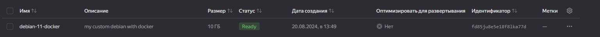

## Задание 1

```
root@educationnetology:~# apt show virtualbox
Package: virtualbox
Version: 6.1.50-dfsg-1~ubuntu1.20.04.1
Priority: optional
Section: multiverse/misc
Origin: Ubuntu
Maintainer: Ubuntu Developers <ubuntu-devel-discuss@lists.ubuntu.com>
Original-Maintainer: Debian Virtualbox Team <team+debian-virtualbox@tracker.debian.org>
Bugs: https://bugs.launchpad.net/ubuntu/+filebug
Installed-Size: 112 MB
```

```
root@educationnetology:~# apt show vagrant
Package: vagrant
Version: 1:2.3.4
Status: install ok installed
Priority: optional
Section: default
Maintainer: HashiCorp <support@hashicorp.com>
Installed-Size: 258 MB
Homepage: https://www.vagrantup.com/
License: unknown
Vendor: none
Download-Size: unknown
APT-Manual-Installed: yes
APT-Sources: /var/lib/dpkg/status
Description: no description given
```

```
root@educationnetology:~# apt show packer
Package: packer
Version: 1.11.2-1
Priority: optional
Section:
Maintainer: HashiCorp
Installed-Size: 49.7 MB
Depends: openssl
Homepage: https://www.packer.io/docs
Download-Size: 15.4 MB
APT-Manual-Installed: yes
APT-Sources: https://apt.releases.hashicorp.com focal/main amd64 Packages
Description: HashiCorp Packer - A tool for creating identical machine images for multiple platforms from a single source configuration
```

```
root@educationnetology:~# yc --version
Yandex Cloud CLI 0.131.1 linux/amd64
```


## Задание 2

```
root@educationnetology:~# vagrant box list
bento/ubuntu-20.04 (virtualbox, 202407.23.0)
root@educationnetology:~# vagrant init
```

```
root@educationnetology:~# vagrant status
Current machine states:

server1.netology          running (virtualbox)

The VM is running. To stop this VM, you can run `vagrant halt` to
shut it down forcefully, or you can run `vagrant suspend` to simply
suspend the virtual machine. In either case, to restart it again,
simply run `vagrant up`.
```

```
vagrant@server1:~$ docker version
Client: Docker Engine - Community
 Version:           27.1.2
 API version:       1.46
 Go version:        go1.21.13
 Git commit:        d01f264
 Built:             Mon Aug 12 11:51:03 2024
 OS/Arch:           linux/amd64
 Context:           default
permission denied while trying to connect to the Docker daemon socket at unix:///var/run/docker.sock: Get "http://%2Fvar%2Frun%2Fdocker.sock/v1.46/version": dial unix /var/run/docker.sock: connect: permission denied

vagrant@server1:~$ docker compose version
Docker Compose version v2.29.1
```


## Задание 3



```
root@educationnetology:~# yc compute image list
+----------------------+------------------+--------+----------------------+--------+
|          ID          |       NAME       | FAMILY |     PRODUCT IDS      | STATUS |
+----------------------+------------------+--------+----------------------+--------+
| fd85ju8e5e18f8lka77d | debian-11-docker |        | f2eh4mveond2hk0t5bb4 | READY  |
+----------------------+------------------+--------+----------------------+--------+

```

```
emav@compute-vm-2-2-10-hdd-1724147550642:~$ apt show htop
Package: htop
Version: 3.0.5-7
Priority: optional
Section: utils
Maintainer: Daniel Lange <DLange@debian.org>
Installed-Size: 328 kB
Depends: libc6 (>= 2.29), libncursesw6 (>= 6), libnl-3-200 (>= 3.2.7), libnl-genl-3-200 (>= 3.2.7), libtinfo6 (>= 6)
Suggests: lm-sensors, lsof, strace
Homepage: https://htop.dev/
Tag: admin::monitoring, interface::text-mode, role::program, scope::utility,
 uitoolkit::ncurses, use::monitor, works-with::software:running
Download-Size: 127 kB
APT-Manual-Installed: yes
APT-Sources: http://mirror.yandex.ru/debian bullseye/main amd64 Packages
Description: interactive processes viewer
 Htop is an ncursed-based process viewer similar to top, but it
 allows one to scroll the list vertically and horizontally to see
 all processes and their full command lines.
 .
 Tasks related to processes (killing, renicing) can be done without
 entering their PIDs.
```

```
emav@compute-vm-2-2-10-hdd-1724147550642:~$ apt show tmux
Package: tmux
Version: 3.1c-1+deb11u1
Priority: optional
Section: admin
Maintainer: Romain Francoise <rfrancoise@debian.org>
Installed-Size: 850 kB
Depends: libc6 (>= 2.27), libevent-2.1-7 (>= 2.1.8-stable), libtinfo6 (>= 6), libutempter0 (>= 1.1.5)
Homepage: https://tmux.github.io/
Tag: hardware::input:keyboard, implemented-in::c, interface::text-mode,
 role::program, scope::application, works-with::software:running
Download-Size: 363 kB
APT-Manual-Installed: yes
APT-Sources: http://mirror.yandex.ru/debian bullseye/main amd64 Packages
Description: terminal multiplexer
 tmux enables a number of terminals (or windows) to be accessed and
 controlled from a single terminal like screen. tmux runs as a
 server-client system. A server is created automatically when necessary
 and holds a number of sessions, each of which may have a number of
 windows linked to it. Any number of clients may connect to a session,
 or the server may be controlled by issuing commands with tmux.
 Communication takes place through a socket, by default placed in /tmp.
 Moreover tmux provides a consistent and well-documented command
 interface, with the same syntax whether used interactively, as a key
 binding, or from the shell. It offers a choice of vim or Emacs key
 layouts.

N: There is 1 additional record. Please use the '-a' switch to see it
```

```
root@compute-vm-2-2-10-hdd-1724147550642:~# docker compose version
Docker Compose version v2.29.1
root@compute-vm-2-2-10-hdd-1724147550642:~# docker --version
Docker version 27.1.2, build d01f264
```

Содержимое файла mydebian.json на основе которого собирался образ диска:

```json
{
    "builders": [
        {
            "type": "yandex",
            "token": "***********************************",
            "folder_id": "b1gecl*********",
            "zone": "ru-central1-a",
            "image_name": "debian-11-docker",
            "image_description": "my custom debian with docker",
            "source_image_family": "debian-11",
            "subnet_id": "e9bigt8p1pdgok1bm26n",
            "use_ipv4_nat": true,
            "disk_type": "network-hdd",
            "ssh_username": "debian"
        }
    ],
    "provisioners": [
        {
            "type": "shell",
            "inline": [
                "sudo apt-get update",
                "sudo apt-get install ca-certificates curl -y",
                "sudo install -m 0755 -d /etc/apt/keyrings",
                "sudo curl -fsSL https://download.docker.com/linux/debian/gpg -o /etc/apt/keyrings/docker.asc",
                "sudo chmod a+r /etc/apt/keyrings/docker.asc",
                "echo \"deb [arch=$(dpkg --print-architecture) signed-by=/etc/apt/keyrings/docker.asc] https://download.docker.com/linux/debian bullseye stable\" | sudo tee /etc/apt/sources.list.d/docker.list > /dev/null",
                "sudo apt-get update",
                "sudo apt-get install -y docker-ce docker-ce-cli containerd.io docker-buildx-plugin docker-compose-plugin",
                "sudo apt-get install -y htop tmux"
            ]
        }
    ]
}
```
