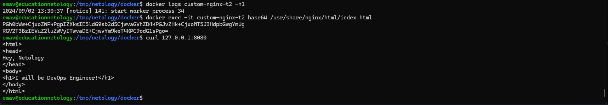

## Задание 1

```
emav@educationnetology:~$ docker compose version
Docker Compose version v2.29.1
```

```bash
emav@educationnetology:/tmp/netology/docker$ docker pull nginx:1.21.1
1.21.1: Pulling from library/nginx
a330b6cecb98: Pull complete
5ef80e6f29b5: Pull complete
f699b0db74e3: Pull complete
0f701a34c55e: Pull complete
3229dce7b89c: Pull complete
ddb78cb2d047: Pull complete
Digest: sha256:a05b0cdd4fc1be3b224ba9662ebdf98fe44c09c0c9215b45f84344c12867002e
Status: Downloaded newer image for nginx:1.21.1
docker.io/library/nginx:1.21.1

emav@educationnetology:/tmp/netology/docker$ docker images
REPOSITORY   TAG       IMAGE ID       CREATED       SIZE
nginx        latest    5ef79149e0ec   2 weeks ago   188MB
ubuntu       latest    edbfe74c41f8   4 weeks ago   78.1MB
nginx        1.21.1    822b7ec2aaf2   3 years ago   133MB
```

```
emav@educationnetology:/tmp/netology/docker$ docker build -f Dockerfile1 -t torrmund/custom-nginx:1.0.0 .
[+] Building 0.1s (7/7) FINISHED                                                                         docker:default
 => [internal] load build definition from Dockerfile1                                                              0.0s
 => => transferring dockerfile: 96B                                                                                0.0s
 => [internal] load metadata for docker.io/library/nginx:1.21.1                                                    0.0s
 => [internal] load .dockerignore                                                                                  0.0s
 => => transferring context: 2B                                                                                    0.0s
 => [1/2] FROM docker.io/library/nginx:1.21.1                                                                      0.0s
 => [internal] load build context                                                                                  0.0s
 => => transferring context: 31B                                                                                   0.0s
 => CACHED [2/2] COPY index.html /usr/share/nginx/html/                                                            0.0s
 => exporting to image                                                                                             0.0s
 => => exporting layers                                                                                            0.0s
 => => writing image sha256:324b0d281025b64a38e326c04b2d386ab07a4df948a2d58f6856798a00225db3                       0.0s
 => => naming to docker.io/torrmund/custom-nginx:1.0.0                                                             0.0s
```

```
emav@educationnetology:/tmp/netology/docker$ docker push torrmund/custom-nginx:1.0.0
The push refers to repository [docker.io/torrmund/custom-nginx]
ebc163a964e6: Pushed
d47e4d19ddec: Mounted from library/nginx
8e58314e4a4f: Mounted from library/nginx
ed94af62a494: Mounted from library/nginx
875b5b50454b: Mounted from library/nginx
63b5f2c0d071: Mounted from library/nginx
d000633a5681: Mounted from library/nginx
1.0.0: digest: sha256:022234df27255bb24eb024f10dfcbc84ba2e151f6f761aba32641cb5d0935753 size: 1777
```

Ссылка на образ:  [https://hub.docker.com/repository/docker/torrmund/custom-nginx/general]()


## Задание 2

1.  
2.  
3.  
4.  


## Задание 3

1. ```
   docker attach
   ```
2.  
3.  
   При CTRL-C в контейнер отправляется SIGINT (signal interrupt) который прерывает главный процесс в контейнере и контейнер останавливается. Такая логика работы актуальна, когда параметры конфигурации --sig-proxy установлен в true и контейнер запущен в режиме -d. Если контенер запущен в режиме -it , то можно отключиться не останавливая работу контенера, применив сочетания клавиш CTRL-P CTRL-Q.
4.  
5.  
6.  
7.  
8.  
9.  
10.  
    Соединение сбрасывается, т.к. приложение в самом контенере (nginx в нашем случае) теперь слушает 81 порт вместо 80.
11.  
    
    
    
12.  


## Задание 4

1.  
2.  


## Задание 5

1. 
   Compose поддерживает как compose.yml, так и docker-compose.yml, но файл docker-compose.yml поддерживается для обратно совместимости с более ранними версиями compose (docker-compose). В более поздних версиях compose приоритет имеет именно compose.yml.
2.  

   
3.  
4.  
5.  
   
   
6.  
7.  
   Предупреждение гласит о том, что найден контейнер "сирота" для которого нет описания в compose файле текущего проекта. При этом контейнер, для которого мы удалили описание, продолжает работать. В варнинге также предлагается указать флаг для удаления контейнеров "сирот" --remove-orphans, что и было сделано.
