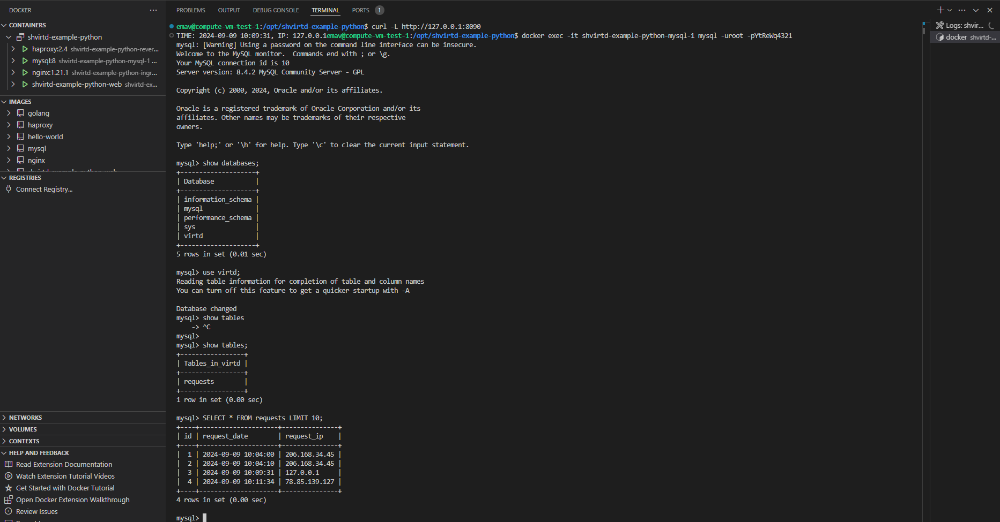
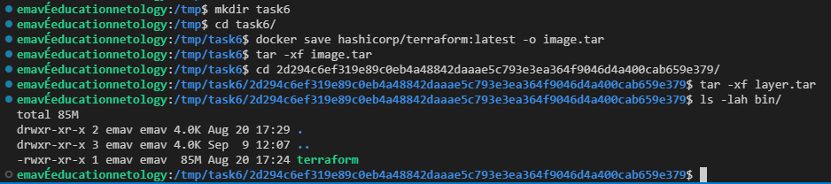

## Задание 0

## Задание 1

1. 
   https://github.com/Torrmund/shvirtd-example-python
2.  
3. 

   `sudo apt install python3-virtualenv
   virtualenv --python=/usr/bin/python3 venv
   source venv/bin/activate
   pip install -r requirements.txt
   export DB_HOST='127.0.0.1' DB_USER='app' DB_PASSWORD='QwErTy1234' DB_NAME='virtd'
   docker run -d -p 3306:3306 -e MYSQL_ROOT_PASSWORD="YtReWq4321" -e MYSQL_DATABASE="virtd" -e MYSQL_USER="app" -e MYSQL_PASSWORD="QwErTy1234" --name test_mysql mysql:8
   python main.py

   `

## Задание 2

1. 

   

## Задание 3

https://github.com/Torrmund/shvirtd-example-python/tree/main

## Задание 4

Ссылка на bash скрипт (запускать с sudo):
https://github.com/Torrmund/shvirtd-example-python/blob/main/project_bootstrap.sh

Ссылка на форк:
https://github.com/Torrmund/shvirtd-example-python/tree/main

## Задание 6

6.1
 
