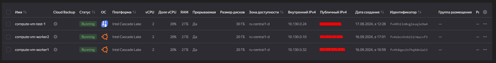
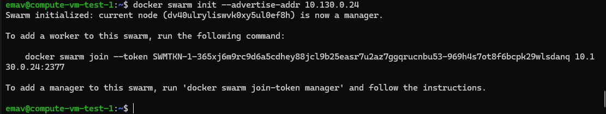
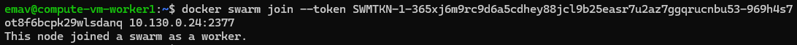
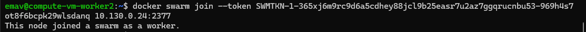
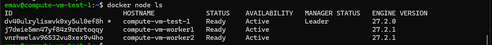

## Задание 1

Созданы ВМ в одной сети в yandex cloud:

На все ВМ установлен docker по документации - https://docs.docker.com/engine/install/ubuntu/

В качестве мастер ноды будет выступать compute-vm-test-1

Инициализируем мастер ноду:

Подключаем к ней воркер ноды:

Проверяем, что воркер ноды подключились корректно:

