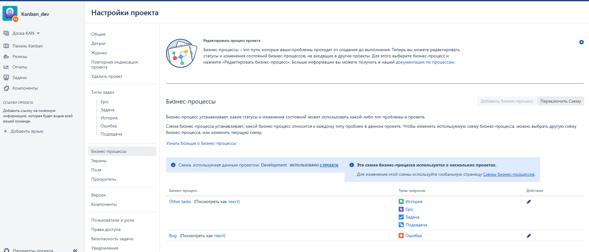
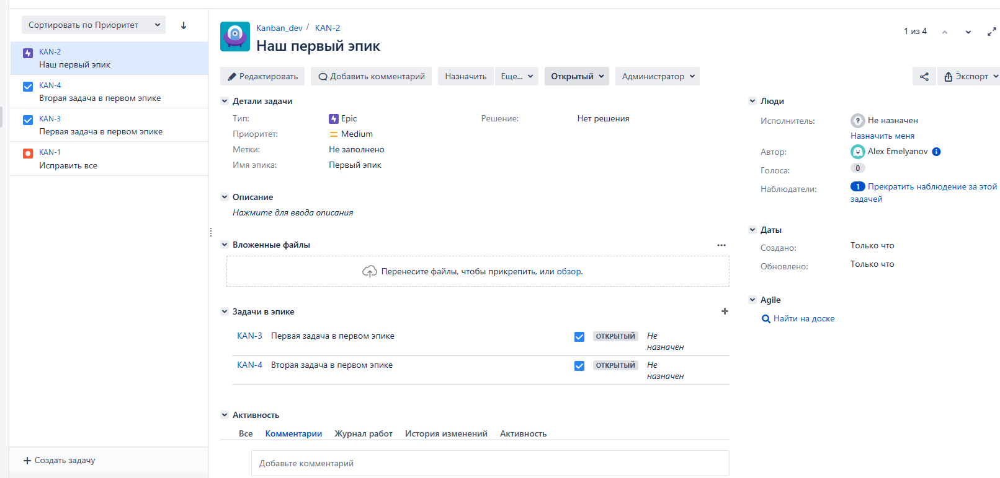
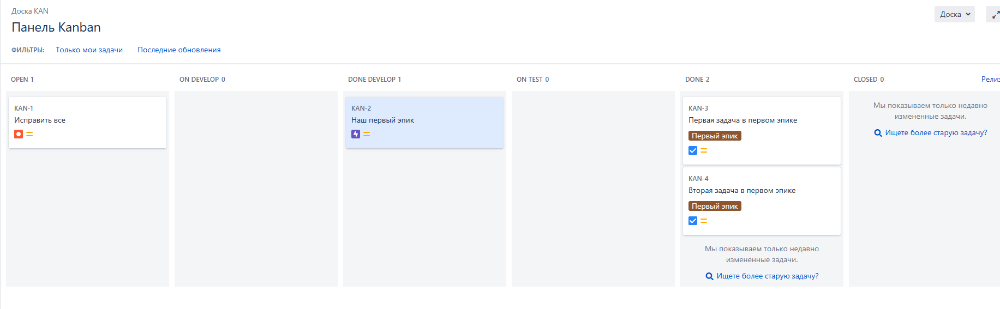

# Домашнее задание к занятию 7 "Жизненный цикл ПО"

## Подготовка к выполнению

|                                                                                 Номер и описание задачи                                                                                 | Описание выполняемых действий                                                                                                                                                                                                                                                                                                                                                                             | Скриншоты                                                                                                                                     |
| :---------------------------------------------------------------------------------------------------------------------------------------------------------------------------------------------------------: | ------------------------------------------------------------------------------------------------------------------------------------------------------------------------------------------------------------------------------------------------------------------------------------------------------------------------------------------------------------------------------------------------------------------------------------ | ------------------------------------------------------------------------------------------------------------------------------------------------------ |
| 1. Получить доступ к Jira. Либо через VPN к  облачной версии, либо развернуть свой инстанс Jira через Docker. | Было принято решение развернуть собственный инстанс Jira через Docker. Был подготовлен файл compose.yml при помощи которого был поднят контейнер Jira и postgres. Затем была получена пробная лицензия Jira и сконфигурирован инстанс. |                                                       |
|                                                                                2. Создать доски Kanban и Scrum                                                                                | Созданы отдельные проекты под Kanban и Scrum на основе предложенных системой Workflow                                                                                                                                                                                                                                                                               |    |

## Основная часть

|                                                                                                                                            Номер и описание задачи                                                                                                                                            | Описание выполняемых действий                                                                                                                                                                                                                                                                        | Скриншоты                                                                                                                                                                                                                                                                                                                                                                                                                                                                                                                                                                                                                         |
| :--------------------------------------------------------------------------------------------------------------------------------------------------------------------------------------------------------------------------------------------------------------------------------------------------------------------------------: | ------------------------------------------------------------------------------------------------------------------------------------------------------------------------------------------------------------------------------------------------------------------------------------------------------------------------------- | ------------------------------------------------------------------------------------------------------------------------------------------------------------------------------------------------------------------------------------------------------------------------------------------------------------------------------------------------------------------------------------------------------------------------------------------------------------------------------------------------------------------------------------------------------------------------------------------------------------------------------------------ |
|                                                                           1. Создать workflow для задач типа bug, которые будут проходить определенный  жизненный цикл.                                                                           | Был создан отдельный workfolw для задач типа bug.                                                                                                                                                                                                                                            |                                                                                                                                                                                                                                                                                                                                                                                                                                                                                                                                                                                              |
|                                                                   2. Создать workflow для задач остальных типов, которые будут проходить определенный жизненный цикл.                                                                   | Был создан отдельный workflow для задач остальных типов.                                                                                                                                                                                                                           |                                                                                                                                                                                                                                                                                                                                                                                                                                                                                                                                                                                              |
|                                                                                                                        3. Прикрепить новые workflow к проектам Kanban и Scrum                                                                                                                        | Была создана новая схема бизнес - процессов Development, в которую были добавлены новые workflow. Затем проекты Kanban и Scrum были переключены на новую схему                                        |                                                                                                                                                                                                                                                                                                                                                                                                                                     |
|                                                                                                             4. Создать задачу типа bug. Провести её через Workflow. Kanban.                                                                                                             | Была создана задача типа Bug. Задача проведена по workflow до  статуса Done.                                                                                                                                                                                           |                                                                                                                                                                                                                         |
|                                                        5. Создать здачу типа Epic, к ней привязать несколько задач типа task. Провести их по workflow до статуса Done. Kanban.                                                        | Создан эпик и две задачи для него. Также создана доска под эти задачи. Задачи проведены по workflow и возвращены в статус Open.                                                                                       |             |
| 6. Переключиться на проект Scrum. Запланировать новый спринт, состоящий из задач эпика и одного бага. Стартануть спринт, провести задачи до статуса Closed и закрыть спринт. | Скорректирована доска под новые workflow. Создан первый спринт. Добавлены задачи в этот спринт. Дан старт спринту. Задачи проведены по флоу до статуса Closed и закрыт спринт. |                                                                                                                                                                                                                                                                            |
|                                                                                                    6. Если все отработано в рамках ожидания - выгрузить workflow в виде XML.                                                                                                    | Экспортированные workflow в формате XML можете найти в папке src.                                                                                                                                                                                                                 |                                                                                                                                                                                                                                                                                                                                                                                                                                                                                                                                                                                                                                            |
