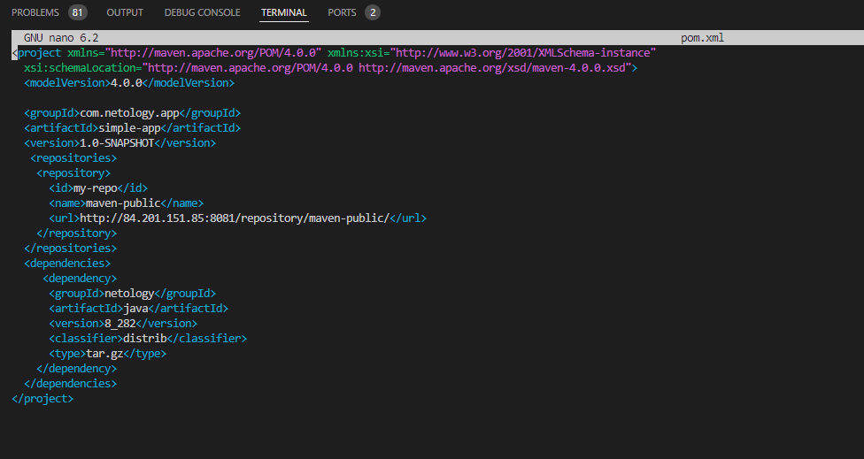

# Домашнее задание к занятию "Процессы CI/CD"

## Подготовка к выполнению

|                                                         Номер и описание задачи                                                         | Описание выполняемых действий                                                                                                                                                                                                                                                                                                                                                                | Скриншоты                             |
| :---------------------------------------------------------------------------------------------------------------------------------------------------------: | ----------------------------------------------------------------------------------------------------------------------------------------------------------------------------------------------------------------------------------------------------------------------------------------------------------------------------------------------------------------------------------------------------------------------- | ---------------------------------------------- |
|                                       1. Создать две VM с указанными параметрами                                       | Созданы ВМ                                                                                                                                                                                                                                                                                                                                                                                                     |  |
|                                      2. Прописать в inventory и playbook созданные хосты                                      | Playbook скорректирован для установки ПО на моё окружение (Ubuntu). Правки вносились минимально необходимые, чтобы playbook работал на моем окружении. Измененный код расположен в папке src.  Добавлены хосты в инвентори. |  |
|                               3. В files добавить файл со своим публичным ключом SSH.                               | С подключением по paramiko были проблемы, поэтому оставил обычное подключение по SSH.                                                                                                                                                                                                                                                                 |                                                |
|                                                               4. Проиграть playbook                                                               | Playbook проигран полностью на всех хостах.                                                                                                                                                                                                                                                                                                                                                |  |
|                     5. Проверить готовность SonarQube. Заменить пароль админа на свой                     | Проверена готовность SonarQube. Заменил пароль админа на свой.                                                                                                                                                                                                                                                                                                         |  |
| 6. Проверить готовность Nexus. Заменить пароль админа. Сохранить анонимный доступ. | Проверил готовность Nexus. Заменил пароль админа на свой. Сохранил анонимный доступ.                                                                                                                                                                                                                                                        |  |

## Основная часть

### Знакомство с SonarQube

|                                                        Номер и описание задачи                                                        | Описание выполняемый действий                                                                                                | Скриншоты                                                                                 |
| :--------------------------------------------------------------------------------------------------------------------------------------------------------: | ------------------------------------------------------------------------------------------------------------------------------------------------------- | -------------------------------------------------------------------------------------------------- |
|                               1. Создать новый проект с произвольным названием                               | Создал новый проект                                                                                                                    |                                                      |
|                              2. Скачать пакет sonar-scanner, который предлагает SonnarQube                              | Выбран локальный запуск. Загружен и установлен sonar-scanner.                                              |                                                      |
|                            3. Сделать так, чтобы binary был доступен через вызов shell                            | Бинарь добавлен в PATH через .bashrc                                                                                                |                                                                                                    |
|                                                       4. Проверить sonar-scanner --version                                                       | Проверена доступность сканера                                                                                                |                                                      |
| 5. Запустить анализатор против кода из директории example с дополнительным ключом. | Анализатор запущен. Проверка проведена успешно.                                                           |   |
|                                             6. Посмотреть результат в интерфейсе                                             | Просмотрен результат в интерфейсе.                                                                                        |                                                      |
|                                             7. Исправить ошибки и варнинги в коде                                             | Исправлен код                                                                                                                               |                                                      |
|              8. Запустить анализатор повторно. Проверить, что QG пройдены успешно.              | Анализатор запущен повторно. Просмотрены результаты проверки в  интерфейсе. |   |
|                           9. Предоставить скрин успешного прохождения анализа.                           |                                                                                                                                                         |   |

### Знакомство с Nexus

|                                   Номер и описание задачи                                   | Описание выполняемых действий                                  | Скриншоты                                                                                                                                     |
| :--------------------------------------------------------------------------------------------------------------: | ----------------------------------------------------------------------------------------- | ------------------------------------------------------------------------------------------------------------------------------------------------------ |
| 1. В репозиторий maven-public загрузить артефакт с GAV-параметрами | Загружен артефакт с заданными параметрами.      |    |
|    2. В него же загрузить такой же артефакт, но с версией 8_102    | Загружен этот же артефакт, но с другой версией |                                                       |
|              3. Проверить, что все файлы загружены успешно              |                                                                                           |                                                                                                          |
|                               4. Прикрепить файл maven-metadata.xml                               | Файл также представлен в этом же репозитории.  |                                                                                                          |

### Знакомство с Maven

|                                                            Номер и описание задачи                                                            | Описание выполняемых действий                                                                      | Скриншоты                             |
| :----------------------------------------------------------------------------------------------------------------------------------------------------------------: | ----------------------------------------------------------------------------------------------------------------------------- | ---------------------------------------------- |
|                                                           1. Скачать дистрибутив Maven                                                           | Дистрибутив скачан                                                                                           |                                                |
|               2. Разархивировать и сделать так, чтобы бинарь был доступен через shell               | Дистрибутив разархивирован и реализован доступ к бинарю через PATH |                                                |
|                      3. Удалить из конфига maven правило, отвергающее HTTP соединение.                      | Закомментировано правило                                                                               |  |
|                                                                4. Проверить mvn --version                                                                | Проверена версия maven                                                                                         |  |
|                                                           5. Забрать директорию с pom                                                           | Скопирован файл pom.xml                                                                                         |  |
| 6. Поменять в pom.xml блок с зависимостями под артефакт из первого пункта задания по Nexus | Изменен файл pom.xml                                                                                               |  |
|                                      7. Запустить команду mvn package в директории с pom.xml                                      | Запущена команда.                                                                                              |  |
|                                 8. Проверить директорию ~/.m2/repository/ найти артефакт                                 | Проверена директория. Обнаружен артефакт.                                            |  |
|                                               9. Прикрепить исправленный файл pom.xml                                               | Файл расположен в одной директории с данным README                                  |                                                |
