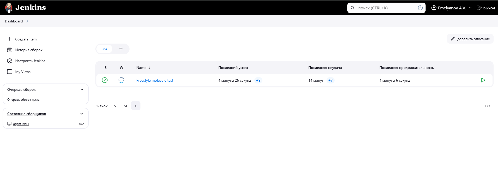
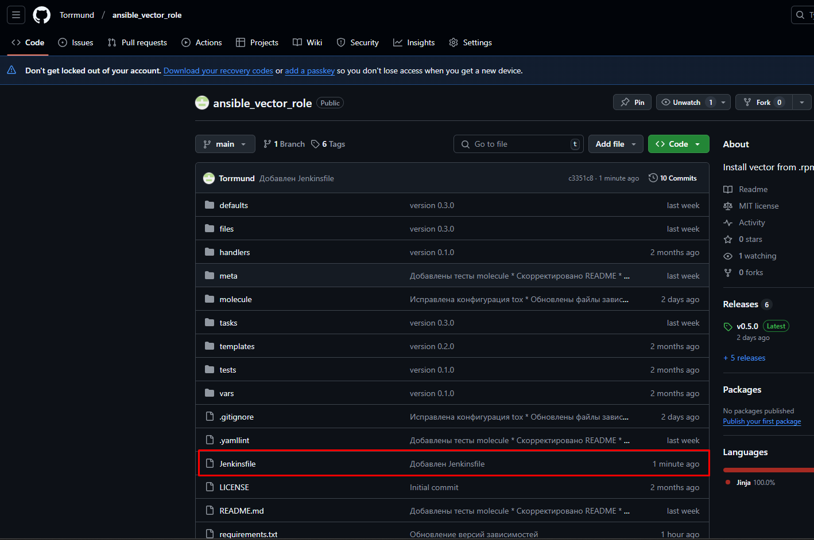

# Домашнее задание к занятию "Jenkins"

## Подготовка к выполнению

|                                        Номер и описание задачи                                        | Описание выполняемых действий                                                                                                                                                                                                                                                                                                                         | Скриншоты                                                                                 |
| :-----------------------------------------------------------------------------------------------------------------------: | -------------------------------------------------------------------------------------------------------------------------------------------------------------------------------------------------------------------------------------------------------------------------------------------------------------------------------------------------------------------------------- | -------------------------------------------------------------------------------------------------- |
|                       1. Создать две VM для jenkins-master и jenkins agent                       | Созданы 2 VM в YC                                                                                                                                                                                                                                                                                                                                                        |                                                                                                    |
| 2. На созданные VM установить и сконфигурировать Jenkins и Jenkins-agent | Создан простой playbook для установки jenkins-master и jenkins-agent. Сам playbook выложен в директорию src рядом с данным README файлом.                                                                                                                                                        |                                                                                                    |
|                                     3. Запустить Мастер и агент                                     | Установлены и запущены мастер и агент                                                                                                                                                                                                                                                                                                            |                                                                                                    |
|                           4. Выполнить первоначальную настройку                           | Проведена первоначальная конфигурация мастера. Создан агент agent-lxd-1 и настроено подключение этого агента к мастеру. На агенте заранее было настроено окружение для проведения тестов molecule. |   |

## Основная часть

|                                                                          Номер и описание задачи                                                                          | Описание выполняемых действий                                                                                                                                                                                                                                                                                                                                                                                                                    | Скриншоты                                                                                                                                                                                                                                                                                                 |
| :--------------------------------------------------------------------------------------------------------------------------------------------------------------------------------------------: | --------------------------------------------------------------------------------------------------------------------------------------------------------------------------------------------------------------------------------------------------------------------------------------------------------------------------------------------------------------------------------------------------------------------------------------------------------------------------- | ------------------------------------------------------------------------------------------------------------------------------------------------------------------------------------------------------------------------------------------------------------------------------------------------------------------ |
|                  1. Создать freestyle job, которая будет запускать molecule test из любого репозитория с ролью                  | Создана freestule джоба с именем Freestyle molecule test, и настроено тестирование моей роли vector.                                                                                                                                                                                                                                                                                                             |                                                          |
| 2. Создать Declarative Pipeline Job, которая будет запускать тесты molecule из любого моего репозитория с ролью. | Создана declarative pipeline джоба, которая клонирует репозиторий с ролью vector и запускает тесты molecule. Указана метка агента.                                                                                                                                                                                                                                             |                                                          |
|                                     3. Перенести Declarative Pipline в репозиторий с ролью в файл  Jenkinsfile                                     | В репозиторий роли добавил Jenkinsfile                                                                                                                                                                                                                                                                                                                                                                                                               |                                                                                                                                                                                                                                                                      |
|                                             4. Создать Multibranch Pipeline на запуск Jenkinsfile из репозитория                                             | Создан Multibranch Pipeline для запуска Jenkinsfile из репозитория с моей ролью vector. Для тестирования добавлена новая ветка (example_build). При повторном сканировании репозитория через Jenkins ветка "подтянулась" и запустилась сборка из Jenkinsfile с этой ветки |       |
|                                            5. Создать Scripted Pipeline, наполнив его скриптом из примера.                                            | Создал pipeline job с именем Scripted pipeline И добавил в него скрипт из примера.                                                                                                                                                                                                                                                                                                                                            |                                                                                                                                                                                                                                                                      |
|                                                    6. Внести изменения для обработки логики prod_run                                                    | Внес в скрипт логику обработки значения prod_run. Добавил указание параметра prod_run при  запуске сборки.                                                                                                                                                                                                                                                                        |                                                                                                                                                                                                                   |
|                                    7. Проверить работоспособность и выложить скрипт в реп с ролью.                                    | Проверена работоспособность Выложил файл с скриптом в репозиторий.                                                                                                                                                                                                                                                                                                                                           |                                                                                                                                                                |
|                                                                 8. Приложить ссылку на репозиторий                                                                 | Ссылка: [link](https://github.com/Torrmund/ansible_vector_role)                                                                                                                                                                                                                                                                                                                                                                                                         |                                                                                                                                                                                                                                                                                                                    |
