# Домашнее задание к занятию "Teamcity"

## Подготовка к выполнению

|                                                                                                      Номер и описание задачи                                                                                                      | Описание выполняемых действий                                                                                                                                                                                                                                                                                                                                                                                                                                                                                                                                                                                                                                                                                                                                                                                                                                                                                                         | Скриншоты                                                                                                                                     |
| :---------------------------------------------------------------------------------------------------------------------------------------------------------------------------------------------------------------------------------------------------: | ---------------------------------------------------------------------------------------------------------------------------------------------------------------------------------------------------------------------------------------------------------------------------------------------------------------------------------------------------------------------------------------------------------------------------------------------------------------------------------------------------------------------------------------------------------------------------------------------------------------------------------------------------------------------------------------------------------------------------------------------------------------------------------------------------------------------------------------------------------------------------------------------------------------------------------------------------------------- | ------------------------------------------------------------------------------------------------------------------------------------------------------ |
|                                                                         1. В YC создать новый инстанс на основе образа teamcity-server                                                                         | Для поднятия инстанса использовал контейнеризацию в YC и написал простой compose для поднятия teamcity-server и postgres для него. Т.к. в образе jetbrains/teamcity-server по умолчанию нет драйвера jdbc и потому как это тестовое окружение, решил не создавать свой образ на базе указанного, а  просто добавить в compose файл контейнер, который будет скачивать драйвер jdbc и складывать его в  волюм контейнера teamcity-server. Таким образом, поднялся контейнер с teamcity-server и выполнилось его подключение к  свой базе postgresql. | 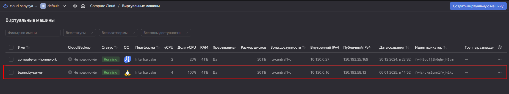 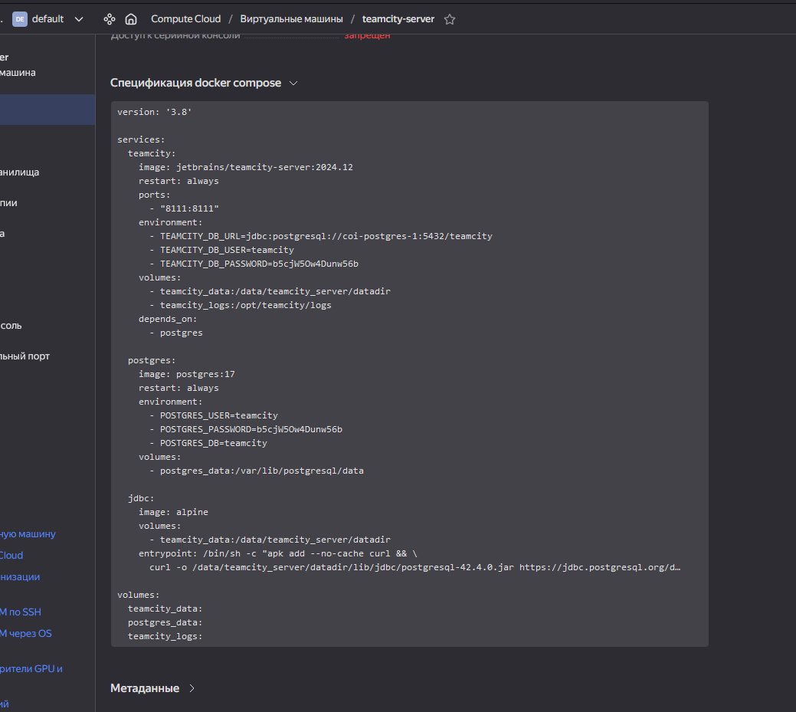                                                     |
|                                                          2. Дождаться запуска teamcity-server Выполнить первоначальную  настройку                                                          | Подождал, пока teamcity server запустится. Выполнил первоначальную настройку.                                                                                                                                                                                                                                                                                                                                                                                                                                                                                                                                                                                                                                                                                                                                                                                                                          | 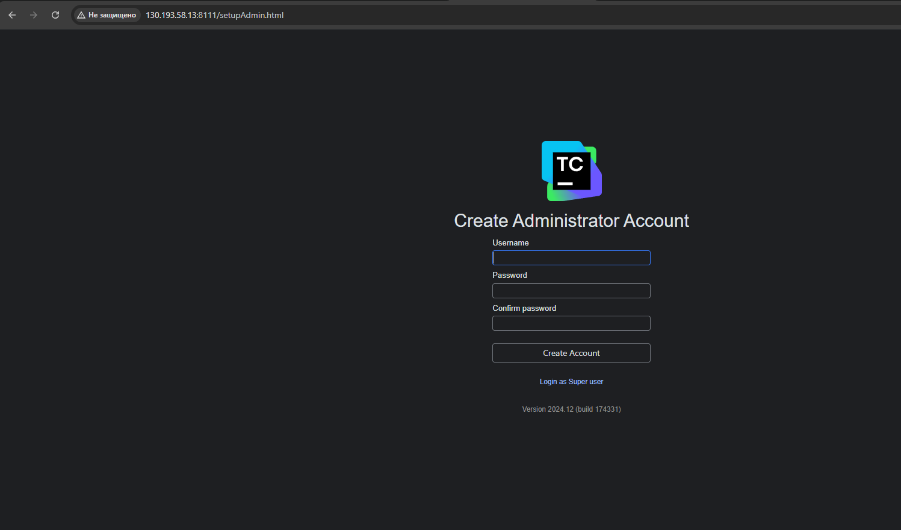 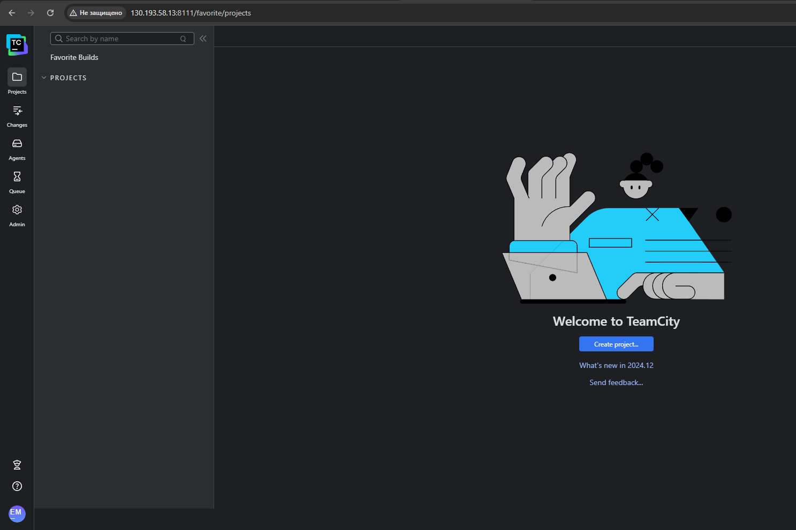                                                     |
| 3. Создать еще один инстанс на основе образа jetbrains/teamcity-agent. Прописать переменную окружения для подключения агента к серверу | Для поднятия инстанса использовал контейнеризацию в YC и написал простой compose для поднятия teamcity-agent.                                                                                                                                                                                                                                                                                                                                                                                                                                                                                                                                                                                                                                                                                                                                                                  | 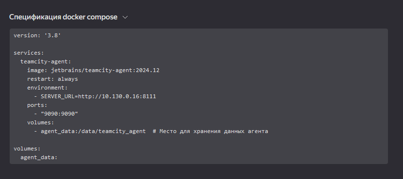 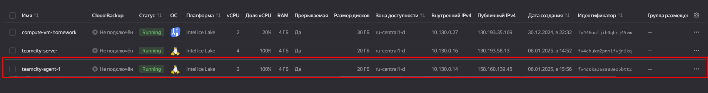                                                     |
|                                                                                                        4. Авторизовать агент                                                                                                        | После поднятия агента, он отобразился в списке неавторизованных агентов на сервере teamcity. Авторизовал агент.                                                                                                                                                                                                                                                                                                                                                                                                                                                                                                                                                                                                                                                                                                                                                 | 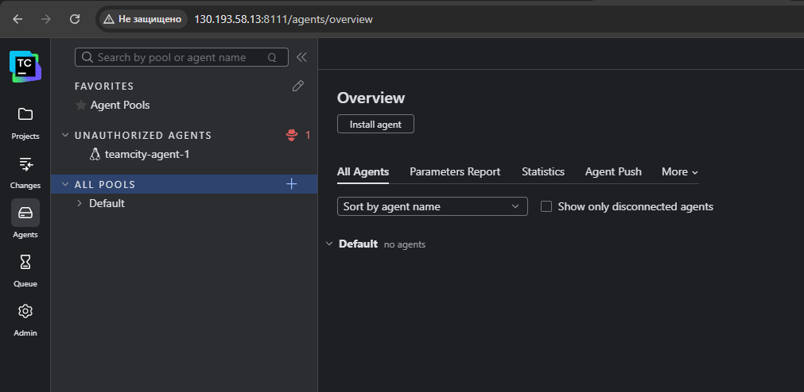 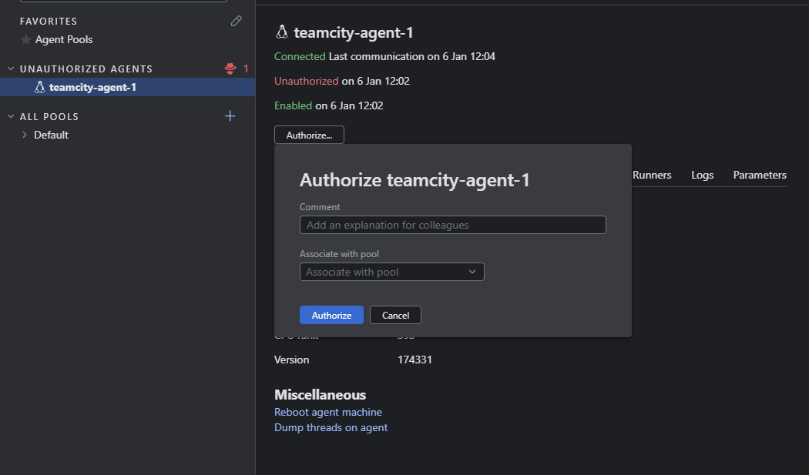 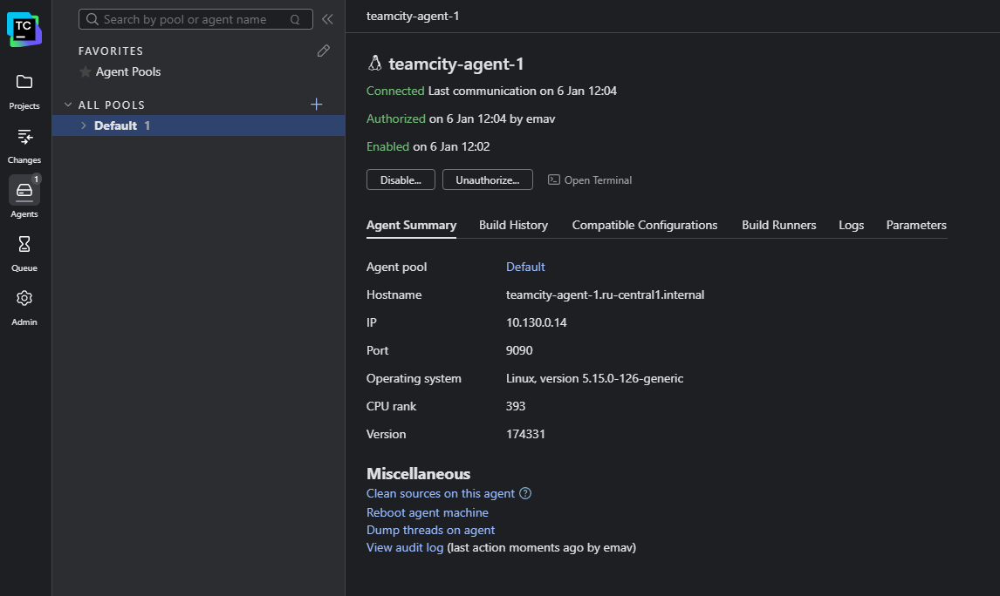 |
|                                                                                                      5. Форкнуть[репозиторий]()                                                                                                      | Форкнул репозиторий                                                                                                                                                                                                                                                                                                                                                                                                                                                                                                                                                                                                                                                                                                                                                                                                                                                                                                                            | 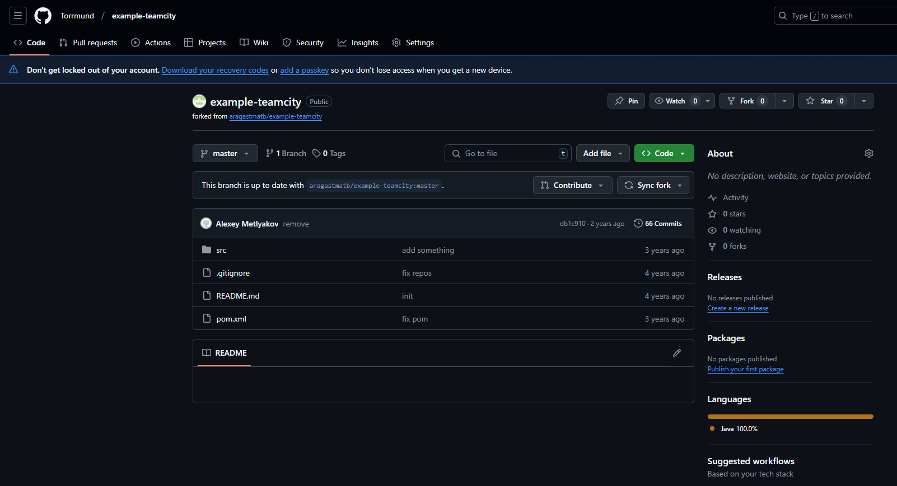                                                                                                         |
|                    6. Создать еще одну VM и поднять на ней Nexus при помощи [playbook](https://github.com/netology-code/mnt-homeworks/tree/MNT-video/09-ci-05-teamcity/infrastructure)                    | Создал VM. Запустил playbook для этой VM. Дождался запуска Nexus                                                                                                                                                                                                                                                                                                                                                                                                                                                                                                                                                                                                                                                                                                                                                                                                                                                   | 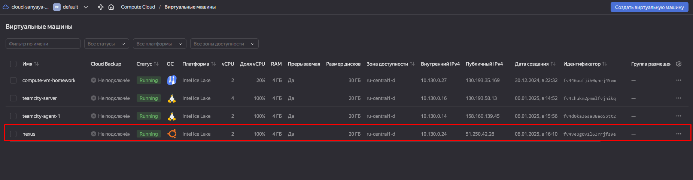 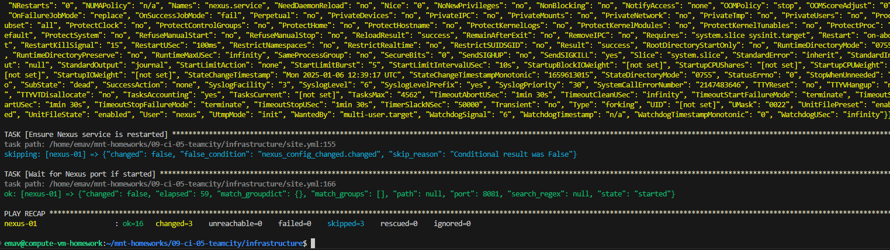 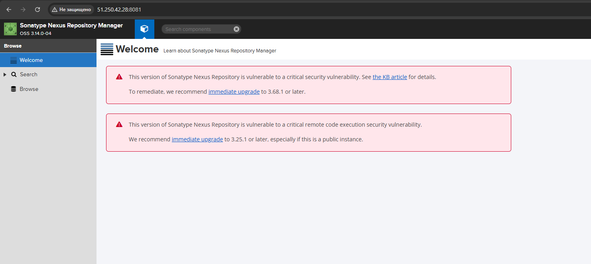 |

## Основная часть

|                                                                                      Номер и описание задачи                                                                                      | Описание выполняемых действийй                                                                                                                                                                                                                                                                                                                                                                                                                                                                                                                                                                                                                                                                                                                                                                                                                                                                                                                                                            | Скриншоты                                                                                 |
| :-------------------------------------------------------------------------------------------------------------------------------------------------------------------------------------------------------------------: | --------------------------------------------------------------------------------------------------------------------------------------------------------------------------------------------------------------------------------------------------------------------------------------------------------------------------------------------------------------------------------------------------------------------------------------------------------------------------------------------------------------------------------------------------------------------------------------------------------------------------------------------------------------------------------------------------------------------------------------------------------------------------------------------------------------------------------------------------------------------------------------------------------------------------------------------------------------------------------------------------------------------- | -------------------------------------------------------------------------------------------------- |
|                                                                        1. Создать новый проект на основе форка                                                                        | Создан новый проект на основе сделанного ранее форка                                                                                                                                                                                                                                                                                                                                                                                                                                                                                                                                                                                                                                                                                                                                                                                                                                                                                                                | 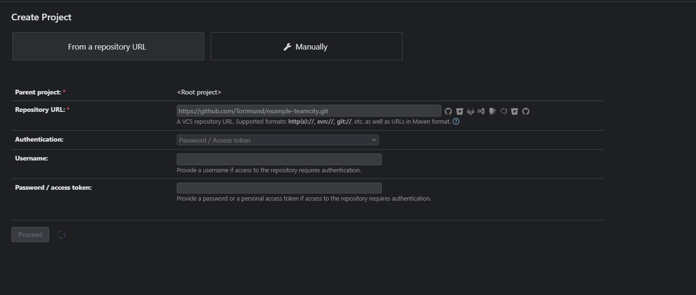 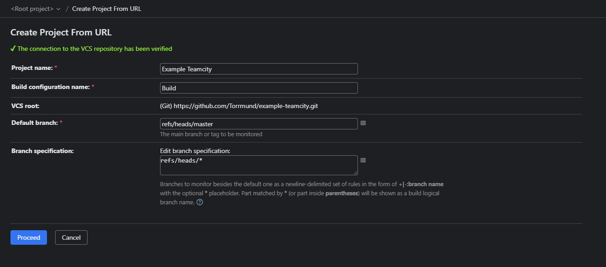 |
|                                                                 2. Выполнить автодетект конфигурации сборки                                                                 | Автодетект выполнился автоматически                                                                                                                                                                                                                                                                                                                                                                                                                                                                                                                                                                                                                                                                                                                                                                                                                                                                                                                                                  | 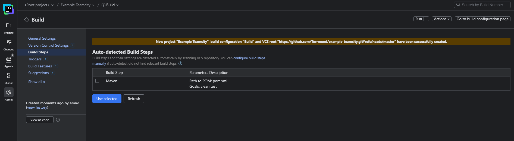                                                     |
|                                                3. Сохранить необходимые шаги и запустить первую сборку на master.                                                | Сохранен единственный имеющийся шаг. Через кнопку run запустил первую сборку для master ветки                                                                                                                                                                                                                                                                                                                                                                                                                                                                                                                                                                                                                                                                                                                                                                                                                                        | 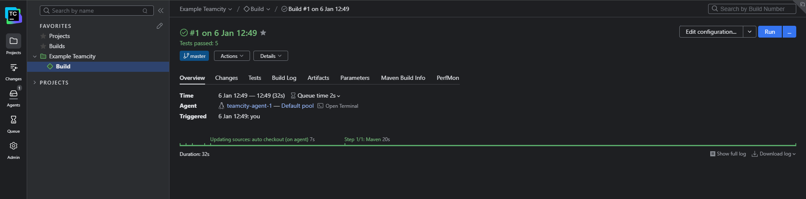                                                     |
|         4. Поменять условия сборки: Если сборка по ветке master, то должен происходить mvn clean deploy, иначе  mvn clean test.         | Создал отдельный Build Step с названием Deploy. В конфигурации прописал раннер maven и  команду clean deploy, а также условие запуска если ветка master. Прикрепил файл settings.xml  Изменил добавленный по умолчанию шаг maven на build and test.  Действие осталось по умолчанию -  mvn clean test. Условия срабатывания данного шага указаны таким образом, что  данный шаг выполняется всегда и для любой ветки.  Таким образом, для всех веток будет выполняться тестирование, а для ветки master, дополнительно, будет также выполняться шаг deploy. | 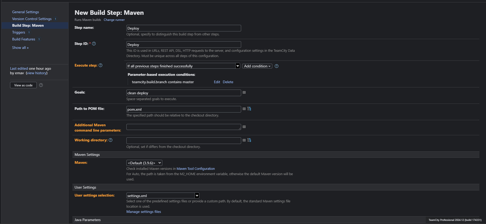 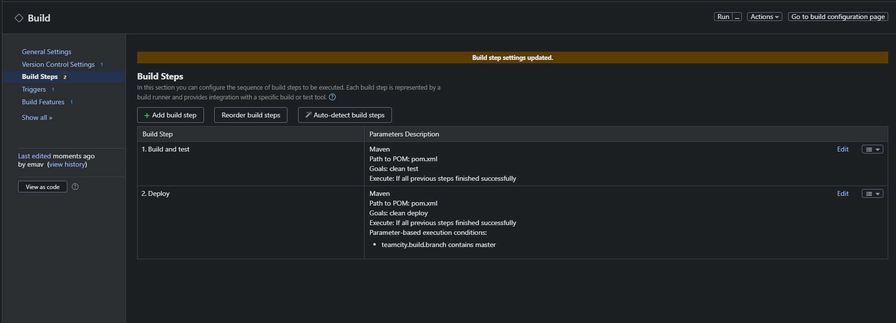 |
|                                                                                   5. Для deploy загрузить settings.xml                                                                                   | В Nexus создал отдельного пользователя teamcity. Занес креды этого пользователя в settings.xml Загрузил файл settings.xml в teamcity.                                                                                                                                                                                                                                                                                                                                                                                                                                                                                                                                                                                                                                                                                                                                                                                            | 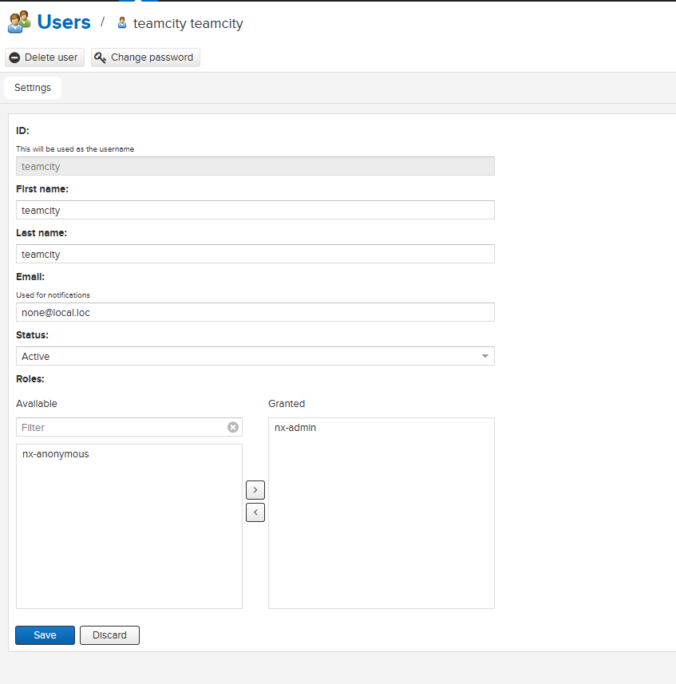 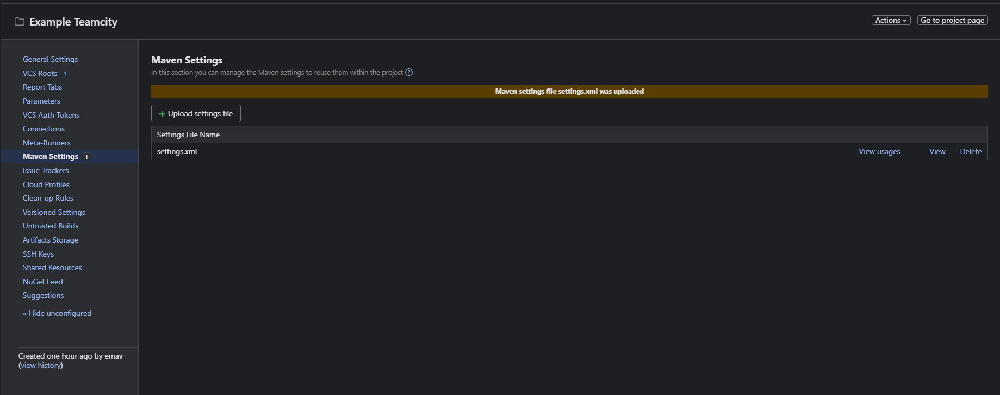 |
|                                                       6. В pom.xml форкнутого репозитория заменить ссылку на nexus.                                                       | Заменил ссылку на nexus на свой развернутый.                                                                                                                                                                                                                                                                                                                                                                                                                                                                                                                                                                                                                                                                                                                                                                                                                                                                                                                                          |                                                                                                    |
|                   7. Запустить сборку по master ветке. Убедиться, что все прошло успешно и артефакт появился в nexus.                   | Т.к. в конфигурации указано, что teamcity сканирует репозиторий каждую минуту, то после пуша изменений в master, teamcity самостоятельно запустил сборку и  выложил артефакт в nexus.                                                                                                                                                                                                                                                                                                                                                                                                                                                                                                                                                                                                                                                                                      | 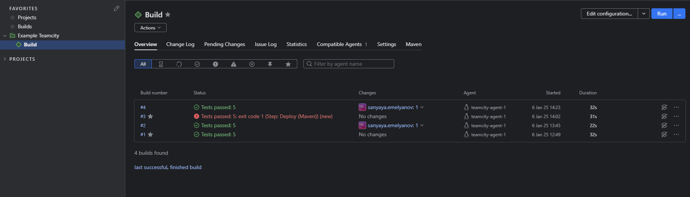 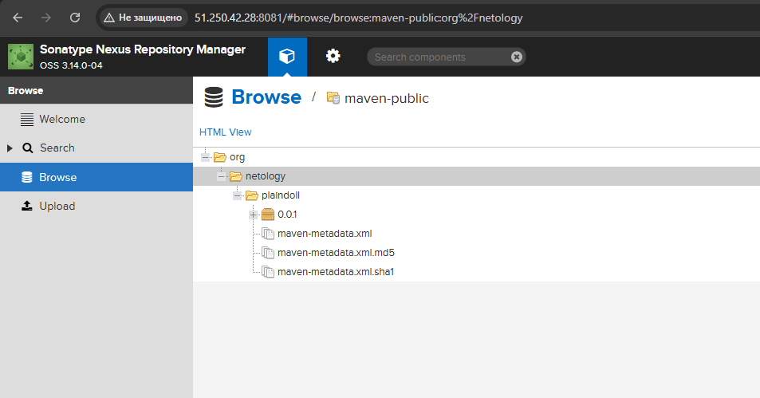 |
|                                                                      8. Мигрируйте build configuration в репозиторий.                                                                      | Экспортировал конфигурацию и поместил в директорию .teamcity репозитория.                                                                                                                                                                                                                                                                                                                                                                                                                                                                                                                                                                                                                                                                                                                                                                                                                                                                                | 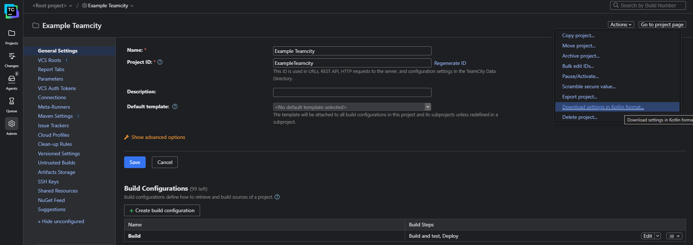 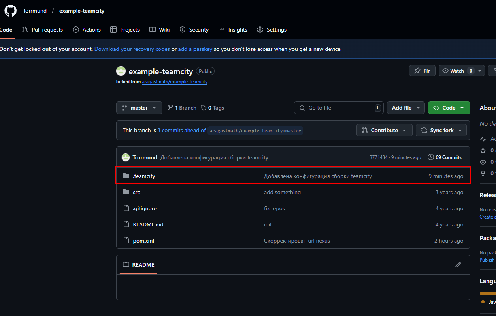 |
|                                                           9. Создать отдельную ветку feature/add_reply в репозитории                                                           | Создал указанную ветку.                                                                                                                                                                                                                                                                                                                                                                                                                                                                                                                                                                                                                                                                                                                                                                                                                                                                                                                                                                           | 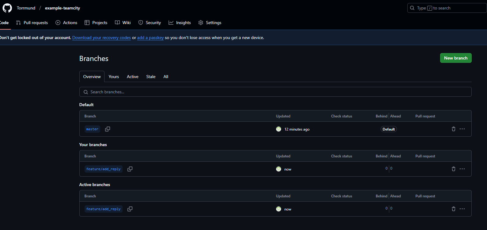                                                     |
| 10. Написать новый метод для класса Welcomer: метод должен возвращать произвольную реплику, содрежащую слово hunter. | Добавил метод                                                                                                                                                                                                                                                                                                                                                                                                                                                                                                                                                                                                                                                                                                                                                                                                                                                                                                                                                                                             | 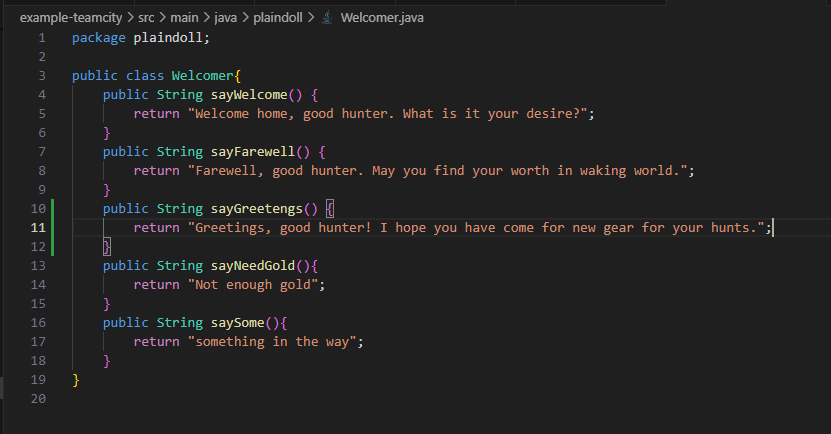                                                     |
|                                          11. Дописать тест для нового метода на поиск слова hunter в новой реплике                                          | Добавил тест в уже имеющийся, который проверяет наличие слова hunter в определенных репликах.                                                                                                                                                                                                                                                                                                                                                                                                                                                                                                                                                                                                                                                                                                                                                                                                                                           | 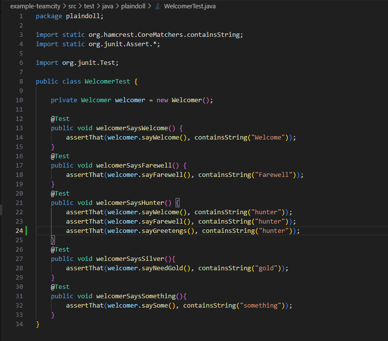                                                     |
|                                                                  12. Сделать push всех изменений в новую ветку.                                                                  | Запушил изменения в новую ветку                                                                                                                                                                                                                                                                                                                                                                                                                                                                                                                                                                                                                                                                                                                                                                                                                                                                                                                                                            |                                                                                                    |
|                                    13. Убедиться, что сборка самостоятельно запустилась и тесты прошли успешно.                                    | Сборка запустилась самостоятельно после пуша изменений. Тесты прошли успешно.                                                                                                                                                                                                                                                                                                                                                                                                                                                                                                                                                                                                                                                                                                                                                                                                                                                            | 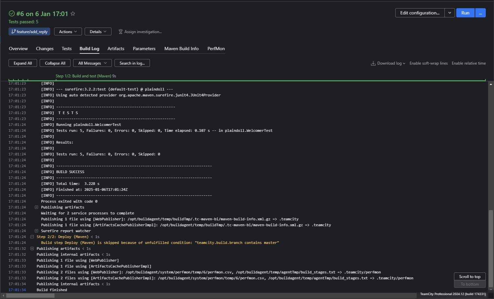                                                     |
|                                                             14. Слить изменения из новой ветки в master через merge.                                                             | Дополнительно скорректировал версию артефакта.                                                                                                                                                                                                                                                                                                                                                                                                                                                                                                                                                                                                                                                                                                                                                                                                                                                                                                                              | 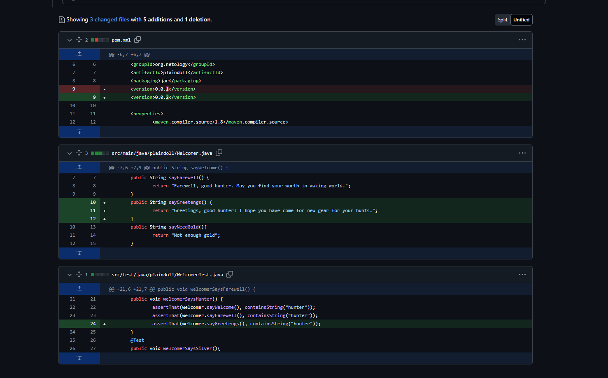                                                     |
|                                       15. Настройте конфигурацию так, чтобы она собирала .jar в артефакты сборки.                                       | Внес изменения в конфигурацию                                                                                                                                                                                                                                                                                                                                                                                                                                                                                                                                                                                                                                                                                                                                                                                                                                                                                                                                                               | 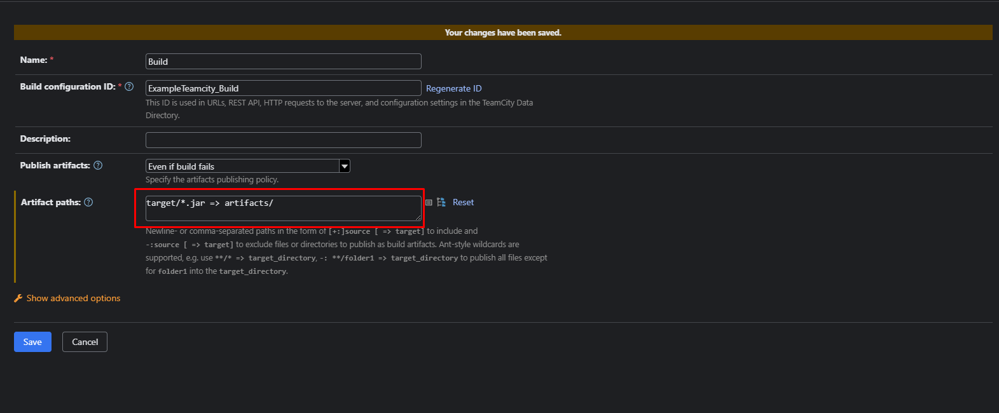                                                     |
|               16. Провести повторную сборку мастера. Убедиться, что сборка прошла успешно и артефакты собраны.               | Сборка прошла успешно. Артефакты загружены как в nexus,  так и в веб интерфейсе                                                                                                                                                                                                                                                                                                                                                                                                                                                                                                                                                                                                                                                                                                                                                                                                                                                                  | 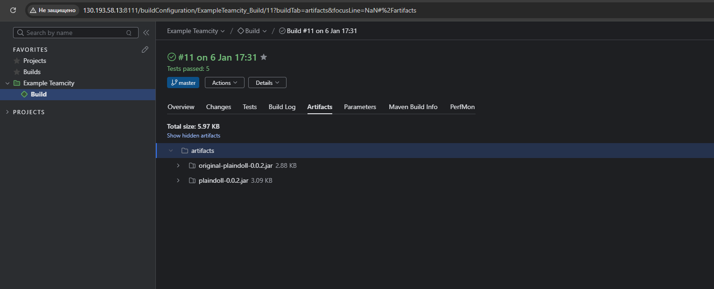 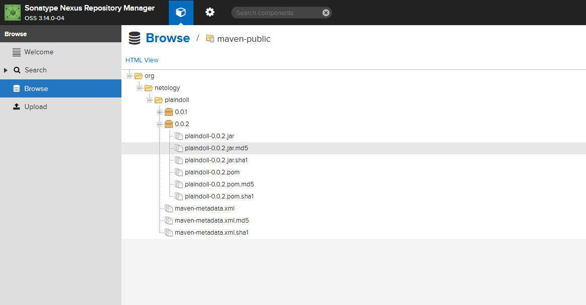 |
|                                                                            17. Приложить ссылку на репозиторий                                                                            | [Ссылка](https://github.com/Torrmund/example-teamcity)                                                                                                                                                                                                                                                                                                                                                                                                                                                                                                                                                                                                                                                                                                                                                                                                                                                                                                                                                             |                                                                                                    |
