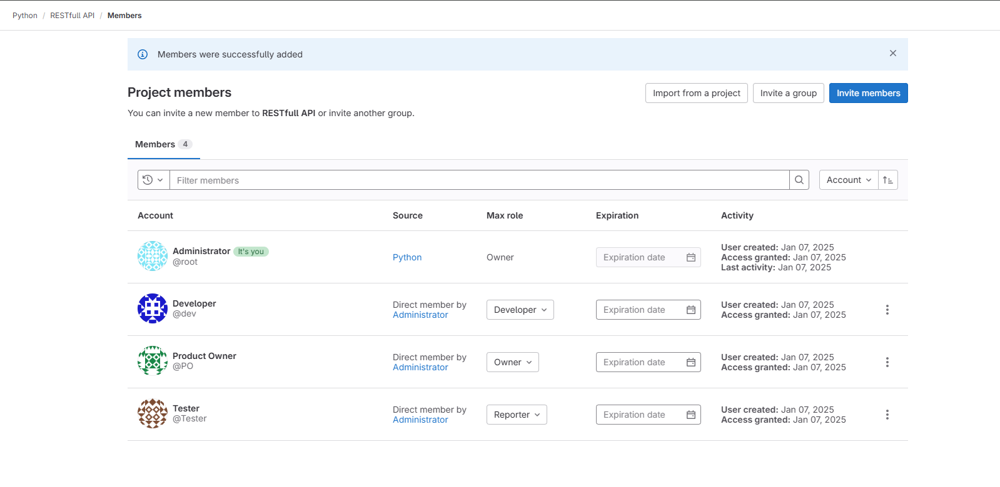
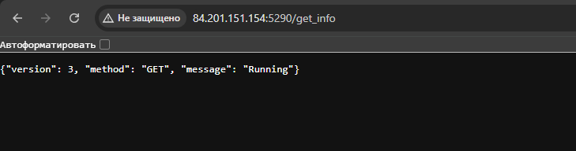

# Домашнее задание к занятию "Gitlab"

## Подготовка к выполнению

|                                                                              Номер и описание задачи                                                                              | Описание выполняемых действий                                                                                                                    | Скриншоты                                                                                                                                     |
| :----------------------------------------------------------------------------------------------------------------------------------------------------------------------------------------------------: | --------------------------------------------------------------------------------------------------------------------------------------------------------------------------- | ------------------------------------------------------------------------------------------------------------------------------------------------------ |
|                             1. Развернуть YC в Gitlab. Либо managed либо на отдельной ВМ из публичного образа.                             | Для развертывания выбрал отдельную ВМ и публичный образ.                                                               |    |
|                2. Создать виртуальную машину и установить на нее gitlab runner. Подключить runner к серверу Gitlab.                | Создал отдельную ВМ для раннера. Установил раннер по инструкции. Подключил раннер к Gitlab. |    |
|                                                                               3. Создать новый проект.                                                                               | Создал новый проект                                                                                                                                        |                                                                                                          |
| 4. Создать новый репозиторий в Gitlab. Наполнить его [файлами](https://github.com/netology-code/mnt-homeworks/tree/MNT-video/09-ci-06-gitlab/repository) | Добавил в реп файл python-api.py                                                                                                                             |                                                       |
|                                       5. Проект должен быть публичным. Остальные настройки по желанию.                                       | Проект создан публичным.                                                                                                                               |                                                                                                                                                        |

## Основная часть

### DevOps

| Описание выполняемых действий                                                                                                                                                                                                                                                                                                                                                                                                                                                                   | Скриншоты                                                                                                                                                                                                                                                                                                 |
| -------------------------------------------------------------------------------------------------------------------------------------------------------------------------------------------------------------------------------------------------------------------------------------------------------------------------------------------------------------------------------------------------------------------------------------------------------------------------------------------------------------------------- | ------------------------------------------------------------------------------------------------------------------------------------------------------------------------------------------------------------------------------------------------------------------------------------------------------------------ |
| 1. По документации gitlab включил доступ к container registry (по умолчанию он отключен в образе YC)                                                                                                                                                                                                                                                                                                                                                               |                                                                                                                                                                                                                                                                      |
| 2. Т.к. регистри у меня работает на http, то от использования dind решил отказаться и использовать shell в качестве executor. Дополнительно настроил раннер: - Установил docker - Добавил пользователя раннера в группу docker - Настроил docker на раннере на работу с "незащищенным" регистри |                                                                                                                                                                                                                                                                                                                    |
| 3. В репозиторий добавил: - Файл зависимостей requirements.txt - Dockerfile                                                                                                                                                                                                                                                                                                                                                                                                   |                                                                                                                                                                                                                   |
| 4. Добавил файл .gitlab-ci.yml с описанием пайплайна.                                                                                                                                                                                                                                                                                                                                                                                                                                        |                                                                                                                                                                                                                                                                      |
| 5. Проверил выполнение пайплайна - все выполняется корректно. При комите в любую ветку должен собираться docker image с форматом имени  restfull-api:gitlab-$CI_COMMIT_SHORT_SHA . Образ пушится в мой Gitlab registry                                                                                                                                                                       |       |

### Product Owner

| Описание выполняемых действий                                                                    | Скриншоты                                                                                 |
| --------------------------------------------------------------------------------------------------------------------------- | -------------------------------------------------------------------------------------------------- |
| 1. Создал дополнительных пользователей - Product Owner - Developer - Tester |                                                      |
| 2. Добавил этих пользователей в проект                                                       |                                                      |
| 3. Зашел под пользователем Product Owner                                                               |                                                      |
| 4. Создал новый issue согласно задаче                                                              |   |

### Developer

| Описание выполняемых действий                                                                                                                                                                                                                                                                                                                                                                                          | Скриншоты                                                                                                                                     |
| ------------------------------------------------------------------------------------------------------------------------------------------------------------------------------------------------------------------------------------------------------------------------------------------------------------------------------------------------------------------------------------------------------------------------------------------------- | ------------------------------------------------------------------------------------------------------------------------------------------------------ |
| 1. Зашел в Gitlab под УЗ Developer                                                                                                                                                                                                                                                                                                                                                                                                     |                                                                                                          |
| 2. Создал новую ветку под решение созданной ранее задачи.                                                                                                                                                                                                                                                                                                                                           |                                                                                                          |
| 3. Внес изменения в код согласно задаче. Закоммитил из в ветку. Т.к. сборка и пуш в регистри должны проходить по всем веткам (по всем коммитам), то проверил прошла ли сборка -  сборка завершилась успешно, образ появился в регистри. |    |
| 4. Создал merge request. Адресовал его Продакту, а в качестве ревьювера указал тестера.                                                                                                                                                                                                                                                                                            |    |

### Tester

| Описание выполняемых действий                                                                                                                                   | Скриншоты                                                                                                                                     |
| ------------------------------------------------------------------------------------------------------------------------------------------------------------------------------------------ | ------------------------------------------------------------------------------------------------------------------------------------------------------ |
| 1. Зашел в Gitlab под УЗ Tester                                                                                                                                                |                                                                                                          |
| 2. Открыл merge request                                                                                                                                                              |                                                                                                          |
| 3. Поднял докер-контейнер с образом из регистри и проверил возврат метода на корректность.                  |                                                       |
| 4. Добавил комментарий в задачу, что имзменения внесены корректно.                                                              |                                                                                                          |
| 5. Переключился на PO и слил изменения. После слития изменений также закрылась и связанная задача. |    |

Dockerfile и файл пайплайна приложил в папку src рядом с данным README.
