# Домашнее задание "Введение в Ansible"

## Подготовка к выполнению

|                                                            Номер и описание задачи                                                            | Описание выполняемых действий                                                        | Скриншоты                             |
| :---------------------------------------------------------------------------------------------------------------------------------------------------------------: | --------------------------------------------------------------------------------------------------------------- | ---------------------------------------------- |
|                                              1. Установить ansible версии 2.10 или выше                                              | Ansible установлен глобально в ОС,  на которой выполняется ДЗ. | 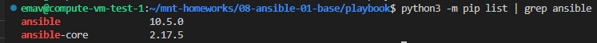 |
| 2. Скопировать исходники из репозитория mnt-homeworks. В частности исходники к данному ДЗ | Скопированы исходники.                                                                      | 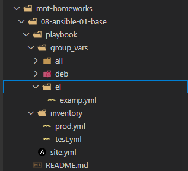 |

## Основная часть

|                                                                                                              Номер и описание задачи                                                                                                              | Описание выполняемых действий                                                                                                                                                                                                                                                                                                                                                               | Скриншоты                                                                                 |
| :-------------------------------------------------------------------------------------------------------------------------------------------------------------------------------------------------------------------------------------------------------------------: | ---------------------------------------------------------------------------------------------------------------------------------------------------------------------------------------------------------------------------------------------------------------------------------------------------------------------------------------------------------------------------------------------------------------------- | -------------------------------------------------------------------------------------------------- |
|                       1. Запустить playbook на окружении из test.yml. Зафиксировать, какое значение  имеет факт some_fact  для указанного хоста.                       | Запущен playbook. Значение some_fact указано  в результате таски Print fact.                                                                                                                                                                                                                                                                                           | 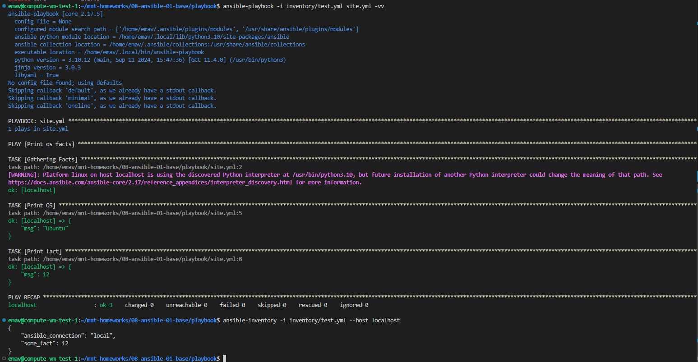                                                     |
|                                                 2. Найти файл с переменными где указывается some_fact  и заменить значение на  all default fact                                                 | some_fact задается в файле group_vars/all/examp.yml Заменил значение переменной и заново проиграл playbook                                                                                                                                                                                                                                        | 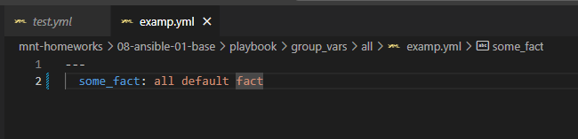 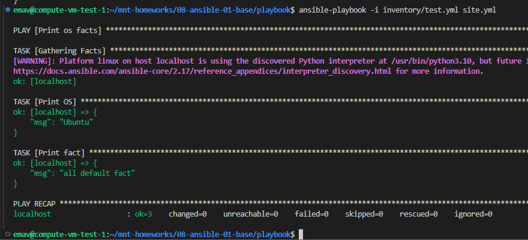 |
|                                   3. Воспользоваться подготовленым окружением  или создать свое для проведения  дальнейших испытаний                                   | Созданы окружение: Созданы контейнеры almalinux9 и ubuntu22  на базе образов с установленным  в них python3, т.к. ansible треубет наличия на managed nodes установленного интерпретатора python. Скорректирован инвентарь prod.yml                | 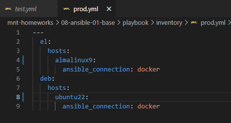 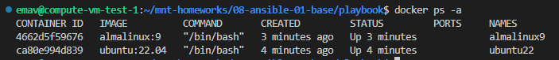 |
|                                                                   4. Запустить playbook на окружении prod.yml Зафиксировать значения some_facts.                                                                   | Запущен playbook на инвентаре prod.yml Значения some_fact для хостов указаны в результатах выполнения таски Print fact. Значения этой переменной задаются через групповые переменные в файлах group_vars/deb/examp.yml и group_vars/el/examp.yml | 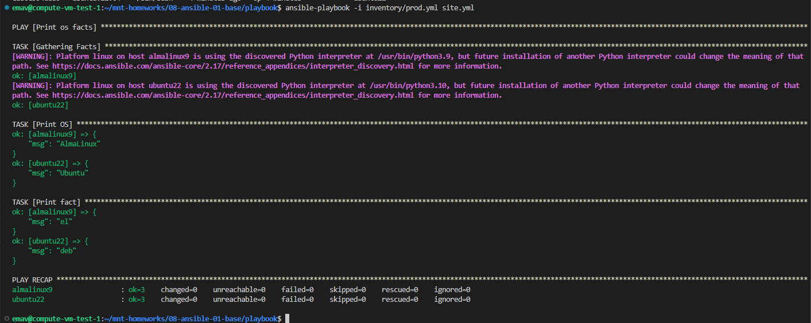                                                     |
|                                                 5. Сделать так, чтобы some_fact имели значения deb default fact и el default fact для разных групп хостов                                                 | Изменено значение переменной some_fact в файлах group_vars/deb/examp.yml и group_vars/el/examp.yml                                                                                                                                                                                                                                                                    | 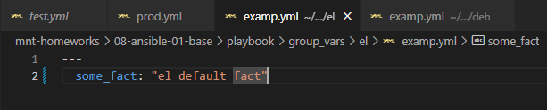 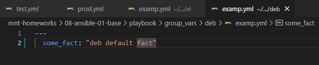 |
|                                6. Запустить playbook на инвентаре prod.yml Удостовериться, что выдаются корректные значения для всех хостов                                | Запущен playbook                                                                                                                                                                                                                                                                                                                                                                                                | 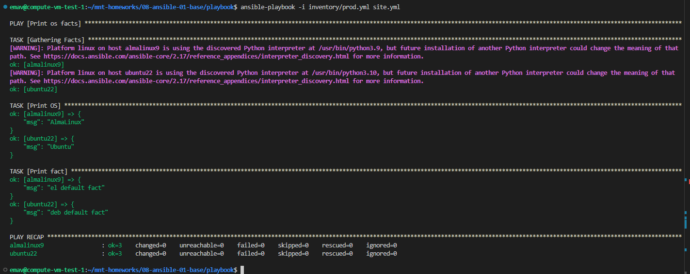                                                     |
|                                                                   7. При помощи vault зашифровать факты  для групп deb и el с паролем netology                                                                   | Зашифрованы файлы с переменными                                                                                                                                                                                                                                                                                                                                                            | 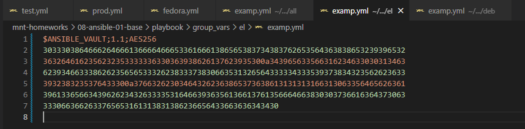 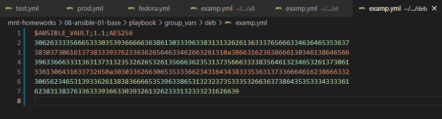 |
| 8. Запустить playbook на инвентаре prod.yml Необходимо, чтобы ansible запросил пароль от зашифрованных переменных. Убедиться в работоспособности. | Запущен playbook с ключом --ask-vault-pass Проверена работоспособность.                                                                                                                                                                                                                                                                                                   | 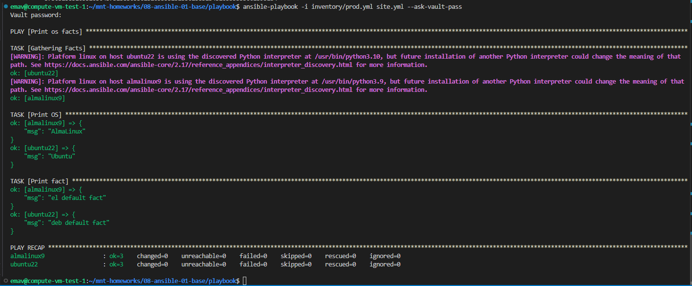                                                     |
|                                 9. Через ansible-doc посмотреть список плагинов для подключения. Выбрать подходящий для работы на control node.                                 | Просмотрен список доступных плагинов. Выбран плагин local.                                                                                                                                                                                                                                                                                                           | 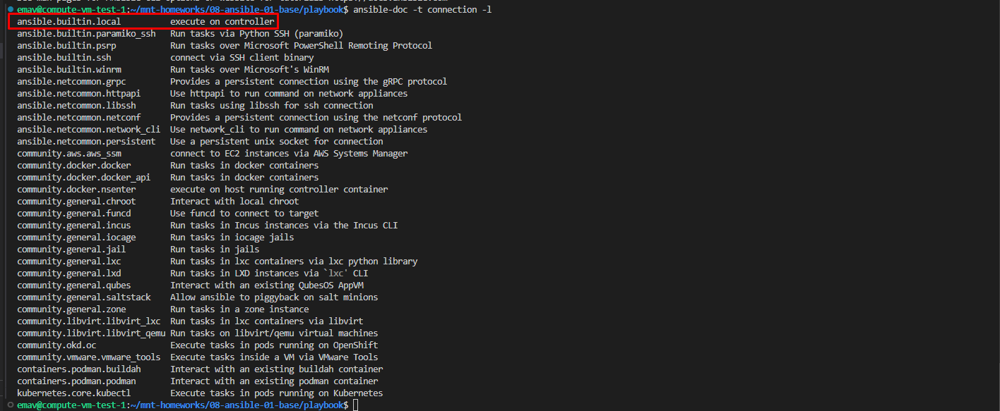                                                     |
|                 10. В инвентарь prod.yml добавить новую группу хостов с именем local. В ней разместить localhost с необходимым типом подключения.                 | В инвентарь prod.yml добавлена группа и хост.                                                                                                                                                                                                                                                                                                                                       | 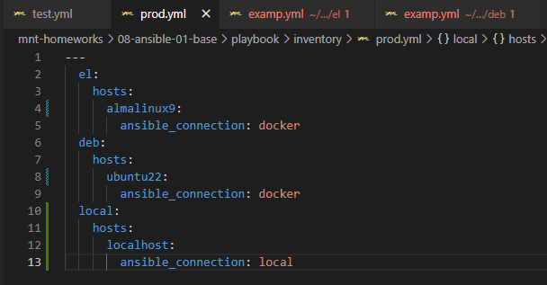                                                     |
|                                                   11. Запустить playbook. Удостовериться, что переменные берутся из коррекных источников.                                                   | Запущен playbook.                                                                                                                                                                                                                                                                                                                                                                                               | 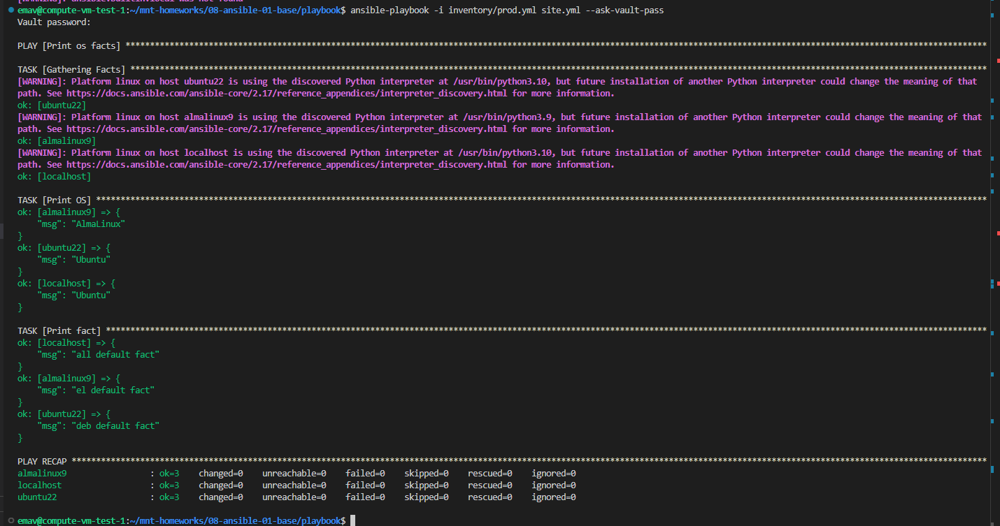                                                     |

## Необязательная часть

|                                                                              Номер и описание задачи                                                                              | Описание выполняемых действий                                                                                                                                                                                                                                                                                                                    | Скриншоты                                                                                                                                     |
| :----------------------------------------------------------------------------------------------------------------------------------------------------------------------------------------------------: | --------------------------------------------------------------------------------------------------------------------------------------------------------------------------------------------------------------------------------------------------------------------------------------------------------------------------------------------------------------------------- | ------------------------------------------------------------------------------------------------------------------------------------------------------ |
|                                                                1. Расшифровать все файлы с переменными                                                                | Расшифрованы файлы с переменными.                                                                                                                                                                                                                                                                                                              | 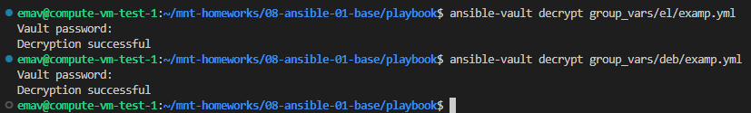 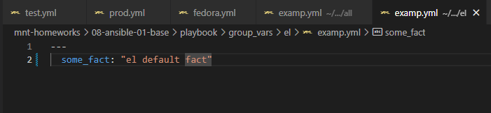 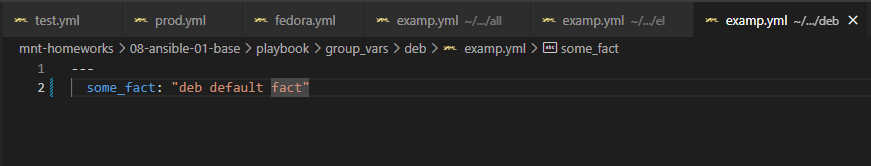 |
|                                                2. Зашифровать значение переменной some_fact для группы all.                                                | Внесены изменения в файл с групповыми переменными для группы all. Зашифрован и подставлено значение.                                                                                                                                                                       | 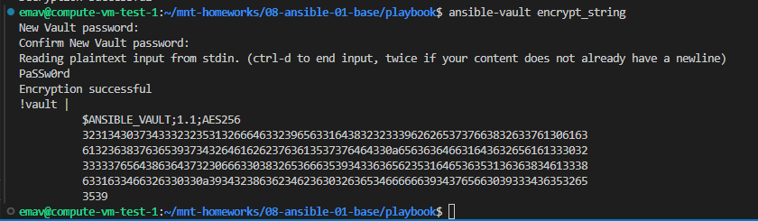 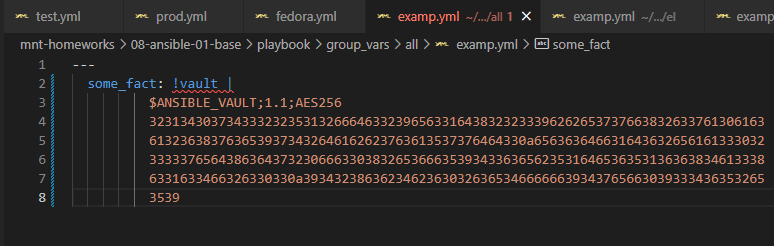                                                     |
|                       3. Запустить playbook и убедиться, что для нужных хостов применяется корректный fact.                       | Запущен playbook.                                                                                                                                                                                                                                                                                                                                                    | 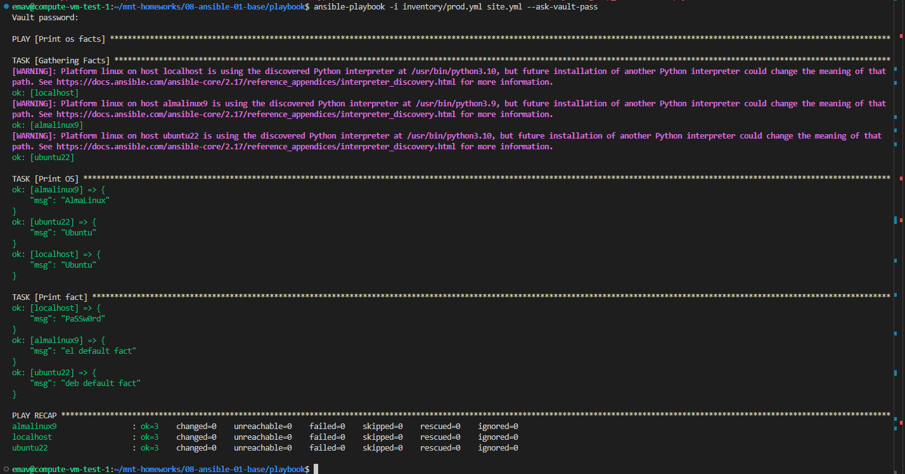                                                                                                         |
|                     4. Добавить новую группу хостов Fedora. Самостоятельно придумать для нее переменную.                     | Добавлена группа Fedora. Добавлена переменная для этой группы.                                                                                                                                                                                                                                                          | 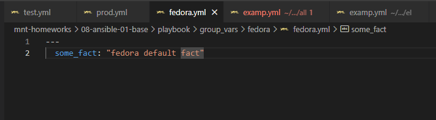 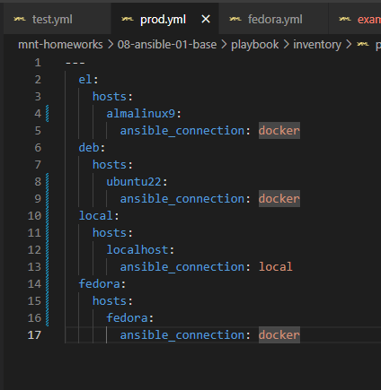 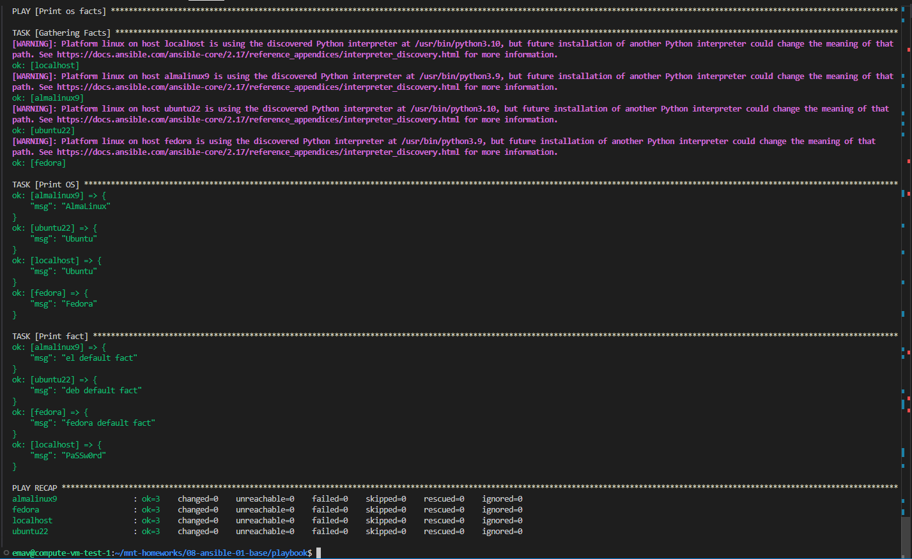 |
| 5. Написать bash скрипт для автоматизации запуска контейнеров, запуска ansible-playbook  и остановку контейнеров | Для того, чтобы скрипт работал корректно , внес изменения в инвентарь согласно  измененному окружению. Скрипт размещен в директории с playbook и запускать его следует из этой же директории. | 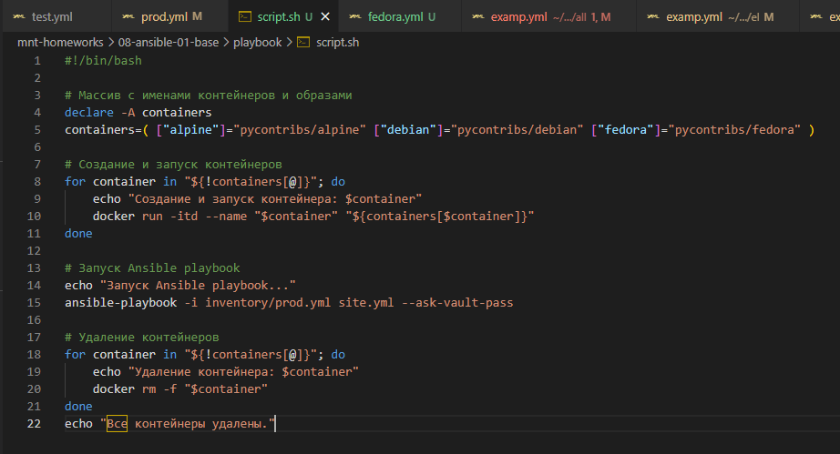 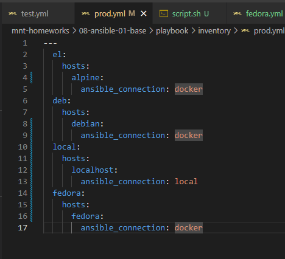 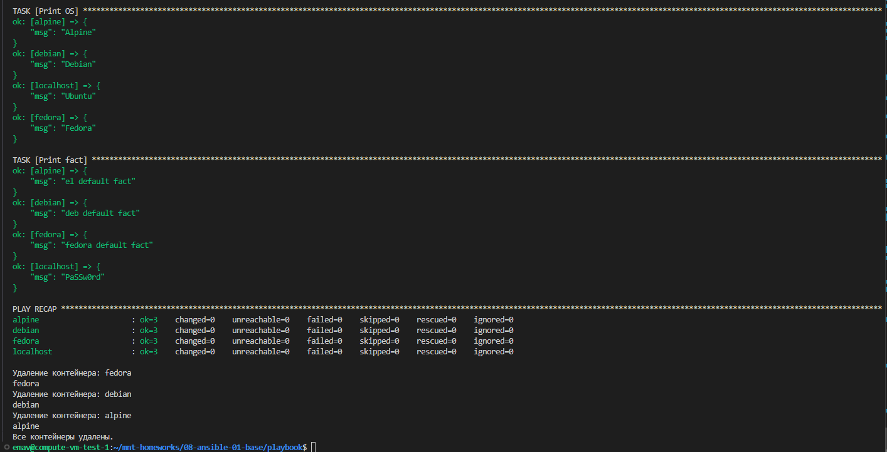 |
