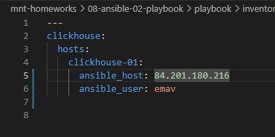
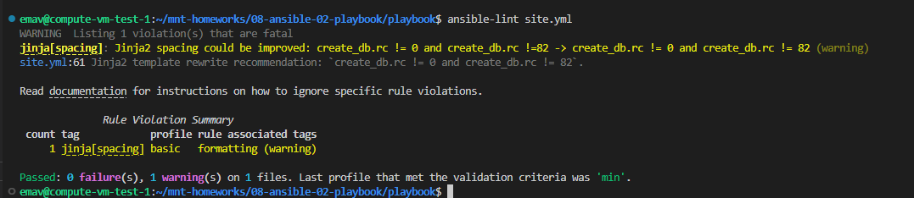
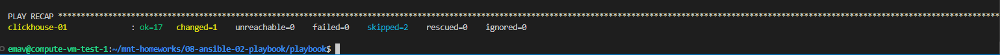
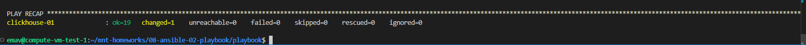

# Домашнее задание к занятию 2 "Работа с Playbook"

## Основная часть

|                                                                                                           Описание задачи                                                                                                           | Описание выполняемых действий                                                                                                                                                                                                                                                     | Скриншоты                                                                          |
| :-----------------------------------------------------------------------------------------------------------------------------------------------------------------------------------------------------------------------------------------------: | ------------------------------------------------------------------------------------------------------------------------------------------------------------------------------------------------------------------------------------------------------------------------------------------------------------ | ------------------------------------------------------------------------------------------- |
|                                                                                                   1. Подготовить инвентарь                                                                                                   | Подготовлен инвентарь                                                                                                                                                                                                                                                                    |                                               |
| 2. Дописать playbook. Добавить Play,  который устанавливает  и настривает vector. Конфигурация должна деплоиться  через шаблон j2. | Переработан playbook с учетом рекомендаций по установке clickhouse из репозитория для debian. Добавлен play установки vector  из скачиваемого архива с бинарником.              | С кодом можно ознакомиться в файле /src/playbook/site.yml |
|                                                                                  3. Запустить ansible-lint для полученного playbook                                                                                  | Запущен ansible-lint. Исправлены ошибки                                                                                                                                                                                                                                               |                                               |
|                                                                                4. Попробовать запустить playbook с флагом --check                                                                                | Команда была запущена уже после успешного проигрывания  playbook.                                                                                                                                                                                  |                                               |
|                                                          5. Запустить playbook с флагом --diff и убедиться, что playbook идемпотентен                                                          | Команда была запущена уже после успешного проигрывания playbook. Установлено, что playbook идемпотентен. Изменения в данном случае - это  обновление кэша apt-get. |                                               |
|                                                                   6. Подготовить отдельный README файл, в котором описать playbook.                                                                   | Подготовлен файл README для playbook-а                                                                                                                                                                                                                                                    | С файлом можно ознакомиться /src/playbook/README.md                 |
