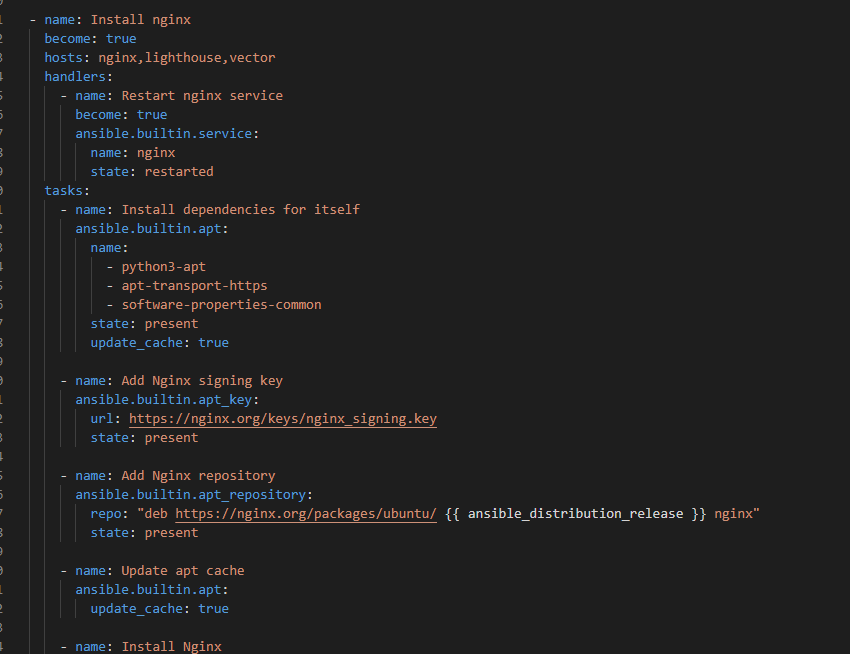
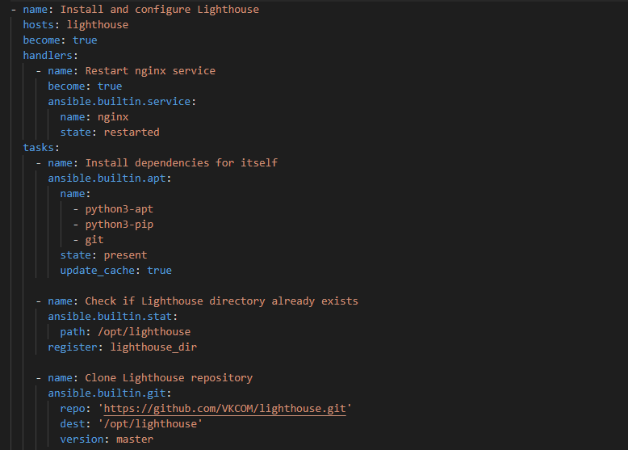
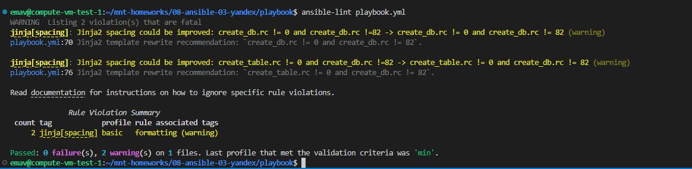
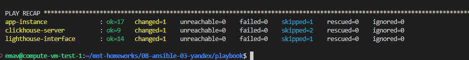
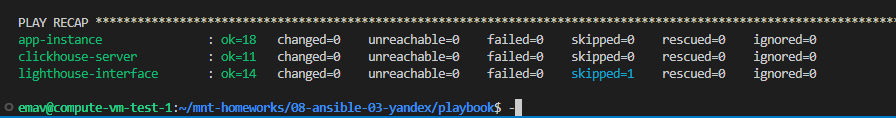
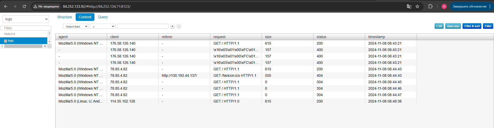

# Домашнее задание к занятию 3 "Использование Ansible"

|                                                  Номер и описание задачи                                                  | Описание выполняемых действий                                                                                            | Скриншоты                                                                                 |
| :--------------------------------------------------------------------------------------------------------------------------------------------: | --------------------------------------------------------------------------------------------------------------------------------------------------- | -------------------------------------------------------------------------------------------------- |
| 1. Дописать playbook, чтобы он еще устанавливал  и Lighthouse и веб-сервер для него. | Дописан playbook. Подробнее ознакомиться с ним  можете в /src/playbook/playbook.yml                |   |
|                                   2. Запустить ansible-lint. Исправить ошибки.                                   | Исправлены ошибки                                                                                                                   |                                                      |
|                                          3. Запустить playbook с флагом --check                                          | Playbook запущен с флагом --check                                                                                                     |                                                      |
|                                           4. Запустить playbook с флагом --diff                                           | Playbook запущен с флагом --diff. Удостоверился, что playbook идемпотентен                           |                                                      |
|                                          5. Подготовить описание в README.md                                          | Подготовлено описание. Подробнее с ним можете ознакомиться в ./src/playbook/README.md |                                                                                                    |
|                                6. Проверить что все компоненты работают.                                | Проверено, что все компоненты работают.                                                                            |                                                      |
