# Домашнее задание к занятию 4 "Работа с roles"

|                                                                   Номер и описание задачи                                                                   | Описание выполняемых действий                                                                                                                                                                                                                                                                                                                                                                                                                                                                                                                | Скриншоты                                                                                                                                                                                                                                   |
| :------------------------------------------------------------------------------------------------------------------------------------------------------------------------------: | ----------------------------------------------------------------------------------------------------------------------------------------------------------------------------------------------------------------------------------------------------------------------------------------------------------------------------------------------------------------------------------------------------------------------------------------------------------------------------------------------------------------------------------------------------------------------- | ---------------------------------------------------------------------------------------------------------------------------------------------------------------------------------------------------------------------------------------------------- |
|                      1. Создать файл requirements.yml Добавить описание роли для установки clickhouse.                      | Создан файл requirements.yml                                                                                                                                                                                                                                                                                                                                                                                                                                                                                                                                  | 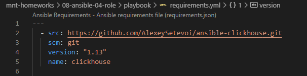                                                                                                                                                                                                       |
|                                              2. При помощи ansible-galaxy скачать указанную роль.                                              | Указанная роль установлена через ansible-galaxy                                                                                                                                                                                                                                                                                                                                                                                                                                                                                       | 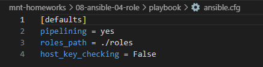 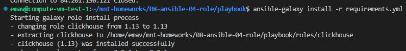                                                                                                                                                   |
| 3. Создать роли для установки Vector и Lighthouse. Выложить все роли в репозитории. Добавить теги. | Созданы роли для установки Vector, Nginx и Lighthouse. Роли запушены в свои репозитории с тегами.                                                                                                                                                                                                                                                                                                                                                                                             | Ссылки на репозитории ролей: https://github.com/Torrmund/ansible_vector_role/tree/main https://github.com/Torrmund/ansible_role_lighthouse/tree/main https://github.com/Torrmund/ansible_role_nginx/tree/main |
|                             4. В requirements.yml добавить описание новых ролей. Установить роли.                             | В requirements.yml добавлено описание новых ролей.                                                                                                                                                                                                                                                                                                                                                                                                                                                                                     | 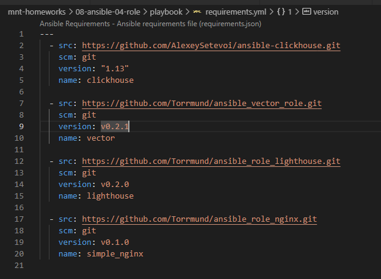 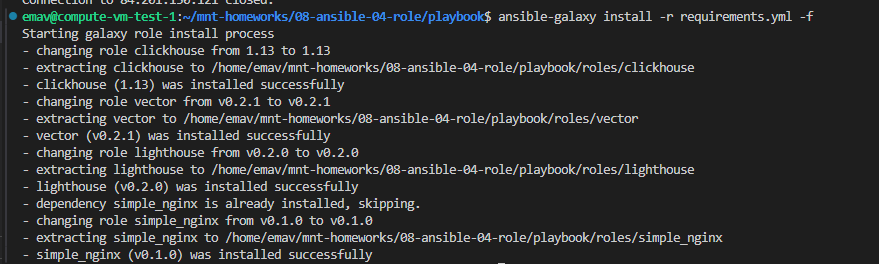                                                                                                                                                   |
|                                 5. Переработать playbook и переменные под использование ролей.                                 | Переработан playbook и переменные под использование ролей.                                                                                                                                                                                                                                                                                                                                                                                                                                                              | 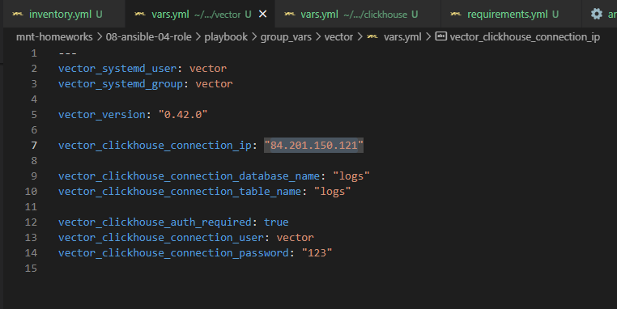 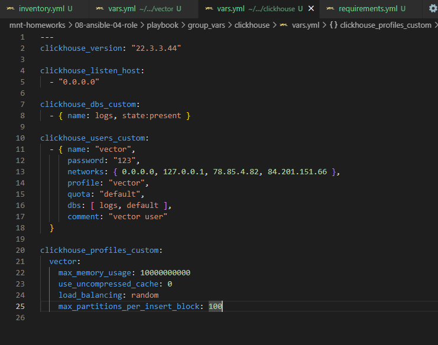 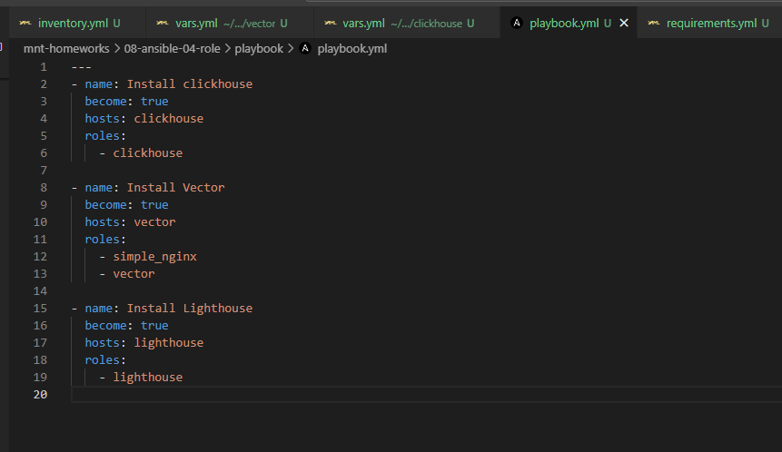                                                                                               |
|                                                     6. Проверить работоспособность проекта.                                                     | Playbook проигран не тестовой инфраструктуре. Таблица в Clickhouse была создана вручную, потому как функции создания таблиц  с кастомными параметрами через предложенную в задании роль я не нашел. Проект полностью работоспособен. Playbook идемпотентен. С playbook можете ознакомиться в /src/playbook | 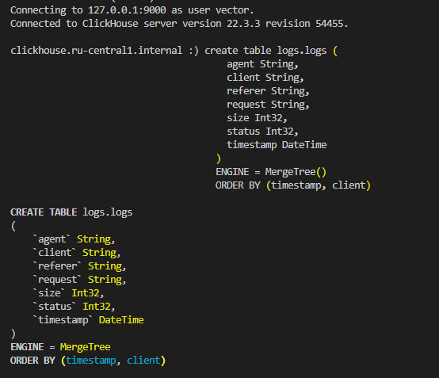 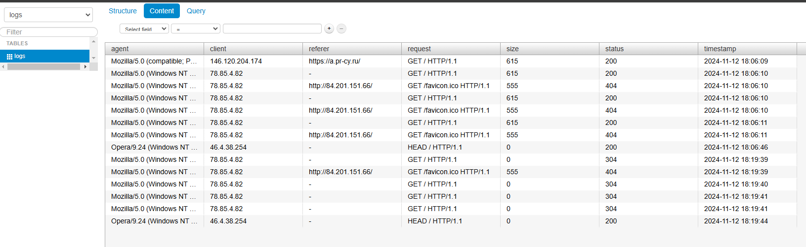 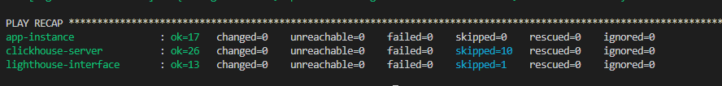                                                                                               |
