# Домашнее задание к занятию 5 "Тестирование roles"

## Подготовка к выполнению

|         Номер и описание задачи         | Описание выполняемых действий                                                | Скриншоты                             |
| :---------------------------------------------------------: | ------------------------------------------------------------------------------------------------------- | ---------------------------------------------- |
| 1. Установить molecule и его драйвера | Команда pip3 install molecule molecule_docker molecule_podman                                   | 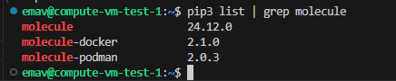 |
|    2. Спулить образ aragast/netology:latest    | это образ с podman, tox и несколькими пайтонами (3.7 и 3.9) внутри | 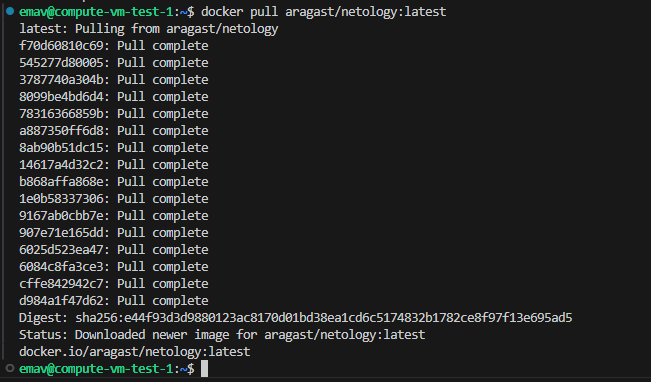 |

## Основная часть

### Molecule

|                                                                           Номер и описание задачи                                                                           | Описание выполняемых действий                                                                                                                                                                                                                                                                                                                                                                                                                                                                                                                                                                                                                                                                                                                                                                                                                                                                                                                                                                                                                                                                                                                                                                                                                                                                                                                                                                                                                                                                                                 | Скриншоты                                                                                                                                                                                         |
| :----------------------------------------------------------------------------------------------------------------------------------------------------------------------------------------------: | -------------------------------------------------------------------------------------------------------------------------------------------------------------------------------------------------------------------------------------------------------------------------------------------------------------------------------------------------------------------------------------------------------------------------------------------------------------------------------------------------------------------------------------------------------------------------------------------------------------------------------------------------------------------------------------------------------------------------------------------------------------------------------------------------------------------------------------------------------------------------------------------------------------------------------------------------------------------------------------------------------------------------------------------------------------------------------------------------------------------------------------------------------------------------------------------------------------------------------------------------------------------------------------------------------------------------------------------------------------------------------------------------------------------------------------------------------------------------------------------------------------------------------------------------------- | ---------------------------------------------------------------------------------------------------------------------------------------------------------------------------------------------------------- |
| 1. Выполнить команду molecule test -s ubuntu_focal внутри корневой директории  clickhouse-role. Изучить вывод команды | Выполнен переход в директорию установленной роли clickhouse. Выполнена команда. Для того, чтобы команда хотя бы запустилась на последней версии molecule, потребовалось в файле molecule.yml сценария убрать параметр playbooks в разделе verifier. После этих изменений тест все равно не смог выполниться успешно. Инфраструктура поднялась, но подключиться к ней Ansible не смог. Также были отображены иные ошибки/предупреждения. Т.к. в данном домашнем задании предполагается использование последней версии molecule а не конкретной, то от дальнейшего разбора проблем было решено отказаться. Поднять виртуальное окружение с зависимостями из самой роли с ходу тоже, к сожалению, не удалось, т.к. эти зависимости довольно давно не обновляются разработчиком, потому как сама роль на данный момент находится в архиве. | 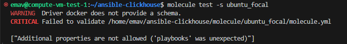 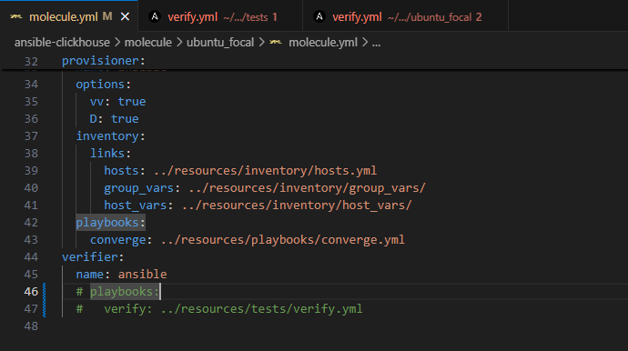 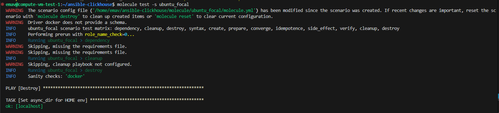 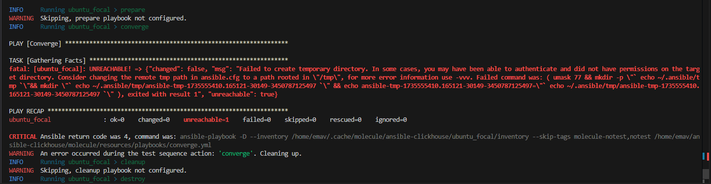 |
|                  2. Перейти в каталог со своей ролью Vector и создать сценарий тестирования по умолчанию                  | Т.к. моя роль подразумевает установку Vector и создания для него юнита в systemd, а также учитывая то, что роль разрабатывалась,  в первую очередь под Ubuntu, принял решение использовать другой драйвер для молекулы, а именно molecule-lxd и понизить версию  molecule до 4.0.4 Создал дефолтный сценарий поднятия LXC контейнеров на Ubuntu и проигрывания на них роли. Также доработал роль, чтобы можно было деплоить дефолтный конфиг Vector, не требующий интегрции. Этот конфиг как раз нужен для тестов.                                                                                                                                                                                                                                                                                                                                                                                                                                                                                                                                                                                                                         | 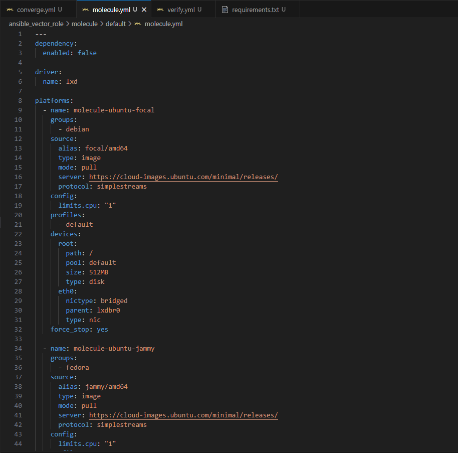                                                                                                                                                             |
|                                                  3. Добавить несколько инстансов для тестирования                                                  | Добавил 2 инстанса для тестирования: Ubuntu Focal Ubuntu Jammy Другие дистрибутивы не включил, потому как на момент выполнения ДЗ LXD перешел под Canonical, что привело, в свою очередь, к недоступности других дистрибутивов кроме Ubuntu в LXD. Но, т.к. роль разрабатывалась под Ubuntu, проблем нет.                                                                                                                                                                                                                                                                                                                                                                                                                                                                                                                                                                                                                                                                                                                                                                                                                                                                                                                                                                                                                 | 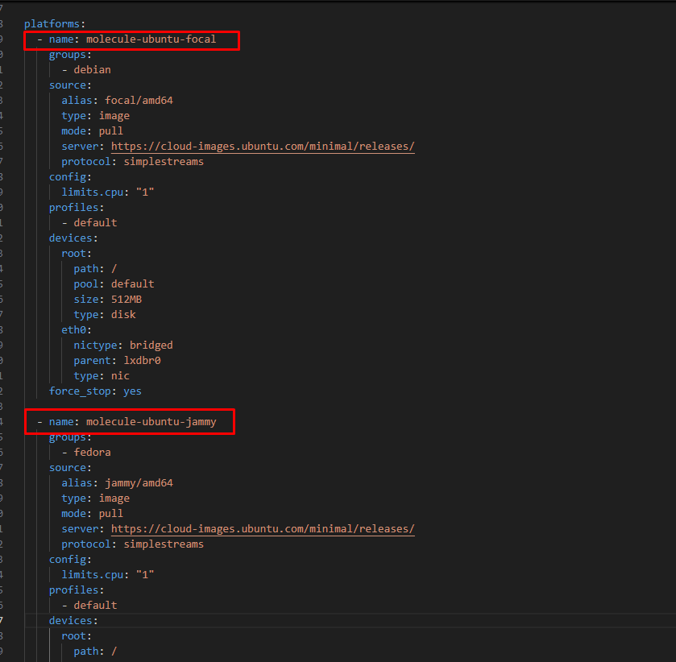                                                                                                                                                             |
|                       4. Добавить несколько asserts для проверки работоспособности Vector после установки.                       | Добавил несколько Asserts для проверки работоспособности Vector после его установки.                                                                                                                                                                                                                                                                                                                                                                                                                                                                                                                                                                                                                                                                                                                                                                                                                                                                                                                                                                                                                                                                                                                                                                                                                                                                                                                                                                                                   | 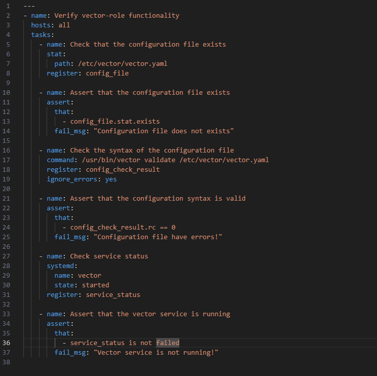                                                                                                                                                             |
|                         5. Запустить тестирование роли повторно. Проверить успешность тестирования.                         | Запустил тест повторно при помощи molecule test. Тестирование прошло успешно.                                                                                                                                                                                                                                                                                                                                                                                                                                                                                                                                                                                                                                                                                                                                                                                                                                                                                                                                                                                                                                                                                                                                                                                                                                                                                                                                                                                                                 | 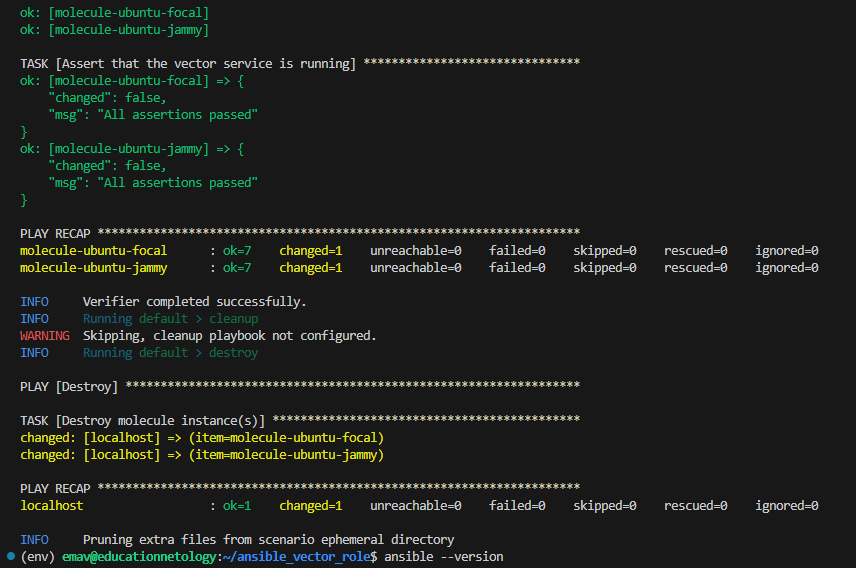 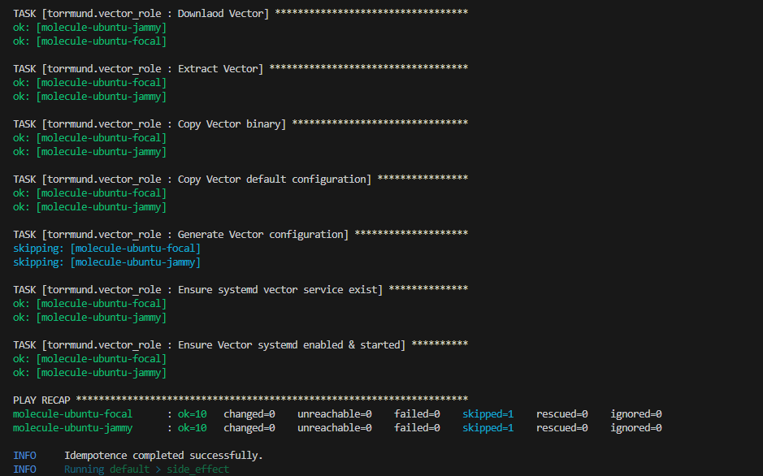 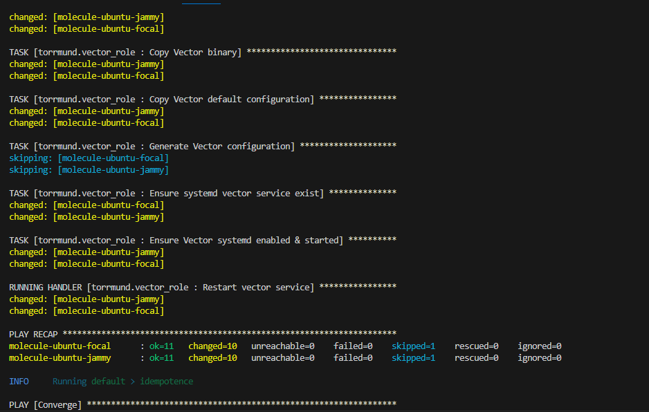 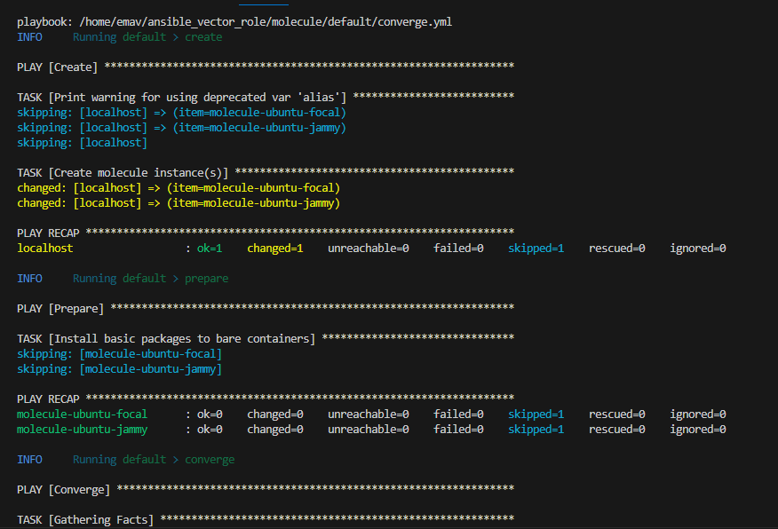 |
|                                                6. Выпустить новый тэг роли после добавления тестов                                                | Выпустил новую версию роли (v0.4.0) https://github.com/Torrmund/ansible_vector_role/releases/tag/v0.4.0                                                                                                                                                                                                                                                                                                                                                                                                                                                                                                                                                                                                                                                                                                                                                                                                                                                                                                                                                                                                                                                                                                                                                                                                                                                                                                                                                                                                                      |                                                                                                                                                                                                            |

### Tox

|                                                                   Номер и описание задачи                                                                   | Описание выполняемых действий                                                                                                                                                                                                                                                                                                                                                                                                                                                                                                                                                                                                                                                                                                                                                                                 | Скриншоты                                                                                                                                     |
| :------------------------------------------------------------------------------------------------------------------------------------------------------------------------------: | ---------------------------------------------------------------------------------------------------------------------------------------------------------------------------------------------------------------------------------------------------------------------------------------------------------------------------------------------------------------------------------------------------------------------------------------------------------------------------------------------------------------------------------------------------------------------------------------------------------------------------------------------------------------------------------------------------------------------------------------------------------------------------------------------------------------------------------------- | ------------------------------------------------------------------------------------------------------------------------------------------------------ |
|                                                        1. Добавить в реп файлы из примера.                                                        | Файлы добавлены                                                                                                                                                                                                                                                                                                                                                                                                                                                                                                                                                                                                                                                                                                                                                                                                            | 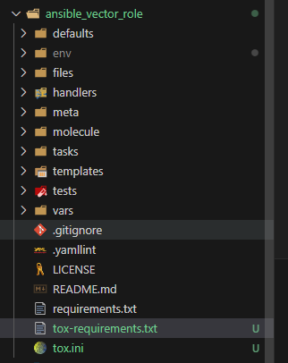                                                                                                         |
| 2. Запустить докер контейнер aragast/netology:latest с примонтированием к нему репозитория с ролью. | Потому как с использованием tox в контейнере на моем окружении возникло множество проблем, Принял решение использовать tox в виртуальном окружении на моей рабочей станции. Файл tox.ini и tox-requirements.txt скорректировал с учетом используемого окружения. Сценарий тестирования molecule также скорректировал, а именно, перевел на драйвер lxd для корректной работы роли. На моей рабочей станции установлены разные версии Python (3.8 и 3.10). | 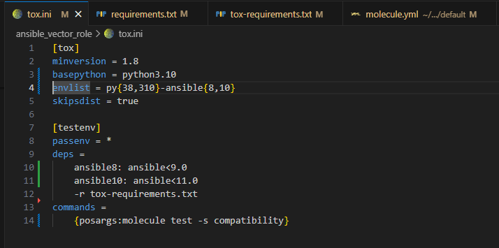 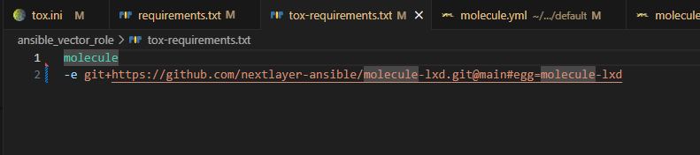                                                     |
|                                                   3. Вызвать внутри контейнера команду tox                                                   | Вызвана команда tox Она не завершилась корректно, потому как не был создан сценарий, указанный в команде вызова tox (сценарий compatibility)                                                                                                                                                                                                                                                                                                                                                                                                                                                                                                                                                                            |                                                                                                                                                        |
|                                              4. Создан легковесный сценарий под драйвер lxd                                              | Создал упрощенную версию default сценария с названием compatibility, чтобы он корректно запускался через  команду tox. Сценарий предварительно был протестирован  через molecule.                                                                                                                                                                                                                                                                                                                                                                                                                                                                                                          | 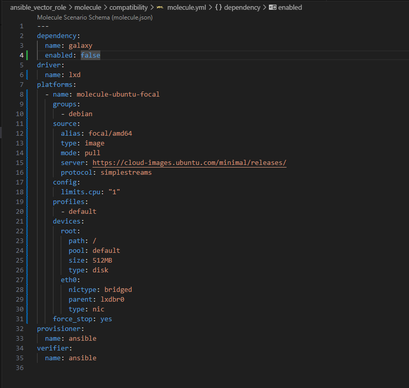 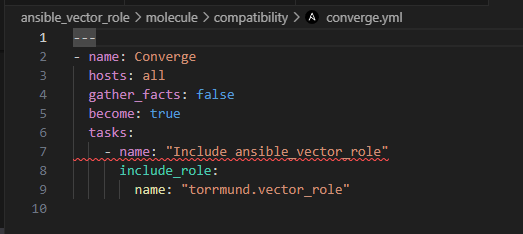 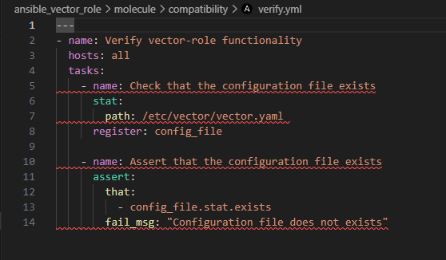 |
|                            5. Запустить команду tox. Убедиться, что все отработало успешно.                            | Запущен tox. Созданы все необходимые (указанные в tox.ini) виртуальные окружения. Успешно пройдены тесты.                                                                                                                                                                                                                                                                                                                                                                                                                                                                                                                                                                                                                                   | 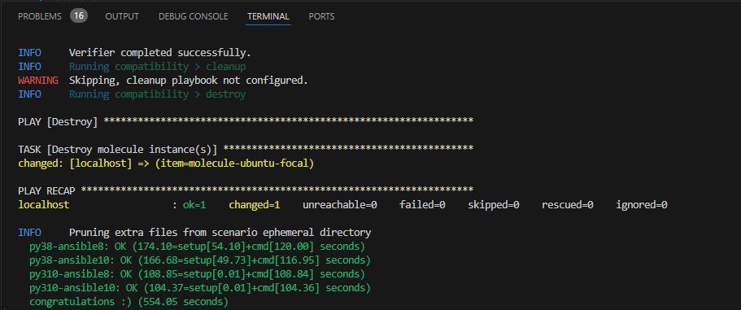                                                                                                         |
|                                                              6. Выпустить новую версию роли                                                              | Ссылка на новую версию роли: [v0.5.0](https://github.com/Torrmund/ansible_vector_role/releases/tag/v0.5.0)                                                                                                                                                                                                                                                                                                                                                                                                                                                                                                                                                                                                                                                                                                          |                                                                                                                                                        |
