# Домашнее задание к занятию "Организация сети"

## Задание 1

### Постановка

1. Создать пустую VPC. Выбрать зону доступности
2. Публичная подсеть.
   1. Создать в VPC subnet с названием public и CIDR 192.168.10.0/24
   2. Создать в этой подсети NAT-инстанс, присвоив ему адрес 192.168.10.254. В качестве image_id использовать fd80mrhj8fl2oe87o4e1
   3. Создать в этой публичной подсети ВМ с публичным IP. Подключиться к ней и убедиться, что есть доступ к интернету.
3. Приватная подсеть
   1. Создать в VPC subnet с названием private и CIDR 192.168.20.0/24
   2. Создать route table. Добавить статический маршрут, направляющий весь исходящий трафик private сети в NAT-инстанс.
   3. Создать в этой приватной подсети ВМ с внутренним IP, подключиться к ней через виртуалку, созданную ранее и убедиться, что есть доступ в интернет.

### Решение

| Номер и описание задачи                                                                                                                                                                                     | Описание выполняемых действий                                                                                                                                                                                                                      | Скриншоты                                                                                                                                                                                                                                                                                           |
| ------------------------------------------------------------------------------------------------------------------------------------------------------------------------------------------------------------------------------- | ----------------------------------------------------------------------------------------------------------------------------------------------------------------------------------------------------------------------------------------------------------------------------- | ------------------------------------------------------------------------------------------------------------------------------------------------------------------------------------------------------------------------------------------------------------------------------------------------------------ |
| 1. Создать описание поднимаемой инфраструктуры для Terraform.                                                                                                                   | Описал инфраструктуру для Terraform. Применил код.  С кодом можно знакомиться в директории src рядом с данным README.                                                      | 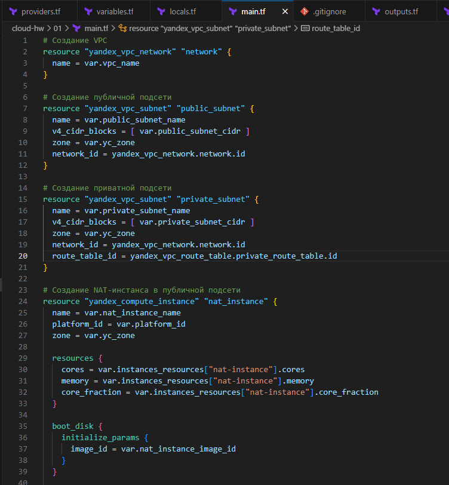 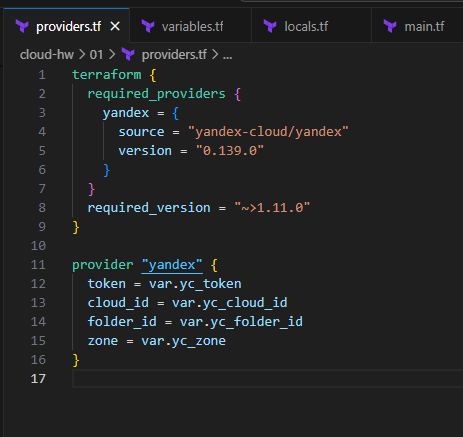 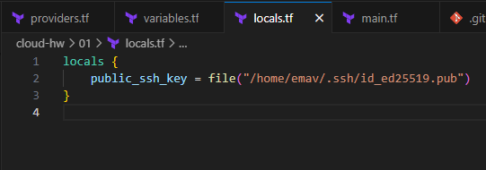 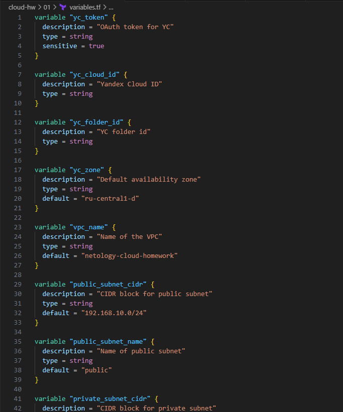 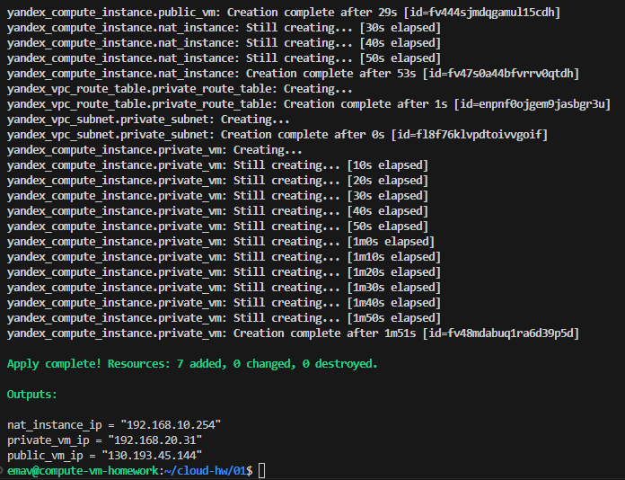                                                    |
| 2. Проверить, что инфраструктура развернута.                                                                                                                                                | Зашел в веб-интерфейс YC и удостоверился, что инфраструктура поднялась.                                                                                                                                        | 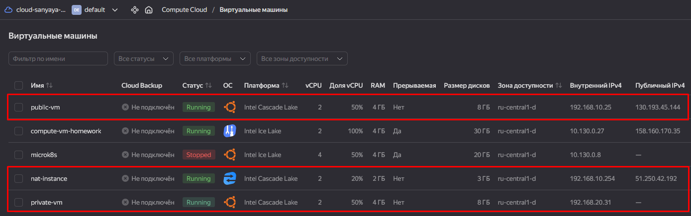 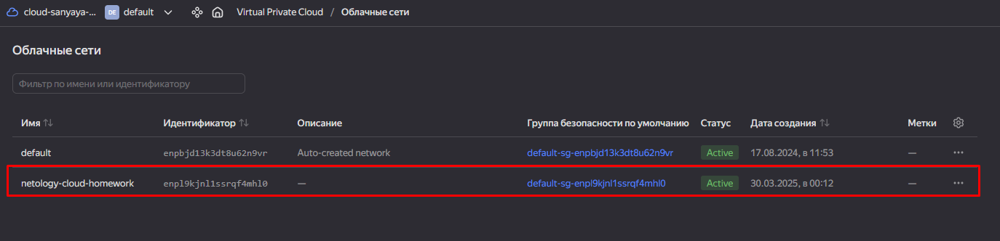  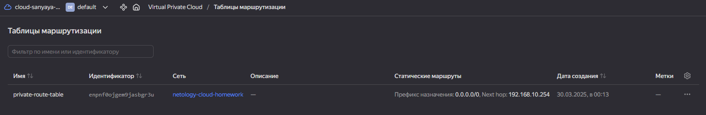 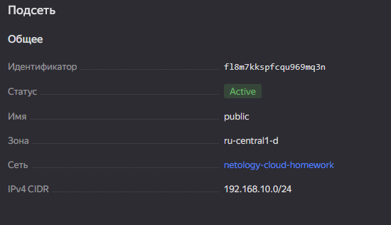 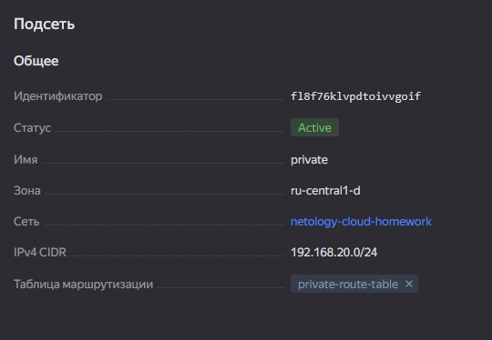 |
| 3. Подключиться к ВМ в публичной подсети и удостовериться, что с неё есть доступ в интернет.                                                      | Подключился по SSH к ВМ в публичной подсети. Проверил доступ в интернет.  Доступ в интернет в наличии                                                                           | 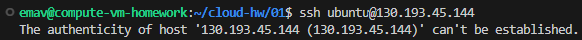 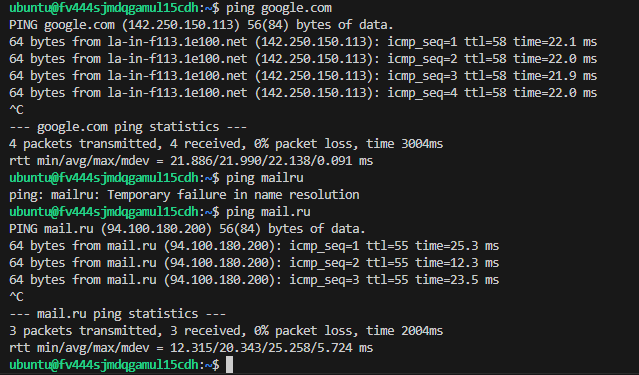 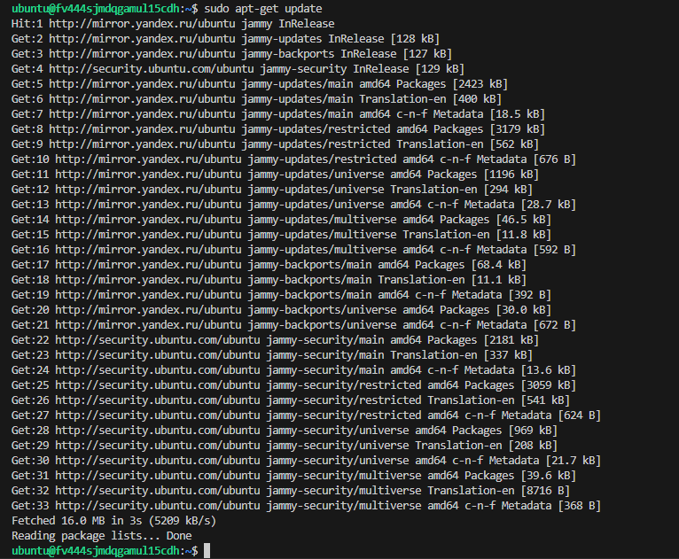 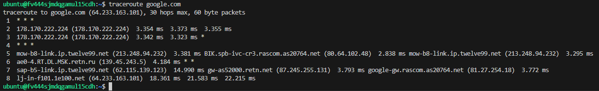                                                                                                       |
| 4. Подключиться к ВМ в приватной подсети по SSH с ВМ из публичной подсети и проверить доступ  в интернет с приватной ВМ. | Подключился по SSH к ВМ в приватной подсети с ВМ в публичной подсети. Проверил доступ в интернет.  Доступ в интернет в наличии через nat-instance | 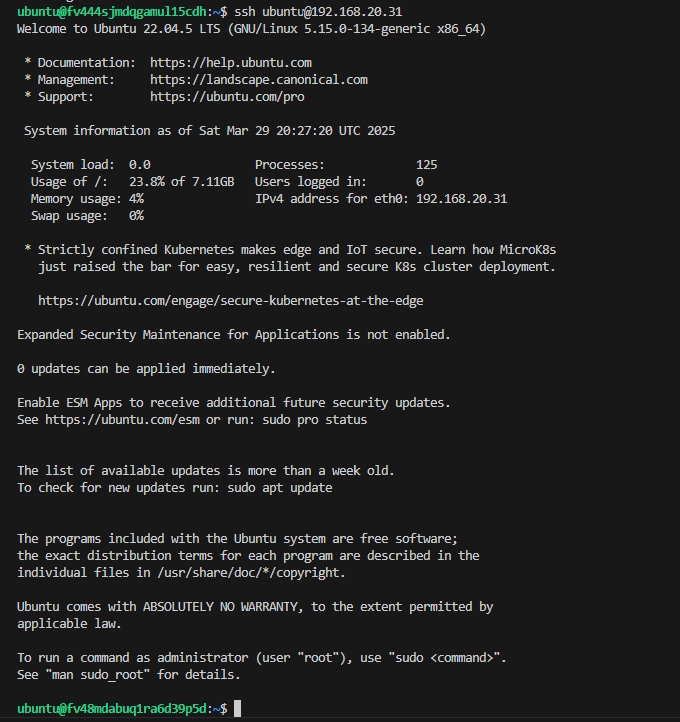 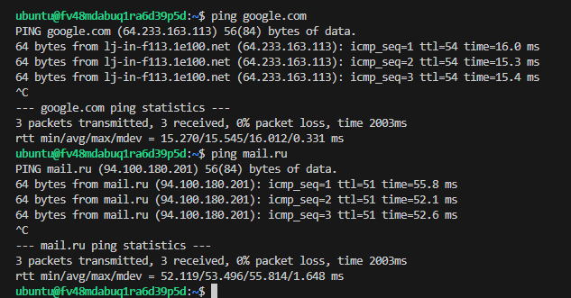 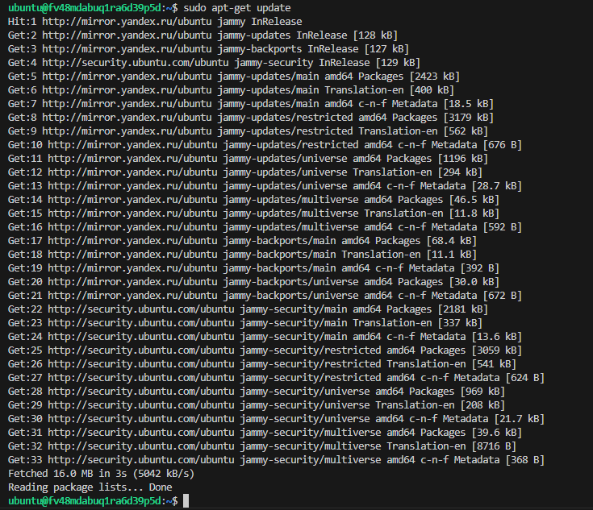 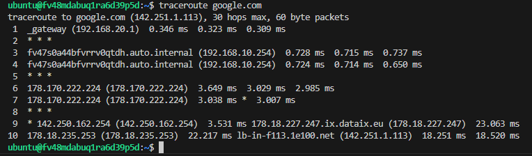                                                                                                       |
