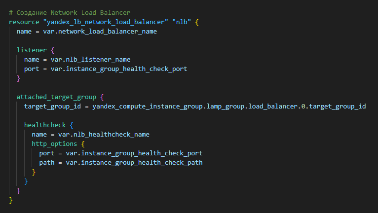

# Домашнее задание к занятию "Вычислительные мощности. Балансировщики нагрузки"

## Задание 1

### Постановка

1. Создать бакет Object Storage и разместить в нем файл с картинкой
   * Создать бакет в Object Storage с произвольным именем
   * Положить в бакет файл с картинкой
   * Сделать файл доступным из интернета
2. Создать группу ВМ в public подсети фиксированного размера с шаблоном LAMP и веб-страницей, содержащей ссылку на картинку из бакета
   * Создать Instance Group с трема ВМ и шаблоном LAMP. Для LAMP рекомендуется использовать image_id = fd827b91d99psvq5fjit
   * Для создания стартовой веб-страницы рекомендутеся использовать раздел user_data в meta_data
   * Разместить на стартовой веб-странице шаблонной ВМ ссылку на картинку из бакета
   * Настроить проверку состояния ВМ
3. Подключить группу ВМ к сетевому балансировщику
   * Создать сетевой балансировщик
   * Проверить работоспособност, удалив одну или несколько ВМ
4. (Дополнительно)* Создать Application Load Balancer с использованием instance group и проверкой состояния.

### Решение

| Номер и описание задачи                                                                                           | Описание выполняемх действий                                                                                                                                                                                                                                                                                                                                                                                                                                                                                                                                                                                                                                                                                                                                                                                                                                                                                                                                                                                                                                                                                                                                                                                                                                                                                                 | Скриншоты                                                                                                                                                                                                                                                                                                                                                                                                                                                                                                                                                                                                                         |
| ------------------------------------------------------------------------------------------------------------------------------------- | ------------------------------------------------------------------------------------------------------------------------------------------------------------------------------------------------------------------------------------------------------------------------------------------------------------------------------------------------------------------------------------------------------------------------------------------------------------------------------------------------------------------------------------------------------------------------------------------------------------------------------------------------------------------------------------------------------------------------------------------------------------------------------------------------------------------------------------------------------------------------------------------------------------------------------------------------------------------------------------------------------------------------------------------------------------------------------------------------------------------------------------------------------------------------------------------------------------------------------------------------------------------------------------------------------------------------------------------------------ | ------------------------------------------------------------------------------------------------------------------------------------------------------------------------------------------------------------------------------------------------------------------------------------------------------------------------------------------------------------------------------------------------------------------------------------------------------------------------------------------------------------------------------------------------------------------------------------------------------------------------------------------ |
| 1. Создать описание развертываемой инфраструктуры для Terraform                    | Описал инфраструктуру для Terraform. Применил код.  Брал за основу код из предыдущего ДЗ.  Добавил необходимые ресурсы и  переменные.  Добавил в репозиторий картинку для  последующей её загрузки в бакет.  Описал создание группы ВМ, id образа взял из постановки.  Создание стартовой веб страницы  реализовал через user-data и cloud-init.  Настроил проверку состояния ВМ.  Описал создание NLB и ALB.  Для удобства добавил вывод в output ip адресов балансировщиков.  Сами ВМ хоть и расположены в публичной подсети, но своих отдельных внешних IP  не имеют, что положительно скажется на безопасности.  С кодом можно ознакомиться в директории src рядом с данным README. |             |
| 2. Проверить, что инфраструктура развернута                                                  | Зашел в веб интерфейс YC и удостоверился, что инфраструктура поднялась.                                                                                                                                                                                                                                                                                                                                                                                                                                                                                                                                                                                                                                                                                                                                                                                                                                                                                                                                                                                                                                                                                                                                                                                                            |                                                                                                                                                                                                                                                                            |
| 3. Получить доступ к созданным ресурсам через балансировщики                  | В браузере перешел по IP адресам NLB и ALB. Удостоверился, что есть доступ к ресурсам и отображается созданная мной страница.                                                                                                                                                                                                                                                                                                                                                                                                                                                                                                                                                                                                                                                                                                                                                                                                                                                                                                                                                                                                                                                                                                            |                                                                                                                                                                                                                                                                                                                                                                                                                                                                                                                                           |
| 4. Проверить стабильность работы системы, удалив одну или несколько ВМ | Через интерфейс удалил 2 ВМ. Удостоверися, что доступ к созданной  странице остался.                                                                                                                                                                                                                                                                                                                                                                                                                                                                                                                                                                                                                                                                                                                                                                                                                                                                                                                                                                                                                                                                                                                                                                                    |                                                                                                                                                                                                                                                                                                                                                                                                                                     |
