# Домашнее задание к занятию "Безопасности в облачных провайдерах"

## Задание 1

### Постановка

1. С помощью ключа в KMS необходимо зашифровать содержимое бакета:
   * Создать ключ в KMS
   * С помощью ключа зашифровать содержимое бакета, созданного ранее.
2. (Выполняется не в Terraform)* Создать статический сайт в Object Storage с собственным публичным адресом и сделать доступным по HTTPS:
   * Создать сертификат
   * Создать статическую страницу в Object Storage и применить сертификат HTTPS
   * В качестве результата предоставить скриншот на страницу с сертификатом в заголовке

### Решение

| Номер и описание задачи                                                                                                                         | Описание выполняемых действий                                                                                                                                                                                                                                                                                                                                                                                                                                                                                                                                                                                                                                                                                                                                                                                                                                                                                                                                                                     | Скриншот                                                                                                                                                                                                                                                                                                                                                                                                           |
| ------------------------------------------------------------------------------------------------------------------------------------------------------------------- | ---------------------------------------------------------------------------------------------------------------------------------------------------------------------------------------------------------------------------------------------------------------------------------------------------------------------------------------------------------------------------------------------------------------------------------------------------------------------------------------------------------------------------------------------------------------------------------------------------------------------------------------------------------------------------------------------------------------------------------------------------------------------------------------------------------------------------------------------------------------------------------------------------------------------------------------------------------------------------------------------------------------------------- | -------------------------------------------------------------------------------------------------------------------------------------------------------------------------------------------------------------------------------------------------------------------------------------------------------------------------------------------------------------------------------------------------------------------------- |
| 1. Создать ключ и зашифровать содержимое бакета, созданного в рамках предыдущего ДЗ. | Взял за основу код из предыдущего ДЗ.  Добавил ресурс создания ключа.  Скорректировал ресурс создания бакета.  Добавил необходимые переменные.  Применил код. Пересоздал бакет и объект, чтобы применился ключ. Удостоверился, что содержимое бакета зашифровано. Проверил это также через веб-интерфейс.  Проверил доступ к объекту через стартовую страницу. Удостоверился, что доступ пропал, потому как   содержимое бакета зашифровано.  С кодом можно ознакомиться в директории src, рядом с данным README | 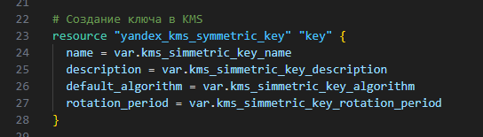 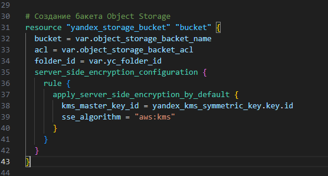 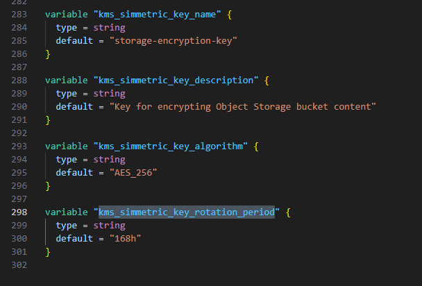 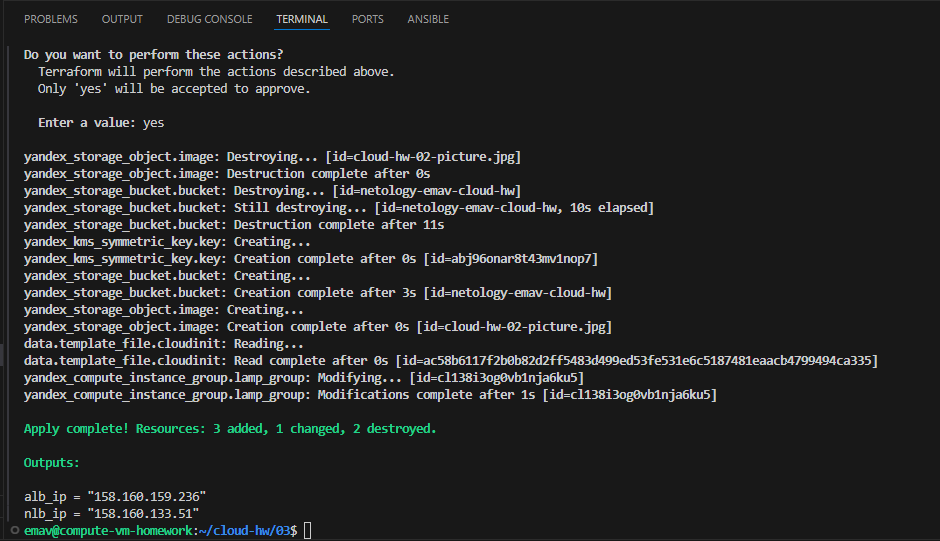 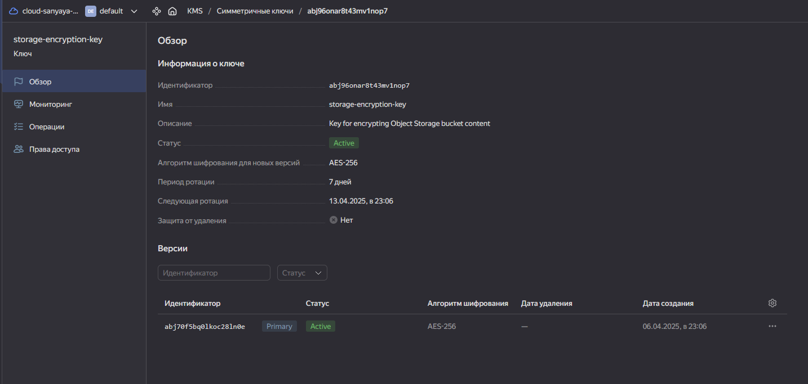 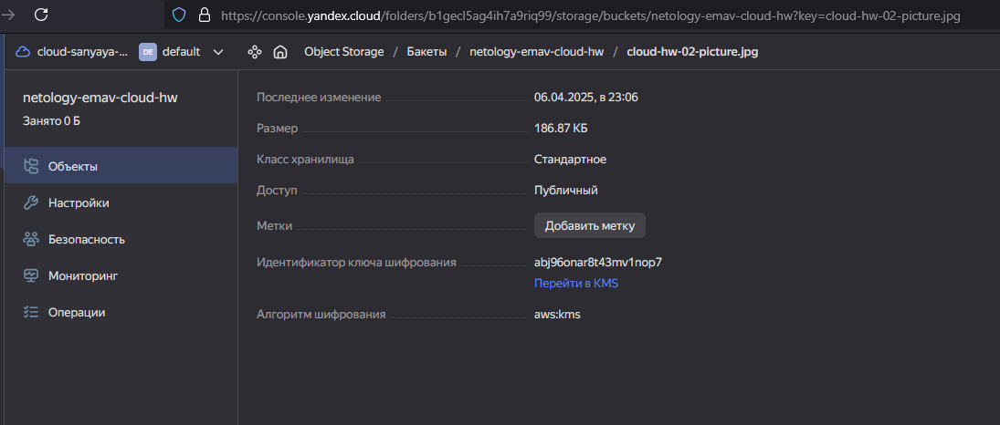 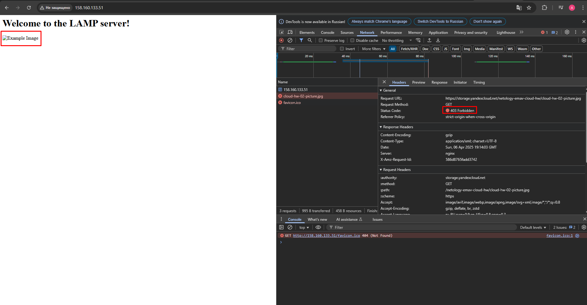                                                     |
| 2. Создать статический сайт в Object Storage и подключить к нему публичный адрес с HTTPS.           | Добавил свой домен в YC.  Создал бакет и разместил в нем объекты статики.  Добавил соответствующие записи в объявленную зону torrmund.ru  Сформировал запрос на получение сертификата.  Дождался, пока сертификат будет получен.  Настроил HTTPS для бакета.  Удостоверился, что доступ к статике осуществляется  по HTTPS и подтягивается полученный ранее  сертификат.                                                                                                                                                                                                                                                                                     | 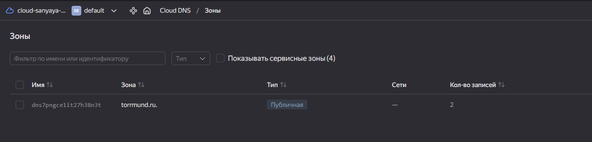 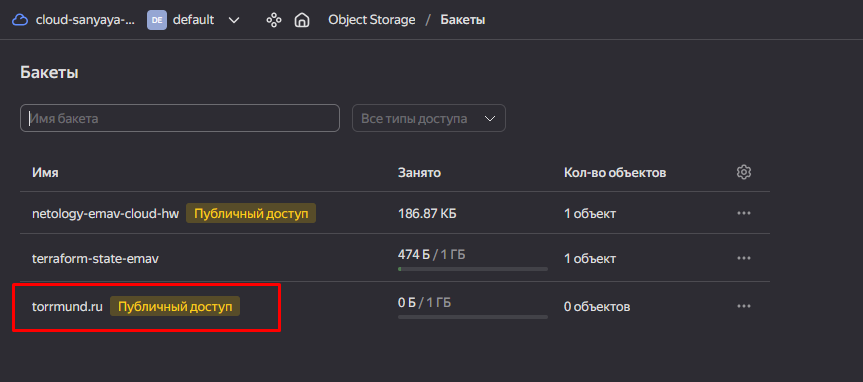 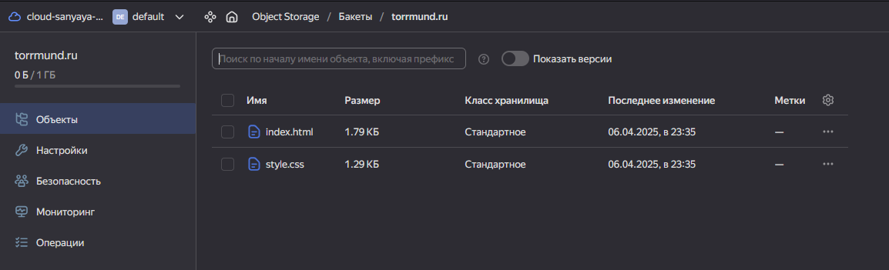 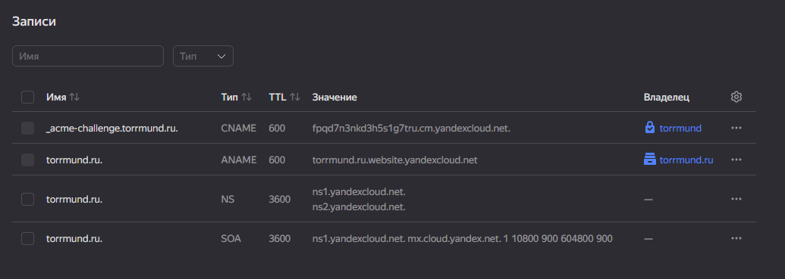 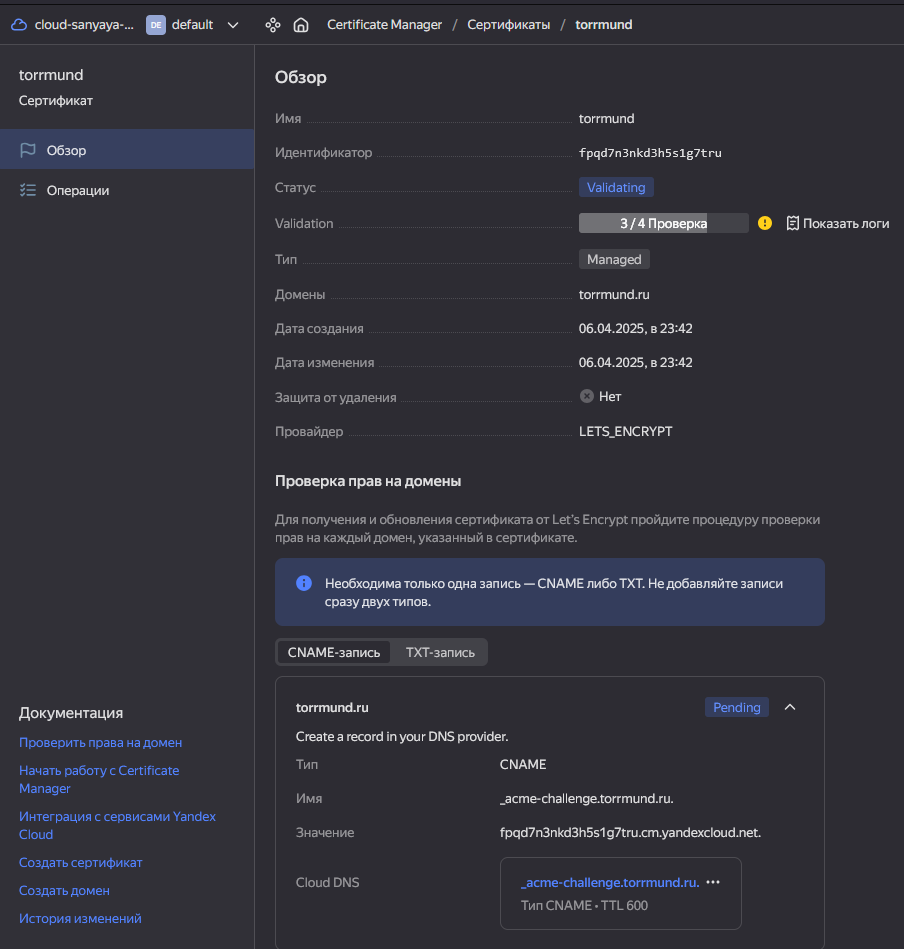 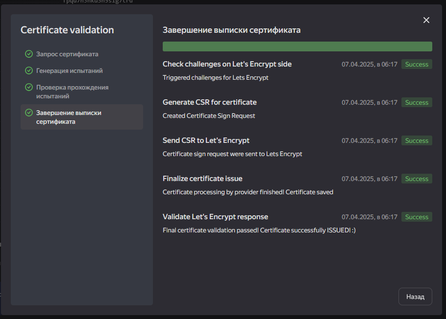 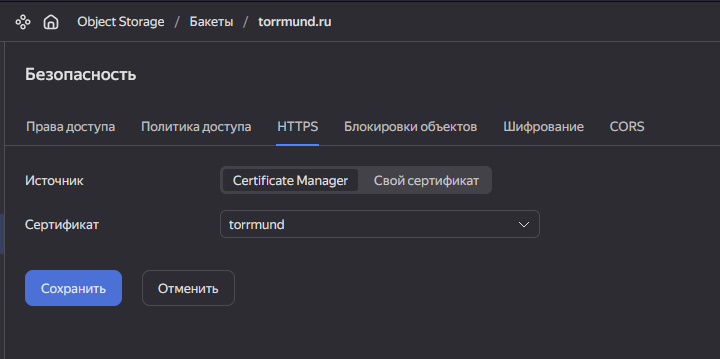 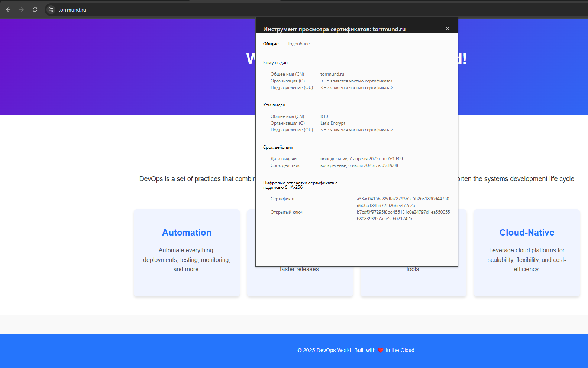 |
