# Домашнее задание к занятию "Kubernetes. Причины появления. Команда kubectl"

## Подготовка к выполнению

### Установка MicroK8S и kubectl

| Описание выполняемых действий                                                                              | Скриншоты                             |
| ------------------------------------------------------------------------------------------------------------------------------------- | ---------------------------------------------- |
| 1. Поднял новую ВМ в YC                                                                                                 | 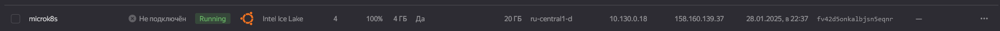 |
| 2. Подключился к новой ВМ по SSH. Выполнил команды для установки  MicroK8S | 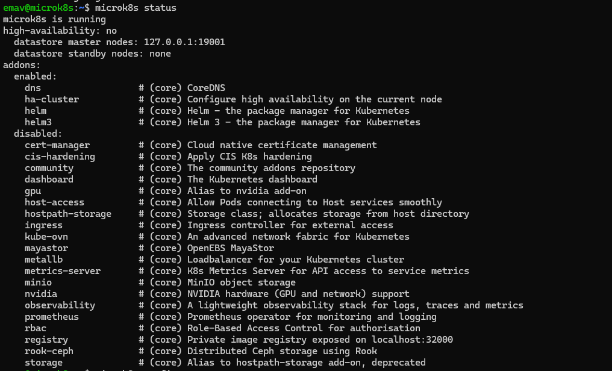 |
| 3. Поднял новую ВМ в YC под kubectl                                                                                  | 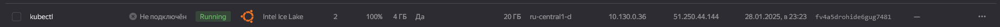 |
| 4. Подключился к новой ВМ по SSH. Выполнил команды для установки  kubectl  | 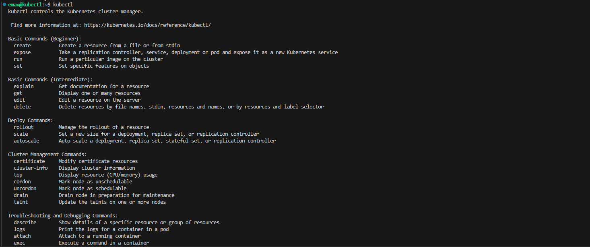 |

## Задание 1

| Номер и описание задачи                                                            | Описание выполняемых действий                                                                                                                                                                                                                                                                                                                                                                                                                                                                                                                                                                                                                                                                                                                                                                                                                                                                                                                              | Скриншоты                                                                                                                                                                                                                                                                                                                                                     |
| ------------------------------------------------------------------------------------------------------ | ------------------------------------------------------------------------------------------------------------------------------------------------------------------------------------------------------------------------------------------------------------------------------------------------------------------------------------------------------------------------------------------------------------------------------------------------------------------------------------------------------------------------------------------------------------------------------------------------------------------------------------------------------------------------------------------------------------------------------------------------------------------------------------------------------------------------------------------------------------------------------------------------------------------------------------------------------------------------------------- | ---------------------------------------------------------------------------------------------------------------------------------------------------------------------------------------------------------------------------------------------------------------------------------------------------------------------------------------------------------------------- |
| 1. Установить MicroK8S                                                                       | Установка произведена на этапе подготовки                                                                                                                                                                                                                                                                                                                                                                                                                                                                                                                                                                                                                                                                                                                                                                                                                                                                                                        |                                                                                                                                                                                                                                                                                                                                                                        |
| 2. Установить dashboard                                                                      | MicroK8s предоставляет встроенный способ установки Kubernetes Dashboard. Активируем addon командой microK8S enable dashboard                                                                                                                                                                                                                                                                                                                                                                                                                                                                                                                                                                                                                                                                                                                                                                                   | 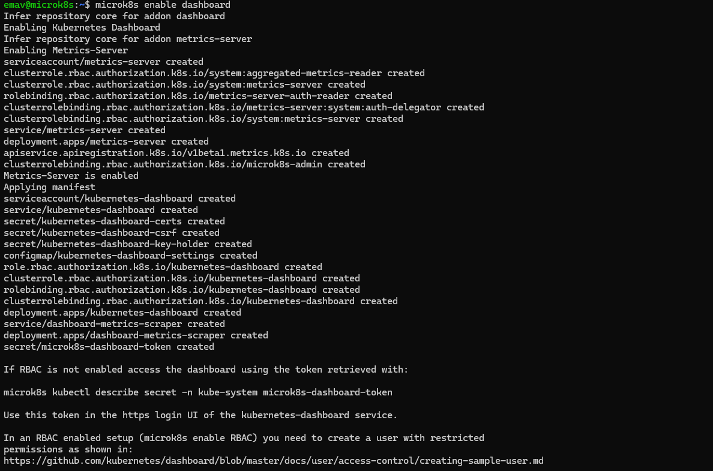                                                                                                                                                                                                                                                                                                                         |
| 3. Организовать доступ к дашборду через внешний  IP. | Получаем токен доступа к Dashboard: Выполняем microk8s kubectl -n kube-system get secret  Выполняем команду для отображения секретов и копируем  себе значение токена dashboard.                                                                                                                                                                                                                                                                                                                                                                                                                                                                                                                                                                                                                                                                                  | 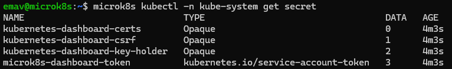 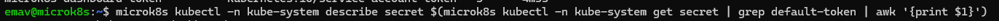 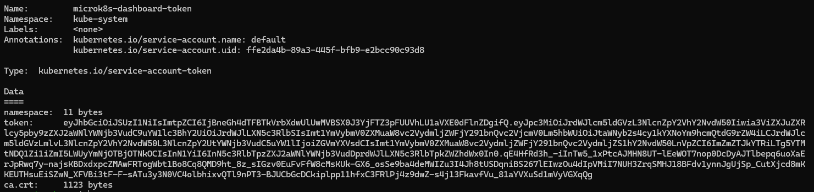                                                                                                                                                                                                                 |
|                                                                                                        | Настраиваем доступ к dashboard через внешний IP: По умолчанию, dashboard доступен только внутри кластера. Чтобы открыть доступ к нему через внешний IP, выполняем  следующие шаги: - Генерируем сертификат для внешнего IP адреса при помощи openssl - Создаем секрет в MicroK8S, используя полученный ранее сертификат. - Используем NodePort для доступа к дашборду. Меняем тип с ClusterIP на NodePort для сервиса kubernetes- dashboard. - Смотрим порт, который был прокинут к дашборду - Открываем в браузере дашборд и авторизуемся по токену. | 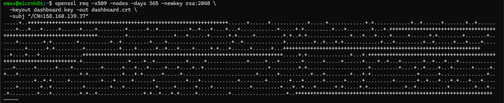 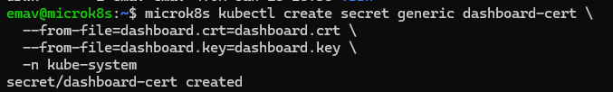 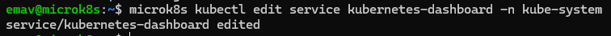 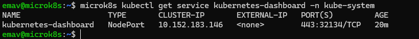 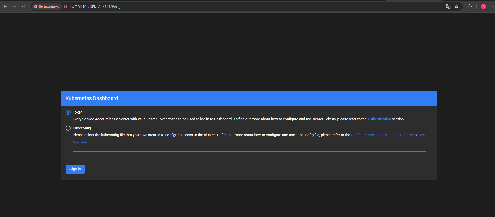 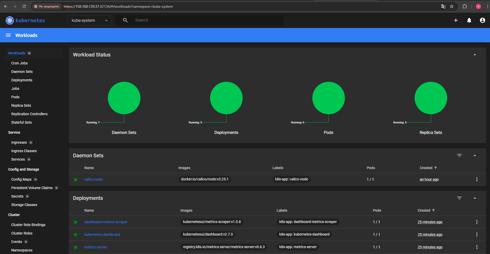 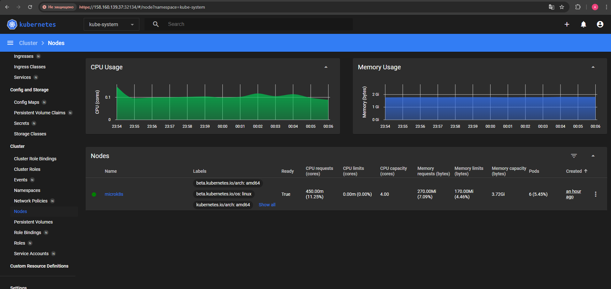 |

## Задание 2

| Номер и описание задачи                                         | Описание выполняемых действий                                                                                                                                                         | Скриншоты                                                                                                                                     |
| ----------------------------------------------------------------------------------- | ---------------------------------------------------------------------------------------------------------------------------------------------------------------------------------------------------------------- | ------------------------------------------------------------------------------------------------------------------------------------------------------ |
| 1. Установить kubectl                                                     | kubectl был установлен на машину в рамках подготовки                                                                                                                  |                                                                                                                                                        |
| 2. Настроить подключение к кластеру                    | Копируем конфиг кластера и формируем файл конфига для kubectl  Проверяем, что kubectl подключается к кластеру | 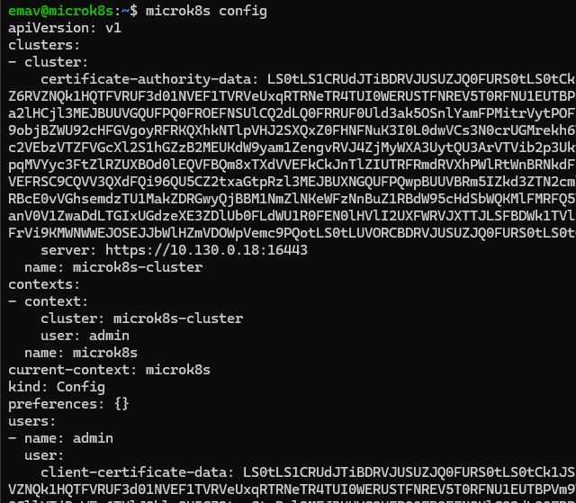 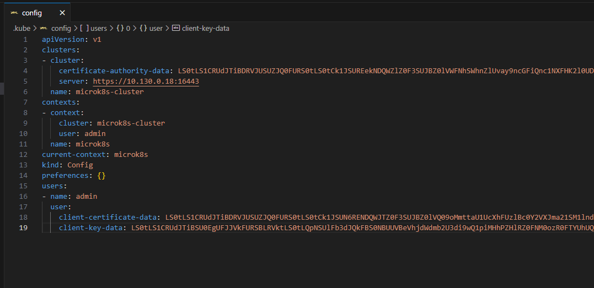 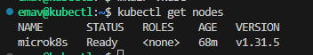 |
| 3. Подключиться к дашборду с помощью port-forward | Находим имя пода дашборда  Запускаем port-forward  Проверяем через curl подключение к дашборду                         | 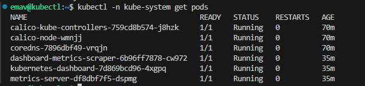 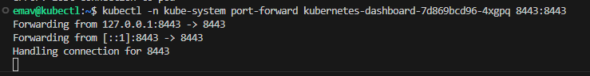 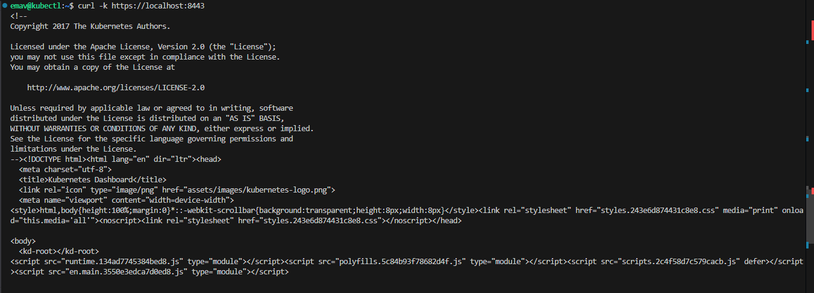 |
