# Домашнее задание к занятию "Базовые объекты K8S"

## Задание 1

| Номер и описание задачи                                                                                                                                          | Описание выполняемых действий                                                                                                                                                                                                                                                                                                                              | Скриншоты                                                                                                                                     |
| ------------------------------------------------------------------------------------------------------------------------------------------------------------------------------------ | ------------------------------------------------------------------------------------------------------------------------------------------------------------------------------------------------------------------------------------------------------------------------------------------------------------------------------------------------------------------------------------- | ------------------------------------------------------------------------------------------------------------------------------------------------------ |
| 1. Создать манифест Pod.                                                                                                                                              | Создал файл echoserver.yml Описал манифест пода.                                                                                                                                                                                                                                                                                                     | 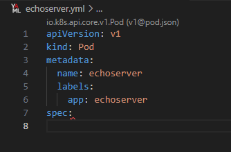                                                                                                         |
| 2. Использовать image, указанный в задании (echoserver:2.2)                                                                                        | Дописал в манифесте использование указанного образа и открытие порта 8080  Применил полученный манифест. Проверил что под создан.                                                                                                                  | 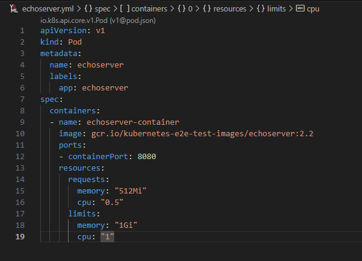 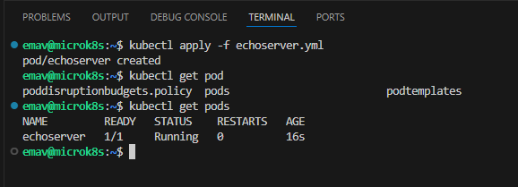                                                     |
| 3. Подключиться к поду локально с помощью kubectl port-forward и отправить запрос на проброшенный порт. | Выполнил команду port-forward для созданного пода.  Отправил запрос через curl   Прокинул ssh туннель до ноды, чтобы получить доступ из браузера к удлаенной машине YC.  Проверил в браузере. | 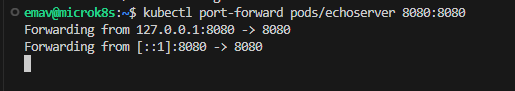 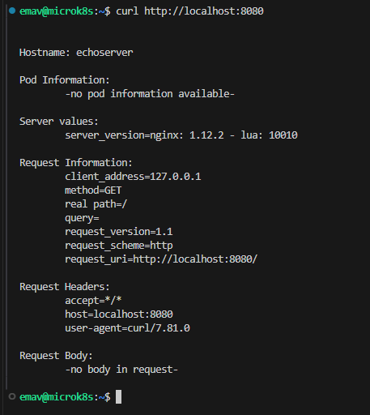 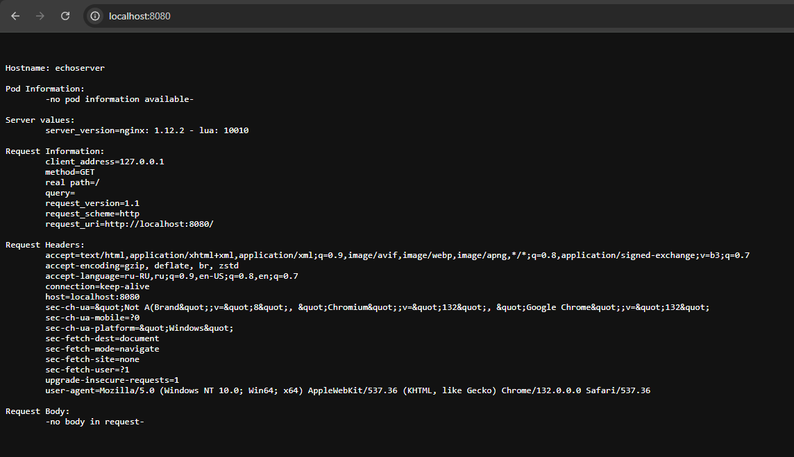 |

## Задание 2

| Номер и описание задачи                                                                                              | Описание выполняемых действий                                                                                                                                            | Скриншоты                                                                                                                                     |
| ---------------------------------------------------------------------------------------------------------------------------------------- | --------------------------------------------------------------------------------------------------------------------------------------------------------------------------------------------------- | ------------------------------------------------------------------------------------------------------------------------------------------------------ |
| 1. Создать под с именем netology-web                                                                                    | создал файл netology-web.yml Описал манифест.                                                                                                                          | 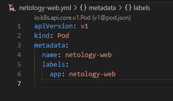                                                                                                         |
| 2. Использовать указанный в задании image                                                                   | Дописал в манифест использование указанного образа.  Применил манифест Проверил что под создан | 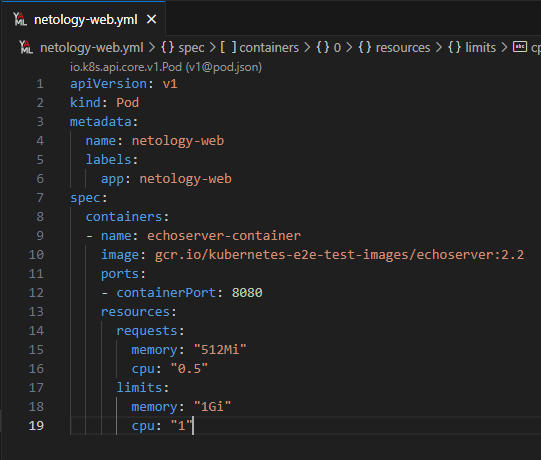 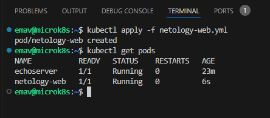                                                     |
| 3. Создать сервис с именем netology-svc и подключить его к netology-web                          | Создал файл netology-svc Описал манифест  Применил манифест Проверил что сервис поднялся                       | 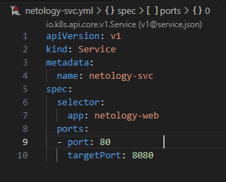 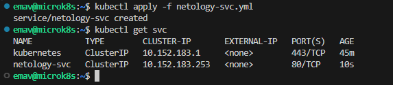                                                     |
| 4. Подключиться локально к Service с помощью kubectl port-fowrward и вывести значение. | Прокинул порт через port-forward Проверил через curl и через браузер                                                                                | 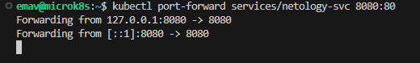 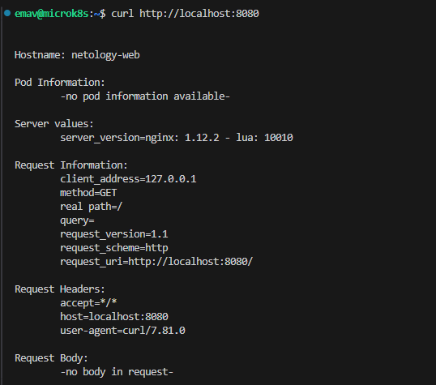 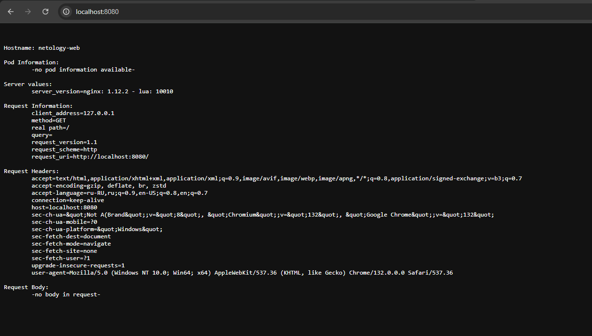 |

Манифесты выложил в папку src рядом с данным README
