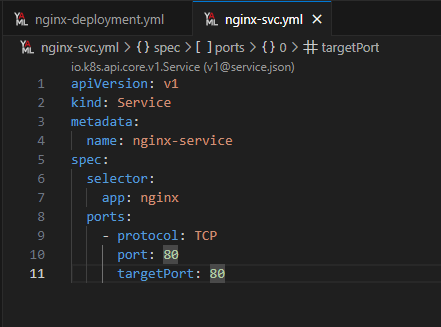

# Домашнее задание к занятию "Запуск приложений в K8S"

## Задание 1

| Номер и описание задачи                                                                                                                                                                          | Описание выполняемых действий                                                                                                                                                                                                                                                                                                                                                                                                                                                                                                                                                                                                                                                                                                                                                                                                                                                                                                                                                                                                                                                                                                              | Скриншоты                                                                                                                                                                                         |
| -------------------------------------------------------------------------------------------------------------------------------------------------------------------------------------------------------------------- | --------------------------------------------------------------------------------------------------------------------------------------------------------------------------------------------------------------------------------------------------------------------------------------------------------------------------------------------------------------------------------------------------------------------------------------------------------------------------------------------------------------------------------------------------------------------------------------------------------------------------------------------------------------------------------------------------------------------------------------------------------------------------------------------------------------------------------------------------------------------------------------------------------------------------------------------------------------------------------------------------------------------------------------------------------------------------------------------------------------------------------------------------------------------- | ---------------------------------------------------------------------------------------------------------------------------------------------------------------------------------------------------------- |
| 1. Создать Deployment приложения, сотоящего из двух контейнеров - nginx и multitool.                                                                                | Создал файл манифеста nginx-multitool.yml Описал манифейт. Применил его.  Появилась ошибка по контейнеру multitool.  Посмотрел лог ошибки.  Связана ошибка с тем, что nginx внутри контейнера multitool пытается забиндить 80 порт, который уже используется другим контейнером nginx. Конфликт вызван тем, что внутри одного пода контейнеры используют одно пространство портов.  Скорректировал манифест, передав в  контейнер multitool переменную окружения которая переназначет порт HTTP.  Применил обновленный манифест. Убедился, что оба контейнера стартуют. Проверил логи контейнеров. |     |
| 2. Увеличить количество реплик работающего  приложения до 2                                                                                                     | Скорректировал манифест deployment указав количество реплик равным 2.  Применил обновленный манифест. Проверил, что второй экземпляр поднялся.                                                                                                                                                                                                                                                                                                                                                                                                                                                                                                                                                                                                                                                                                                                                                                                                                                                                                     |                                                                                                           |
| 3. Создать svc, который обеспечит доступ до реплик развернутых приложений.                                                                            | Описал манифест создания svc в отдельном файле nginx-multitool-svc.yml  Применил манифест  Убедился, что svc создан                                                                                                                                                                                                                                                                                                                                                                                                                                                                                                                                                                                                                                                                                                                                                                                                                                                                                                                                                    |                                                                                                           |
| 4. Создать отдельный pod с приложением multitool и убедиться с помощью curl, что из пода есть доступ до приложений из п.1. | Написал простой манифест для развертывания пода с multitool.  Выполнил внутри нового контейнера запросы curl по имени svc                                                                                                                                                                                                                                                                                                                                                                                                                                                                                                                                                                                                                                                                                                                                                                                                                                                                                                                                  |                                                        |

## Задание 2

| Номер и описание задачи                                                                                                                                                                                       | Описание выполняемых действи                                                  | Скриншоты                                                                                 |
| --------------------------------------------------------------------------------------------------------------------------------------------------------------------------------------------------------------------------------- | ------------------------------------------------------------------------------------------------------- | -------------------------------------------------------------------------------------------------- |
| 1. Создать deployment приложения nginx и обеспечить старт контейнера только после того, как будет запущен svc этого приложения. | Описан манифест deployment Применил манифест.                        |   |
| 2. Убедиться что nginx не стартует. В качестве init-контейнера использовать busybox.                                                                                    | Убедился, что nginx не стартует                                                    |                                                      |
| 3. Создать и запустить сервис. Убедиться что init отработал.                                                                                                                          | Описал манифест svc. Применил манифест.                              |   |
| 4. Продемонстрировать состояние пода до и после запуска сервиса                                                                                                              | После создания svc под инициализировался и запустился. |                                                      |

Все манифесты выложил в директрию src рядом с данным README.
