# Домашнее задание к занятию "Сетевое взаимодействие в K8S. Часть 1"

## Задание 1

| Номер и описание задачи                                                                                                                                                                                                     | Описание выполняемых действий                                                                                                                                                                                                                                                                                                                           | Скриншоты                                                                                                                                     |
| ----------------------------------------------------------------------------------------------------------------------------------------------------------------------------------------------------------------------------------------------- | ---------------------------------------------------------------------------------------------------------------------------------------------------------------------------------------------------------------------------------------------------------------------------------------------------------------------------------------------------------------------------------- | ------------------------------------------------------------------------------------------------------------------------------------------------------ |
| 1. Создать Deployment приложения, состоящего из 2 контейнеров ( nginx и multitool), с количеством реплик, равным 3.                                                  | Описал манифест для поднятия подов согласно задаче.  Применил манифест.  Убедился, что нужное количество  экземпляров развернуто.                                                                                                       | 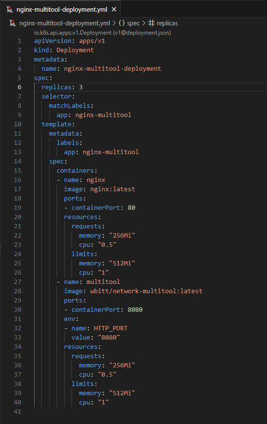 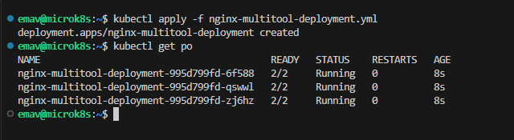                                                     |
| 2. Создать Service, который обеспечит доступ внутри кластера до контейнеров приложения из п.1 по портам: 9001 - nginx:80 9002 - multitool:8080 | Описал манифест для создания svc согласно задаче.  Применил манифест.  Убедился, что svc создан.                                                                                                                                                                                  | 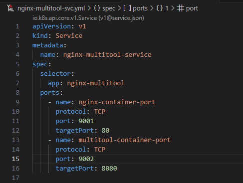 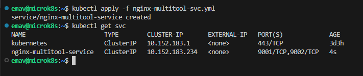                                                     |
| 3. Поднять отдельный pod с multitool и с помощью curl проверить доступ к приложению из п.1. по  портам из п.2.                                                     | Описал манифест поднятия отдельного пода с multitool  Применил манифест. Убедился, что под поднялся.  Проверил через curl в этом поде, что  есть доступ до приложения из п.1. по  портам из п.2. | 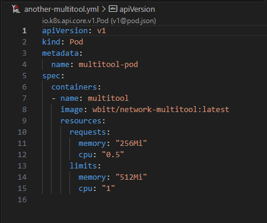 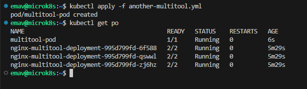 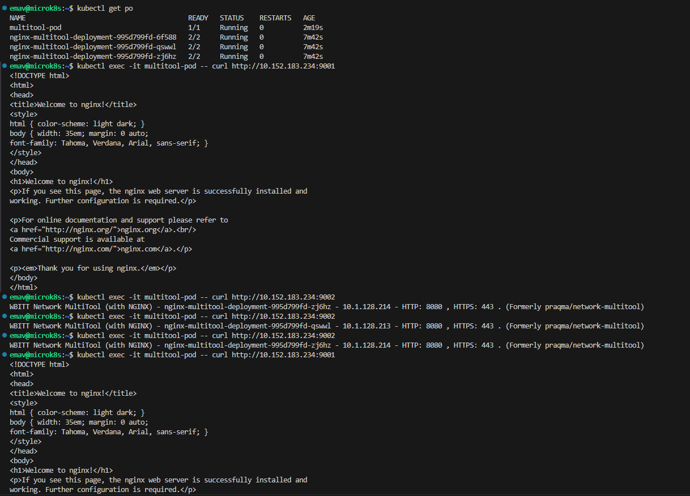 |
| 4. Продемонстрировать доступ с помощью curl по доменному имени svc.                                                                                                                        | Проверил доступ к приложению из отдельного пода multitool по доменному имени svc.                                                                                                                                                                                                                               | 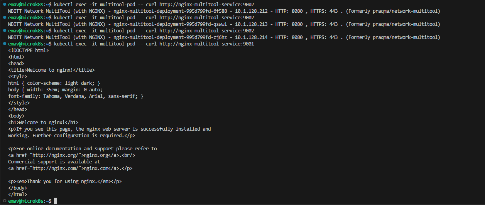                                                                                                         |
| 5. Приложить манифесты.                                                                                                                                                                                                       | Манифесты выложил в директорию src рядом с данным readme.                                                                                                                                                                                                                                                                              |                                                                                                                                                        |

## Задание 2

| Номер и описание задачи                                                                                                                                                                                        | Описание выполняемых действий                                                                                                                                                                      | Скриншоты                                                                                                                                                                                         |
| ---------------------------------------------------------------------------------------------------------------------------------------------------------------------------------------------------------------------------------- | ----------------------------------------------------------------------------------------------------------------------------------------------------------------------------------------------------------------------------- | ---------------------------------------------------------------------------------------------------------------------------------------------------------------------------------------------------------- |
| 1. Создать отдельный svc для приложения из задания 1 с возможностью доступа снаружи  кластера к nginx, используя тип svc NodePort | Описал манифест для создания svc, согласно условиям задачи.  Применил манифест.  Удостоверился, что svc создан. | 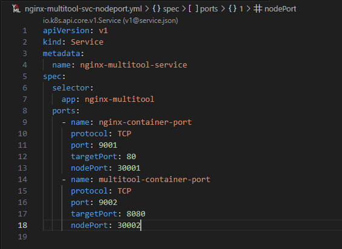 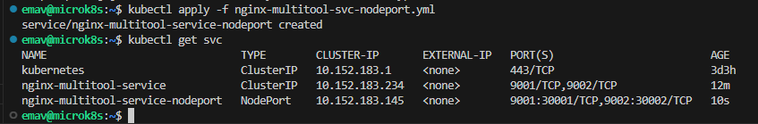                                                                                                         |
| 2. Проверить доступ к приложению из внешки через созданный svc при помощи браузера или curl на внешней машине.                        | Проверил со своей внешней машины доступ к приложению по заданным портам (обращался по внешнему IP ноды)                         | 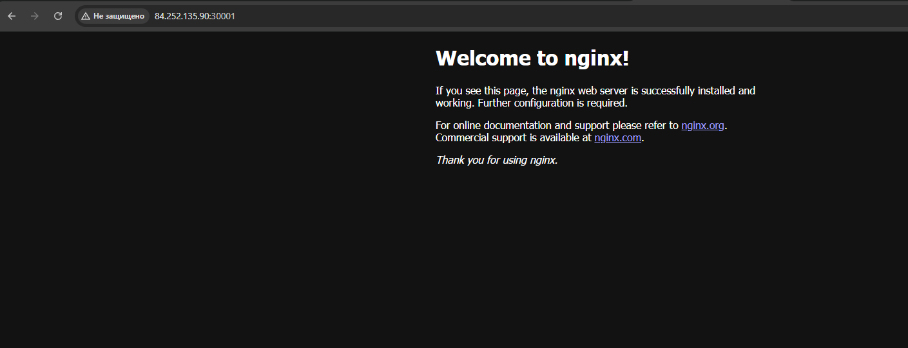 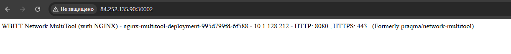 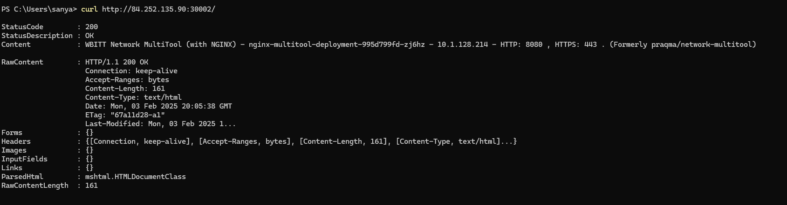 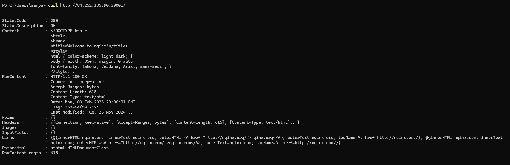 |
| 3. Приложить манифесты                                                                                                                                                                                           | Манифесты выложил в директорию src рядом с данным readme.                                                                                                                         |                                                                                                                                                                                                            |
