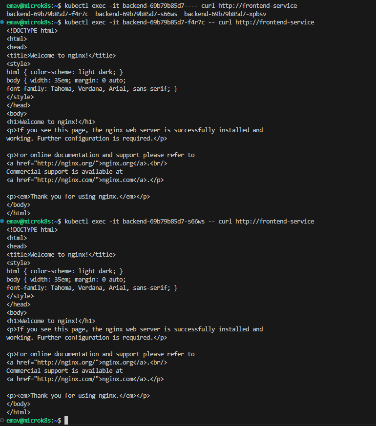

# Домашнее задание к занятию "Сетевое взаимодействие в K8S. Часть 2"

## Задание 1

| Номер и описание задачи                                                                                                     | Описание выполняемых действий                                                                                                                                                     | Скриншоты                                                                                                                                     |
| ----------------------------------------------------------------------------------------------------------------------------------------------- | ------------------------------------------------------------------------------------------------------------------------------------------------------------------------------------------------------------ | ------------------------------------------------------------------------------------------------------------------------------------------------------ |
| 1. Создать Deployment приложения frontend из образа nginx с количеством реплик 3                | Описал манифест deployment для приложения frontend.  Применил манифест.  Удостоверился, что поды поднялись. |                                                       |
| 2. Создать Deployment приложения backend из образа multitool.                                                     | Описал манифест deployment для приложения backend.  Применил манифест.  Удостоверился, что поды поднялись.  |                                                       |
| 3. Добавить svc, которые обеспечат доступ к обоим приложениям внутри кластера | Описал манифесты svc для frontend и backend.  Применил манифесты.  Удостоверился, что svc созданы.                       |    |
| 4. Продемонстрировать, что приложения видят друг друга с помощью svc                  | Проверил доступ из подов приложения frontend к приложению backend по  звязанному svc и наоборот.                                   |                                                       |
| 5. Предоставить манифесты deployment и svc.                                                                               | Манифесты выложил в директорию src рядом с данным readme                                                                                                         |                                                                                                                                                        |

## Задание 2

| Номер и описание задачи                                                                                                                                                                                                                                                     | Описание выполняемых действий                                                                                                                                                                                                                   | Скриншоты                                                                                                                                                                                         |
| ----------------------------------------------------------------------------------------------------------------------------------------------------------------------------------------------------------------------------------------------------------------------------------------------- | -------------------------------------------------------------------------------------------------------------------------------------------------------------------------------------------------------------------------------------------------------------------------- | ---------------------------------------------------------------------------------------------------------------------------------------------------------------------------------------------------------- |
| 1. Включить Ingress-controller                                                                                                                                                                                                                                                          | Включил ingress-контроллер в microk8s  Убедился, что ingress-контроллер запущен                                                                                                                                    |                                                                                                                                                              |
| 2. Создать Ingress, обеспечивающий доступ снаружи по IP-адресу кластера так, чтобы при запросе только по адресу открывался frontend, а при добавлении /api - backend  | Описал манифест для создания ресурса ingress.  Применил манифест.  Убедился, что ресурс создан.                                                                            |                                                                                                           |
| 3. Продемонстрировать доступ с помощью браузера или curl с внешней машины.                                                                                                                                                        | Проверил через браузер с внешней машины. Обращался на внешний IP адрес ноды, т.к. нода была создана черз YC с подключением внешнего IP адреса. |     |
| 4. Предоставить манифесты.                                                                                                                                                                                                                                                 | Манифесты выложил в директорию src рядом с данным readme.                                                                                                                                                                      |                                                                                                                                                                                                            |
