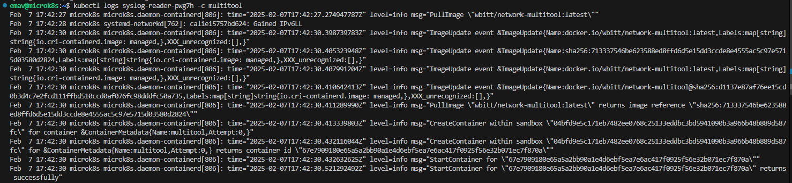

# Домашнее задание к занятию "Хранение в K8S. Часть 1"

## Задание 1

| Номер и описание задачи                                                                                                                      | Описание выполняемых действий                                                                                                                                                                                               | Скриншоты                                                                                 |
| ---------------------------------------------------------------------------------------------------------------------------------------------------------------- | ------------------------------------------------------------------------------------------------------------------------------------------------------------------------------------------------------------------------------------------------------ | -------------------------------------------------------------------------------------------------- |
| 1. Создать deployment приложения, состоящего из контейнеров busybox и multitool                                    | Описал манифест deployment Для развертывания приложений,  согласно задаче.  Применил манифест.  Убедился, что под поднялся. |   |
| 2. Сделать так, чтобы busybox писал каждые пять секунд в некий файл в общей директории.       | В манифесте реализовал запись в файл output.txt из контейнера busybox тестового сообщения.                                                                                      |                                                      |
| 3. Обеспечить возможность чтения файла контейнером multitool                                                     | В манифесте реализовал чтение из файла output.tx в контейнере multitool.                                                                                                                              |                                                      |
| 4. Продемонстрировать, что multitool может читать файл, который периодически обновляется. | Убедился, что контейнер multitool считывает тестовые сообщения из файла output.txt                                                                                                           |                                                      |
| 5. Предоставить манифесты                                                                                                                   | Манифесты выложил в директорию src рядом с данным readme.                                                                                                                                                  |                                                                                                    |

## Задание 2

| Номер и описание задачи                                                                                    | Описание выполняемых действий                                                                                                                                                | Скриншоты                                                                                 |
| ------------------------------------------------------------------------------------------------------------------------------ | ------------------------------------------------------------------------------------------------------------------------------------------------------------------------------------------------------- | -------------------------------------------------------------------------------------------------- |
| 1. Создать DaemonSet приложения, состоящего из multitool                                     | Описал манифест для DaemonSet согласно задаче.  Применил манифест.  Удостоверился, что под поднялся. |   |
| 2. Обеспечить возможность чтения файла /var/log/syslog ноды кластера MicroK8S | В манифесте реализовал возможность чтения файла syslog ноды.                                                                                         |                                                      |
| 3. Продемонстрировать возможность чтения файла изнутри пода            | Удостоверился, что из пода можно прочитать файл syslog.                                                                                                    |   |
| 4. Предоставить манифесты                                                                                 | Манифесты выложил в директорию src рядом с данным readme                                                                                                    |                                                                                                    |
