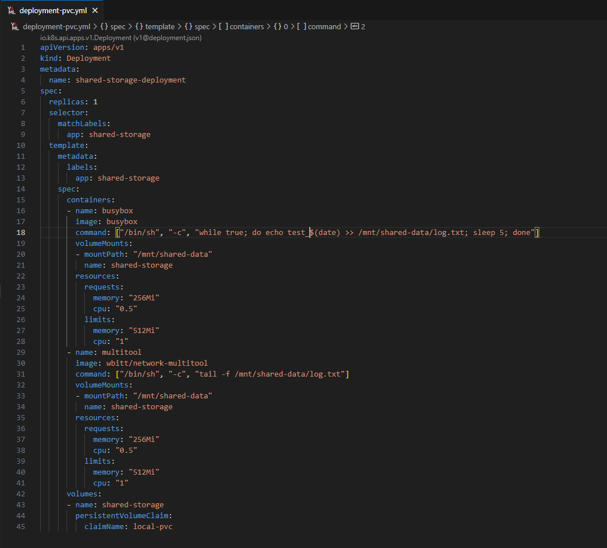
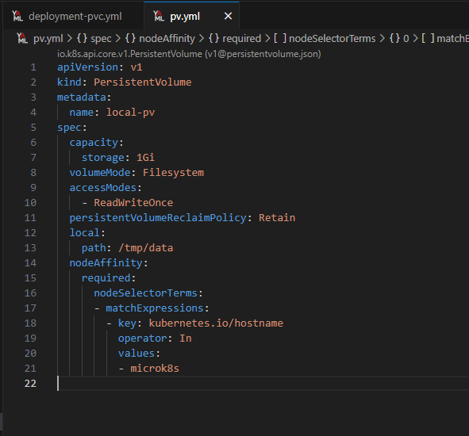

# Домашнее задание к занятию "Хранение в K8S. Часть 2"

## Задание 1

| Номер и описание задачи                                                                                                                                                                                                                                                             | Описание выполняемых действий                                                                                                                                                                                                                                                                                                                                                                                                                                                                                                                                                                                                                                     | Скриншоты                                                                                                                                     |
| ------------------------------------------------------------------------------------------------------------------------------------------------------------------------------------------------------------------------------------------------------------------------------------------------------- | -------------------------------------------------------------------------------------------------------------------------------------------------------------------------------------------------------------------------------------------------------------------------------------------------------------------------------------------------------------------------------------------------------------------------------------------------------------------------------------------------------------------------------------------------------------------------------------------------------------------------------------------------------------------------------------------- | ------------------------------------------------------------------------------------------------------------------------------------------------------ |
| 1. Создать Deployment приложения, состоящего из контейнеров buxybox и multitool.                                                                                                                                                                          | Описал манифест deployment, состоящего из контейнеров busybox и multitool, использующих PV.                                                                                                                                                                                                                                                                                                                                                                                                                                                                                                                                      |                                                                                                          |
| 2. Создать PV и PVC для подключения папки на локальной ноде, которая будет использована в поде.                                                                                                                             | Описал манифесты PV и PVC.  Применил манифесты.  Убедился, что все объекты созданы.                                                                                                                                                                                                                                                                                                                                                                                                                                                                                                                         |    |
| 3. Продемонстрировать, что multitool может читать файл, в который busybox пишет каждые 5 секунд в общей директории.                                                                                                   | Удостоверился, что multitool может читать файл, в который busybox записывает информацию.                                                                                                                                                                                                                                                                                                                                                                                                                                                                                                                                     |                                                                                                          |
| 4. Удалить Deployment и PVC. Продемонстрировать, что после этого произошло с PV. Объяснить почему.                                                                                                                                 | Удалил созданные ранее deployment и PVC. Посмотрел, что стало с PV и данными на нем.  PV перешел из статуса bound в статус Released. Это  означает, что PV больше не имеет связанного PVC, но сам PV не удален из кластера и может быть  использован повторно.  Данные контейнеров в PV при этом остались, потому как политика возврата (persistentVolumeReclaimPolicy) установлена на Retain |                                                                                                          |
| 5. Продемонстрировать, что файл сохранился на локальном диске ноды. Удалить PV. Продемонстрировать что произошло с файлом после удаления PV. Объяснить почему. | Удалил созданный ранее PV.  После удаления PV, файл на диске остался, потому как PV был создан с политикой Retain, которая не удаляет данные при удалении PV.                                                                                                                                                                                                                                                                                                                                                                                            |                                                                                                          |
| 6. Предоставить манифесты.                                                                                                                                                                                                                                                         | Манифесты выложил в директорию src рядом с данным readme                                                                                                                                                                                                                                                                                                                                                                                                                                                                                                                                                                                         |                                                                                                                                                        |

## Задание 2

| Номер и описание задачи                                                                                                                                                                      | Описание выполняемых действий                                                                                                                                                                                                                                                                                                                                                                                                                                                                                                                                                                                                                                                   | Скриншоты                                                                                                                                                                                                                                              |
| ---------------------------------------------------------------------------------------------------------------------------------------------------------------------------------------------------------------- | ---------------------------------------------------------------------------------------------------------------------------------------------------------------------------------------------------------------------------------------------------------------------------------------------------------------------------------------------------------------------------------------------------------------------------------------------------------------------------------------------------------------------------------------------------------------------------------------------------------------------------------------------------------------------------------------------------------- | --------------------------------------------------------------------------------------------------------------------------------------------------------------------------------------------------------------------------------------------------------------- |
| 1. Включить и настроить NFS-сервер на MicroK8S.                                                                                                                                        | Установил NFS сервер по инструкции из документации: https://microk8s.io/docs/how-to-nfs                                                                                                                                                                                                                                                                                                                                                                                                                                                                                                                                                                 |                                                                                                                                                                                                                   |
| 2. Создать Deployment приложения, состоящего из multitool, и подключить к нему PV, созданный автоматически на сервере NFS. | Описал манифест storageClass. Применил манифест. Убедился, что SC  создался.  Описал манифест PVC, который будет динамически запрашивать PV на NFS-сервере. Применил манифест. Убедился, что PVC создан.  Описал манифест Deployment. Применил манифест. Убедился, что под поднят.                                                                                                                                                               |       |
| 3. Продемонстрировать возможность чтения и записи файла внутри пода                                                                                     | Подключился к командной оболочке контейнера.  Проверил запись в файл на подключенном PV и чтение из этого файла.  Проверил наличие файла на самом сервере.  Удалил созданный ранее Deployment и PVC. Убедился, что созданный динамически PV также удалился.  Проверил файлы на сервере. Убедился, что файлы удалились согласно примененной к  SC политике. |                                                          |
| 4. Предоставить манифесты                                                                                                                                                                   | Манифесты выложил в директорию src рядом с данным readme                                                                                                                                                                                                                                                                                                                                                                                                                                                                                                                                                                                                       |                                                                                                                                                                                                                                                                 |
