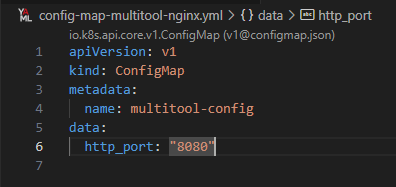

# Домашнее задание к занятию "Конфигурация приложений"

## Задание 1

| Номер и описание задачи                                                                                                                                                                                    | Описание выполняемых действий                                                                                                                                                                                                                                                                                                                                                                                                                                                                                                                                                                 | Скриншоты                                                                                                                                                                                                                                             |
| ------------------------------------------------------------------------------------------------------------------------------------------------------------------------------------------------------------------------------ | ------------------------------------------------------------------------------------------------------------------------------------------------------------------------------------------------------------------------------------------------------------------------------------------------------------------------------------------------------------------------------------------------------------------------------------------------------------------------------------------------------------------------------------------------------------------------------------------------------------------------ | -------------------------------------------------------------------------------------------------------------------------------------------------------------------------------------------------------------------------------------------------------------- |
| 1. Создать Deployment приложения, состоящего из контейнеров nginx и multitool.                                                                                                   | Описал манифест deployment, согласно задаче.  При применении данного манифеста, под не  сможет стартануть, потому как контейнеры nginx и multitool слушают один и тот же порт по умолчанию.  Было решено сконфигурировать контейнер multitool для решения проблемы.                                                                                                                      |                                                                                                                                                                                                                  |
| 2. Решить возникшую проблему с помощью ConfigMap.                                                                                                                                               | Описал манифест ConfigMap Применил манифест  Скорректировал манифест deployment Применил обновленный манифест                                                                                                                                                                                                                                                                                                                                                                                                         |                                                                                                            |
| 3. Продемонстрировать, что под стартовал и оба контейнера работают.                                                                                                | Убедился, что проблема решена                                                                                                                                                                                                                                                                                                                                                                                                                                                                                                                                                                   |                                                                                                                                                               |
| 4. Сделать простую веб-страницу и подключить её к Nginx с помощью ConfigMap. Подключить svc и показать вывод curl или в браузере. | Описал манифест ConfigMap, содержащий страницу для nginx. Применил манифест.  Скорректировал манифест deployment для прокидывания страницы в контейнер. Применил обновленный манифест.  Описал манифест svc для развернутого приложения. Применил манифест.  Проверил получение от nginx созданной ранее страницы. |      |
| 5. Приложить манифесты                                                                                                                                                                                       | Манифесты выложил в директорию src рядом с данным readme                                                                                                                                                                                                                                                                                                                                                                                                                                                                                                                     |                                                                                                                                                                                                                                                                |

## Задание 2

| Номер и описание задачи                                                                                                                                                                         | Описание выполняемых действий                                                                                                                                                                                                                                                                                                                                                 | Скриншоты                                                                                                                                                                                         |
| ------------------------------------------------------------------------------------------------------------------------------------------------------------------------------------------------------------------- | -------------------------------------------------------------------------------------------------------------------------------------------------------------------------------------------------------------------------------------------------------------------------------------------------------------------------------------------------------------------------------------------------------- | ---------------------------------------------------------------------------------------------------------------------------------------------------------------------------------------------------------- |
| 1. Создать Deployment приложения, состоящего из Nginx                                                                                                                             | Описал манифест deployment для приложения, состоящего из контейнера Nginx. Применять манифест пока не стал, так как еще не созданы соответствующие ConfigMap                                                                                                                 |                                                                                                                                                              |
| 2. Создать собственную веб-страницу и подключить её как ConfigMap к приложению.                                                                        | Описал манифест для ConfigMap с содержимым в виде страницы для Nginx.  Применил манифест.  Применил манифест Deployment. Убедился, что под поднялся.                                                                                                                     |                                                                                                           |
| 3. Выпустить самоподписанный сертификат SSL. Создать secret для использования сертификата.                                                 | Выпустил самоподписанный сертификат.  Описал манифест для создания секрета. Применил манифест.                                                                                                                                                                                                           |                                                        |
| 4. Создать Ingress и необходимый svc, подключить к нему SSL сертификат. Продемонстрировать доступ к приложению по HTTPS. | Описал манифест svc Применил манифест.  Описал манифест Ingress. Подключил к нему  сертификат в виде секрета. Также реализована терминация TLS. Применил манифест.  Проверил доступ к приложению по HTTPS. |     |
| 5. Приложить манифесты                                                                                                                                                                            | Манифесты выложил в директорию src рядом с данным readme                                                                                                                                                                                                                                                                                                     |                                                                                                                                                                                                            |
