# Домашнее задание к занятию "Управление доступом"

## Задание 1

| Номер и описание задачи                                                                                                                                                                                                                                                                                                                 | Описание выполняемых действий                                                                                                                                                                                                                                                                                                                                                                                                                                                                                                                                                                                                                                                                                                                                                                                                                                                                                                                                                                                                                                                                                                                                                                     | Скриншоты                                                                                                                                                                                                                                                                                                                                                                                                                                                                                                                                                                     |
| ----------------------------------------------------------------------------------------------------------------------------------------------------------------------------------------------------------------------------------------------------------------------------------------------------------------------------------------------------------- | ---------------------------------------------------------------------------------------------------------------------------------------------------------------------------------------------------------------------------------------------------------------------------------------------------------------------------------------------------------------------------------------------------------------------------------------------------------------------------------------------------------------------------------------------------------------------------------------------------------------------------------------------------------------------------------------------------------------------------------------------------------------------------------------------------------------------------------------------------------------------------------------------------------------------------------------------------------------------------------------------------------------------------------------------------------------------------------------------------------------------------------------------------------------------------------------------------------------------------- | -------------------------------------------------------------------------------------------------------------------------------------------------------------------------------------------------------------------------------------------------------------------------------------------------------------------------------------------------------------------------------------------------------------------------------------------------------------------------------------------------------------------------------------------------------------------------------------- |
| 1. Создать и подписать SSL-сертификат для подключения к кластеру.                                                                                                                                                                                                                                    | Создал закрытый ключ пользователя.  Сформировал запрос на подписание  сертификата.  Подписал CSR с помощью корневого  сертификата кластера.                                                                                                                                                                                                                                                                                                                                                                                                                                                                                                                                                                                                                                                                                                                                                                                                                                                                                                                                | 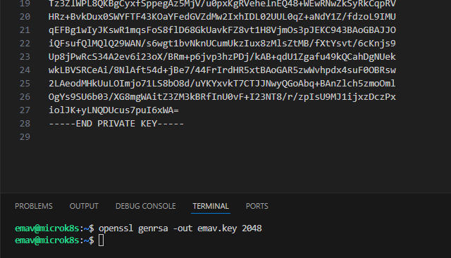 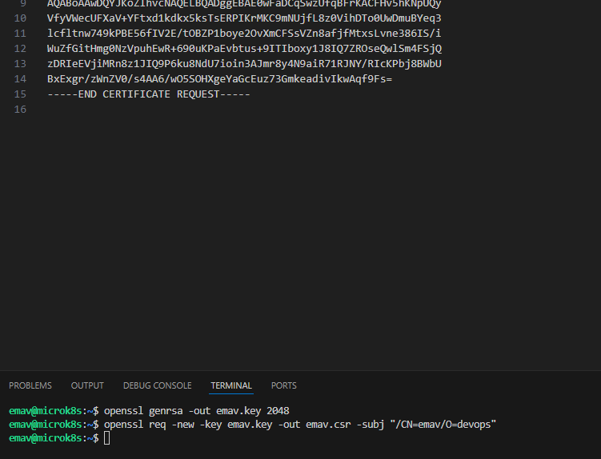 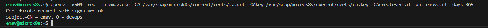 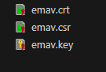                                                                                                                                                                                                                                                                                                                                                                             |
| 2. Настроить конфигурационный файл для подключения по новому сертификату.                                                                                                                                                                                                                | Добавил пользователя в конфигурацию через CLI.  Создал контекст пользователя через CLI.  Переключился на новосазданный  контекст. Проверил выполнение команд.                                                                                                                                                                                                                                                                                                                                                                                                                                                                                                                                                                                                                                                                                                                                                                                                                                                                                             | 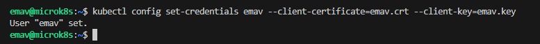 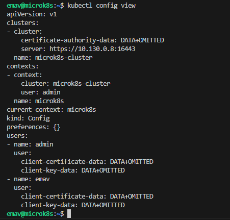 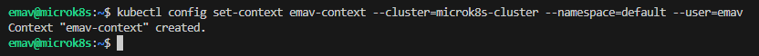 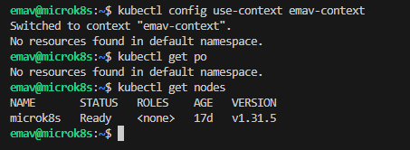                                                                                                                                                                                                                                                                                                                                                                             |
| 3. Создать роли и все необходимые настройки для пользователя. Предусмотреть права пользователя. Пользователь может рассматривать логи подов и их конфигурацию. "logs pod" и "describe pod". | Проверил аддоны, которые активированы в моем microk8s. Увидел, что rbac не активирован. Автивировал его.  Проверил выполнение команд, используя новый контекст, после активации rbac. Увидел, что ролевая модель управления доступом активировалась и доступ к  объектам пропал на новом контексте.  Описал манифест Role с необходимыми правами. Переключился на контекст админа. Применил манифест.  Описал манифест бинда роли. Применил манифест.  Переключился на контекст нового  пользователя. Проверил выполнение команд. Удостоверился, что есть только тот доступ, который необходим согласно задаче. | 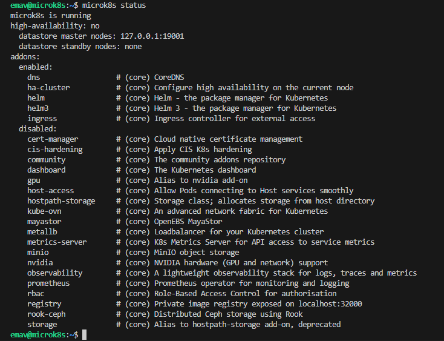 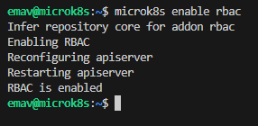 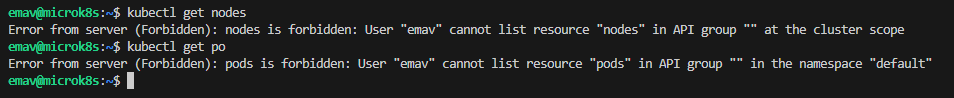 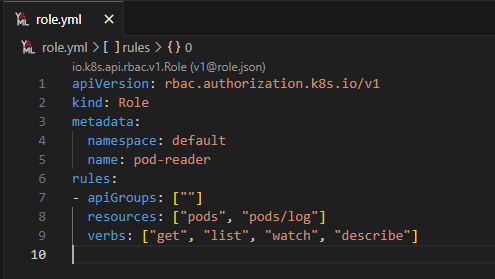 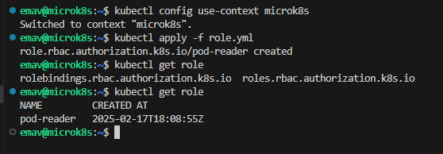 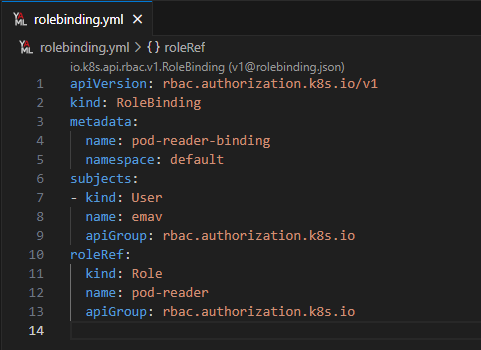 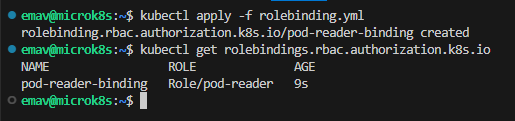 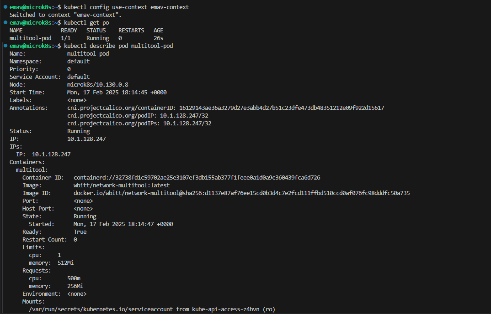 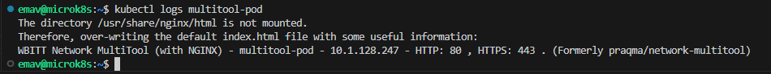 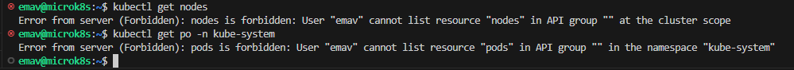 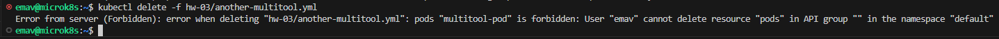 |
| 4. Предоставить манифесты.                                                                                                                                                                                                                                                                                                             | Манифесты выложил в директорию src рядом с данным readme                                                                                                                                                                                                                                                                                                                                                                                                                                                                                                                                                                                                                                                                                                                                                                                                                                                                                                                                                                                                                                                                                                                         |                                                                                                                                                                                                                                                                                                                                                                                                                                                                                                                                                                                        |
