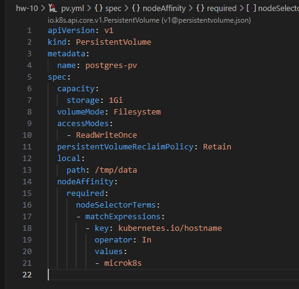
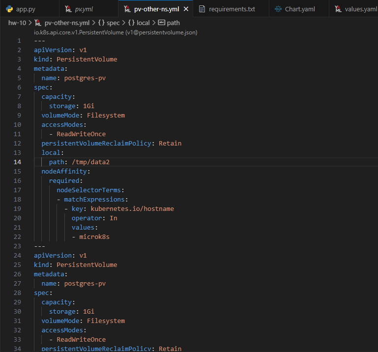

# Домашнее задание к занятию "Helm"

## Подготовка к выполнению

| Номер и описание задачи                             | Описание выполняемых действий                                                                                                                                                                                                                                                                                                                                                             | Скриншоты                                                                                                                                                                                                                                             |
| ----------------------------------------------------------------------- | -------------------------------------------------------------------------------------------------------------------------------------------------------------------------------------------------------------------------------------------------------------------------------------------------------------------------------------------------------------------------------------------------------------------- | -------------------------------------------------------------------------------------------------------------------------------------------------------------------------------------------------------------------------------------------------------------- |
| Установить helm на свою локальную машину | 1. Скачал бинарник helm последней версии из релизной статьи: https://github.com/helm/helm/releases  2. Распаковал архив.  3. Переместил бинарь в директорию /usr/local/bin/  4. Проверил вызов команды helm  5. Настроил Completion Helm для Bash |      |

## Задание 1

| Номер и описание задачи                                                                                                                                                                                                   | Описание выполняемых действий                                                                                                                                                                                                                                                                                                                                                                                                                                                                                                                                                                                   | Скриншот                                                                                                                                                                                                                                                                                                                                                       |
| --------------------------------------------------------------------------------------------------------------------------------------------------------------------------------------------------------------------------------------------- | ------------------------------------------------------------------------------------------------------------------------------------------------------------------------------------------------------------------------------------------------------------------------------------------------------------------------------------------------------------------------------------------------------------------------------------------------------------------------------------------------------------------------------------------------------------------------------------------------------------------------------------------ | ---------------------------------------------------------------------------------------------------------------------------------------------------------------------------------------------------------------------------------------------------------------------------------------------------------------------------------------------------------------------- |
| 1. Подготовить приложение, для которого будет создаваться чарт.                                                                                                                      | Написал приложение на Python для создания и просмотра заметок. Приложение работает на flask. В качестве хранилища заметок будет использоваться PostgreSQL.  Проработал сборку образа приложения.  Собрал приложение и запушил в Docker Hub.  Исходный код приложения выложил в директорию src/app/ рядом с данным readme.                                |                                                                                                                                                                                                                    |
| 2. Упаковать приложение в чарт, для деплоя в разные окружения. Каждый компонент деплоится отдельным deployment'ом или statefulset'ом. | Создал чарт при помощи helm create <имя чарта>  Описал все необходимое в чарте. С содержимом чарта можно ознакомиться в  директории src/notes-app/ рядом с данным readme  Данный чарт подразумевает использование PV. Соответственно, перед установкой чарта, следует  предвартельно создать требуемый PV. Описал и применил его манифест. |        |
| 3. Попробовать установить чарт.                                                                                                                                                                                      | Предварительно создал namespace, в котором будет разворачиваться приложение из чарта.  Запустил установку чарта.  Чарт развернулся.  Потребовались правки в конфиге приложения. Выпустил новую версию образа приложения (0.3.0). Обновил развернутое приложение через Helm.  Приложение стало доступно.                                       |                                                                                                              |

## Задание 2

| Номер и описание задачи                                                    | Описание выполняемых действйи                                                                   | Скриншоты                                                                                                                                                                                                                                                                                                                                                     |
| ---------------------------------------------------------------------------------------------- | -------------------------------------------------------------------------------------------------------------------------- | ---------------------------------------------------------------------------------------------------------------------------------------------------------------------------------------------------------------------------------------------------------------------------------------------------------------------------------------------------------------------- |
| 1. Развернуть разные версии приложения в разных NS | Создал ns и дополнительные локальные pv. Разные релизы в разные ns.  |        |
|                                                                                                | Код приложения и чарт выложил в директорию src рядом с данным readme. |                                                                                                                                                                                                                                                                                                                                                                        |
