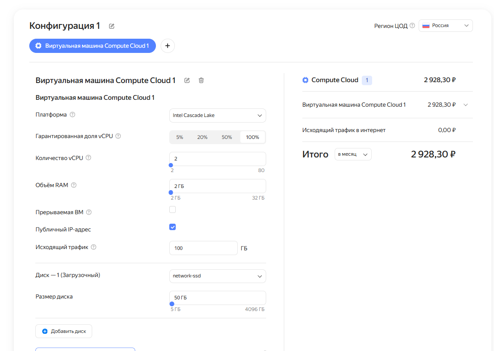
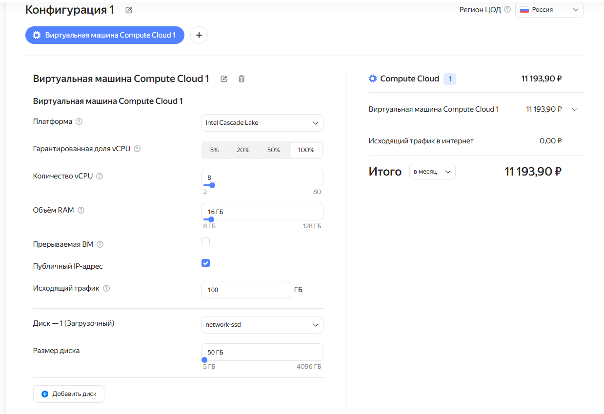
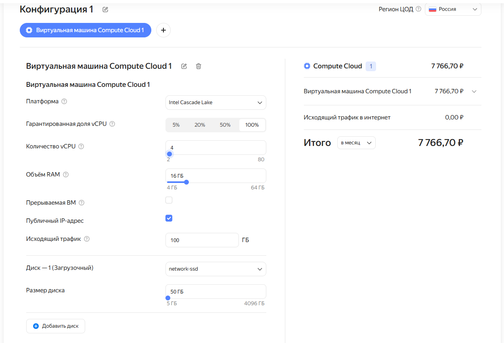
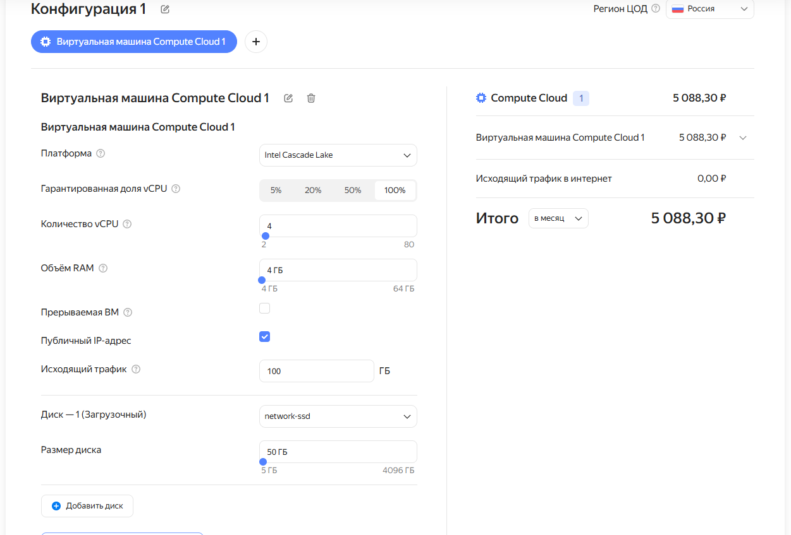
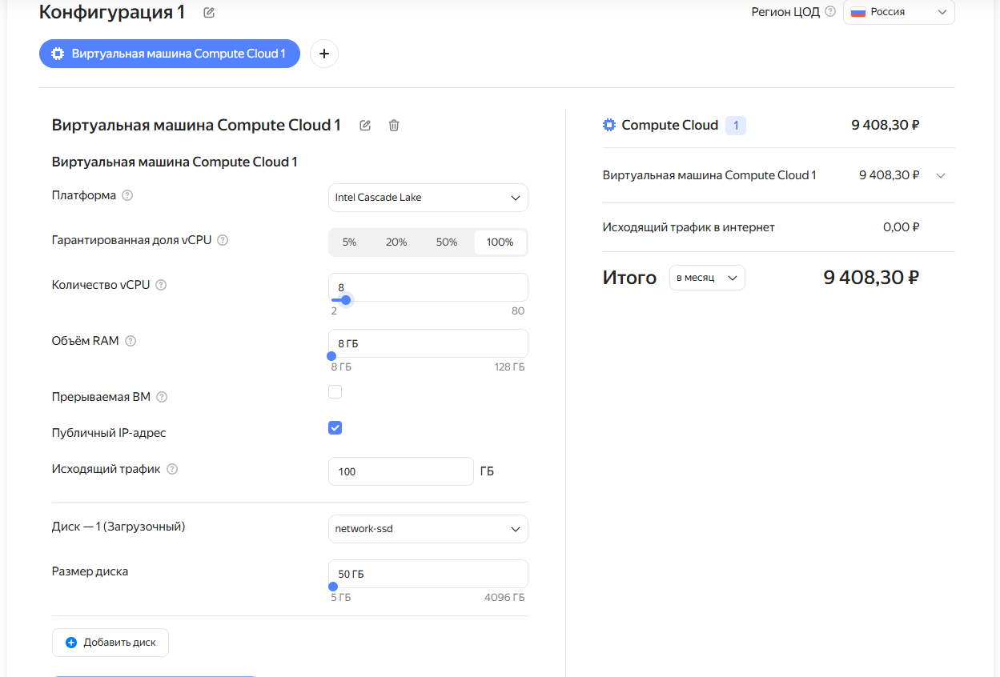
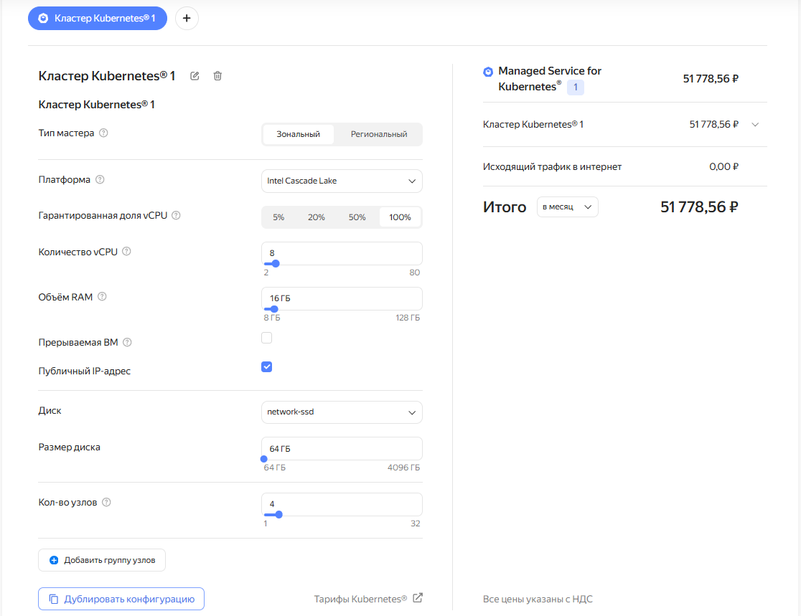
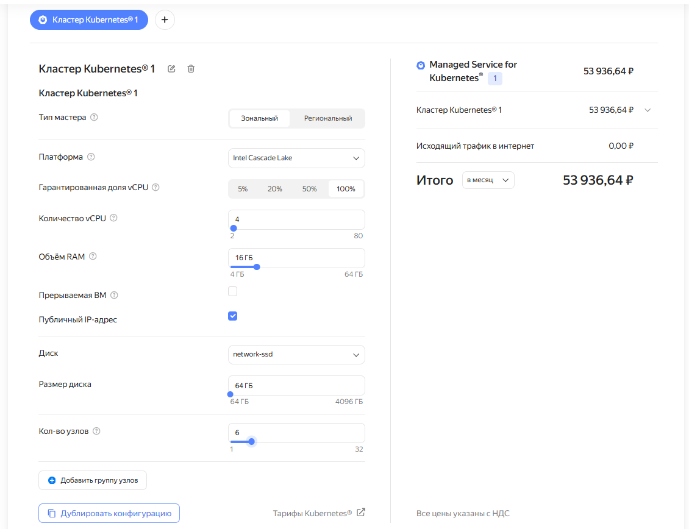
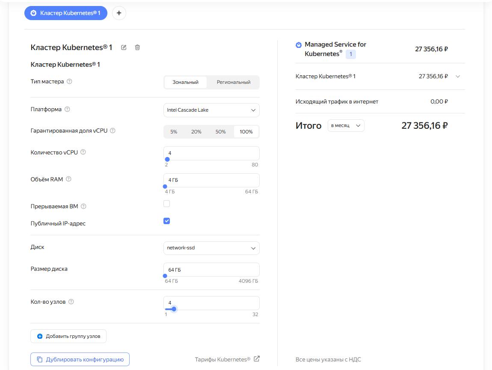
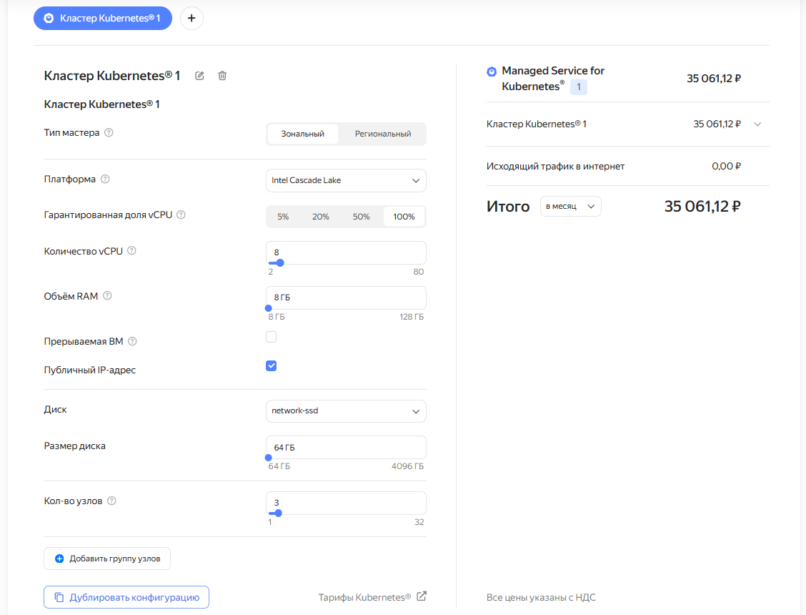

# Домашнее задание к занятию "Компоненты Kubernetes"

## Цель задания

Рассчитать требования к кластеру под проект

## Описание задания

Известно, что проекту нужны база данных, система кеширования, а само приложение состоит из бекенда и фронтенда.

Описать, какие ресурсы нужны, если известно:

1. Необходимо упаковать приложение в чарт для деплоя в разные окружения.
2. База данных должна быть отказоустойчивой. Потребляет 4ГБ ОЗУ в работе, 1 ядро. 3 копии.
3. Кеш должен быть отказоустойчивым. Потребляет 4ГБ ОЗУ в работе, 1 ядро. 3 копии.
4. Фронтенд обрабатывает внешние запросы быстро, отдавая статику. Потребляет не более 50МБ ОЗУ на каждый экземпляр, 0.2 ядра. 5 копий.
5. Бекенд потребляет 600МБ ОЗУ и по 1 ядру на копию. 10 копий.

## Ответ

Для начала дополнительно определим, что следует рассмотреть также возможные варианты развертывания:

1. Кластер K8S разворачивается полностью самостоятельно. Выделяется дополнительно 3 master-ноды. СУБД поднимаются внутри кластера на worker-нодах;
2. Кластер K8S разворачивается полностью самостоятельно. Выделяется дополнительно 3 master-ноды. СУБД поднимаются за пределами кластера (либо самостоятельное развертывание, либо использование Managed Service в облаке);
3. Кластер K8S разворачивается как Managed Service в облаке (на примере YC). Выделяются только worker-ноды. СУБД поднимаются внутри кластера на worker-нодах;
4. Кластер K8S разворачивается как Managed Service в облаке (на примере YC). Выделяются только worker-ноды. СУБД поднимаются за пределами кластера (либо самостоятельное развертывание, либо использование Managed Service в облаке).

Сначала рассчитаем общее количество ресурсов, которое необходимо для проекта, а затем пересчитаем их под разные варианты развертывания.

### Общее количество ресурсов под проект

#### База данных

* ОЗУ: 4ГБ * 3 копии = 12ГБ
* CPU: 1 ядро * 3 копии = 3 ядра

#### Система кеширования

* ОЗУ: 4ГБ * 3 копии = 12ГБ
* CPU: 1 ядро * 3 копии = 3 ядра

#### Frontend

* ОЗУ: 50МБ * 5 копий = 250МБ
* CPU: 0.2 ядра * 5 копий = 1 ядро

#### Backend

* ОЗУ: 600 МБ * 10 копий = 6 ГБ
* CPU: 1 ядро * 10 копий = 10 ядер

#### Итого

* ОЗУ: 12ГБ (БД) + 12ГБ (кеш) + 0.25ГБ (frontend) + 6ГБ (backend) = 30.25ГБ
* CPU: 3 ядра (БД) + 3 ядра (кеш) + 1 ядро (frontend) + 10 ядер (backend) = 17 ядер

### Расчет количества нод

При расчете количества worker-нод очень важно учитывать, что ресурсы ноды расходуются не только на поды, но и на ОС, kubelet и прочие сервисные нужды.

Дальнейший расчет будет проводиться без учета дополнительных DaemonSets, которые также потребляют ресурсы ноды.

В статье https://learnk8s.io/kubernetes-node-size за нас любезно посчитали, какое именно количество ресурсов worker-ноды может уходить на сервисные нужды:

CPU:

* 6% от первого ядра
* 1% от следующего ядра (до 2 ядер)
* 0.5% от следующих 2 ядер (до 4)
* 0.25% от всех ядер свыше 4

Например, если нода имеет 6 ядер, то на сервисные нужды будет уходить примерно:

1000m * 0.06 = 60m - От первого ядра
1000m * 0.01 = 10m - От второго ядра
1000m * 0.005 * 2 = 10m - От третьего и четвертого ядер
1000m * 0.0025 * 2 = 5m - От пятого и шестого ядер.

В итоге, от 6 ядер ноды, под сами поды останется 6000m - 60m - 10m - 10m - 5m = 5915m или 5.9vCPU

ОЗУ:

* 255МБ памяти для машин с объемом ОЗУ менее 1ГБ
* 25% от первых 4ГБ памяти
* 20% от следующих 4ГБ памяти (до 8ГБ)
* 10% от следующих 8ГБ памяти (до 16ГБ)
* 6% от следующих 112ГБ памяти (до 128ГБ)
* 2% от любой памяти свыше 128ГБ

Например, если нода имеет 16ГБ ОЗУ, но на сервисные нужны будет уходить примерно:

25% от первых 4ГБ памяти = 1ГБ
20% от следующих 4ГБ памяти = 0.8ГБ
10% от следующих 8ГБ памяти = 0.8ГБ

В итоге, от 16ГБ ОЗУ ноды, под рабочую нагрузку (поды) останется 16 - 1 - 0.8 - 0.8 - 0.1 = 13.3ГБ (где 0.1 - это 100МБ порога вытеснения)

Как и описано ранее, в данном случае мы берем в расчет расходование ресурсов на дополнительные модули, такие как DaemonSets (Kube-proxy, CSI, DNSCache и пр.).

Для упрощения расчетов, возьмем фиксированное значение ресурсов, которое будут потреблять наши дополнительные модули в нашем проекте:

* CPU: 1vCPU
* ОЗУ: 1ГБ

Таким образом, для рабочей нагрузки на нашей ноде, рассматриваемой в качестве пример (6vCPU/16RAM) останется:

* 5.9vCPU - 1vCPU = 4.9VCPU
* 13.3ГБ - 1ГБ = 12.3ГБ

С учетом этой информации рассмотрим варианты развертывания.

#### Вариант развертывания - кластер K8S разворачивается полностью самостоятельно. СУБД поднимаются внутри кластера.

Т.к. кластер разворачивается полностью самостоятельно, то следует в первую очередь решить вопрос с controle-plane. Для обеспечения отказоустойчивости controle-plane заложим создание 3 master-ноды с следующими характеристиками:

* CPU: 2vCPU
* ОЗУ: 2ГБ

Рассмотрим стоимость создания этих нод на примере YC Compute Cloud (Если кластер создается на основе своей имеющейся инфраструктуры, то итоговая стоимость может сильно врьироваться)

В итоге, стоимость 3 таких нод будет стоить 2 928.3 * 3 = 8 784.9 руб/мес.

После создания и обеспечения отказоустойчивости control-plane, следует решить вопрос обеспечения ресурсов для выполнения нагрузки (подов).

Попробуем определить нужное нам кол-во worker-нод под наш проект и их характеристики.

В постановке задачи однозначно указано, что для БД и кеша должна обеспечиваться отказоустойчивость. Самый простой вариант исполнить это условие - распределить реплики БД и кеша по отдельным нодам.

Т.к. в проекте подразумевается 3 реплики БД и кеша, то и минимальное количество нод будет равняться 3.

Количество ресурсов, которое будет расходоваться на каждой ноде только под БД + кеш:

* CPU: 1 ядро (БД) + 1 ядро (кеш) = 2 ядра
* ОЗУ 4ГБ (БД) + 4ГБ (кеш) = 8ГБ

Попробуем определить, можно ли распределить реплики frontend и backend таким образом, чтобы ноды были одинаковыми по количеству ресурсов.

Frontend

* CPU: 1 ядро (5 реплик) / 3 (минимальное кол-во нод) = 0.333m vCPU на одну ноду. Округлим до 0.35m vCPU.
* ОЗУ: 250МБ (5 реплик) / 3 (минимальное кол-во нод) = примерно 85МБ ОЗУ на одну ноду.

Backend

* CPU: 10 ядер (10 реплик) / 3 (минимальное кол-во нод) = 3333m vCPU на одну ноду. Округлим до 3500m vCPU.
* ОЗУ: 6ГБ (10 реплик) / 3 (минимальное кол-во нод) = 2ГБ ОЗУ на одну ноду.

Сложим полученные данные и попробуем определить требования к одной ноде

* CPU: 2 ядра (БД + кеш) + 0.35 ядра (frontend) + 3.5 ядра (backend) = 5.85 ядер vCPU
* ОЗУ: 8ГБ (БД + кеш) + 0.085ГБ (frontend) + 2ГБ (backend) = 10.085ГБ

Добавим сюда ресурсы для дополнительных модулей:

* CPU: 5.85 + 1 = 6.85 ядер vCPU
* ОЗУ: 10.085ГБ + 1ГБ = 11.085ГБ ОЗУ

Таким образом, мы получили требования к одной ноде, если нацелиться на минимизацию общего количества нод (минимум 3). При этом можно заметить, что требования по CPU довольно высокое и это будет являться дополнительным ограничивающим фактором, при выборе конфигурации нод. Также следует учесть, что рассматривается вариант размещения подов без возможности оперативного увеличения количества реплик. Только для текущего состояния, описанного в постановке задачи.

Попробуем выбрать одну из типовых конфигураций нод, которые предлагает провайдер и расчитать, подходят ли они под наши условия.

В YC Compute Cloud можно довольно гибко настраивать количество ресурсов создаваемой ноды.

Под наши условия может подойти конфигурация 8vCPU/16RAM. Попробуем рассчитать, подходит ли нам такая конфигурация.

Для начала рассчитаем кол-во ресурсов, уходящих на сервисные потребности (ОС и kubelet):

1000m * 0.06 = 60m - От первого ядра
1000m * 0.01 = 10m - От второго ядра
1000m * 0.005 * 2 = 10m - От третьего и четвертого ядер
1000m * 0.0025 * 4 = 10m - От пятого до восьмого ядер.

В итоге, от 8 ядер ноды, под сами поды останется 8000m - 60m - 10m - 10m - 10m = 7910m или 7.9vCPU

25% от первых 4ГБ памяти = 1ГБ
20% от следующих 4ГБ памяти = 0.8ГБ
10% от следующих 8ГБ памяти = 0.8ГБ

В итоге, от 16ГБ ОЗУ ноды, под рабочую нагрузку (поды) останется 16 - 1 - 0.8 - 0.8 - 0.1 = 13.3ГБ (где 0.1 - порог вытеснения)

Посчитаем, достаточно ли оставшихся ресурсов ноды:

* CPU: 7.9 - 6.85 = 1.05 ядер vCPU останется в запасе.
* ОЗУ: 13.3 - 11.085 = 2.215ГБ останется в запасе.

Видим, что ресурсов на ноде будет достаточно для выполнения полезной нагрузки (подов). Даже останется некоторый запас, например, для увеличения реплик фронта или бэка.

Попробуем узнать примерную стоимость аренды нод, но следует учесть, что нам необходимо заложить также одну дополнительную ноду для обеспечения отказоустойчивости всего проекта на случай, если одна из нод упадет и недостающие реплики могли быть перекинуты на дополнительную ноду.

Воспользуемся калькулятором YC.

Содержание одной ноды обойдется в 11 193,90 руб./мес.

Нам необходимо 4 ноды. Соответственно, содержание 4 таких нод обойдется в 44 775,6 руб./мес.

Итого, на весь кластер (master-ноды + worker-ноды) будет уходить 8 784,9 + 44 775,6 = 53 560,5 руб./мес.

Выше был предоставлен расчет количества нод и их ресурсов через подстраивание количества ресурсов нод под нагрузку с целью минимизации количества нод и приведения количества ресурсов нод к одному количеству у каждой отдельной ноды.

В качестве альтернативы, можно пойти от обратного, и рассчитать необходимое количество нод исходя из заранее выбранного количества ресурсов для каждой отдельной ноды.

Например, для worker-нод выбраны следующие ресурсы:

* CPU: 4 ядра
* ОЗУ: 16ГБ

Посчитаем минимально необходимое количество нод:

* CPU: 17 ядер / 4 ядра = 4.25 , что, в свою очередь, говорит о том, что нам необходимо минимум 5 нод.
* ОЗУ: 30,25ГБ / 16ГБ = 1,89, что, в свою очередь, говорит о том, что нам необходимо минимум 2 ноды.

Таким образом, при выбранной конфигурации нод, ограничивающим фактором является CPU и минимальное кол-во нод равняется 5.

Добавляем также одну ноду для повышения отказоустойчивости. Количество нод становится равно 6.

Попробуем посчитать, достаточно ли ресурсов 6 нод для выполнения полезной нагрузки (подов) и дополнительных модулей. Для этого к общему потреблению добавим служебное потребление со всех нод:

* CPU: 17 + 1 * 6 = 23 ядра < 24 ядер из 6 нод - ресурсов достаточно.
* ОЗУ: 30.25 + 1 * 6 = 36.25ГБ ОЗУ < 96ГБ из 6 нод - ресурса достаточно и формируется большой объем не расходуемой ОЗУ.

Видим, что 6 нод действительно достаточно для выполнения нагрузки и обеспечения отказоустойчивости, но при этом формируется большое количество нерасходуемой ОЗУ, что говорит о нерациональном использовании ресурсов.

Попробуем посчитать стоимость 6 нод в YC.

Воспользуемся калькулятором YC

Содержание одной ноды обойдется в 7 766,7 руб./мес.

Нам необходимо 6 нод. Соответственно, содержание 6 таких нод обойдется в 46 600,2 руб./мес.

Итого, на весь кластер (master-ноды + worker-ноды) будет уходить 8 784,9 + 46 600,2 = 55 385,1 руб./мес. , что, в свою очередь, дороже предыдущего варианта расчета.

Сравнительная таблица

| Конфигурация нод (worker) | Требуемое количество | Стоимость аренды нод (master + worker) |
| ---------------------------------------- | --------------------------------------- | -------------------------------------------------------- |
| 8vCPU/16ГБ                             | 4                                       | 53 560,5 руб./мес.                                 |
| 4vCPU/16ГБ                             | 6                                       | 55 385,1 руб./мес.                                 |

#### Вариант развертывания - кластер K8S поднимается полностью самостоятельно. СУБД поднимаются отдельно за пределами кластера.

В данном варианте развертывания рассматривается случай, когда СУБД для данных и кеша поднимаются за пределами кластера K8S. Например, через Managed Service или на отдельных ВМ (отдельно не будем высчитывать в рамках данного задания).

Соответственно, можно вычесть нагрузку БД и кеша на кластер и посмотреть, сколько нод потребуется для выполнения полезной нагрузки (подов) только для frontend и backend:

* CPU: 17 - 6 = 11 ядер
* ОЗУ: 30.25ГБ - 24ГБ = 6,25 ГБ

Видим, что ограничивающим фактором опять же выступает кол-во ядер.

Также добавим одну ноду для обеспечения отказоустойчивости.

Посчитаем количество нод по их заранее определенным характеристикам, но возьмем меньшее кол-во ОЗУ, т.к. её потребление значительно снижено из-за вывода СУБД и кеша за пределы кластера.

##### Первый вариант - 4vCPU/4ГБ

* CPU: 11 / 4 = 2.75 - минимум 3 ноды
* ОЗУ: 6,25 / 4 = 1,5625 - Минимум 2 ноды.

Ограничение по CPU. Добавляем 1 ноду и считаем, достаточно ли ресурсов с учетом сервисных расходов:

* CPU: 11 + 1 * 4 = 15 ядра < 16 ядер из 4 нод - ресурсов достаточно.
* ОЗУ: 6.25 + 1 * 4 = 10,25ГБ ОЗУ < 16ГБ из 4 нод - ресурса достаточно и формируется небольшой объем не расходуемой ОЗУ.

##### Второй вариант - 8vCPU/8ГБ

* CPU: 11 / 8 = 1.375 - минимум 2 ноды
* ОЗУ: 6,25 / 8 = 0,781 - Минимум 1 нода.

Ограничение по CPU. Добавляем 1 ноду и считаем, достаточно ли ресурсов с учетом сервисных расходов:

* CPU: 11 + 1 * 3 = 14 ядер < 24 ядер из 3 нод - ресурсов достаточно. Формируется объем неисползуемого ресурса
* ОЗУ: 6.25 + 1 * 3 = 9,25ГБ ОЗУ < 24ГБ из 4 нод - ресурса достаточно и формируется объем не расходуемой ОЗУ.

##### Сравнение стоимости

Первый вариант - 4vCPU/4ГБ

Стоимость worker-нод 5 088,30 * 4 = 20 353,2 руб./мес. Весь кластер 20 353,2 + 8 784,9 = 29 138,1 руб./мес.

Второй вариант - 8vCPU/8ГБ

Стоимость worker-нод 9 408,3 * 3 = 28 224,9 руб./мес. Весь кластер 28 224,9 + 8 784,9 = 37 009,8 руб./мес. Также формируется большой объем неиспользуемых ресурсов.

##### Сравнительная таблица

| Конфигурация нод (worker) | Требуемое количество нод | Стоимость аренды нод (master + worker) |
| ---------------------------------------- | ---------------------------------------------- | -------------------------------------------------------- |
| 4vCPU/4ГБ                              | 4                                              | 29 138,1 руб./мес.                                 |
| 8vCPU/8ГБ                              | 3                                              | 37 009,8 руб./мес.                                 |

#### Вариант развертывания - кластер K8S разворачивается как Managed Service в облаке (на примере YC). СУБД поднимаются внутри кластера на worker-нодах

Для интереса, воспользуемся предыдущими расчетами и выясним, сколько будет стоить аренда кластера через Managed Service например от YC с таким же количеством нод, как из предыдущих расчетов.

При предыдущих расчетах мы выяснили возможные характеристики worker-нод и их количество при развертывании всего проекта в кластере K8S:

* 8vCPU/16ГБ - 4 ноды
* 4vCPU/16ГБ - 6 нод

Обратимся к калькулятору YC

8vCPU/16ГБ

Стоимость - 51 778,56 руб./мес. и при этом нам не нужно самостоятельно следить за мастер-нодами, т.к. провайдер берет это все на себя.

4vCPU/16ГБ

Стоимость - 53 936,64 руб./мес. и при этом нам не нужно самостоятельно следить за мастер-нодами, т.к. провайдер берет это все на себя.

Сравнительная таблица

| Конфигурация нод (worker) | Требуемое количество нод | Стоимость аренды Managed Service |
| ---------------------------------------- | ---------------------------------------------- | ----------------------------------------------- |
| 8vCPU/16ГБ                             | 4                                              | 51 778,56 руб./мес.                       |
| 4vCPU/16ГБ                             | 6                                              | 53 936,64 руб./мес.                       |

#### Вариант развертывания - Кластер K8S разворачивается как Managed Service в облаке (на примере YC). СУБД поднимаются за пределами кластера (либо самостоятельное развертывание, либо использование Managed Service в облаке)

По аналогии расчитаем также стоимость аренды нод при разворачивании СУБД и кеша за пределами кластера.

При предыдущих расчетах мы выяснили возможные характеристики worker-нод и их количество при развертывании всего проекта в кластере K8S:

* 4vCPU/4ГБ - 4 ноды
* 8vCPU/8ГБ - 3 ноды

Обратимся к калькулятору YC

4vCPU/4ГБ

Стоимость - 27 356,16 руб./мес. и при этом нам не нужно самостоятельно следить за мастер-нодами, т.к. провайдер берет это все на себя.

8vCPU/8ГБ

Стоимость - 35 061,12 руб./мес. и при этом нам не нужно самостоятельно следить за мастер-нодами, т.к. провайдер берет это все на себя.

Сравнительная таблица

| Конфигурация нод (worker) | Требуемое количество нод | Стоимость аренды Managed Service |
| ---------------------------------------- | ---------------------------------------------- | ----------------------------------------------- |
| 4vCPU/4ГБ                              | 4                                              | 27 356,16 руб./мес.                       |
| 8vCPU/8ГБ                              | 3                                              | 35 061,12 руб./мес.                       |

### Выводы

Т.к. в постановке задачи подразумевалось только такое развертывание, когда СУБД и кеш подняты внутри кластера, то и выводы будем делать только по этим видам развертывания.

Сравнительная таблица

| Вид развертывания      | Конфигурация нод (worker) | Требуемое количество нод | Стоимость аренды            |
| -------------------------------------- | ---------------------------------------- | ---------------------------------------------- | ------------------------------------------ |
| Self-hosted на ВМ YC Compute Cloud | 4vCPU/16ГБ                             | 6                                              | 55 385,1 руб./мес. (master + worker) |
| Self-hosted на ВМ YC Compute Cloud | 8vCPU/16ГБ                             | 4                                              | 53 560,5 руб./мес. (master + worker) |
| Managed Service for K8S YC             | 4vCPU/16ГБ                             | 6                                              | 53 936,64 руб./мес. (service)        |
| Managed Service for K8S YC             | 8vCPU/16ГБ                             | 4                                              | 51 778,56 руб./мес. (service)        |

Таким образом можно сделать вывод, что самым выгодным будет арендовать Managed Service for K8S на конфигурации нод 8vCPU/16ГБ. Данная конфигурация обеспечит необходимые ресурсы для выполенния всей полезной нагрузки и отказоустойчивость, а использование Managed Service позволит возложить ответственность за master-ноды на провайдера, что, в свою очередь, позволит высвободить дополнительные ресурсы девопсов.

Также можно получить все благоприятные последствия сокращения кол-ва нод. Например, уменьшение расходования ресурсов на дополнительные модули и сервисы, уменьшение нагрузки на сеть и пр.
