# Домашнее задание к занятию "Установка Kubernetes"

## Подготовка к выполнению

Для развертывания кластера K8s будут создаваться ВМ в Yandex Compute Cloud

Пример развернутых ВМ:

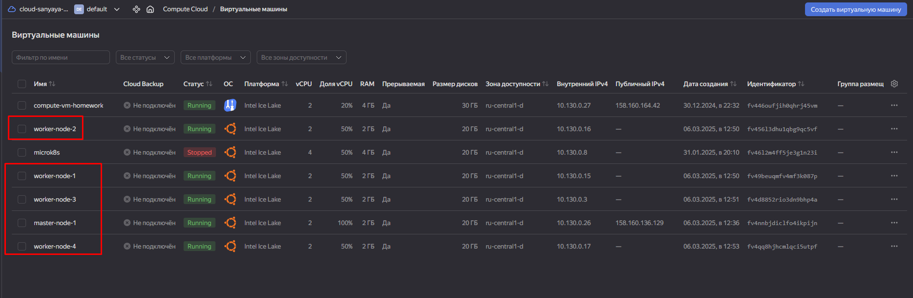

Затем, на основе этих ВМ будет подниматься кластер K8s описанными далее способами.

## Задание 1

Установить кластер K8s с одной мастер нодой

1. Подготовка работы кластера из 5 нод: 1 мастер и 4 воркер ноды;
2. В качестве CRI - containerd;
3. Запуск etcd производить на мастер ноде;
4. Способ установки выбрать самостоятельно.

### Установка через kubeadm

| Номер и описание задачи                                                                                                                       | Описание выполняемых действий                                                                                                                                                                                                                                   | Скриншоты                                                                                                                                                                                         |
| ----------------------------------------------------------------------------------------------------------------------------------------------------------------- | ------------------------------------------------------------------------------------------------------------------------------------------------------------------------------------------------------------------------------------------------------------------------------------------ | ---------------------------------------------------------------------------------------------------------------------------------------------------------------------------------------------------------- |
| 1. Создать ВМ для мастер ноды                                                                                                               | В Yandex Compute Cloud создал ВМ для control plane                                                                                                                                                                                                                             | 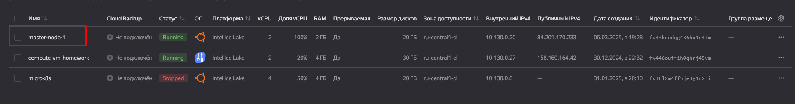                                                                                                                                                             |
| 2. Настроить ноду для установки k8s                                                                                                      | Внес изменения в конфигурацию ноды. Установил необходимые пакеты.                                                                                                                                                             | 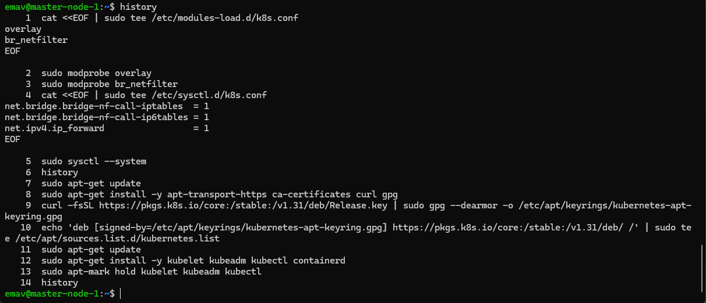                                                                                                                                                             |
| 3. Инициализировать кластер                                                                                                                | Вызвал команду инициализации кластера через kubeadm                                                                                                                                                                                            | 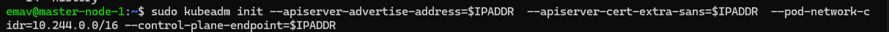 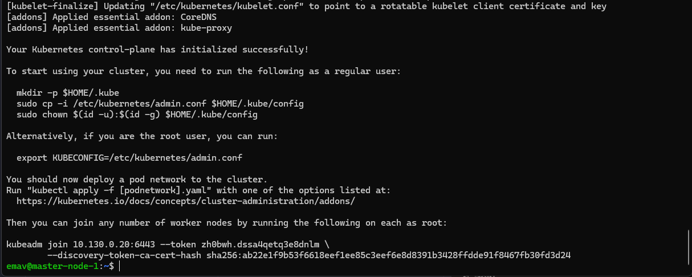                                                                                                         |
| 4. Настроить локально kubectl                                                                                                                    | Настроил локально kubectl                                                                                                                                                                                                                                                  | 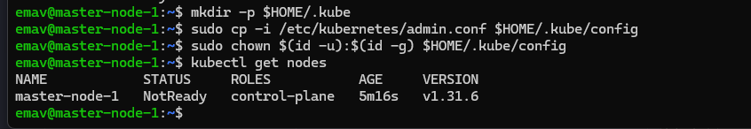                                                                                                                                                             |
| 5. Создать ВМ для воркер нод.                                                                                                                | В YCC создал 4 ВМ для worker нод                                                                                                                                                                                                                                            | 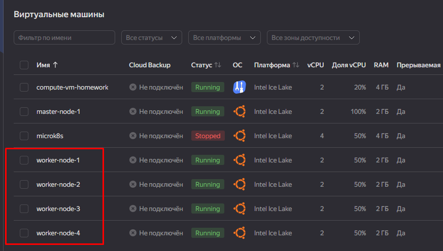                                                                                                                                                             |
| 6. Подготовить воркер ноды для подключения к кластеру.                                                           | Внес необходимые изменения в конфигурацию всех нод. Установил необходимые пакеты.                                                                                                                          | 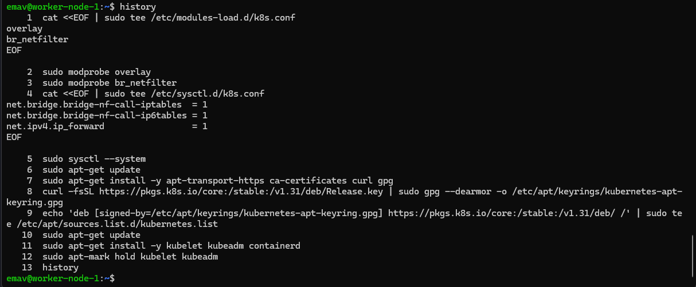 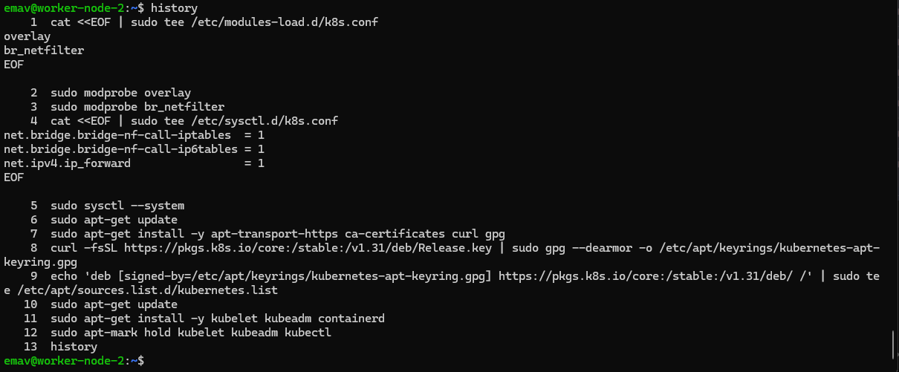 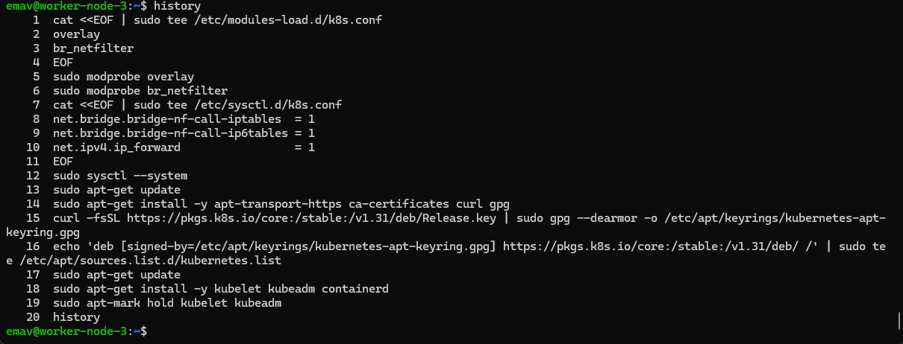 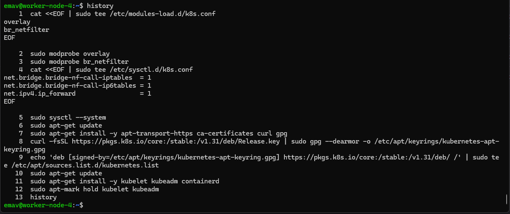 |
| 7. Установить сетевой плагин для обеспечения сетевого взаимодействия между нодами | К сожалению, в этот момент заметил, что кластер "упал". Какая-то проблема с развертыванием кластера через kubeadm. Решить данную проблему пока не удалось. |                                                                                                                                                                                                            |

### Установка через kubespray

| Номер и описание задачи                                                                                           | Описание выполняемых действий                                                                                                                                                   | Скриншоты                                                                                                                                     |
| ------------------------------------------------------------------------------------------------------------------------------------- | ---------------------------------------------------------------------------------------------------------------------------------------------------------------------------------------------------------- | ------------------------------------------------------------------------------------------------------------------------------------------------------ |
| 1. Создать ВМ для master и worker нод                                                                                 | В YCC создал все необходимые ВМ                                                                                                                                                     | 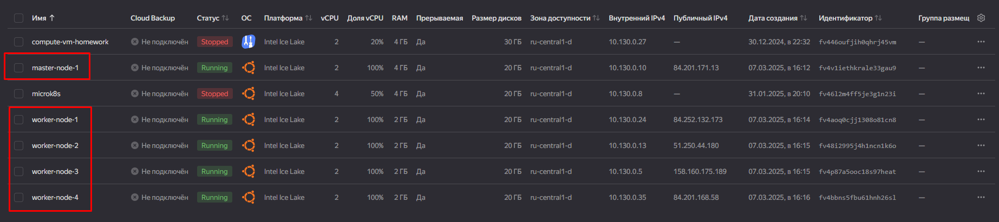                                                                                                         |
| 2. На отдельной машине развернуть kubespray                                                           | Выделил отдельную машину. Склонировал репозиторий kubespray.                                                                                         | 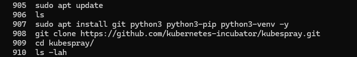                                                                                                         |
| 3. Создать виртуальное окружение. Установить необходимые зависимости. | Создал виртуальное окружение. Установил необходимые зависимости.                                                                             | 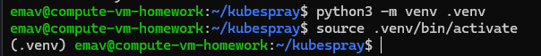 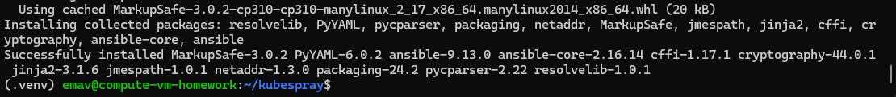                                                     |
| 4. Скопировать пример inventory и скорректировать его под свои нужды.            | Скопировал пример inventory и скорректировал его под свои нужды.                                                                                        | 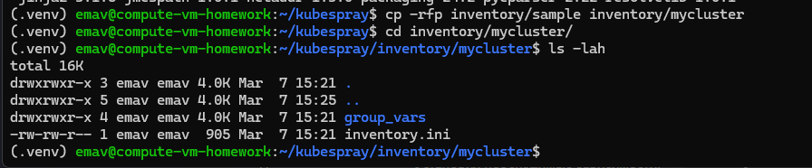 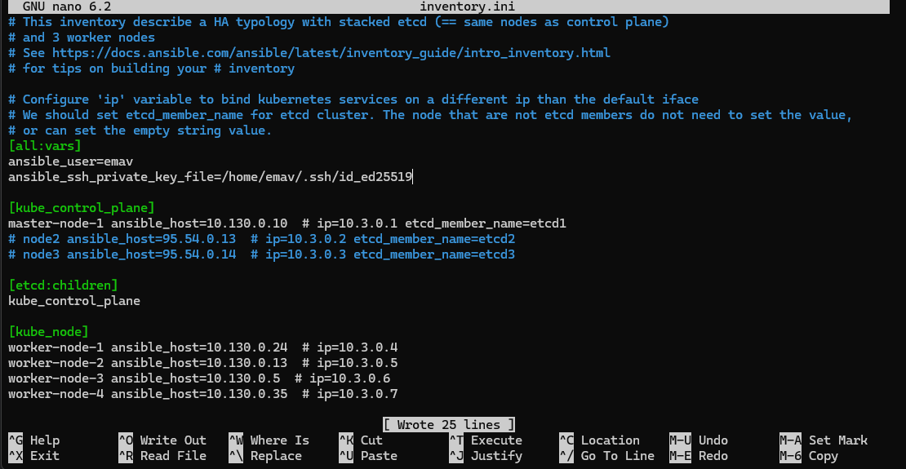 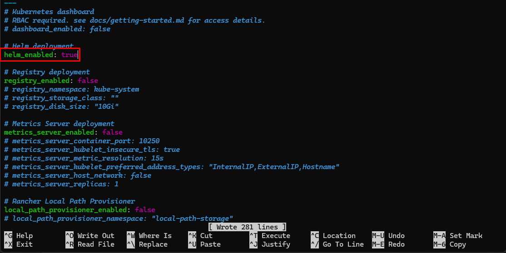 |
| 5. Запустить развертывание кластера                                                                     | Запустил развертывание кластера через запуск плейбука cluster.yml  Playbook проигрался.                                           | 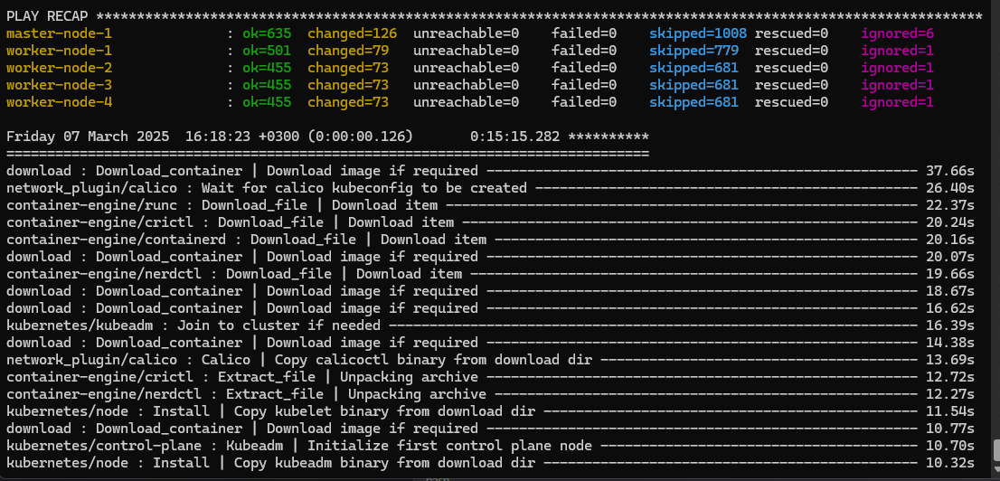                                                                                                         |
| 6. Проверить состояние кластера                                                                             | Подключился к мастер ноде по ssh. Настроил kubectl.  Проверил состояние нод.  Кластер поднялся успешно. | 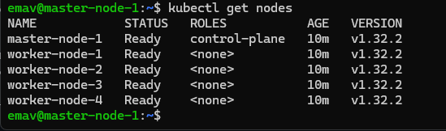                                                                                                         |

### Установка через RKE2

| Номер и описание задачи                                            | Описание выполняемых действий                                                                                                                                                                                                                                                                                                                                                                       | Скриншоты                                                                                                                                     |
| -------------------------------------------------------------------------------------- | ------------------------------------------------------------------------------------------------------------------------------------------------------------------------------------------------------------------------------------------------------------------------------------------------------------------------------------------------------------------------------------------------------------------------------ | ------------------------------------------------------------------------------------------------------------------------------------------------------ |
| 1. Создать ВМ для master и worker нод                                  | В YCC создал необходимые ВМ.                                                                                                                                                                                                                                                                                                                                                                               | 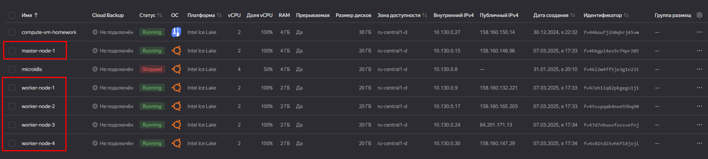                                                                                                         |
| 2. Установить на master ноду серверную часть RKE2   | Установил серверную часть RKE2 по [инструкции](https://docs.rke2.io/install/quickstart)                                                                                                                                                                                                                                                                                                  | 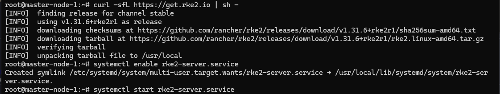 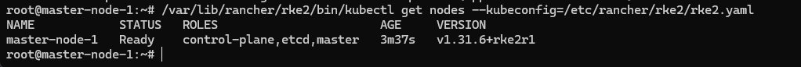                                                     |
| 3. Установить на worker ноды клиентскую часть RKE2 | Установил на воркер ноды клиентскую часть по [инструкции](https://docs.rke2.io/install/quickstart)   В конфигурации клиента указал IP адрес мастер ноды и токен, полученный на мастер ноде.  Повторил установку на всех воркер нодах. | 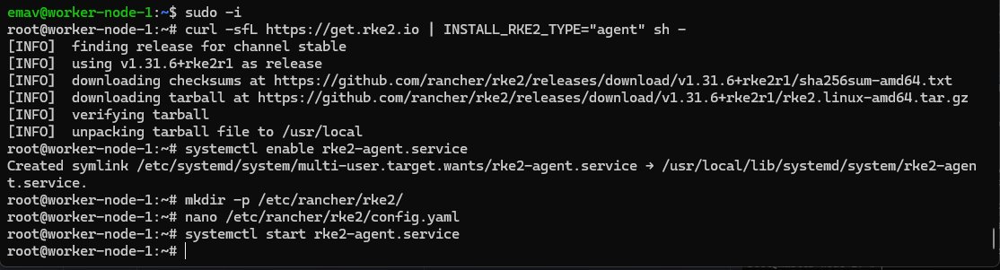 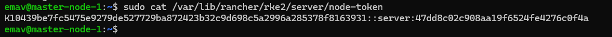 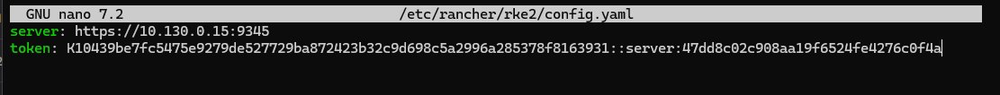 |
| 4. Проверить, что ноды добавились в кластер          | Подключился к master ноде.  Проверил состояние нод.  Кластер поднялся успешно.                                                                                                                                                                                                                                                                   | 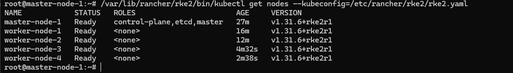                                                                                                         |

## Задание 2

1. Установить кластер в режиме HA
2. Использовать нечетное количество мастре нод
3. Для cluster ip использовать keepalived или другой способ.

Для развертывания выбрал keepalived и kubespray

| Номер и описание задачи                                                                       | Описание выполняемых действий                                                                                                                                                             | Скриншоты                                                                                 |
| ----------------------------------------------------------------------------------------------------------------- | -------------------------------------------------------------------------------------------------------------------------------------------------------------------------------------------------------------------- | -------------------------------------------------------------------------------------------------- |
| 1. Создать ВМ для кластера.                                                                   | В YCC создал все необходимые ВМ: 3 ВМ для мастер нод 2 ВМ для воркер нод                                                                                | 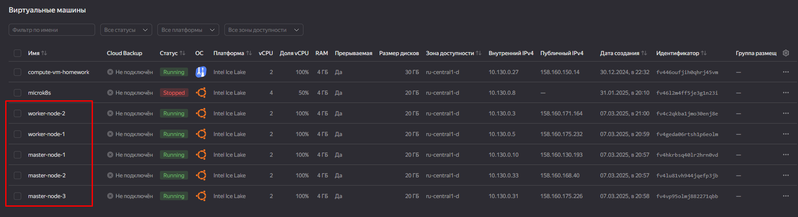                                                     |
| 2. Установить keepalived на master ноды.                                                     | На все мастер ноды установил и сконфигурировал keepalived                                                                                                               | 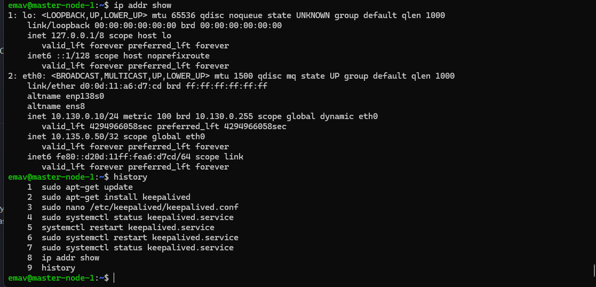 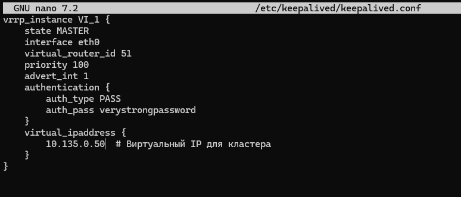 |
| 3. Подготовить инвентарь для kubespray. Развернуть кластер.     | Подготовил инвентарь для kubespray. Скорректировал конфигурацию для развертывания.  Запустил развертывание. | 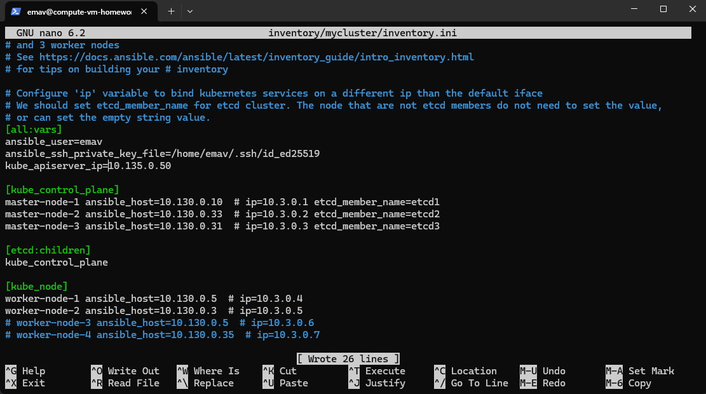 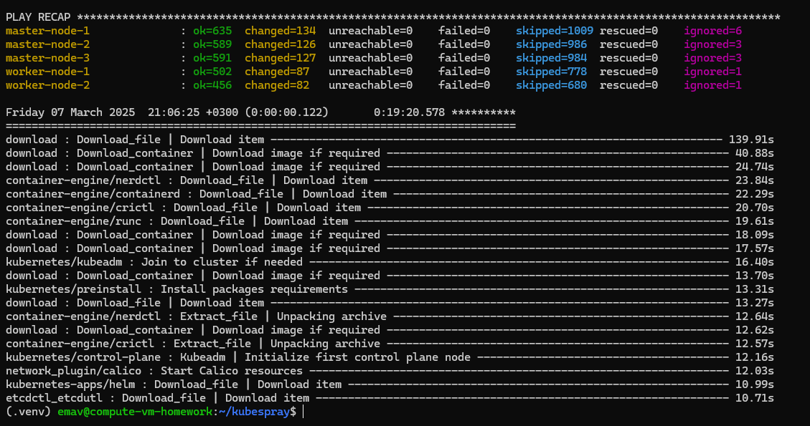 |
| 4. Подключиться к кластеру. Посмотреть состояние нод.             | Подключился к кластеру и посмотрел состояние нод.                                                                                                                     |                                                      |
| 5. Выключить одну из master нод. Посмотреть состояние кластера. | Выключил master-node-1. Посмотрел состояние кластера.  Кластер остался доступен.                                                              | 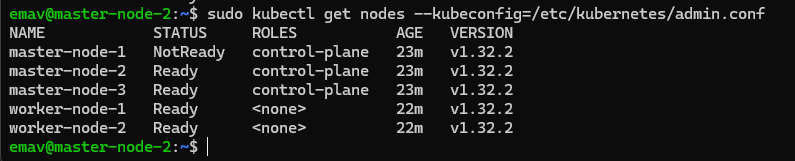                                                     |
