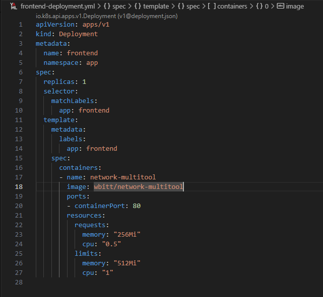

# Домашнее задание к занятию "Как работает сеть в K8s"

## Задание

1. Создать deployment'ы приложений frontend, backend и cache и соответствующие сервисы.
2. В качестве образа использовать network-multitool
3. Разместить поды в namespace App
4. Создать политики, чтобы обеспечить дооступ frontend -> backend -> cache. Другие виды подключений должны быть запрещены.
5. Продемонстрировать, что трафик разрешен и запрещен.

## Решение

Для решения буду использовать ВМ с поднятым microk8s

| Номер и описание задачи                                                                 | Описание выполняемых действий                                                                                                                                                                                                                                                                                                                                                                                                                                                                                                                                                                                                                              | Скриншоты                                                                                                                                                                                                                                                                                                                                                     |
| ----------------------------------------------------------------------------------------------------------- | ------------------------------------------------------------------------------------------------------------------------------------------------------------------------------------------------------------------------------------------------------------------------------------------------------------------------------------------------------------------------------------------------------------------------------------------------------------------------------------------------------------------------------------------------------------------------------------------------------------------------------------------------------------------------------------- | ---------------------------------------------------------------------------------------------------------------------------------------------------------------------------------------------------------------------------------------------------------------------------------------------------------------------------------------------------------------------- |
| 1. Создать namespace для развертывания                                               | Создал namespace app согласно задаче.                                                                                                                                                                                                                                                                                                                                                                                                                                                                                                                                                                                                                             |                                                                                                                                                                                                                                                                                                                          |
| 2. Создать deployment'ы и сервисы                                                           | Описал манифесты деплойментов и сервисов согласно задаче. Манифесты выложил в директорию src рядом с данным readme.  В качестве образа использовал network-multitool.  Применил манифесты.  Удостоверился, что поды поднялись и сервисы созданы.                                                                                                                                                                                                         |                                                                                                                                                                                                                    |
| 3. Создать политики согласно заданию                                          | Описал манифесты сетевых политик для реализации правил прохождения трафика согласно заданию.  Реализовано следующим образом: Запрещаем весь трафик между подами Затем разрешаем только тот трафик между подами, который нам нужен по заданию. В том числе разрешаем доступ к dns.  Применил манифесты.                                                                               |        |
| 4. Проверить корректность работы реализованных политик. | Проверил доступ frontend -> backend. Успешно.  Проверил доступ backend -> cache. Успешно.  Проверил доступ frontend -> cache. Ответа нет, т.к. запрещено подобное соединение.  Проверил доступ cache -> frontend. Ответа нет, т.к. запрещено подобное соединение.  Проверил доступ backend -> frontend. Ответа нет, т.к. запрещено подобное соединение.  Политики работают корректно. |                                                                                                              |
