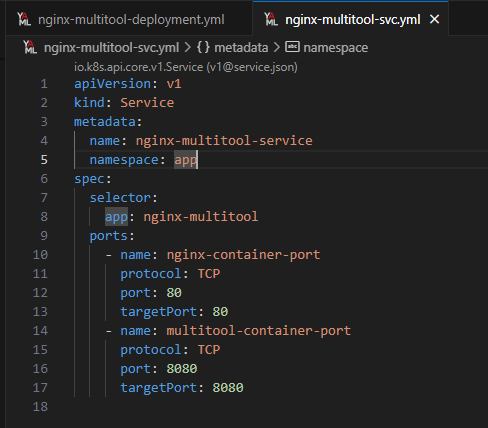
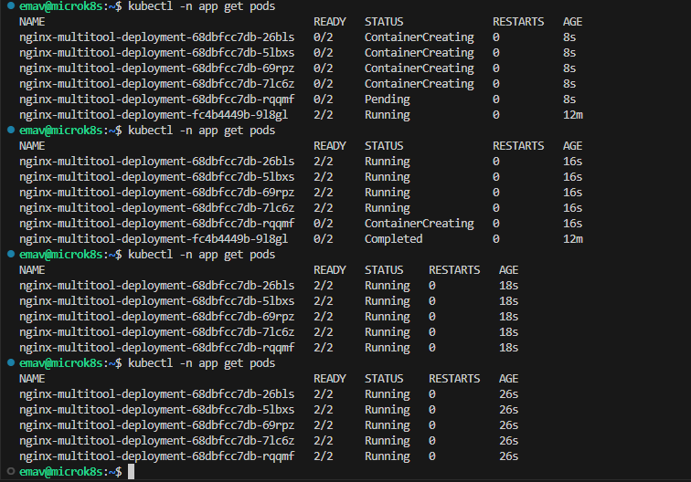
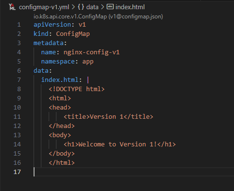

# Домашнее задание к занятию "Обновление приложений"

## Задание 1

Выбрать стратегию обновления приложения и описать выбор

### Условия

1. Имеется приложение, состоящее из нескольких реплик, которое требуется обновить
2. Ресурсы, выделенные для приложения, ограничены и нет возможности их увеличить
3. Запас по ресурсам в менее загруженный момент времени составляет 20%
4. Обновление мажорное, новые версии приложения не умеют работать со старыми
5. Необходимо объяснить выбор стратении приложения.

### Ответ

Главным ограничивающим фактором при выборе стратегии обновление будет являться тот факт, что новая версия приложения несовместима со старой.

Таким образом, самой приемлемой стратегией обновления будет - **Полное обновление (Recreate) в период минимальной нагрузки на приложение.**

**Обоснование выбора:**

* **Несовместимость версий:**
  Т.к. новая версия приложения несовместима со старой, параллельная работа экземпляров разных версий (как, например, в Blue-Green Deployment или в Rolling Update) с очень высокой долью вероятности может привести к сбоям в работе всего приложения. Например, данные или протоколы взаимодействия могут быть изменены, что сделает невозможным корректную обработку запросов, или при обновлении приложения проводится миграция БД и с новой версией схемы БД старая версия приложения не сможет работать.
* **Минимизация простоя:**
  Стратения Recreate предполагает остановку всех старых реплик перед запуском новых. Это приведет к непродолжительному downtime-у, но т.к. это мажорное обновление, получается что это единственный способ избежать конфликтов между версиями.
  * **Контроль времени простоя:** Обновление должно проводиться в момент наименьшей активности пользователей, чтобы минимизировать влияние на сервис.
  * **Использование запаса ресурсов:** В период минимальной нагрузки (когда свободно 20% ресурсов) останавливаем старые реплики и высвобождаем еще 80%. В итоге для создания реплик новой версии будет доступно 100% ресурсов, что позволит быстрее выполнить развертывание.
* **Ограниченные ресурсы:**
  Есть стратегии, требующие двукратного количества ресурсов для своей реализации (например Blue-Green). Для таких стратегий недостаточно выделенных ресурсов, потому как минимальная нагрузка на приложение уже 80%.

**Другие стратегии и причина отказа от них:**

* Rolling Update - Несовместимость новой и старой версий
* Canary Release - Несовместимость новой и старой версий. Даже один экземпляр новой версии может вызвать сбои во всем приложении.
* Blue-Green Deployment - Требует двукратного количества ресурсов, которых нет в таком объеме.

## Задание 2

1. Создать deployment приложения с контейнерами nginx и multitool. Версию nginx взять 1.19. Количество реплик — 5
2. Обновить версию nginx в приложении до версии 1.20, сократив время обновления до минимума. Приложение должно быть доступно
3. Попытаться обновить nginx до версии 1.28, приложение должно оставаться доступным
4. Откатиться после неудачного обновления

### Решение

| Номер и описание задачи                                                                                                                                                                                   | Описание выполняемых действий                                                                                                                                                                                                                                                                                                                                                                                                                                                                                                                                                                 | Скриншоты                                                                                                                                     |
| ----------------------------------------------------------------------------------------------------------------------------------------------------------------------------------------------------------------------------- | ------------------------------------------------------------------------------------------------------------------------------------------------------------------------------------------------------------------------------------------------------------------------------------------------------------------------------------------------------------------------------------------------------------------------------------------------------------------------------------------------------------------------------------------------------------------------------------------------------------------------ | ------------------------------------------------------------------------------------------------------------------------------------------------------ |
| 1. Создать Deployment приложения с указанными контейнерами, версиями и количеством реплик.                                                        | Описал манифест deployment'а.  Применил манифест.  Убедился что поды поднялись.                                                                                                                                                                                                                                                                                                                                                                                                                                                               |    |
| 2. Обновить nginx до версии 1.20. Сократить время обновления до минимума при это приложение должно оставаться доступным. | Скорректировал стратегию обновления.  Исходя из количества реплик - 5 изменяем параметры: maxUnavailable = 4, чтобы один под оставался всегда доступным для стабильности приложения maxSurge=5 чтобы создавалось сразу 5 подов с  новой версией.  Обновил манифест и применил его, запустив  тем самым процесс обновления. |                                                       |
| 3. Попытаться обновить nginx до версии 1.28.0                                                                                                                                                       | Изменил версию nginx на 1.28.0 в манифесте.  Применил измененный манифест.  Получаем ошибку при создании новых подов с версией nginx 1.28.0 потому как такая версия nginx еще не вышла.  При этом приложение осталось доступным на  одной поде, так как мы указали это в стратегии обновления.                                                         |                                                       |
| 4. Откатиться после неудачного обновления.                                                                                                                                                 | Выполнил откат обновления.  Откат выполнился успешно.  Все манифесты выложил в директорию src/ex.2  рядом с данным readme.                                                                                                                                                                                                                                                                                                                                                                              |                                                                                                          |

## Задание 3

1. Создать два deployment'а приложения nginx
2. При помощи разных ConfigMap сделать две версии приложения - веб-страницы.
3. С помощью ingress создать канареечный деплоймент, чтобы можно было часть трафика перебросить на разные версии приложения.

### Решение

| Номер и описание задачи                                                                       | Описание выполняемых действий                                                                                                                                                                                                                                                                                                                                                                                                                                                     | Скриншоты                                                                                                                                                                                                                                             |
| ----------------------------------------------------------------------------------------------------------------- | ------------------------------------------------------------------------------------------------------------------------------------------------------------------------------------------------------------------------------------------------------------------------------------------------------------------------------------------------------------------------------------------------------------------------------------------------------------------------------------------------------------ | -------------------------------------------------------------------------------------------------------------------------------------------------------------------------------------------------------------------------------------------------------------- |
| 1. Создасть ConfigMap для приложений.                                                        | Описал манифесты ConfigMap.  Применил манифесты.                                                                                                                                                                                                                                                                                                                                                                                                                   |                                                                                                            |
| 2. Создать деплойменты и svc для двух версий приложения.           | Описал манифесты развертывания двух версий приложения. У каждой версии своя конфигурация.  Применил манифесты.  Убедился, что поды поднялись.                                                                                                                                                                                                            |      |
| 3. С помощью ingress создать канареечный деплоймент.                     | Описал манифест nginx ingress для реализации канареечного деплоймента. Реализовано так, что 90% трафика уходит на v1 и 10% трафика на v2. Управление этим соотношением осуществляется через аннотацию canary-weight  Применил манифест.                                                            |                                                                                                            |
| 4. Проверить корректность работы канареечного деплоймента. | Прописал себе в hosts запись для example.com.  Открыл из браузера несколько раз example.com  Удостоверился, что 10% трафика  уходит на 2 версию приложения.  Канареечный деплоймент настроен успешно.  Все манифесты выложил в директорию src/ex.3 рядом с данным readme. |                                                                                                                                                               |
