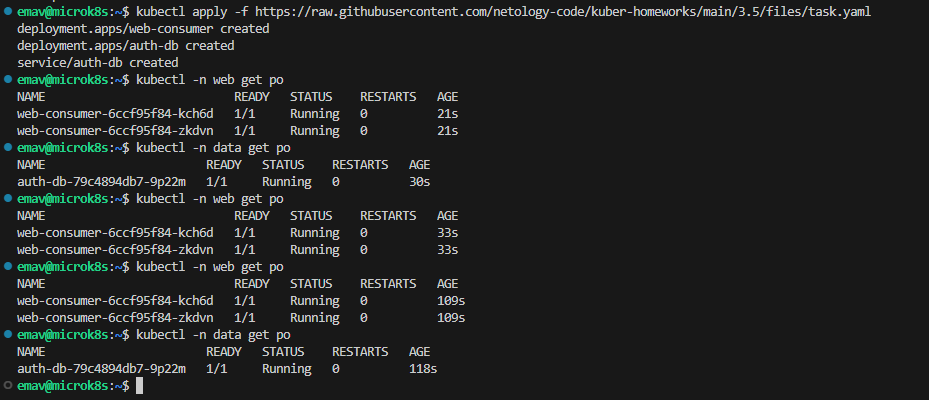

# Домашнее задание к занятию "Troubleshooting"

## Задание

1. Установить приложение из манифеста [ссылка](https://raw.githubusercontent.com/netology-code/kuber-homeworks/main/3.5/files/task.yaml)
2. Выявить проблему и описать
3. Исправить проблему. Описать, что сделано.
4. Продемонстрировать что проблема решена

## Решение

| Номер и описание задачи                                        | Описание выполняемых действий                                                                                                                                                                                                                                                                                                                                                                                                                                                                                                                                                                                | Скриншоты                                                                                                                                                                                                                                             |
| ---------------------------------------------------------------------------------- | --------------------------------------------------------------------------------------------------------------------------------------------------------------------------------------------------------------------------------------------------------------------------------------------------------------------------------------------------------------------------------------------------------------------------------------------------------------------------------------------------------------------------------------------------------------------------------------------------------------------------------------- | -------------------------------------------------------------------------------------------------------------------------------------------------------------------------------------------------------------------------------------------------------------- |
| 1. Установить приложение из манифеста.              | Установил приложение из манифеста. При установке выявилась перва проблема - не созданы заранее неймспейсы в которые должно деплоиться приложение.  Проверил состояние приложения после развертывания.                                                                                                                                                                                                                                 |      |
| 2. Выявить проблему. Описать её.                           | Видим проблему с тем, что контейнеры web-consumer не могут получить доступ к сервису auth-db потому как не могут зарезолвить его доменное имя. Связано это с тем, что web-consumer и auth-db (с его сервисом)  находятся в разных неймспейсах(web и data), а при обращении к сервису  из другого неймспейса следует использовать его полное доменное имя (FQDN). |                                                                                                                                                                                                                                                                |
| 3. Исправить проблему. Описать решение.             | Для решения проблемы следует скорректировать манифест deployment'а web-consumer, указав в команде контейнера полное доменное имя (FQDN) сервиса auth-db.  Скорректировал манифест и применил его.                                                                                                                                                                                                                                                                                |                                                                                                                                                               |
| 4. Продемонстрировать что проблема решена. | Смотрим логи контейнеров после изменений.  Видим, что проблема устранена и взаимодействие между сервисами восстановлено.  Исправленный манифест выложил в директорию src рядом с данным readme.                                                                                                                                                                                                                                                       |                                                                                                            |
