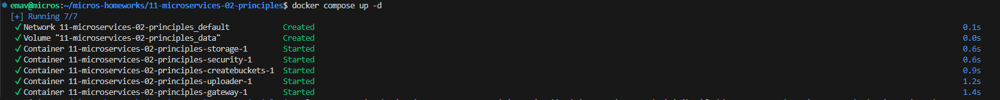
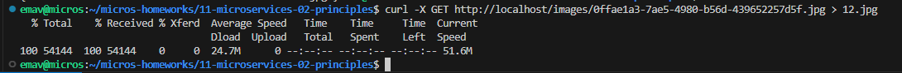

# Домашнее задание к занятию "Микросервисы. Принципы"

## Задание 1

### Постановка

Предложите решение для обеспечения реализации API Gateway. Составьте сравнительную таблицу возможностей различных программных решений. На основе таблицы сделайте выбор решения.

Решение должно соответствовать следующим требованиям:

* маршрутизация запросов к нужному сервису на основе конфигурации,
* возможность проверки аутентификационной информации в запросах,
* обеспечение терминации HTTPS.

Обоснуйте свой выбор.

### Ответ

К рассмотрению приняты несколько довольно известных программных решений:

* Kong
* NGINX
* AWS API Gateway
* Apigee
* Traefik

Краткое описание рассматриваемых вариантов:

**Kong** :

* **Описание** : Kong — это API Gateway с открытым исходным кодом, построенный на базе NGINX и Lua. Он поддерживает множество плагинов для расширения функциональности, таких как аутентификация, логирование, мониторинг и другие.
* **Преимущества** : Поддержка множества плагинов и расширений, высокая масштабируемость, поддержка различных протоколов.
* **Недостатки** : Средняя сложность настройки. Требуется более глубокое погружение.

**NGINX** :

* **Описание** : NGINX — это высокопроизводительный HTTP-сервер и обратный прокси-сервер, который также может использоваться в качестве API Gateway. Он поддерживает маршрутизацию, балансировку нагрузки и терминацию HTTPS.
* **Преимущества** : Высокая легкость настройки, высокая производительность, поддержка плагинов.
* **Недостатки** : Ограниченная поддержка протоколов.

**AWS API Gateway** :

* **Описание** : AWS API Gateway — это полностью управляемый сервис от Amazon, который позволяет разработчикам создавать, публиковать, поддерживать, мониторить и защищать API любого масштаба. Он интегрируется с другими сервисами AWS.
* **Преимущества** : Низкая сложность настройки, высокая масштабируемость, интеграция с AWS сервисами.
* **Недостатки** : Платная, нет поддержки плагинов.

**Apigee** :

* **Описание** : Apigee — это API Gateway от Google, который предоставляет инструменты для создания, управления и анализа API. Он поддерживает множество функций, таких как аутентификация, мониторинг и аналитика.
* **Преимущества** : Поддержка множества плагинов и расширений, высокая масштабируемость.
* **Недостатки** : Средняя легкость настройки, платная.

**Traefik** :

* **Описание** : Traefik — это современный HTTP обратный прокси-сервер и балансировщик нагрузки, разработанный специально для микросервисов. Он автоматически обнаруживает новые сервисы и маршруты, поддерживает множество протоколов и интеграций с различными оркестраторами контейнеров.
* **Преимущества** : Низкая сложность настройки, поддержка множества протоколов, автоматическое обнаружение сервисов.
* **Недостатки** : Меньшая масштабируемость по сравнению с другими решениями.

Сводная таблица сравнения

| Возможность                                                          | Kong                                       | NGINX                                                             | AWS API Gateway                     | Apigee                                        | Traefik                                             |
| ------------------------------------------------------------------------------- | ------------------------------------------ | ----------------------------------------------------------------- | ----------------------------------- | --------------------------------------------- | --------------------------------------------------- |
| Маршрутизация запросов                                     | +                                          | +                                                                 | +                                   | +                                             | +                                                   |
| Проверка аутентификационной информации | +                                          | +                                                                 | +                                   | +                                             | +                                                   |
| Обеспечение терминации HTTPS                               | +                                          | +                                                                 | +                                   | +                                             | +                                                   |
| Поддержка плагинов и расширений                     | +                                          | +                                                                 | -                                   | +                                             | +                                                   |
| Сложность конфигурирования                             | Средняя                             | Низкая                                                      | Низкая                        | Средняя                                | Низкая                                        |
| Масштабируемость                                                | Высокая                             | Высокая                                                    | Высокая                      | Высокая                                | Высокая                                      |
| Поддержка различных протоколов                      | HTTP, HTTPS, gRPC, gRPC-Web, TCP, UDP | HTTP, HTTPS, TCP, UDP, WebSocket, gRPC, FastCGI, SCGI, uWSGI | HTTP, HTTPS, REST, WebSocket  | HTTP, HTTPS, REST, SOAP, gRPC, WebSocket | HTTP, HTTPS, TCP, TLS, WebSocket, gRPC, HTTP/2 |
| Интеграция с CI/CD                                                   | +                                          | +                                                                 | +                                   | +                                             | +                                                   |
| Стоимость                                                              | Открытый исходный код   | Открытый исходный код                          | Платная                      | Платная                                | Открытый исходный код            |

Выбор решения

В общем случае, исходя из требования и сравнительной таблицы, Kong представляется наиболее подходящим решением для реализации API Gateway. Он обеспечивает бОльшую часть необходимых функций, а также поддерживает множество плагинов и расширений, что бывает важно при реализации нестандартных идей, и обладает высокой масштабируемостью. Но следует учесть, необходимость глубокого погружения в продукт для его успешного применения.

Если в качестве инфраструктуры проекта используется AWS или Google Cloud, то можно также рассмотреть предоставляемые этими облачными платформами решания (AWS API Gateway, Apigee), при условии, что на их внедрение заложится бюджет и поддерживаемых протоколов достаточно.

Если же большого времени на погружение и внедрение нового продукта не так много, то можно обратить внимание на NGINX и Traefik, которые более просты в настройке и могут покрыть основные требования к API Gateway на первых этапах.

Также, при выборе следует руководствоваться текущей архитектурой приложения в целом и микросервисов в частности, чтобы сделать правильный выбор.

## Задание 2

### Постановка

Составьте таблицу возможностей различных брокеров сообщений. На основе таблицы сделайте обоснованный выбор решения.

Решение должно соответствовать следующим требованиям:

* поддержка кластеризации для обеспечения надёжности,
* хранение сообщений на диске в процессе доставки,
* высокая скорость работы,
* поддержка различных форматов сообщений,
* разделение прав доступа к различным потокам сообщений,
* простота эксплуатации.

Обоснуйте свой выбор.

### Ответ

Для сравнения рассмотрим несколько популярных брокеров сообщений:

* RabbitMQ
* Apache Kafka
* ActiveMQ
* NATS
* Redis

Описание рассматриваемых программных решений

**RabbitMQ** :

* **Описание** : RabbitMQ — это брокер сообщений с открытым исходным кодом, который поддерживает 		множество протоколов обмена сообщениями, таких как AMQP, MQTT и STOMP. Он обеспечивает надежную доставку сообщений и поддерживает кластеризацию.
* **Преимущества** :

  * Поддержка различных протоколов (AMQP, MQTT, STOMP).
  * Надежность доставки сообщений.
  * Разделение прав доступа с использованием плагинов.
  * Поддержка кластеризации для обеспечения высокой доступности.
* **Недостатки** :

  * Средняя скорость работы по сравнению с Kafka и NATS.
  * Средняя простота эксплуатации, требует настройки и управления.
* **Подходит для** : Проектов, где важна поддержка различных протоколов и надежность доставки сообщений, таких как финансовые системы, системы управления заказами и IoT.

**Apache Kafka** :

* **Описание** : Apache Kafka — это распределенная стриминговая платформа, которая обеспечивает высокую производительность и надежность. Kafka используется для построения систем реального времени и обработки больших объемов данных.
* **Преимущества** :
  * Очень высокая скорость работы, подходит для обработки больших объемов данных.
  * Надежность и устойчивость к сбоям благодаря распределенной архитектуре.
  * Поддержка различных форматов сообщений (JSON, Avro, Protobuf).
  * Поддержка кластеризации и репликации данных.
  * Разделение прав доступа с использованием Apache Kafka ACLs.
* **Недостатки** :
  * Средняя простота эксплуатации, требует настройки и управления.
  * Более сложная архитектура по сравнению с другими брокерами.
* **Подходит для** : Проектов, требующих высокой производительности и обработки больших объемов данных в реальном времени, таких как аналитические системы, системы мониторинга и логирования.

**ActiveMQ** :

* **Описание** : ActiveMQ — это брокер сообщений с открытым исходным кодом, который поддерживает множество протоколов обмена сообщениями, таких как AMQP, MQTT и STOMP. Он обеспечивает надежную доставку сообщений и поддерживает кластеризацию.
* **Преимущества** :
  * Поддержка различных протоколов (AMQP, MQTT, STOMP).
  * Надежность доставки сообщений.
  * Разделение прав доступа с использованием плагинов.
  * Поддержка кластеризации для обеспечения высокой доступности.
* **Недостатки** :
  * Средняя скорость работы по сравнению с Kafka и NATS.
  * Средняя простота эксплуатации, требует настройки и управления.
* **Подходит для** : Проектов, где важна поддержка различных протоколов и надежность доставки сообщений, таких как корпоративные системы и системы управления бизнес-процессами.

**NATS** :

* **Описание** : NATS — это высокопроизводительный брокер сообщений с открытым исходным кодом, который обеспечивает простоту эксплуатации и высокую скорость работы. Он поддерживает кластеризацию и различные форматы сообщений.
* **Преимущества** :
  * Очень высокая скорость работы, подходит для систем реального времени.
  * Простота эксплуатации, минимальные требования к настройке.
  * Поддержка различных форматов сообщений (JSON, Protobuf).
  * Поддержка кластеризации для обеспечения высокой доступности.
* **Недостатки** :
  * Нет поддержки хранения сообщений на диске.
  * Нет встроенного разделения прав доступа.
* **Подходит для** : Проектов, где важна высокая производительность и простота эксплуатации, таких как системы мониторинга, IoT и микросервисные архитектуры.

**Redis** :

* **Описание** : Redis — это высокопроизводительная база данных в памяти, которая также может использоваться как брокер сообщений при использовании Redis pub/sub. Поддерживает кластеризацию и хранение сообщений на диске.
* **Преимущества** :
  * Высокая скорость работы благодаря хранению данных в памяти.
  * Простота эксплуатации, минимальные требования к настройке.
  * Поддержка различных форматов сообщений (JSON, Protobuf).
  * Поддержка кластеризации для обеспечения высокой доступности.
  * Возможность хранения сообщений на диске с использованием Redis Persistence.
* **Недостатки** :
  * Ограниченная функциональность как брокера сообщений по сравнению с RabbitMQ и Kafka.
  * Основное предназначение — база данных в памяти, а не брокер сообщений.
* **Подходит для** : Проектов, где важна высокая производительность и простота эксплуатации, таких как кэширование, очереди задач и системы реального времени.

Сравнительная таблица по заданным параметрам

| Возможность                                                                               | RabbitMQ       | Apache Kafka   | ActiveMQ       | NATS         | Redis        |
| ---------------------------------------------------------------------------------------------------- | -------------- | -------------- | -------------- | ------------ | ------------ |
| Поддержка кластеризации                                                        | +              | +              | +              | +            | +            |
| Хранение сообщений на диске                                                  | +              | +              | +              | -            | +            |
| Высокая скорость работы (Чем больше плюсов тем выше) | ++             | +++            | +              | +++          | ++           |
| Поддержка различных форматов сообщений                       | +              | +              | +              | +            | +            |
| Разделение прав доступа                                                         | +              | +              | +              | -            | +            |
| Сложность эксплуатации                                                          | Средняя | Средняя | Средняя | Низкая | Низкая |

Результаты сравнения

**RabbitMQ** :

* **Преимущества** : Поддержка различных протоколов, надежность, разделение прав доступа.
* **Недостатки** : Средняя скорость работы.
* **Рекомендация** : Подходит для проектов, где важна поддержка различных протоколов и надежность доставки сообщений.

**Apache Kafka** :

* **Преимущества** : Очень высокая скорость работы, надежность, поддержка различных форматов сообщений.
* **Недостатки** : Средняя простота эксплуатации.
* **Рекомендация** : Подходит для проектов, требующих высокой производительности и обработки больших объемов данных в реальном времени.

**ActiveMQ** :

* **Преимущества** : Поддержка различных протоколов, надежность, разделение прав доступа.
* **Недостатки** : Средняя скорость работы.
* **Рекомендация** : Подходит для проектов, где важна поддержка различных протоколов и надежность доставки сообщений.

**NATS** :

* **Преимущества** : Очень высокая скорость работы, простота эксплуатации.
* **Недостатки** : Нет поддержки хранения сообщений на диске, нет разделения прав доступа.
* **Рекомендация** : Подходит для проектов, где важна высокая производительность и простота эксплуатации.

**Redis** :

* **Преимущества** : Высокая скорость работы, простота эксплуатации, поддержка различных форматов сообщений.
* **Недостатки** : Ограниченная функциональность как брокера сообщений.
* **Рекомендация** : Подходит для проектов, где важна высокая производительность и простота эксплуатации.

Выводы

На основе требований и сравнительной таблицы, **Apache Kafka** представляется наиболее подходящим решением для реализации брокера сообщений. Он обеспечивает высокую производительность, надежность, поддержку различных форматов сообщений и кластеризацию. Это делает его отличным выбором для проектов, требующих высокой скорости работы и обработки больших объемов данных.

Но также, при выборе следует руководствоваться текущей архитектурой приложения в целом и микросервисов в частности, структурой инфраструктуры и другими нюансами проекта, что, в свою очередь, может позволить выделить дополнительные метрики сравнения и сделать более правильный выбор.

## Задание 3

| Описание выполняемых действий                                                                                                                                       | Скриншоты                                                                                                    |
| ---------------------------------------------------------------------------------------------------------------------------------------------------------------------------------------------- | --------------------------------------------------------------------------------------------------------------------- |
| 1. Поднял отдельную ВМ в YC и устновил в нее docker. Склонировал проект с кодом задания.                                     |                                                                         |
| 2. Дописал конфиг NGINX для реализации API Gateway Скорректировал compose файл, для выполнения условия задачи. | С кодом можно ознакомиться в директории src рядом с данным readme. |
| 3. Запустил проект                                                                                                                                                               |                                                                         |
| 4. Получил токен                                                                                                                                                                   |                                                                         |
| 5. Загрузил картинку, указав полученный ранее токен                                                                                                  |                      |
| 6. Скачал картинку из хранилища                                                                                                                                       |                      |
