# Домашнее задание к занятию "Системы мониторинга"

|                                                                                                                                                                                                                                                                                                                                                                   Вопрос                                                                                                                                                                                                                                                                                                                                                                   | Ответ                                                                                                                                                                                                                                                                                                                                                                                                                                                                                                                                                                                                                                                                                                                                                                                                                                                                                                                                                                                                                                                                                                                                                                                                                                                                                                                                                                                                                                                                                                                                                                                                                                                                                                                                                                                                                                                                                                                                                                                                                                                                                                                                                                                                                                                                                                                                                                                                                                                                                                                                                                                                                                                             |
| :-----------------------------------------------------------------------------------------------------------------------------------------------------------------------------------------------------------------------------------------------------------------------------------------------------------------------------------------------------------------------------------------------------------------------------------------------------------------------------------------------------------------------------------------------------------------------------------------------------------------------------------------------------------------------------------------------------------------------------------------------: | ---------------------------------------------------------------------------------------------------------------------------------------------------------------------------------------------------------------------------------------------------------------------------------------------------------------------------------------------------------------------------------------------------------------------------------------------------------------------------------------------------------------------------------------------------------------------------------------------------------------------------------------------------------------------------------------------------------------------------------------------------------------------------------------------------------------------------------------------------------------------------------------------------------------------------------------------------------------------------------------------------------------------------------------------------------------------------------------------------------------------------------------------------------------------------------------------------------------------------------------------------------------------------------------------------------------------------------------------------------------------------------------------------------------------------------------------------------------------------------------------------------------------------------------------------------------------------------------------------------------------------------------------------------------------------------------------------------------------------------------------------------------------------------------------------------------------------------------------------------------------------------------------------------------------------------------------------------------------------------------------------------------------------------------------------------------------------------------------------------------------------------------------------------------------------------------------------------------------------------------------------------------------------------------------------------------------------------------------------------------------------------------------------------------------------------------------------------------------------------------------------------------------------------------------------------------------------------------------------------------------------------------------------------------------- |
| 1. Вас пригласили настроить мониторинг на проект. На онбординге вам рассказали, что проект представляет из себя  платформу для вычислений с выдачей текстовых отчетов,  которые сохраняются на диск.  Взаимодействие с платформой осуществляется по протоколу http.  Также вам отметили, что вычисления загружают ЦПУ.  Какой минимальный набор метрик вы выведите в мониторинг  и почему? | Минимальны набор метрик: - Загрузка CPU (LA) - RAM/SWAP Usage - Response Time - Request Time - Error Rate - Disk I/O (сюда же относится и inodes)  Пояснения: - Потому как вычисления загружают CPU, необходимо отслеживать его загрузку, чтобы отслеживать возможность выполнения запросов системой в реальном времени. Если CPU будет перегружен,  то система не сможет обрабатывать запросы, либо будет это делать с ощутимыми задержками. - Вычисления могут потреблять большое количество оперативной памяти. Особенно, если будет обрабатываться большой объем данных. Мониторинг использования оперативной памяти поможет избежать проблем с производитель ностью и/или утечками памяти - Необходимо мониторить время обработки запросов и выдачи отчетов, потому как это критично для пользовательского опыта. Долгое время отклика может  указывать на проблемы с производительностью - Также нужно отслеживать количество входящих запросов. Это поможет понять  нагрузку на систему, что полезно для проработки масштабирования. - Мониторинг количества ошибок, возникающих при использовании платформы,  позволит быстро реагировать на возникающие проблемы и поддерживать стабильность сервиса. - Т.к. отчеты сохраняются на диск, то нужен также и мониторинг операций  ввода-вывода и inodes, чтобы отслеживать состояние хранилища и выявлять  узкие места, связанные с записью и чтением данных. |
|                                                                                                                       2. Менеджер продукта посмотрев на ваши метрики сказал, что ему непонятно что такое RAM/inodes/CPUla.  Также он сказал, что хочет понимать,  насколько мы выполняем свои обязанности  перед клиентами  и какое качество обслуживания.  Что вы можете ему предложить?                                                                                                                       | В первую очередь следует объяснить продакту что значит та или иная метрика, а также зафиксировать описание метрик во внутренней документации команды, чтобы всегда можно было сослаться на это описание.  Также следует предложить продакту вывести SLI на основе предложенных метрик. Например, связанный с временем отклика, где 95% запросов должны обрабатываться менее чем за 300 мс. Или, например, SLO установлен как - сервис должен выдвать ответы 2хх/3хх в 99% случаев где 1% закладывается на тех. обслуживание и нужно сверить это с фактическим SLI.  Для формирования прозрачности, следует также применить визуализацию данных. Например, можно создать дашборд с ключевыми метриками и SLI, который будет наглядно демонстрировать состояние системы и качество обслуживания. Это также поможет продакту  лучше понимать, Как связаны метрики и клиентский опыт.                                                                                                                                                                                                                                                                                                                                                                                                                                                                                                                                                                                                                                                                                                                                                                                                                                                                                                                                                                                                              |
|                                                                                             3. Вашей DevOps команде в этом году не выделили финансирование на построение системы сбора логов.  Разработчики в свою очередь хотят видеть все ошибки,  которые выдают их приложения.  Какое решение вы можете предпринять в этой ситуации,  чтобы разработчики получали ошибки приложения?                                                                                             | Во первых, следует удостовериться, что логирование для приложений настроено со стороны разработчиков. Многие языки программирования и фрейморки имеют встроенные библиотеки для логирования, которые  могут сохранять логи в файлы или выводить их в консоль. Следует убедиться, что эти инструменты применяются разработчиками и логи от самих приложений куда-то выводятся. В данном случае лучше, чтобы логи сохранялись в файлы.  Затем можно при помощи black-box мониторинга настроить уведомления команде разработки при наступлении  недоступности сервиса, что сервер недоступен и нужно посмотреть логи сервиса.  В качетсве альтернативы можно применить скриптовое решение, которое будет периодически собирать логи из  файлов и отправлять их команде разработки в удобном формате.  Если же бюджет не выделен именно на преобретение ПО, то можно исследовать возможность внедрения  open-source решений, таких как ELK Stack или Graylog, но при условии, что на работы по внедрению бюджет все же будет выделен.                                                                                                                                                                                                                                                                                                                                                                                                                                                                                                                                                                                                                                                                                                                             |
|                                                                                               4. Вы, как опытный SRE, сделали мониторинг, куда вывели отображения выполнения SLA=99% по http кодам ответов.  Вычисляете этот параметр по следующей формуле:  summ_2xx_requests/summ_all_requests.  Данный параметр не поднимается выше 70%,  но при этом в вашей системе нет кодов ответа 5xx и 4xx. Где у вас ошибка?                                                                                               | Ошибка заключается в том, что при подсчете учитываются только ответы 2xx, когда от системы могут поступать другие ответы, отличные от 5хх и 4хх, например 3xx, которые также не являются кодами ошибок.  Соответственно, следует скорректировать формулу вычисления параметра, чтобы она учитывала все  "неошибочные" коды.                                                                                                                                                                                                                                                                                                                                                                                                                                                                                                                                                                                                                                                                                                                                                                                                                                                                                                                                                                                                                                                                                                                                                                                                                                                                                                                                                                                                                                                                                                                                                                                                                                                                                                                                                                                                                                                                                                                                                                                                                                                           |
|                                                                                                                                                                                                                                                                                                                  5. Опишите основные плюсы и минусы pull и push систем мониторинга.                                                                                                                                                                                                                                                                                                                  | Плюсы и минусы Pull систем мониторинга: "+": - Легче контролировать целостность данных; - Можно настроить единый прокси до всех агентов с TLS; - Упрощенная отладка получения данных с агентов; "-": - Данные собираются только в момент запроса, что может привести к задержкам в обнаружении проблем. - Если система не запрашивает данные часто, критические события могут получены с опозданием.  Плюсы и минусы Push систем мониторинга: "+": - Упрощение репликации данных в разные системы мониторинга или их резервные копии - Более гибкая настройка пакетов данных с метриками при отправке - Как правило, работают на UDP, а значит производительность выше. "-": - Требует настройки каждого агента - Если нет буфферизации, то данные могут быть потерены, если система будет недоступна - Постоянная частая отправка данных может привести к значительному увеличению нагрузки на сеть.                                                                                                                                                                                                                                                                                                                                                                                                                                                                                                                                                                                                                                                                                                                                                                                                                                                                                                                                                               |
|                                                                                                                                                                                                                                           6. Какие из перечисленных систем относятся к push модели, а какие к pull ? А может есть гибридные ? - Prometheus - TICK - Zabbix - VictoriaMetrics - Nagios                                                                                                                                                                                                                                           | - Prometheus, как правило, работает по pull модели. Но есть еще PushGateway, но с него все равно prometheus пулит метрики. - TICK - использует push модель в которой Telegraph пушит метрики - Zabbix - может использовать как pull так и push модель - VictoriaMetrics - Может использовать и комбинировать push и pull модели - nagios - не знаком с данным инструментом, но на сколько я понял, он использует pull модель, опрашивая  целевые системы для получения их статуса по snmp.                                                                                                                                                                                                                                                                                                                                                                                                                                                                                                                                                                                                                                                                                                                                                                                                                                                                                                                                                                                                                                                                                                                                                                                                                                                                                                                                                                                                                                                                                                                                                                                                                                                                                                                                                                                                                                                            |

|                                                                                                                                                                                                                                                                                               Номер и описание задачи                                                                                                                                                                                                                                                                                               | Описание выполняемых действий                                                                                                                                                                                                                                                                                                                                                                                  | Скриншоты                                                                                                                                                                                         |
| :--------------------------------------------------------------------------------------------------------------------------------------------------------------------------------------------------------------------------------------------------------------------------------------------------------------------------------------------------------------------------------------------------------------------------------------------------------------------------------------------------------------------------------------------------------------------------------------------------------------------------------------: | ----------------------------------------------------------------------------------------------------------------------------------------------------------------------------------------------------------------------------------------------------------------------------------------------------------------------------------------------------------------------------------------------------------------------------------------- | ---------------------------------------------------------------------------------------------------------------------------------------------------------------------------------------------------------- |
|                                                                                                                                                                                                                       7. Склонировать[репозиторий](https://github.com/influxdata/sandbox/tree/master) и запустить TICK-стэк, используя docker и docker compose.                                                                                                                                                                                                                       | Создал новую ВМ в YC Установил в нее Docker Склонировал репозиторий Скорректировал файл docker-compose.yml и запустил docker compose                                                                                                                                                                                                      | 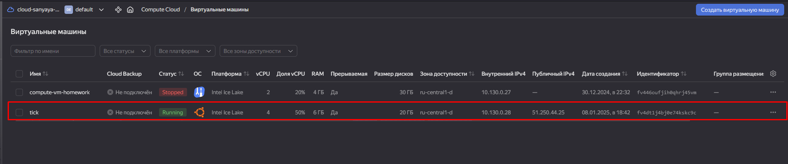 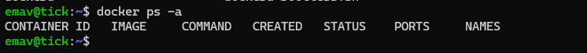 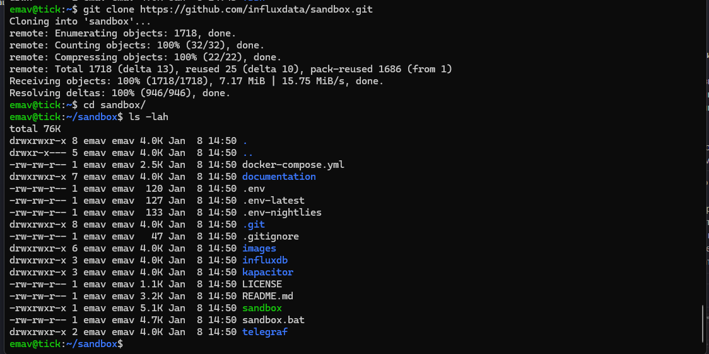 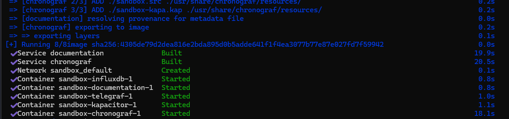 |
|                                                                                                                                                                                                                                                                           Приложить скриншот веб-интерфейса ПО chronograf                                                                                                                                                                                                                                                                           | Зашел на поднятый chronograf Приложил скрин                                                                                                                                                                                                                                                                                                                                                              | 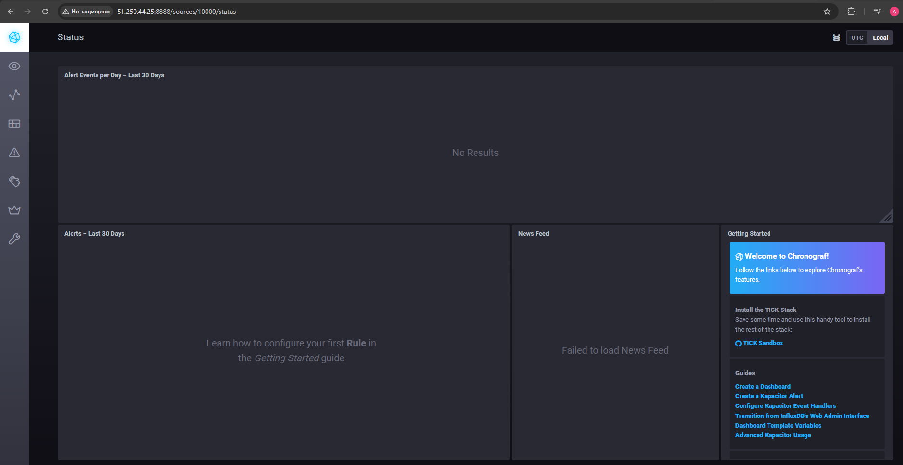                                                                                                                                                             |
| 8. Открыть вкладку Data Explorer - Нажать кнопку Add a query - Изучить вывод интерфейса и выбрать БД telegraf.autogen - В measurments выбрать cpu->host->telegraf->getting-started а в fields выбрать usage_system. Внизу появится график использования CPU. - Вверху будет запрос, похожий на SQL. Поэксперементировать с запросом, изменив группировку и интервал наблюдений. | Открыл вкладку Data Explorer Выбрал то, что указано в задаче. поигрался с запросом.                                                                                                                                                                                                                                                                                     | 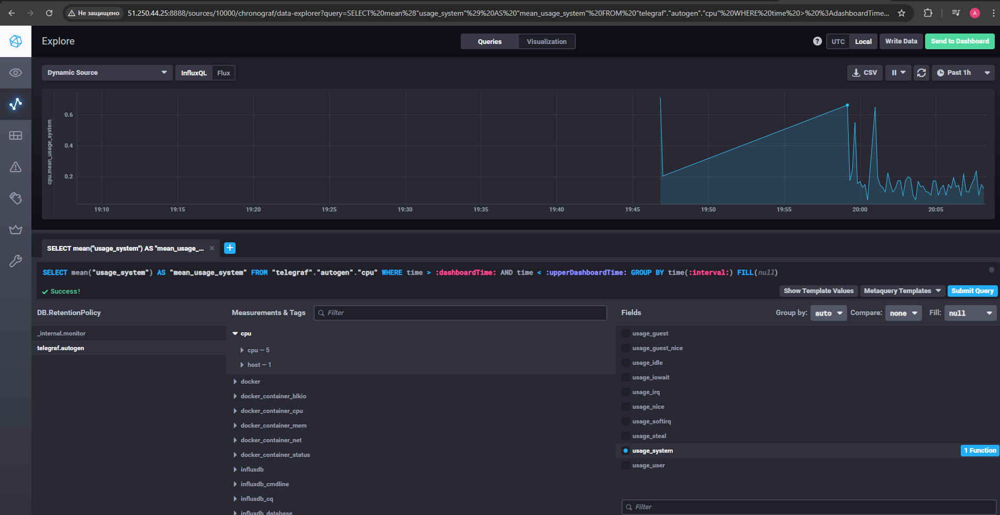 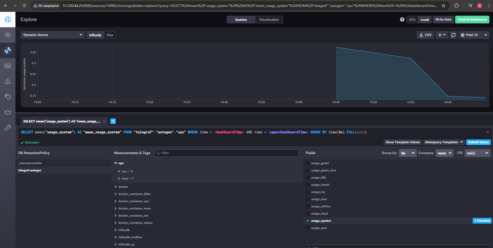 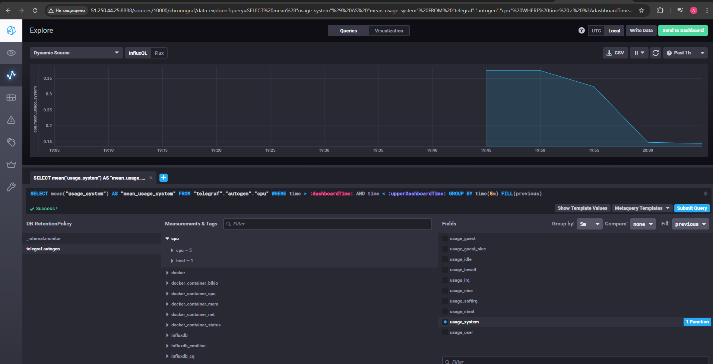 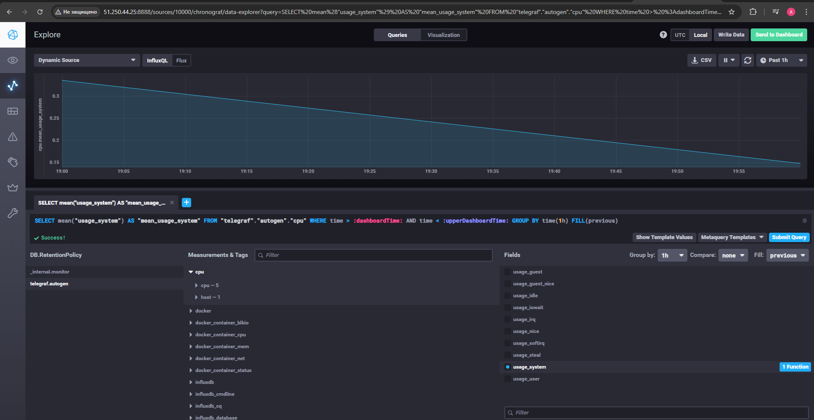 |
|                                                                                                                                                                                                          9. Добавить в telegraf плагин docker При необходимости скорректировать  docker-compose.yml Приложить скриншот новых метрик.                                                                                                                                                                                                          | Плагин Docker был в подключен в репозитории по умолчанию, поэтому подключать его отдельно не потребовалось. Проверил на всякий случай конфигурацию, затем пошел в веб интерфейс смотреть метрики. Приложил скриншоты метрик. | 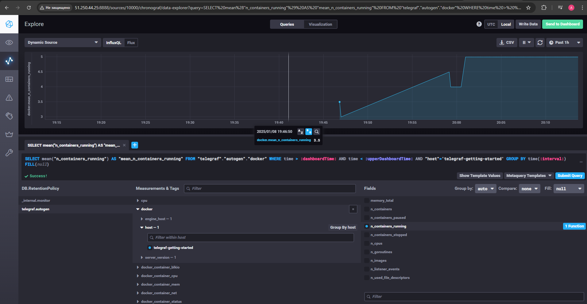 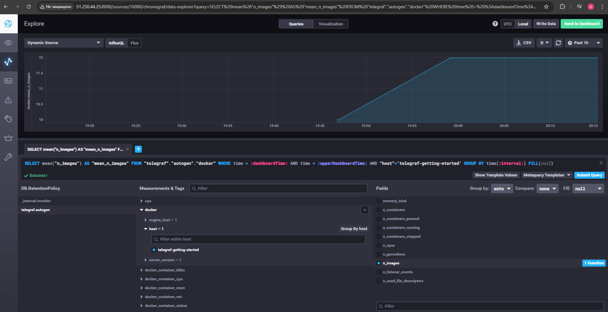 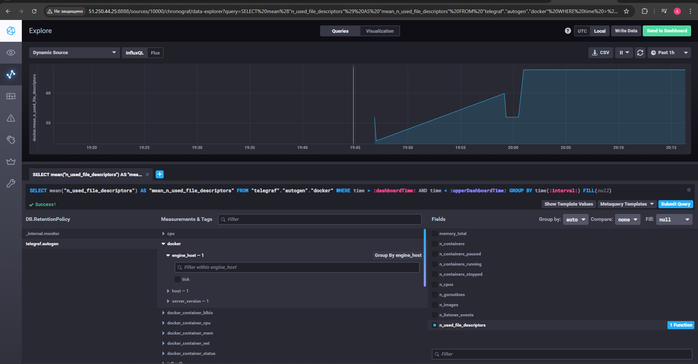                                                     |
