# Домашнее задание к занятию "Система сбора логов Elastic Stack"

## Задание 1

| Номер и описание задачи                                                                                                                                                                                                                                                                                                                                                                                            | Описание выполняемых действий                                                                                                                                                                                                                                                                                                                                                                                                                                              | Скриншоты                                                                                                                                                                                               |
| -------------------------------------------------------------------------------------------------------------------------------------------------------------------------------------------------------------------------------------------------------------------------------------------------------------------------------------------------------------------------------------------------------------------------------------- | ----------------------------------------------------------------------------------------------------------------------------------------------------------------------------------------------------------------------------------------------------------------------------------------------------------------------------------------------------------------------------------------------------------------------------------------------------------------------------------------------------- | ---------------------------------------------------------------------------------------------------------------------------------------------------------------------------------------------------------------- |
| 1. Поднять в докере и связать между собой: - elasticsearch (hot и warm ноды) - logstash - kibana - filebeat Logstash следует сконфигурировать для приема по tcp json-сообщений. Filebeat следует сконфигурировать для отправки логов docker системы в logstash. | Создал в YC отдельную ВМ. Указал параметр vm.max_map_count. Установил docker и docker compose. Создал директорию elk для подготовки файлов проекта. Добавил файлы проекта. Запустил проект. C файлами проекта можно ознакомиться в директории src/elk/ рядом с данным README | 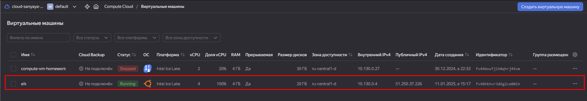  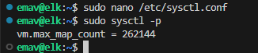 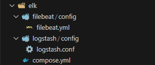 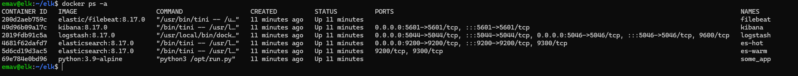 |
| 2. Прикрепить скриншоты развернутой системы                                                                                                                                                                                                                                                                                                                                                       |                                                                                                                                                                                                                                                                                                                                                                                                                                                                                                       | 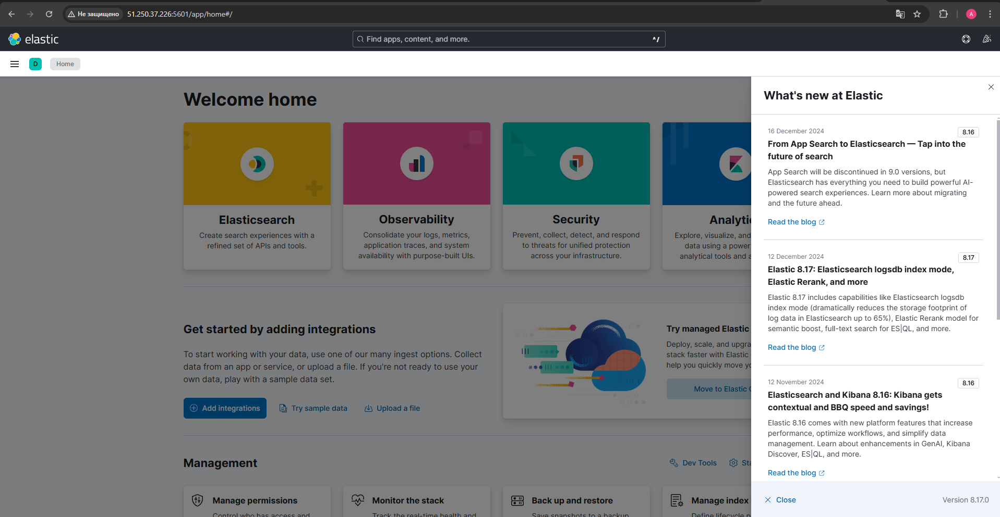                                                                                                                                                              |

## Задание 2

| Номер и описание задачи                                                                                                                                                              | Описание выполняемых действий                                                             | Скриншоты                                                                                                                                                                                                                                             |
| -------------------------------------------------------------------------------------------------------------------------------------------------------------------------------------------------------- | -------------------------------------------------------------------------------------------------------------------- | -------------------------------------------------------------------------------------------------------------------------------------------------------------------------------------------------------------------------------------------------------------- |
| 1. Перейти в меню создания index-patterns в Kibana и создать несколько паттернов из имеющихся                                             | Создал пару паттернов                                                                             | 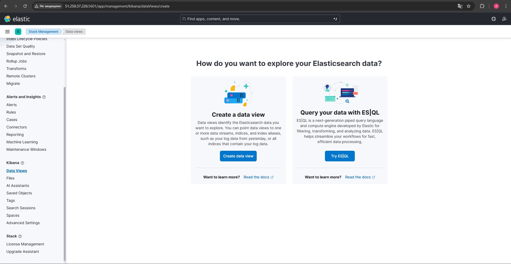 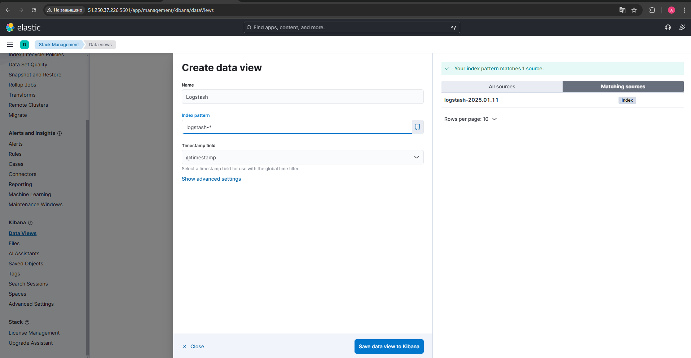 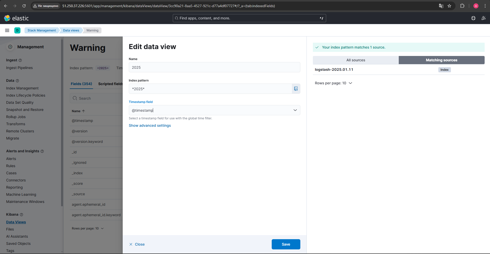 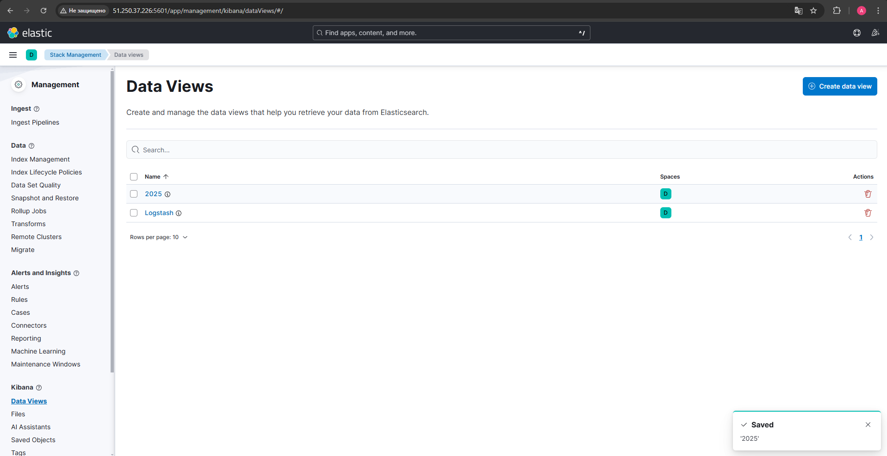                                                     |
| 2. Перейти в меню просмотра логов в Kibana и изучить как отобража.тся логи и как производить поиск по  логам. | Открыл меню просмотра логов. Сделал пару запросов по данным. | 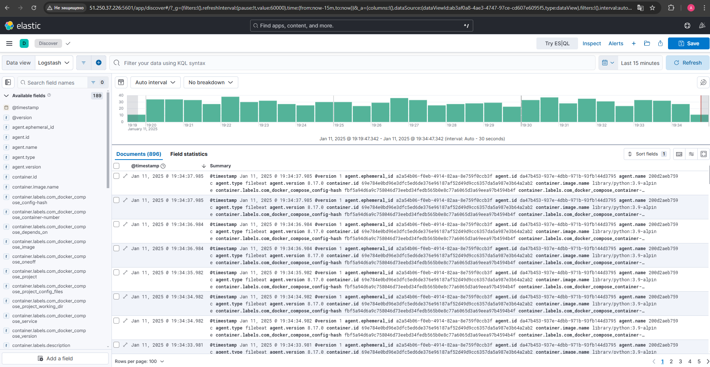 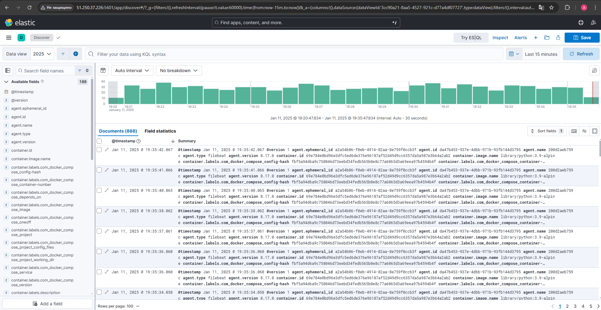 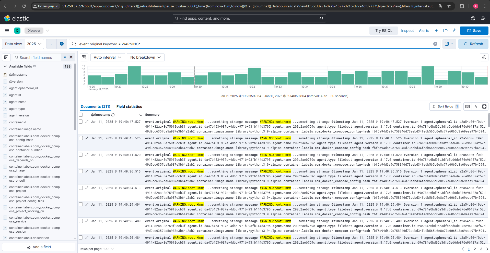 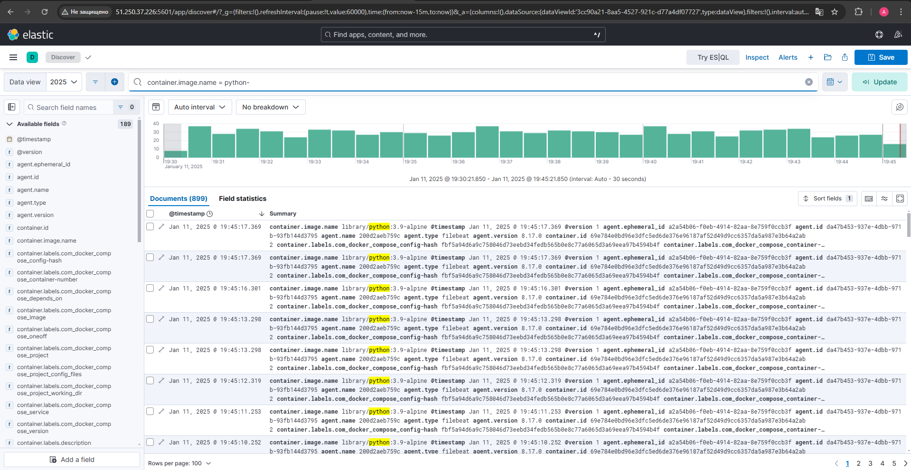 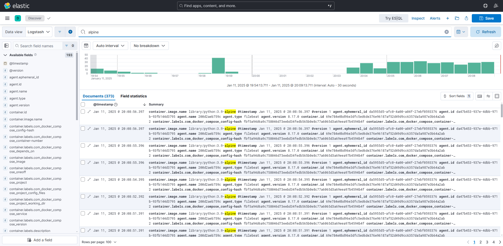 |
