## Подготовка к выполнению ДЗ

1.   
2.   
3.   

## Задание 1

1.   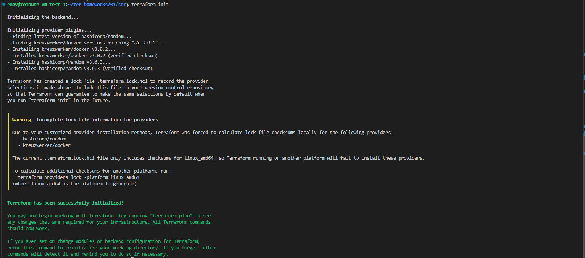
2. Согласно представленному .gitignore, допустимо хранить личную/секретную информацию только в файле personal.auto.tfvars, так как он исключен из под управления системы контроля версий (Git) и, в отличии от других директорий/файлов из .gitignore, не является файлом, который terraform будет перезаписывать во время своей работы (из этого файла terraform будет только считывать информацию).
3.   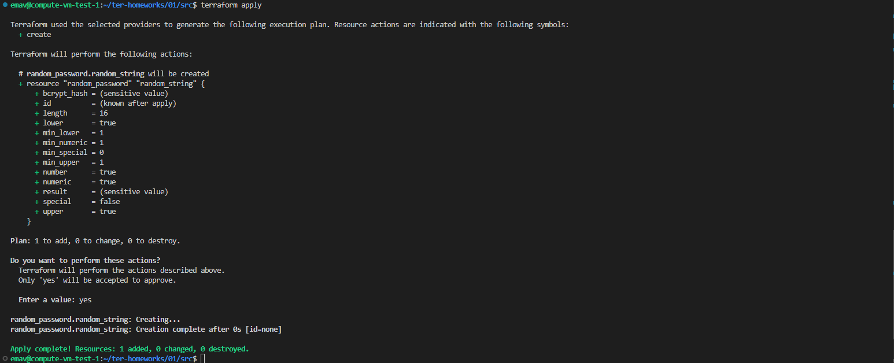

   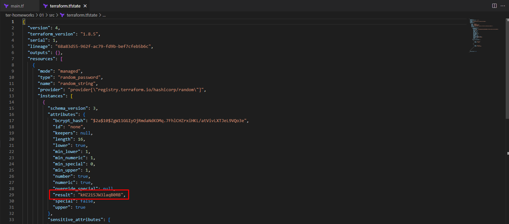
4.   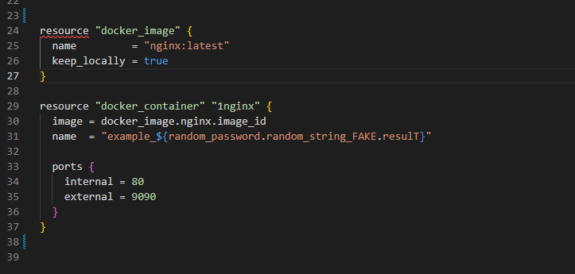
   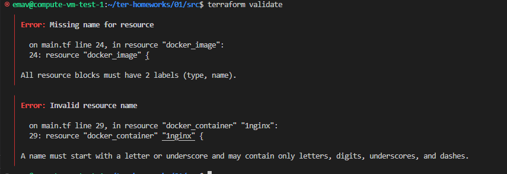
   В случае с 24 строкой, не задан второй label для ресурса "docker_image", а именно, label "name".
   В случае с 29 строкой, ошибка вызвана некорректным неймингом лейбла "name" ресурса "docker_containet". Согласно нотификатору, наименование лейбла "name" должно начинаться с буквы или с нижнего подчеркивания. В нашем же случае, наименование лейбла начинается с цифры, что и приводит к ошибке.
   Также ошибка содержится в 31 строке файла main.tf. В частности, для получения строки random_string указано некорректное наименование переменной - _FAKE и resulT. _FAKE необходимо удалить, а resulT заменить на result.
   Со всеми исправлениями:
   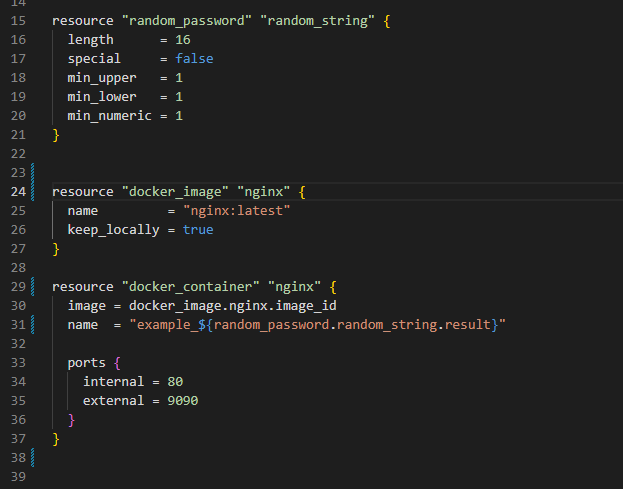
   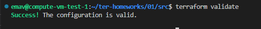
5.   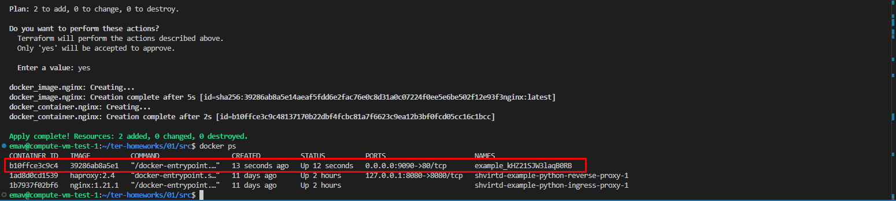
6.   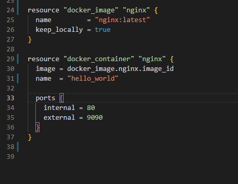

   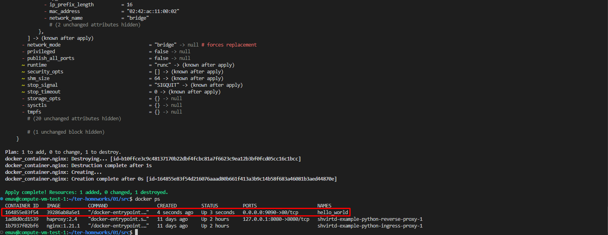
   Опасность использования ключа -auto-approve может заключаться в том, что после ввода команды terraform apply -auto-approve изменения начнут применяться незамедлительно и при наличии ошибок в файлах конфигурации данное действие может привести к нарушению функционирования инфраструктуры и/или потере некоторых важных данных.
   Чтобы нивелировать данные риски, использовать ключ -auto-approve должно быть скомбинировано с предварительной подготовкой и валидацией плана изменения инфраструктуры. Если план заранее подготовлен и провалидирован, то можно безпрепятственно использовать данный ключ.
   Также данный ключ используется при запуске terraform через различные автоматизации (например, в пайплайнах CI/CD), т.к. без этого ключа автоматизация не будет работать корректно в виду наличия запроса наподтверждение внесения изменений в команде terraform apply по умолчанию.
7.   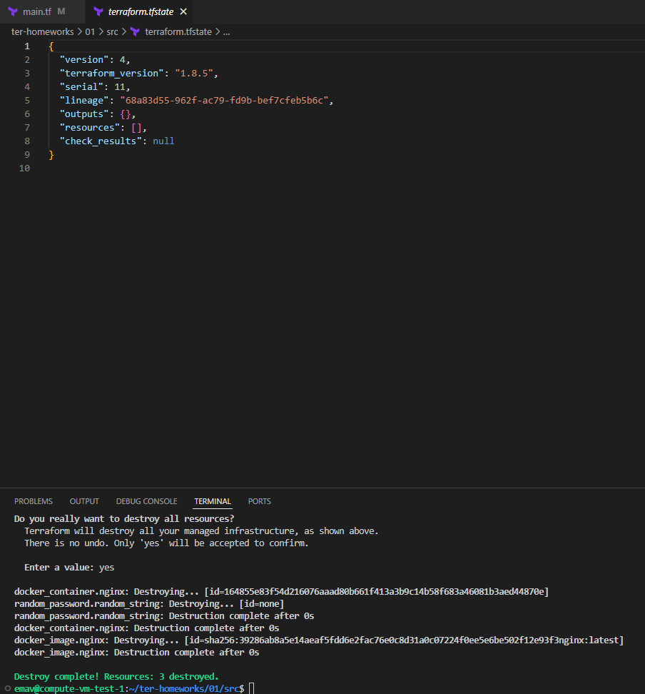
8. За сохранение образа docker после удаление всех ресурсов terrafom отвечает параметр keep_locally, который в коде задан как true:
   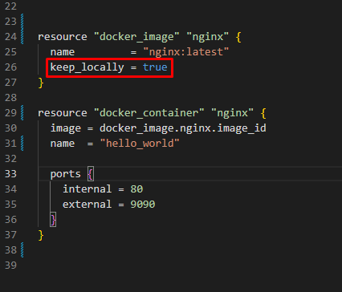
   Подтверждение из документации к провайдеру:
   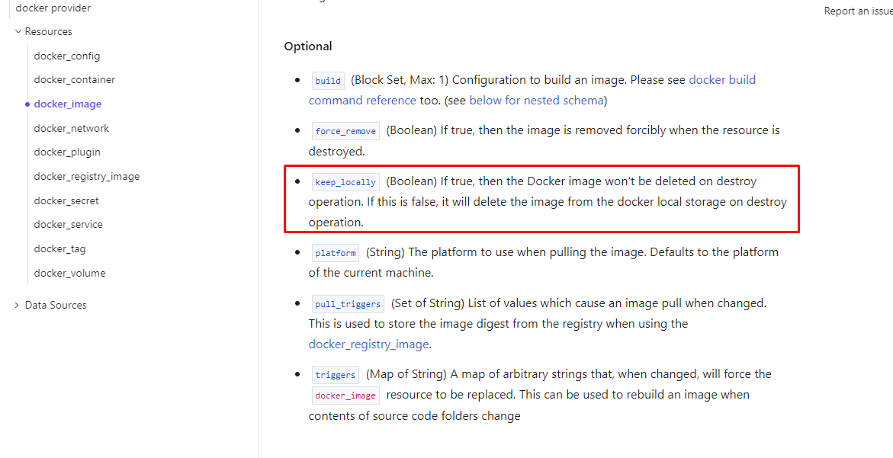

## Задание 2

1.   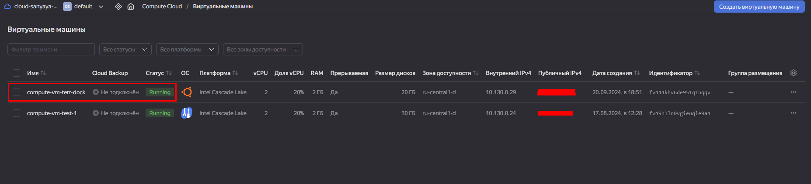
2.   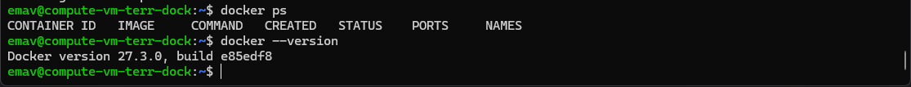
3.   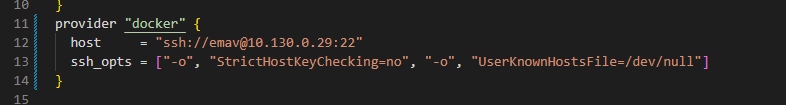
4. Файл с конфигурацией terraform (main.tf) находится в одной папке с данным README.md
5.   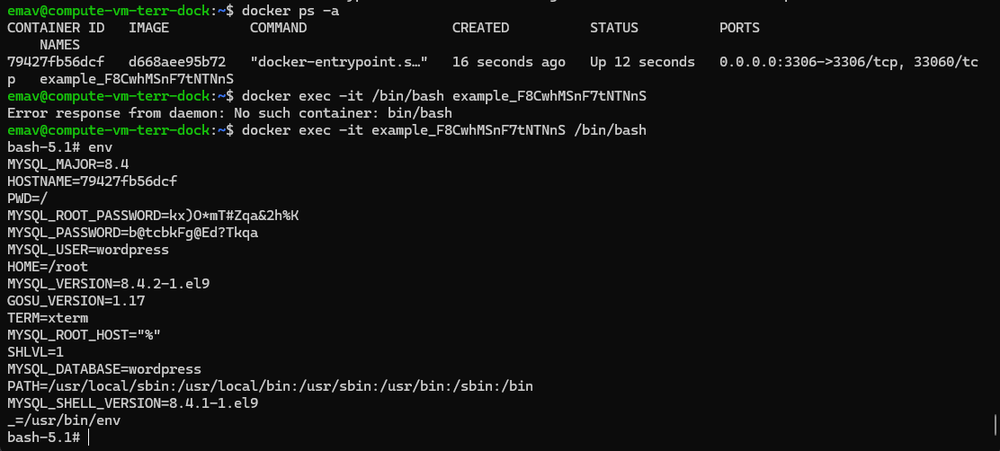

   

## Задание 3

1. https://opentofu.org/docs/intro/install/deb/
   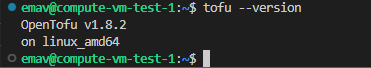
2. Не удалось проверить, так ка кне нашел зеркало для регистри tofu :((
