## Подготовка к выполнению ДЗ

1. 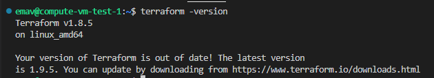
2. 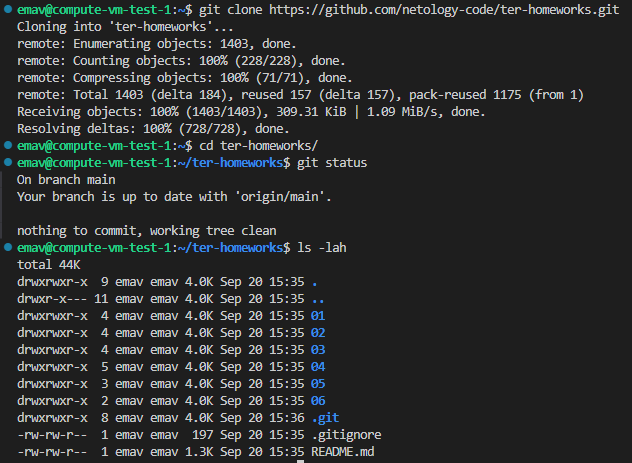
3. 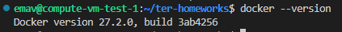

## Задание 1

| № | Скриншоты                                                                                                                                                                                         | Описание (при наличии)                                                                                                                                                                                                                                                                                                                                                                                                                                                                                                                                                                                                                                                                                                                                                                                                                                                                                                                                                                                                                                                                                                                                                                                                                                                                                                                                                                                                                                                                                                                                                                                                                    |
| -- | ---------------------------------------------------------------------------------------------------------------------------------------------------------------------------------------------------------- | ----------------------------------------------------------------------------------------------------------------------------------------------------------------------------------------------------------------------------------------------------------------------------------------------------------------------------------------------------------------------------------------------------------------------------------------------------------------------------------------------------------------------------------------------------------------------------------------------------------------------------------------------------------------------------------------------------------------------------------------------------------------------------------------------------------------------------------------------------------------------------------------------------------------------------------------------------------------------------------------------------------------------------------------------------------------------------------------------------------------------------------------------------------------------------------------------------------------------------------------------------------------------------------------------------------------------------------------------------------------------------------------------------------------------------------------------------------------------------------------------------------------------------------------------------------------------------------------------------------------------------------------------------------- |
| 1  | 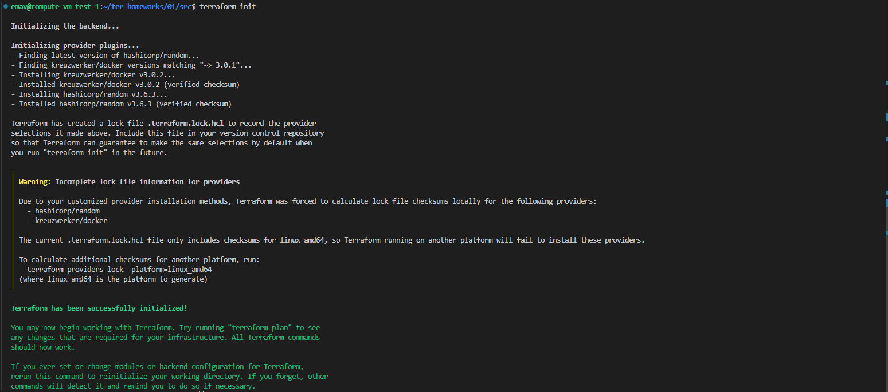                                                                                                                                                             |                                                                                                                                                                                                                                                                                                                                                                                                                                                                                                                                                                                                                                                                                                                                                                                                                                                                                                                                                                                                                                                                                                                                                                                                                                                                                                                                                                                                                                                                                                                                                                                                                                                             |
| 2  |                                                                                                                                                                                                            | Согласно представленному .gitignore, допустимо хранить личную/секретную информацию только в файле personal.auto.tfvars,  так как он исключен из под управления системы контроля версий (Git) и,  в отличии от других директорий/файлов из .gitignore, не является файлом,  который terraform будет перезаписывать во время своей работы  (из этого файла terraform будет только считывать информацию).                                                                                                                                                                                                                                                                                                                                                                                                                                                                                                                                                                                                                                                                                                                                                                                                                                                                                                                                                    |
| 3  | 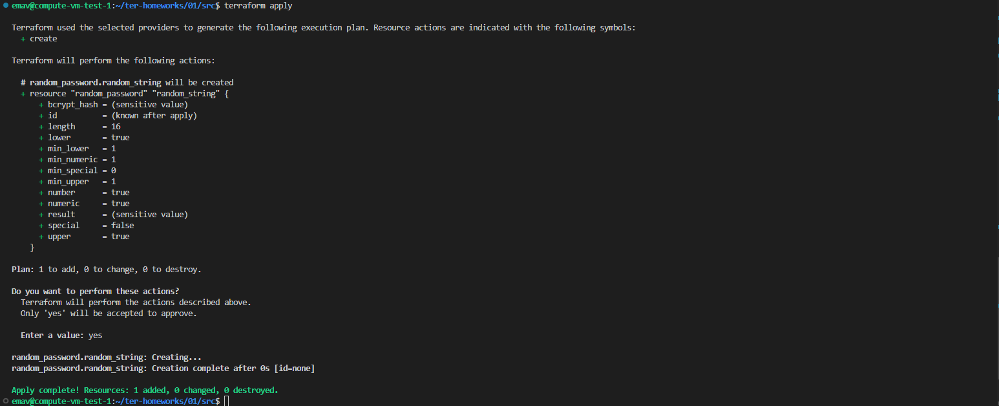 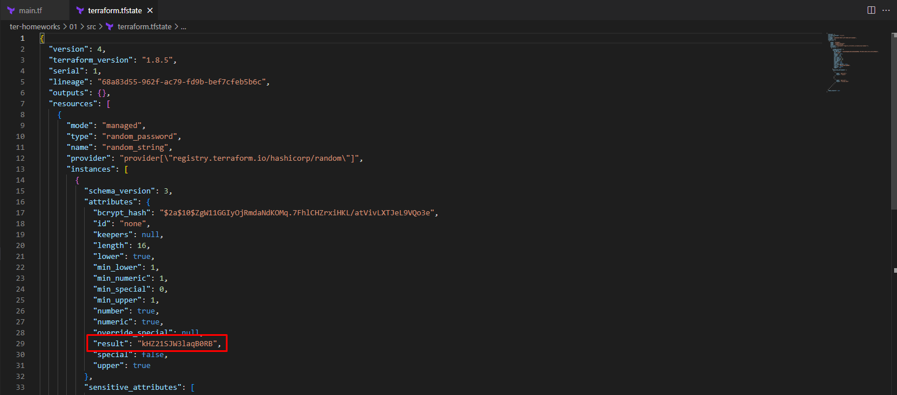                                                                                                         |                                                                                                                                                                                                                                                                                                                                                                                                                                                                                                                                                                                                                                                                                                                                                                                                                                                                                                                                                                                                                                                                                                                                                                                                                                                                                                                                                                                                                                                                                                                                                                                                                                                             |
| 4  | 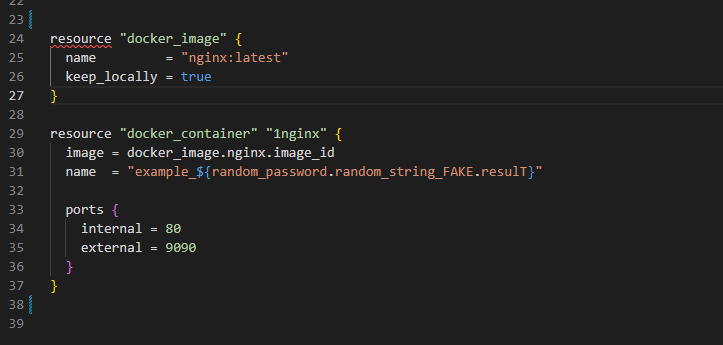 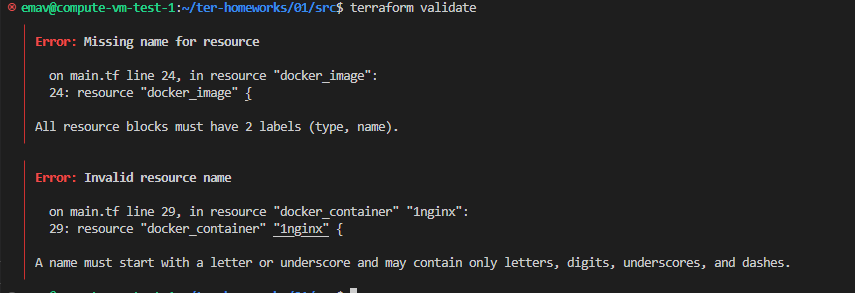 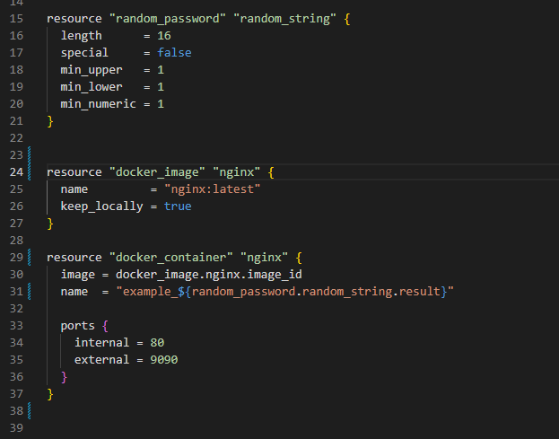 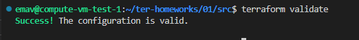 | В случае с 24 строкой, не задан второй label для ресурса "docker_image", а именно, label "name".  В случае с 29 строкой, ошибка вызвана некорректным неймингом лейбла "name" ресурса "docker_containet".  Согласно нотификатору, наименование лейбла "name" должно начинаться с буквы или с нижнего подчеркивания.  В нашем же случае, наименование лейбла начинается с цифры, что и приводит к ошибке.  Также ошибка содержится в 31 строке файла main.tf.  В частности, для получения строки random_string указано некорректное наименование переменной - _FAKE и resulT.  _FAKE необходимо удалить, а resulT заменить на result.                                                                                                                                                                                                                                                                                                                                                                                                                                                                                                                                                                       |
| 5  | 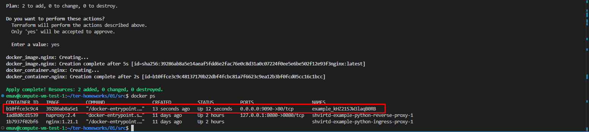                                                                                                                                                             |                                                                                                                                                                                                                                                                                                                                                                                                                                                                                                                                                                                                                                                                                                                                                                                                                                                                                                                                                                                                                                                                                                                                                                                                                                                                                                                                                                                                                                                                                                                                                                                                                                                             |
| 6  | 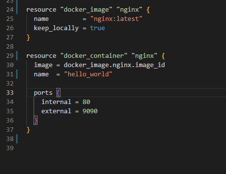 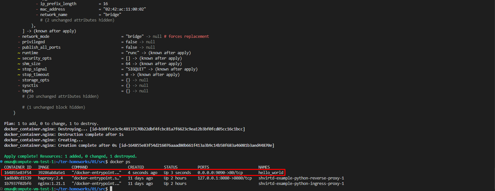                                                                                                         | Опасность использования ключа -auto-approve может заключаться в том, что после ввода команды terraform apply -auto-approve изменения начнут применяться незамедлительно  и при наличии ошибок в файлах конфигурации данное действие может привести к нарушению функционирования  инфраструктуры и/или потере некоторых важных данных.  Чтобы нивелировать данные риски, использовать ключ -auto-approve должно быть скомбинировано  с предварительной подготовкой и валидацией плана изменения инфраструктуры.  Если план заранее подготовлен и провалидирован, то можно безпрепятственно использовать данный ключ. Также данный ключ используется при запуске terraform через различные автоматизации  (например, в пайплайнах CI/CD), т.к. без этого ключа автоматизация не будет работать корректно  в виду наличия запроса наподтверждение внесения изменений в команде terraform apply по умолчанию. |
| 7  | 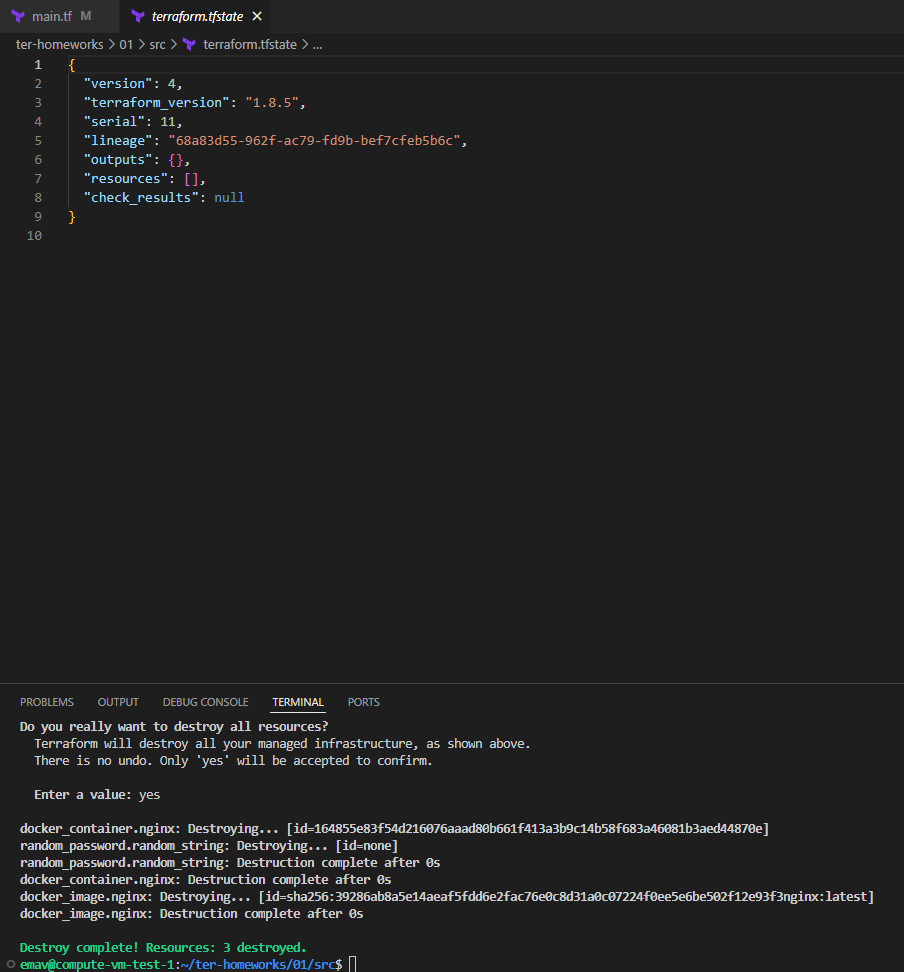                                                                                                                                                             |                                                                                                                                                                                                                                                                                                                                                                                                                                                                                                                                                                                                                                                                                                                                                                                                                                                                                                                                                                                                                                                                                                                                                                                                                                                                                                                                                                                                                                                                                                                                                                                                                                                             |
| 8  | 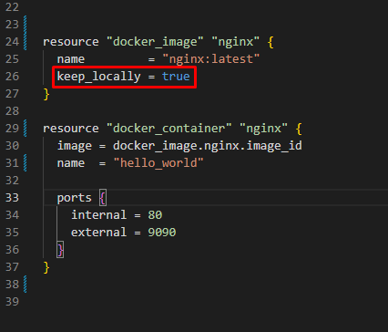 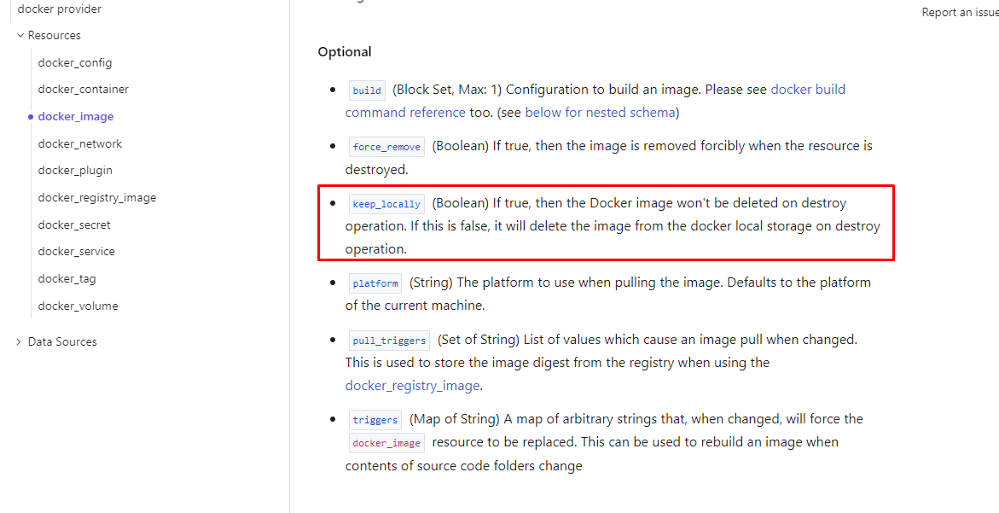                                                                                                         | За сохранение образа docker после удаление всех ресурсов terrafom отвечает параметр keep_locally, который в коде задан как true                                                                                                                                                                                                                                                                                                                                                                                                                                                                                                                                                                                                                                                                                                                                                                                                                                                                                                                                                                                                                                                                                                                                                                                                                                                                                                                                                                                                                                         |

## Задание 2

| № | Скриншоты                                                                                 | Описание (при наличии)                                                                                         |
| -- | -------------------------------------------------------------------------------------------------- | -------------------------------------------------------------------------------------------------------------------------------- |
| 1  | 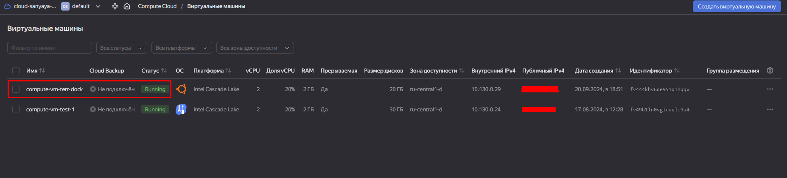                                                     |                                                                                                                                  |
| 2  | 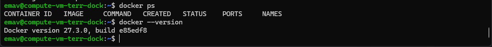                                                     |                                                                                                                                  |
| 3  | 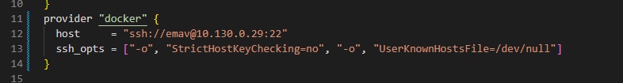                                                     |                                                                                                                                  |
| 4  |                                                                                                    | Файл с конфигурацией terraform (main.tf) находится в одной папке с данным README.md |
| 5  | 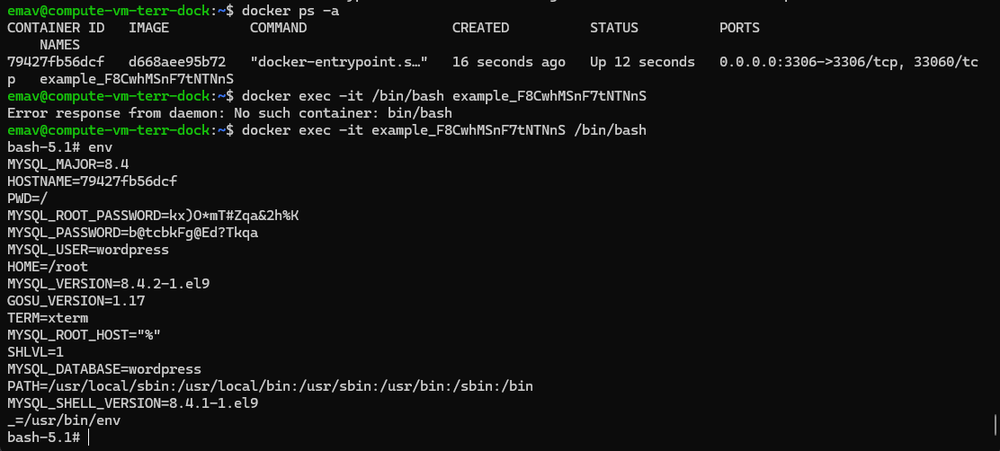 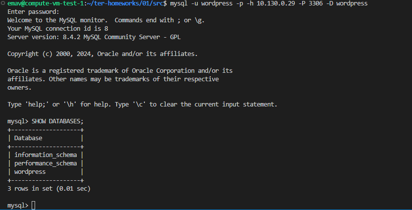 |                                                                                                                                  |

## Задание 3

1. 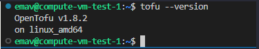

   https://opentofu.org/docs/intro/install/deb/
2. Не удалось проверить, так ка кне нашел зеркало для регистри tofu :((
