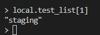
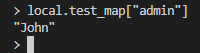
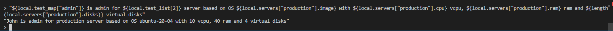

## Задание 1

|                                                   Номер и описание задачи                                                   | Описание выполненных действий                                                                                                                                                                                                                                                                                                                                                                                                                                                                                                                                                                                                                                                                                                                                                           | Скриншоты                                                                                                                                                                                                                                             |
| :---------------------------------------------------------------------------------------------------------------------------------------------------: | :----------------------------------------------------------------------------------------------------------------------------------------------------------------------------------------------------------------------------------------------------------------------------------------------------------------------------------------------------------------------------------------------------------------------------------------------------------------------------------------------------------------------------------------------------------------------------------------------------------------------------------------------------------------------------------------------------------------------------------------------------------------------------------------------------------------- | -------------------------------------------------------------------------------------------------------------------------------------------------------------------------------------------------------------------------------------------------------------- |
|                                 2. Создать сервисный аккаунт и ключ для него                                 | Создан сервисный аккаунт terraform-test и ключ для него Ключ скачан в виде файла .authorized_key.json  и размещен в домашней директории.                                                                                                                                                                                                                                                                                                                                                                                                                                                                                                                                                                         |                                                                                                                                                                                                                  |
|                          3. Добавить свой public key в переменную  vms_ssh_public_root_key                          | Личный public key записан в переменную vm_ssh_root_key                                                                                                                                                                                                                                                                                                                                                                                                                                                                                                                                                                                                                                                                                                                                |                                                                                                                                                                                                                  |
|  4. Инициализировать проект. Выполнить код, исправив  синтаксические ошибки.  | 1. standart вместо standard  2. платформы standard-v4  не существует. укзать от v1 до v3. Я указал v2.  3. При указании платформы standard-v2  появляется ошибка о некорректном числе ядер  (допускается указание 2,4).  Указал 2 ядра в cores.  При этом если указать платформу standard-v3,  то принимается значение cores = 1,  но не принимается cores_fraction = 5  (принимается только 20,50,100))  После внесения указанных изменений  код выполнился. |      |
|        5. Подключиться к созданной ВМ через SSH  и выполнить команду curl ifconfig.me        | Подключился по ssh ubuntu@ipvm и ввел команду                                                                                                                                                                                                                                                                                                                                                                                                                                                                                                                                                                                                                                                                                                                                        |                                                                                                                                                               |
| 6. Как в процессе обучения могут пригодиться параметры  preemtible = true и core_fraction=5 ? | Флаг preemtible делает создаваемую ВМ "прерываемой", а core_fraction задает ограничение на использование CPU.  Вместе эти параметры помогают  существенно снизить стоимость использования этой ВМ.                                                                                                                                                                                                                                                                                                                                                                                                                                                  |                                                                                                                                                                                                                                                                |

## Задание 2

|                                                                                              Номер и описание задачи                                                                                              | Описание выполненных действий                   | Скриншоты                             |
| :----------------------------------------------------------------------------------------------------------------------------------------------------------------------------------------------------------------------------------------: | -------------------------------------------------------------------------- | ---------------------------------------------- |
| 1. Заменть хардкод значения для ресусров compute_image и compute_instance  на отдельные переменные.  К переменным добавить префикс vm_web_ | Хардкод заменен на переменные.                   |  |
|                                      2. Объявить нужные переменные в файле variables.tf Заполнить их default прежними значениями                                      | Объявлены дополнительные переменные. |  |
|                                                                          3. Проверить terraform plan Изменений быть не должно.                                                                          |                                                                            |  |

## Задание 3

|                                                                                                                   Номер и описание задачи                                                                                                                   | Описание выполненных действий                                                                                                                                                                                                                                                                                                                                                                                                                                                                                                                                                                                                                                                              | Скриншоты                             |
| :----------------------------------------------------------------------------------------------------------------------------------------------------------------------------------------------------------------------------------------------------------------------------------: | --------------------------------------------------------------------------------------------------------------------------------------------------------------------------------------------------------------------------------------------------------------------------------------------------------------------------------------------------------------------------------------------------------------------------------------------------------------------------------------------------------------------------------------------------------------------------------------------------------------------------------------------------------------------------------------------------------------------- | ---------------------------------------------- |
| 1. Создать новый файл для переменных  vms_platform.tf Скопировать в него  переменные из variables.tf Скорректировать переменные  под второй инстанс. | Создал файл vms_platform.tf в него скопировал переменные для ВМ  из variables.tf  Заменил префиксы с vm_web_ на vm_db и скорректировал переменные  согласно постановке.  (Копируются в новый файл только  новые переменные.  Если скопировать все переменные,  то будет появляться ошибка  о дублировании переменных)                                                                                                          |  |
|                                                          2. Скопировать блок ресурса в main.tf и создать еще одну ВМ с  другими характеристиками                                                          | Скопировал ресурс yandex_compute_instance в файле main.tf  Скорректировал имя ресурса для второй ВМ.  Скорректировал названия переменных для второй ВМ.  Добавил ресурс yandex_vpc_subnet.develop_db так как зоны у первой и второй ВМ различаются,  то под вторую ВМ следует создать еще одну подсеть  в нужной зоне.  Переопределил параметр zone для  второй ВМ согласно постановке. |  |
|                                                                                                                       3. Применить изменения                                                                                                                       | Применил изменения. Создалась новая подсеть в зоне ru-central1-b. Создалась новая ВМ в зоне ru-central1-b и с параметрами  согласно постановке.                                                                                                                                                                                                                                                                                                                                                                                                                                                         |  |

## Задание 4

|                                                                          Номер и описание задачи                                                                          | Описание выполненных действий | Скриншоты                             |
| :-------------------------------------------------------------------------------------------------------------------------------------------------------------------------------------------------: | -------------------------------------------------------- | ---------------------------------------------- |
| 1. В файле outputs.tf объявить одну output переменную, которая содержит instance_name, external_ip и fqdn  для каждой из ВМ | Объявил переменную                      |  |
|                                                        2. Применить изменения и выполнить terraform output                                                        |                                                          |  |

## Задание 5

|                                                                              Номер и описание задачи                                                                              | Описание выполненных действий                                                                                                                                             | скриншоты                                                                                                                                     |
| :--------------------------------------------------------------------------------------------------------------------------------------------------------------------------------------------------------: | ---------------------------------------------------------------------------------------------------------------------------------------------------------------------------------------------------- | ------------------------------------------------------------------------------------------------------------------------------------------------------ |
| 1. В файле locals.tf описать в одном блоке имя каждой ВМ,  используя интерполяцию с несколькими  переменными | Объявил локальные переменные. Скорректировал имеющиеся переменные                                                                    |    |
|                                                     2. Заменить переменные внутри ресурса на созданные                                                     | Заменил переменные внутри ресурсов                                                                                                                                    |                                                                                                          |
|                                                                                  3. Применить изменения                                                                                  | Т.к. локальные переменные подобраны так,  что имена формируются одинаковые,  то изменений на инфре нет. |                                                                                                          |

## Задание 6

|                                    Номер и описание задачи                                    | Описание выполняемых действий                                      | Скриншоты                                                                                 |
| :--------------------------------------------------------------------------------------------------------------------: | --------------------------------------------------------------------------------------------- | -------------------------------------------------------------------------------------------------- |
| 1. Объединить cores, memory, core_fraction  в единую map-переменную vms_resources | Объявил переменную                                                           |   |
|             2. Создать отдельную map переменную для блока metadata             | Объявил переменную                                                           |   |
|    3. Закомментировать неиспользуемые переменные  проекта    | Закомментировал неиспользуемые переменные         |                                                                                                    |
|                   4. Проверить план. Изменений быть не должно                   | Проверил план. Изменений в инфре не требовалось. |                                                      |

## Задание 7

|                                          Номер и описание задачи                                          | Описание выполняемых действий                                                                                                                                                                                                                        | Скриншоты                             |
| :--------------------------------------------------------------------------------------------------------------------------------: | ------------------------------------------------------------------------------------------------------------------------------------------------------------------------------------------------------------------------------------------------------------------------------- | ---------------------------------------------- |
| 1. Какой командой можно отобразить  второй элемент списка  test_list |                                                                                                                                                                                                                                                                                 |  |
|                                        2. Найти длину списка test_list                                        |                                                                                                                                                                                                                                                                                 |  |
|                         3. Отобразить значение ключа admin из map test_map                         |                                                                                                                                                                                                                                                                                 |  |
|                            4. Написать интерполяционное выражение                            | `"${local.test_map["admin"]} is admin for ${local.test_list[2]} server based on OS ${local.servers["production"].image} with ${local.servers["production"].cpu} vcpu, ${local.servers["production"].ram} ram and ${length(local.servers["production"].disks)} virtual disks"` |  |

## Задание 8

|                                                               Номер и описание задачи                                                               | Описание выполняемых действий | Скриншоты                             |
| :---------------------------------------------------------------------------------------------------------------------------------------------------------------------------: | -------------------------------------------------------- | ---------------------------------------------- |
|                     1. Объявить переменную и её дефолтное значение  согласно постановке                     | Объявил переменную                      |  |
| 2. В консоли написать выражение, которое вычленит определенную строку  из этой переменной |                                                          |  |
