## Задание 1

|                                Номер и описание задачи                                | Описание выполненных действий                                                                                                                                           | Скриншоты                                                                                                                                     |
| :-------------------------------------------------------------------------------------------------------: | -------------------------------------------------------------------------------------------------------------------------------------------------------------------------------------------------- | ------------------------------------------------------------------------------------------------------------------------------------------------------ |
| 1. Заполнить файл personal.auto.tfvars и инициализировать проект | Заполнен файл personal.auto.tfvars. В него занесены токен, id облака и id директории. Инициализирован проект.        | 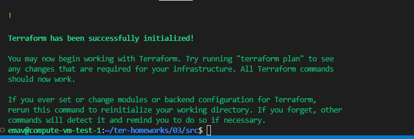                                                                                                         |
|                               2. Выполнить код проекта.                               | Выполнен код проекта. Таким образом созданы сеть, подсеть и правила безопасности для созданной сети. | 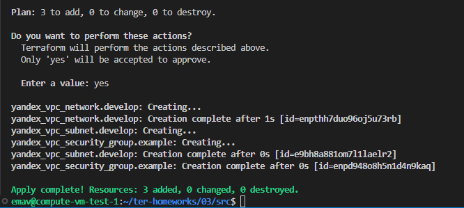 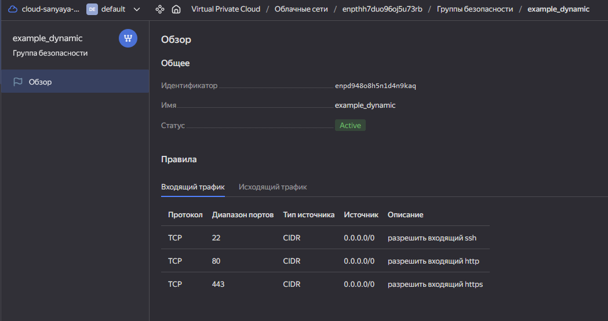 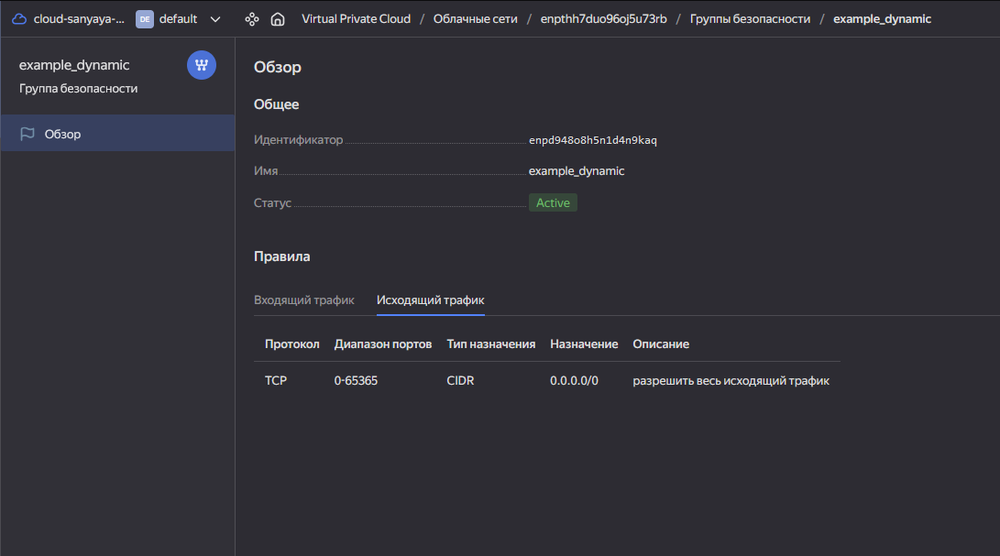 |

## Задание 2

|                                                                                                                                                                                 Номер и описание задачи                                                                                                                                                                                 | Описание выполненных действий                                                                                                                                                                                                                                                                            | Скриншоты                                                                                                                                     |
| :---------------------------------------------------------------------------------------------------------------------------------------------------------------------------------------------------------------------------------------------------------------------------------------------------------------------------------------------------------------------------------------------------------: | ----------------------------------------------------------------------------------------------------------------------------------------------------------------------------------------------------------------------------------------------------------------------------------------------------------------------------------- | ------------------------------------------------------------------------------------------------------------------------------------------------------ |
| 1. Создать файл count-vm.tf. Описать в нем создание двух одинаковых ВМ  web-1 и web-2  с минимальными параметрами,  используя метааргумент count loop. Назначить этим ВМ созданную  в первом задании группу безопасности. | Создал файл count-vm.tf и описал в нем создание ВМ  через count loop. Назначил новым ВМ группу безопасности. В variables.tf добавлены необходимые переменные.                                               | 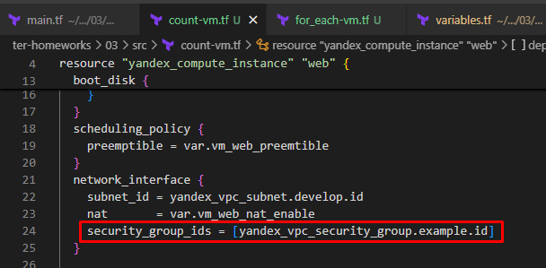                                                                                                         |
|                                                                       2. Создать файл for_each-vm.tf Описать создание ВМ main и replica через for_each loop. Использовать для обеих ВМ одну общую переменную типа list(object({}))                                                                       | Создал файл for_each-vm.tf и описал в нем создание ВМ через for_each loop  и переменную each_vm. В variables.tf добавлены  необходимые переменные.                                                                           | 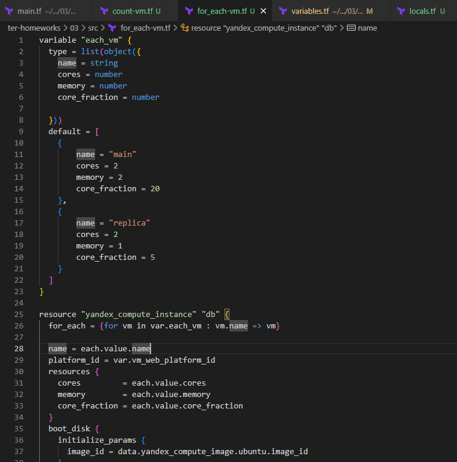                                                                                                         |
|                                                                                                     3. Сделать так, чтобы ВМ из задачи 1  создавались только  после завершения создания ВМ из задачи 2.                                                                                                     | Добавил depends_on в файл count-vm.tf. Также, логичным было добавить depends_on  и в файл for_each-vm.tf, т.к. данные ВМ зависят от создания VPC.  Добавил для "перестраховки"                                     | 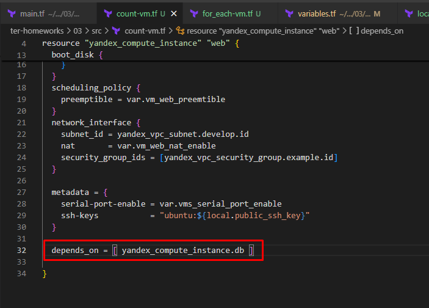 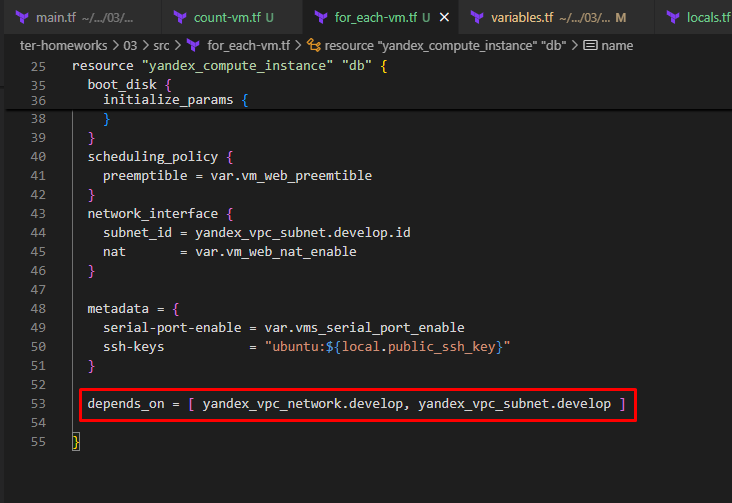                                                     |
|                                        4. Использовать функцию file для передачи в локальную переменную  содержимое файла  с публичным ssh ключом. Реализовать использование  этой переменной в блоке metadata                                        | Создал файл locals.tf, где объявил локальную переменную public_ssh_key. Этой переменной присвоил значение функции file. Реализовал использование  этой переменной в блоке metadata. | 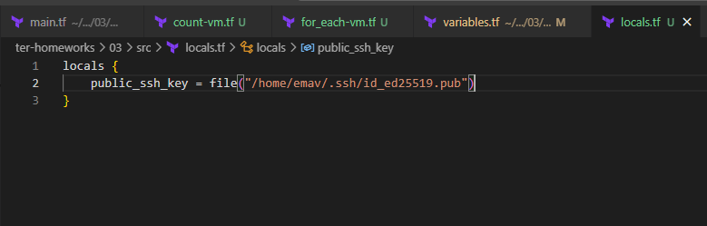 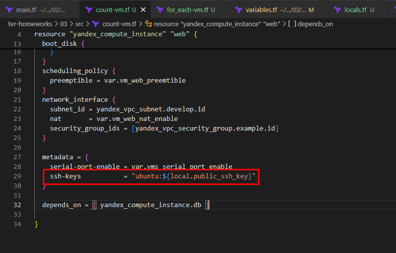 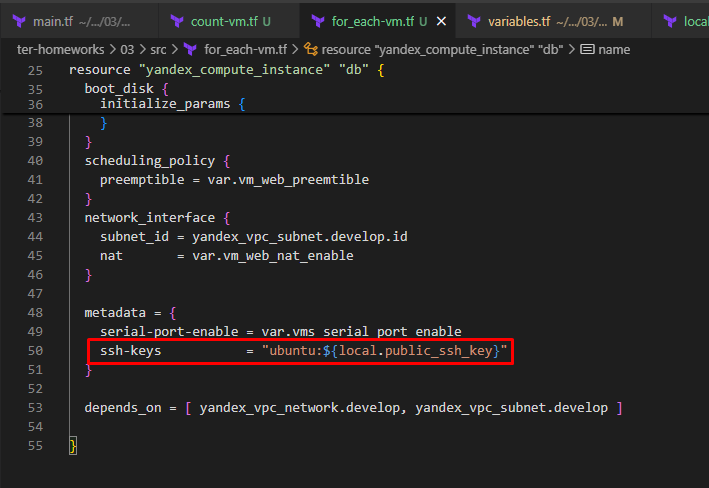 |
|                                                                                                                                                                                        5. Выполнить код                                                                                                                                                                                        | Выполнил код. Все ВМ "поднялись".                                                                                                                                                                                                                                                                          | 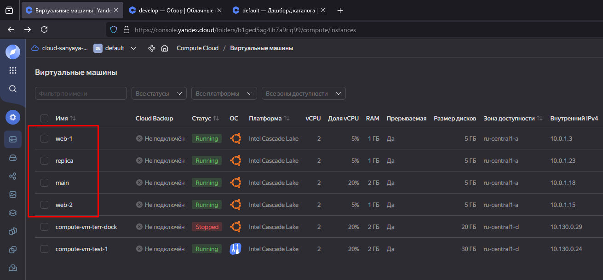                                                                                                         |

## Задание 3

|                                                                                                           Номер и описание задачи                                                                                                           | Описание выполненных действий                                                                                                                                                                                                                                          | Скриншоты                             |
| :--------------------------------------------------------------------------------------------------------------------------------------------------------------------------------------------------------------------------------------------------------------: | ------------------------------------------------------------------------------------------------------------------------------------------------------------------------------------------------------------------------------------------------------------------------------------------------- | ---------------------------------------------- |
|                        1. Создать 3 одинаковых виртуальных диска размером 1ГБ через yandex_compute_disk и мета аргумента count в файле disk_vm.tf                        | В новойм файле disk_vm.tf описал создание дисков. В файл variables.tf добавил  необходимые переменные.                                                                                                            | 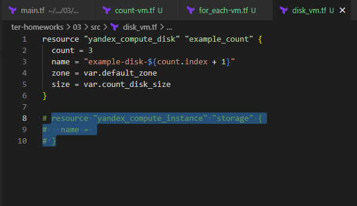 |
| 2. В этом же файле описать создание отдельной ВМ storage. При помощи dynamic блока  подключить к ней вторичные  диски, созданные в задаче 1. | В этом же файле описал создание ВМ storage, а также добавл динамический блок secondary_disk. Добавл зависимости. Добавил нужные переменные в файл variables.tf | 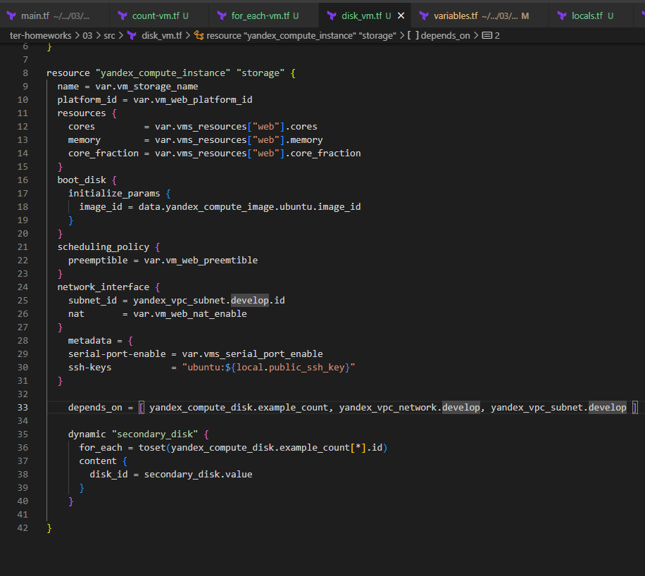 |
|                                                                                                                   3. Выполнить код                                                                                                                   | Выполнил код. ВМ поднялась. Диски к ней подключились.                                                                                                                                                                                        | 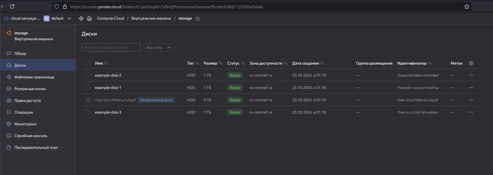 |

## Задание 4

|                                              Номер и описание задачи                                              | Описание выполняемых действий                                                                                                                                                                                                                                      | Скриншоты                             |
| :------------------------------------------------------------------------------------------------------------------------------------: | --------------------------------------------------------------------------------------------------------------------------------------------------------------------------------------------------------------------------------------------------------------------------------------------- | ---------------------------------------------- |
| 1. В файле ansible.tf создать inventory, используя функию templatefile и файл шаблон. | Создан файл ansible.tf в котором описан вызов функции templatefile. Переданы переменные.                                                                                                                                 | 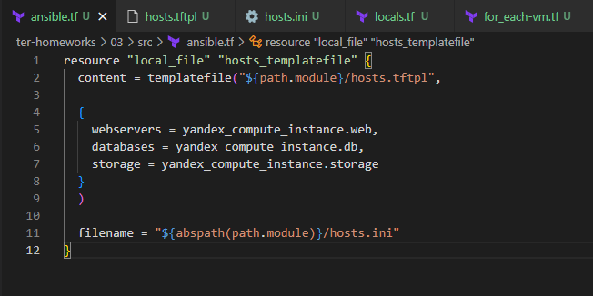 |
|    2. Сделать так, чтобы инвентарь содержал 3 группы и был динамическим.    | В файле-шаблоне hosts.tftpl реализована динамическая генерация за исключением группы storage, потому как в ресурсе yandex_compute_instance.storage создана одиночная VM. | 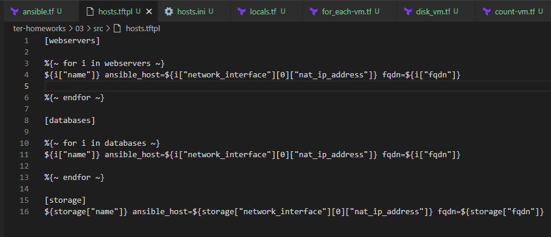 |
|                  3. Добавить в инвентарь переменную fqdn Выполнить код.                  | В файл-шаблон hosts.tftpl добавлена переменная fqdn                                                                                                                                                                                                             | 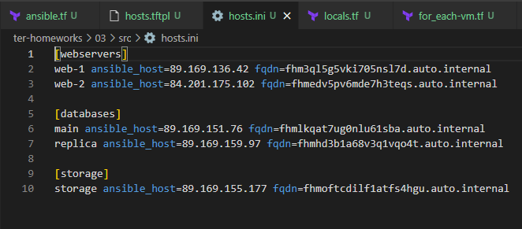 |

## Задание 5

|                                                         Нормер и описание задачи                                                         | Описание выполняемых действий                                                                                                                                                                                                                                             | Скриншоты                                                                                 |
| :------------------------------------------------------------------------------------------------------------------------------------------------------------: | ---------------------------------------------------------------------------------------------------------------------------------------------------------------------------------------------------------------------------------------------------------------------------------------------------- | -------------------------------------------------------------------------------------------------- |
| 1. Написать output, который отобразит ВМ из ресурсов count и for_each в виде списка словарей | Создал файл outputs.tf в котором описал output переменную vm_list. Т.к. в yandex_compute_instance.storage  у нас только одиночная ВМ то её добавление выглядит слегка хардкодно. | 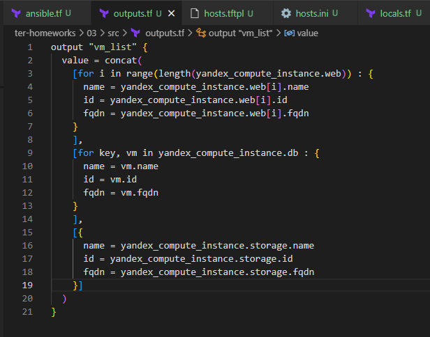 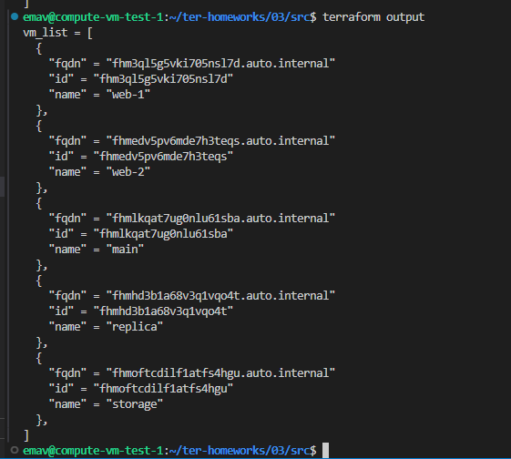 |

## Задание 6

|                                       Номер и описание задачи                                       | Описание выполняемых действий                                                           | Скриншоты                             |
| :---------------------------------------------------------------------------------------------------------------------: | ------------------------------------------------------------------------------------------------------------------ | ---------------------------------------------- |
| 1. Используя null_resource и local-exec применить ansible-playbook к машинам webservers | Скопировал содержимое файлов из демонстрации Выполнил код. | 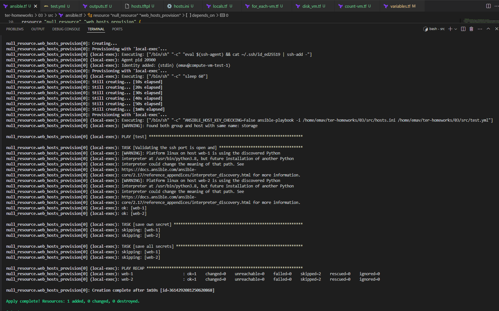 |

## Задание 8

|   Номер и описание задачи   | Описание выполняемых действий                                                                                                                                                            | Скриншоты                             |
| :----------------------------------------------: | ------------------------------------------------------------------------------------------------------------------------------------------------------------------------------------------------------------------- | ---------------------------------------------- |
| 1. Идентифицировать ошибки | Поставлен лишний пробел после "platform_id" Некорректно поставлена фигурная скобка. Она должна быть после "nat_ip_address" | 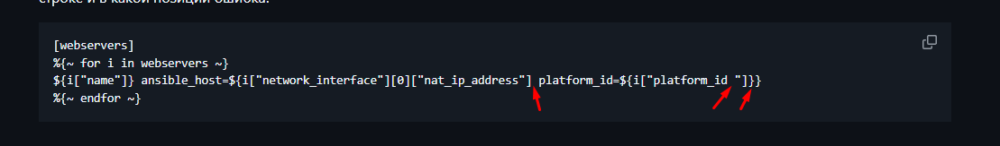 |
