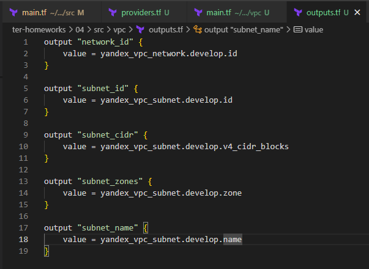
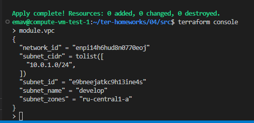

# Домашнее задание к занятию "Продвинутые методы работы с Terraform"

## Задание 1

|                                                                                                                                                                                                     Номер и описание задачи                                                                                                                                                                                                     | Описание выполняемых действий                                                                                                                                                                                                                                                                                                                                                          | Скриншоты                                                                                                                                                                                         |
| :-------------------------------------------------------------------------------------------------------------------------------------------------------------------------------------------------------------------------------------------------------------------------------------------------------------------------------------------------------------------------------------------------------------------------------------------------: | ----------------------------------------------------------------------------------------------------------------------------------------------------------------------------------------------------------------------------------------------------------------------------------------------------------------------------------------------------------------------------------------------------------------- | ---------------------------------------------------------------------------------------------------------------------------------------------------------------------------------------------------------- |
| 1. Взять код из демонстрации для создания двух ВМ, относящихся к разным проектам (marketing и analytics). Использовать labels для обозначения принадлежности. В файл cloud-init.yml необходимо использовать переменную ssh ключа вместо хардкода.  | В main.tf добавлен вызов remote модулей. Добавлены все необходимые переменные. Инициализирован проект. Проект запущен.                                                                                                                                                                                |     |
|                                                                                                                                                                                    2. Добавить в файл cloud-init.yml установку nginx.                                                                                                                                                                                    | В файл cloud-init.yml добавлена установка nginx. Т.к. cloud-init применяется только  при создании ВМ,  То и перед применением обновленного кода, нужно предварительно удалить ранее созданные ВМ.  Что и было сделано. |                                                                                                                                                              |
|                                                                                  3. Предоставить скриншоты подключения к созданным ВМ и вывод команды sudo nginx -t А также консоли YC с метками и Terraform Console с содержимым модуля.                                                                                  | Прикреплены скриншоты                                                                                                                                                                                                                                                                                                                                                                         |     |

## Задание 2

|                                                                                                                               Номер и описание задачи                                                                                                                               | Описание выполняемых действий                                                                                                                                                                                                                                                                                                                | Скриншоты                                                                                                                                                                                                                                             |
| :-----------------------------------------------------------------------------------------------------------------------------------------------------------------------------------------------------------------------------------------------------------------------------------------------------: | ----------------------------------------------------------------------------------------------------------------------------------------------------------------------------------------------------------------------------------------------------------------------------------------------------------------------------------------------------------------------- | -------------------------------------------------------------------------------------------------------------------------------------------------------------------------------------------------------------------------------------------------------------- |
|     1. Написать локальный модуль vpc, который будет создавать 2 ресурса: Одну сеть и одну подсеть в зоне, объявленной при вызове модуля, например: ru-central1-a.     | Добавил локальный модуль согласно заданию.                                                                                                                                                                                                                                                                                    |      |
|                                                                              2. Вы должны передать в модуль переменные с названием сети, zone и  v4_cidr_blocks                                                                              | Добавил вызов модуля vpc в root модуль                                                                                                                                                                                                                                                                                                    |                                                                                                                                                                                                                  |
|                 3. Модуль должен возвращать в root module с помощью output информацию о yandex_vpc_subnet. Прикрепить скриншот информации из terraform console о своем модуле.                 | Реализовал через outputs возвращение информации о yandex_vpc_subnet                                                                                                                                                                                                                                                      |                                                                                                                                                               |
| 4. Заменить ресурсы yandex_vpc_network и yandex_vpc_subnet созданным модулем. Не забыть передать необходимые параметры сети из модуля vpc в модуль с виртуальной машиной. | Заменил ресурсы на вызов модуля. Добавил передачу необходимых параметров из модуля vpc в модуль создания ВМ. Инициализировал проект  для добавления локального модуля. Выполнил код. |                                                                                                            |
|                                                                                              5. Сгенерировать документацию к модулю с помощью terraform-docs                                                                                              | terraform-docs установлен локально. Сформирована документация для локального модуля vpc.                                                                                                                                                                                                         |                                                                                                                                                               |

## Задание 3

|                                                                       Номер и описание задачи                                                                       | Описание выполняемых действий                                                                                                                                                                                                                                                                                                                                                                                                                           | Скриншоты                                                                                                                                     |
| :-------------------------------------------------------------------------------------------------------------------------------------------------------------------------------------: | ---------------------------------------------------------------------------------------------------------------------------------------------------------------------------------------------------------------------------------------------------------------------------------------------------------------------------------------------------------------------------------------------------------------------------------------------------------------------------------- | ------------------------------------------------------------------------------------------------------------------------------------------------------ |
|                                                      1. Вывести список всех ресурсов в стейте                                                      | Использована команда terraform state list                                                                                                                                                                                                                                                                                                                                                                                                                  |                                                                                                          |
|                                                      2. Полностью удалить из стейта модуль vpc                                                      | terraform state rm не поддерживает использование символов подстановки, таких как '*'. Поэтому удалять все ресурсы модуля vpc придется поочереди.                                                                                                                                                                                                          |                                                                                                          |
|                                                      3. Полностью удалить из стейста модуль vm                                                      | По аналогии с удалением ресурсов vpc, удалил поочереди ресурсы модулей ВМ.  P.S. в последствии выяснил, что для удаления всех ресурсов модуля, можно не удалять их по очереди, а выполнить команду удаления из стейта по имени модуля (на скриншоте) |                                                                                                          |
| 4. Импортировать удаленные ресурсы обратно. Проверить plan. Значимых изменений быть не должно. | Импортировал ресурсы. Идентификаторы брал из консоли YC. Можно было, в теории, в бэкапе стейта их подглядеть.  Проверил plan. Значимых изменений не обнаружил.                                                                                                                                                            |    |
