# Домашнее задание к занятию "Использование Terraform в команде"

## Задание 1

|                                                    Номер и описание задачи                                                    | Описание выполняемых действий                                                                                                                                                                                                                                                                                                                                                                                                                                                                                                                                                                                                                                                                                                     | Скриншоты                                                                                                                                                                                                                                                                                                 |
| :-----------------------------------------------------------------------------------------------------------------------------------------------: | ------------------------------------------------------------------------------------------------------------------------------------------------------------------------------------------------------------------------------------------------------------------------------------------------------------------------------------------------------------------------------------------------------------------------------------------------------------------------------------------------------------------------------------------------------------------------------------------------------------------------------------------------------------------------------------------------------------------------------------------------------------ | ------------------------------------------------------------------------------------------------------------------------------------------------------------------------------------------------------------------------------------------------------------------------------------------------------------------ |
| 1. Проверить свой код и демонстрационный код из ДЗ №4 с помощью tflint и checkov | Инструменты для проверки запускались через docker.                                                                                                                                                                                                                                                                                                                                                                                                                                                                                                                                                                                                                                                                | 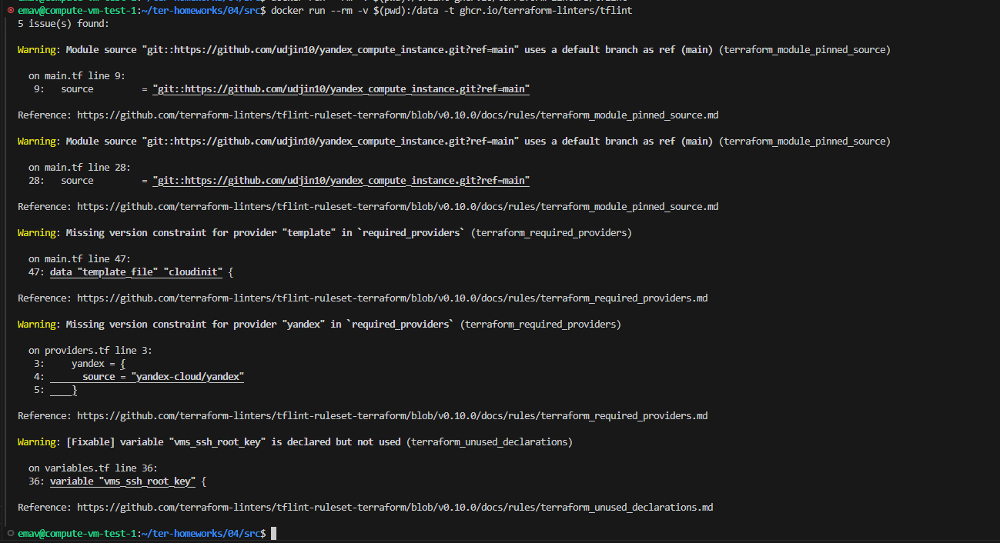 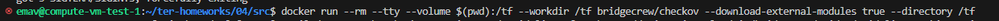 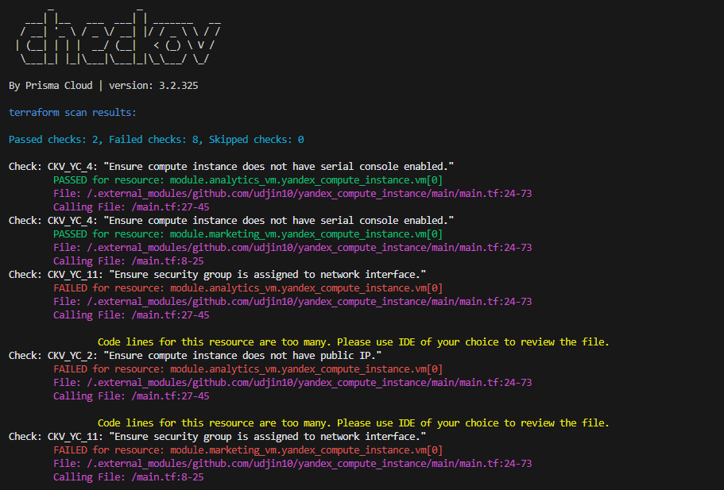 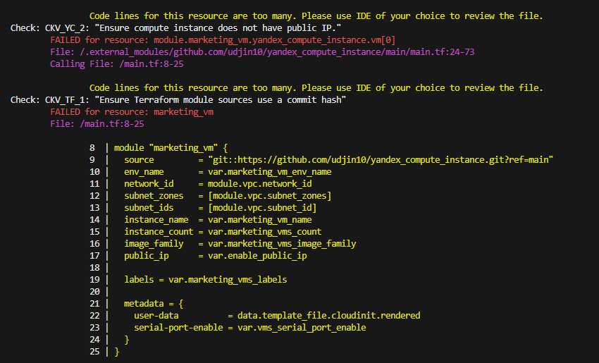 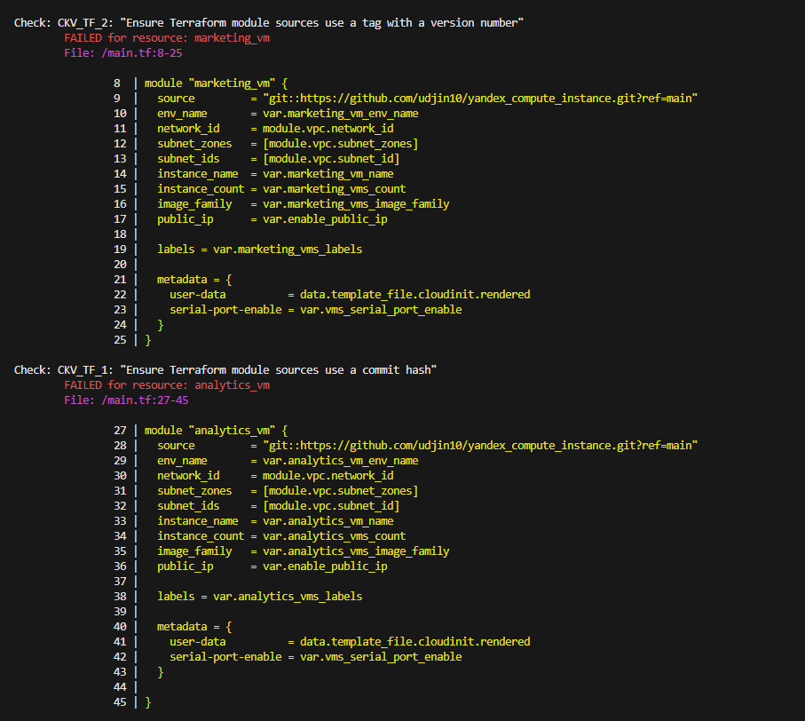 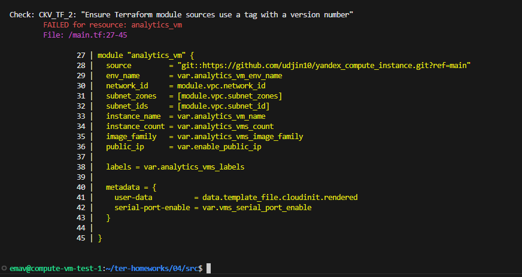 |
|                                  2. Перечислить типы обнаруженных ошибок.                                  | tflint: 1. Указана ссылка на main ветку модулей,  вместо конкретной версии. 2. Не указана конкретная версия провайдера template 3. Не указана конкретная версия провайдера yandex 4. Переменная vms_ssh_root_key объявлена, но не используется  Chekov: 1. Много строк кода в описании параметров вызываемых модулей 2. Версия модулей не ссылается на хеш коммита 3. Версия модулей не ссылается на тэг. |                                                                                                                                                                                                                                                                                                                    |

## Задание 2

|                                                                                                                                  Номер и описание задачи                                                                                                                                  | Описание выполняемых действий                                                                                                                                                                                                                                                                                                                                                                                                                                                                                                                                                                                                                                                                                                                                                                                            | Скриншоты                                                                                                                                                                                                                                                                                                                                                                                                                                                                                                                                                                                                                         |
| :-----------------------------------------------------------------------------------------------------------------------------------------------------------------------------------------------------------------------------------------------------------------------------------------------------------: | --------------------------------------------------------------------------------------------------------------------------------------------------------------------------------------------------------------------------------------------------------------------------------------------------------------------------------------------------------------------------------------------------------------------------------------------------------------------------------------------------------------------------------------------------------------------------------------------------------------------------------------------------------------------------------------------------------------------------------------------------------------------------------------------------------------------------------------------------- | ------------------------------------------------------------------------------------------------------------------------------------------------------------------------------------------------------------------------------------------------------------------------------------------------------------------------------------------------------------------------------------------------------------------------------------------------------------------------------------------------------------------------------------------------------------------------------------------------------------------------------------------ |
| 1. Взять свой код из ДЗ №4 и повторить демонстрацию из лекции: настроить YDB, S3 bucket, yandex service account, права доступа и мигрировать state проекта в S3 с блокировками. | Создан S3 bucket под хранение state.  Создан сервисный аккаунт.  Добавлен ключ для него. Выданы права на бакет.  Создана новая БД YDB. Выданы права к ней сервисному  аккаунту. Создана новая таблица с  нужным полем и типом.  Добавлено описание backend-a в код.  Т.к. данный проект был ранее запущен без описания s3 backend-a, то стейт хранился локально. Вызываем terraform init с флагом -reconfigure для применения изменений в backend-е. | 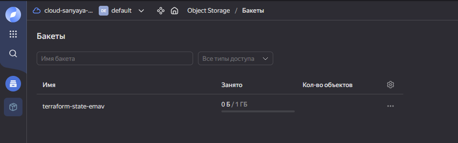 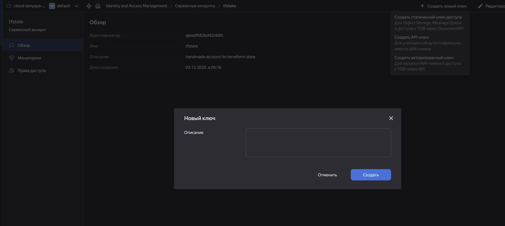 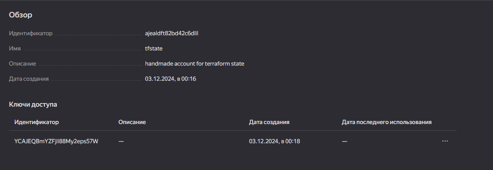 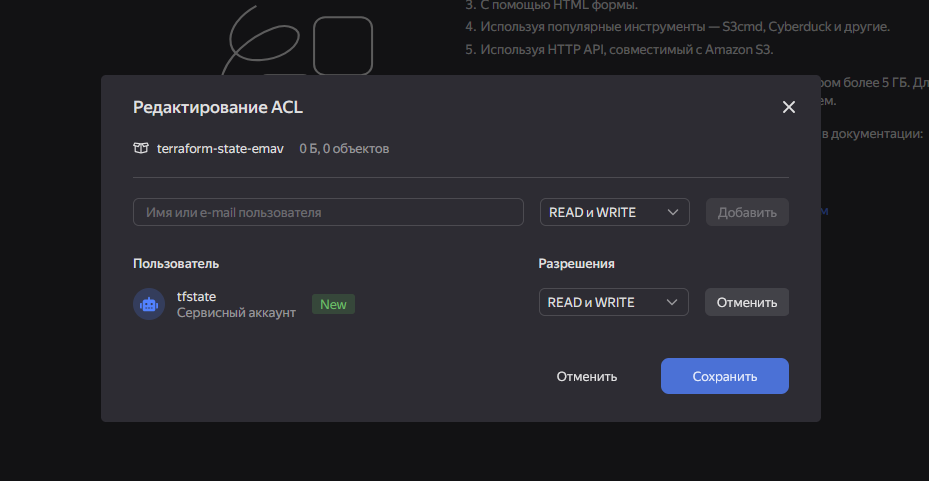 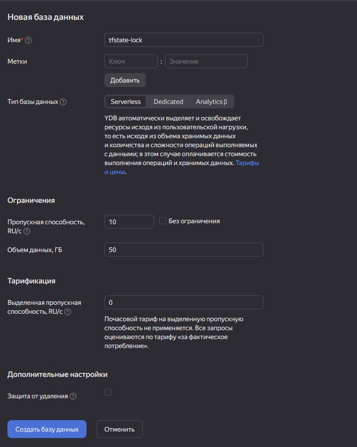 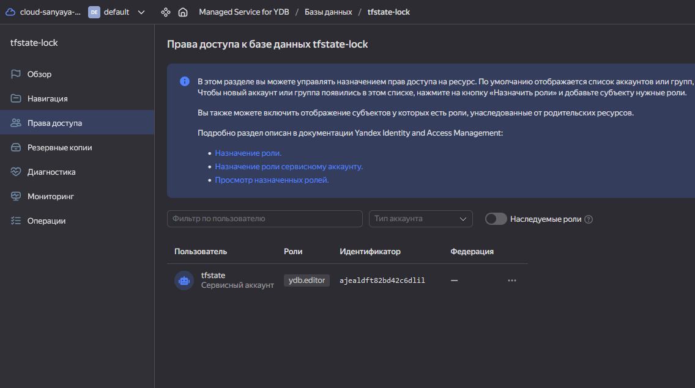 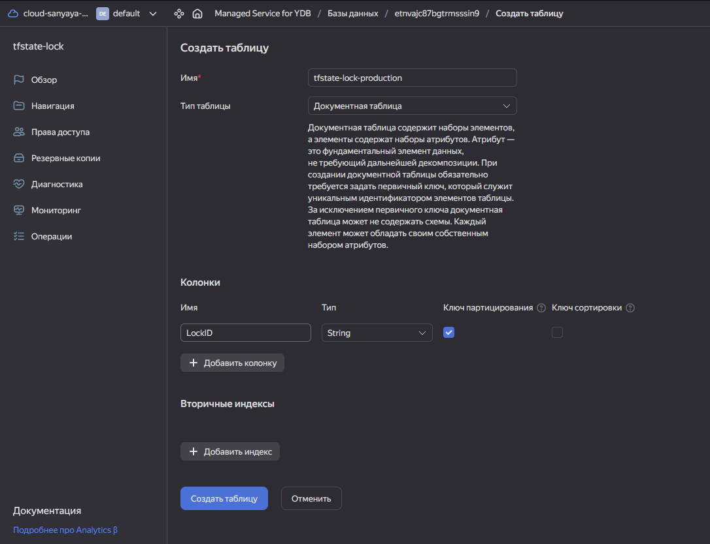 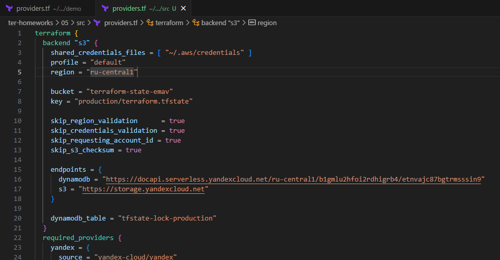 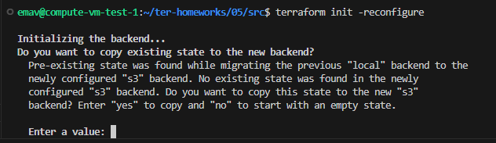 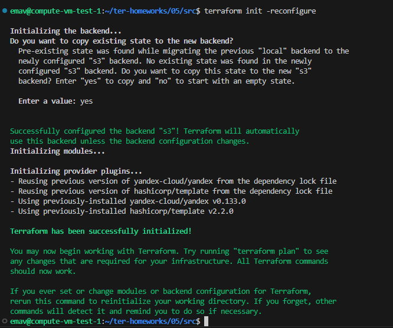 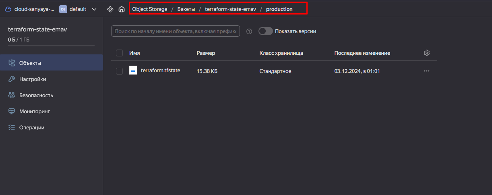 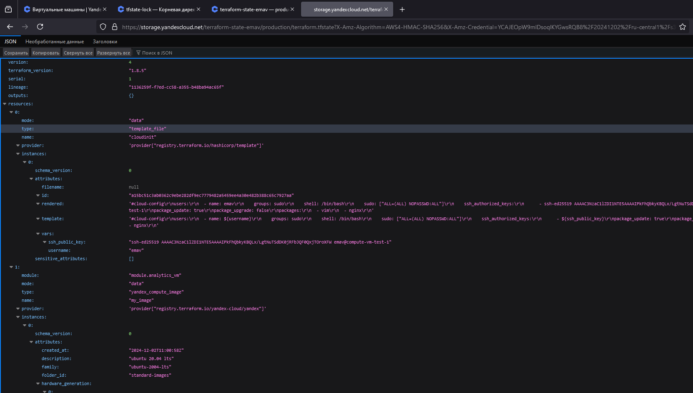 |
|                                                                                                          2. Закоммитить в отдельную ветку все изменения.                                                                                                          | Изменения запушены в ветку                                                                                                                                                                                                                                                                                                                                                                                                                                                                                                                                                                                                                                                                                                                                                                                                   |                                                                                                                                                                                                                                                                                                                                                                                                                                                                                                                                                                                                                                            |
|                                                                   3. Открыть в проекте terraform console, а в другом окне из этой же директории запустить terraform apply.                                                                   | Выполнена комманда terraform console из двух вкладок терминала в одной и  той же директории.                                                                                                                                                                                                                                                                                                                                                                                                                                                                                                                                                                                                                                                                                | 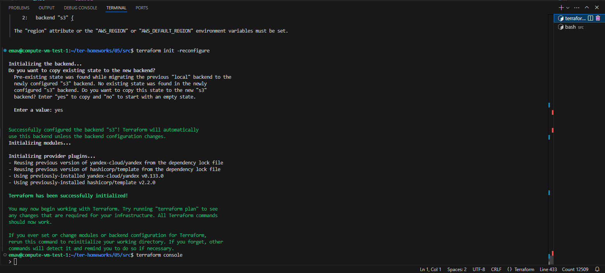 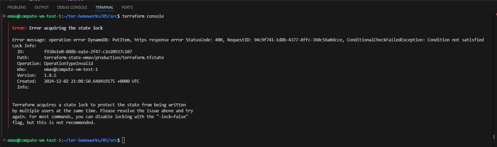                                                                                                                                                                                                                                                                                                                                                                                                                                                                                                                                         |
|                                                                                                       4. Зафиксировать ошибку доступа к state в виде скрина                                                                                                       |                                                                                                                                                                                                                                                                                                                                                                                                                                                                                                                                                                                                                                                                                                                                                                                                                                                     |                                                                                                                                                                                                                                                                                                                                                                                                                                                                                                                                                                                              |
|                                                                                                                       5. Принудительно разблокировать state.                                                                                                                       | Для принудительной разблокировки стейта выполнена команда terraform force-unlock IDБлокировки                                                                                                                                                                                                                                                                                                                                                                                                                                                                                                                                                                                                                                                                               | 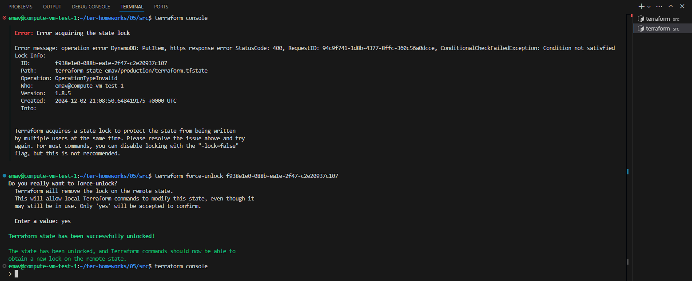                                                                                                                                                                                                                                                                                                                                                                                                                                                                                                                                                                                             |
